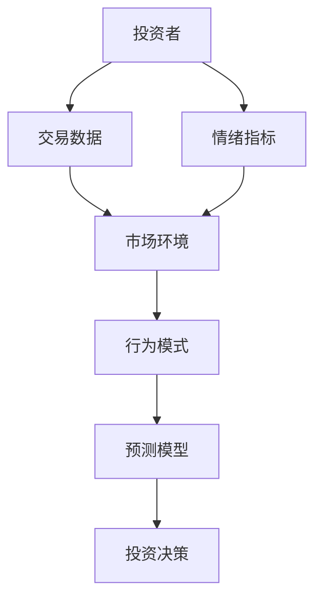
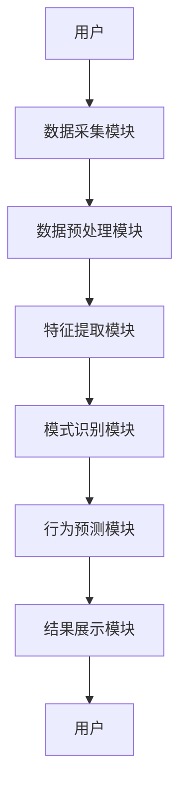

                 


# AI驱动的投资者行为模式识别

**关键词：** AI，投资者行为模式，机器学习，深度学习，模式识别，金融分析

**摘要：**  
本文探讨了利用人工智能技术驱动投资者行为模式识别的方法与应用。通过分析投资者的行为数据，结合深度学习和强化学习等先进算法，构建投资者行为模式识别系统，从而帮助投资者和金融机构更好地理解市场动态，优化投资决策。文章详细阐述了投资者行为模式识别的背景、核心算法、系统架构设计、项目实战以及最佳实践，为读者提供了全面而深入的技术解析。

---

## 第1章: 投资者行为模式识别的背景与概念

### 1.1 投资者行为分析的基本概念

#### 1.1.1 投资者行为分析的定义  
投资者行为分析是指通过对投资者的交易数据、市场反应、情绪变化等多维度信息进行分析，揭示投资者在不同市场环境下的决策模式和行为特征。这些行为特征可以帮助我们理解投资者的心理状态和决策逻辑，进而预测其未来的投资行为。

#### 1.1.2 投资者行为模式的分类  
投资者行为模式可以根据多个维度进行分类：  
1. **基于时间维度**：短期交易行为、长期投资行为。  
2. **基于策略维度**：价值投资、趋势跟踪、情绪驱动。  
3. **基于风险偏好**：保守型、激进型、平衡型。  

#### 1.1.3 投资者行为模式识别的重要性  
投资者行为模式识别在金融领域具有重要意义：  
- 帮助投资者优化决策，避免情绪化投资。  
- 为金融机构提供客户行为洞察，制定个性化服务策略。  
- 为市场研究提供数据支持，揭示市场波动的内在规律。  

### 1.2 AI在投资者行为分析中的应用

#### 1.2.1 AI技术在金融领域的应用现状  
人工智能技术在金融领域的应用日益广泛，包括：  
- 量化交易：利用算法进行高频交易和套利。  
- 风险管理：通过机器学习模型评估投资风险。  
- 市场预测：利用深度学习模型预测股票价格和市场趋势。  

#### 1.2.2 投资者行为模式识别中的AI技术  
AI技术在投资者行为模式识别中的应用主要体现在：  
- 数据挖掘：从海量交易数据中提取投资者行为特征。  
- 模式识别：利用机器学习算法识别投资者的行为模式。  
- 预测模型：构建预测模型，预测投资者未来的交易行为。  

#### 1.2.3 投资者行为模式识别的挑战与机遇  
投资者行为模式识别面临以下挑战：  
- 数据多样性：投资者行为受到多种因素影响，数据复杂且多变。  
- 情绪因素：投资者情绪波动难以量化，增加了模式识别的难度。  
- 数据隐私：投资者行为数据涉及个人隐私，数据获取和处理需要符合相关法规。  

然而，这些挑战也带来了机遇：通过技术创新和数据积累，AI技术在投资者行为模式识别中的应用将更加深入。

### 1.3 投资者行为模式识别的边界与外延

#### 1.3.1 行为模式识别的边界  
投资者行为模式识别的边界包括：  
- 数据范围：仅限于交易数据和市场环境数据，不包括外部社交数据。  
- 时间范围：关注短期到中期的交易行为，不涉及长期投资策略。  

#### 1.3.2 行为模式识别的外延  
投资者行为模式识别的外延包括：  
- 情绪分析：通过自然语言处理技术分析投资者情绪。  
- 行为预测：基于行为模式构建预测模型，预测未来的交易行为。  

#### 1.3.3 相关概念的对比分析  
投资者行为模式识别与其他相关概念的对比：

| 概念                | 定义与范围                          | 应用场景                     |
|---------------------|-----------------------------------|-----------------------------|
| 投资者情绪分析      | 分析投资者情绪波动                | 帮助预测市场走势             |
| 交易行为分析        | 分析投资者的交易记录              | 识别交易模式，优化投资策略  |
| 市场预测模型        | 预测市场价格变化                  | 指导投资决策                 |

### 1.4 核心概念与联系

#### 1.4.1 核心概念原理  
投资者行为模式识别的核心在于将投资者的交易行为与市场环境相结合，通过AI技术提取行为特征并构建预测模型。其核心原理如下：

1. **数据采集**：收集投资者的交易数据、市场数据和情绪数据。  
2. **特征提取**：从数据中提取有意义的特征，例如交易频率、交易金额、情绪指数等。  
3. **模式识别**：利用机器学习算法识别投资者行为模式。  
4. **行为预测**：基于识别出的行为模式，构建预测模型，预测未来的交易行为。  

#### 1.4.2 核心概念属性特征对比表格  
投资者行为模式识别的核心概念属性特征对比：

| 属性           | 投资者行为模式识别    | 投资者情绪分析        |
|----------------|---------------------|----------------------|
| 数据来源       | 交易数据、市场数据    | 文本数据（如新闻、社交媒体） |
| 分析目标       | 识别行为模式          | 分析情绪波动          |
| 分析方法       | 机器学习算法          | 自然语言处理技术      |
| 应用场景       | 优化投资策略          | 帮助预测市场走势      |

#### 1.4.3 ER实体关系图架构的Mermaid流程图  



### 1.5 本章小结  
本章介绍了投资者行为模式识别的背景、核心概念、AI技术的应用以及相关挑战。通过对比分析和Mermaid流程图，我们明确了投资者行为模式识别的关键要素及其相互关系。

---

## 第2章: AI驱动的投资者行为模式识别的核心算法

### 2.1 核心算法原理

#### 2.1.1 深度学习在投资者行为模式识别中的应用  
深度学习是一种基于人工神经网络的机器学习技术，具有强大的特征提取能力。在投资者行为模式识别中，深度学习常用于处理复杂的数据模式，例如时间序列数据和图像数据。

#### 2.1.2 基于强化学习的行为预测模型  
强化学习是一种通过试错机制优化决策的机器学习技术。在投资者行为模式识别中，强化学习可以用于构建行为预测模型，帮助投资者做出更优决策。

#### 2.1.3 时间序列分析与行为模式识别  
时间序列分析是一种研究数据随时间变化的统计方法。在投资者行为模式识别中，时间序列分析可以用于分析交易数据的时间特征，识别周期性行为模式。

### 2.2 算法原理的数学模型与公式

#### 2.2.1 线性回归模型  
线性回归是一种简单而有效的统计模型，适用于预测连续型变量。其数学公式如下：

$$ y = \beta_0 + \beta_1x + \epsilon $$

其中，\( y \) 是预测目标，\( x \) 是输入特征，\( \beta_0 \) 和 \( \beta_1 \) 是模型参数，\( \epsilon \) 是误差项。

#### 2.2.2 决策树模型  
决策树是一种基于树状结构的分类模型，适用于处理分类问题。其信息熵公式如下：

$$ entropy = -\sum p_i \log p_i $$

其中，\( p_i \) 是各个类别的概率。

### 2.3 算法实现的Python源代码

#### 2.3.1 线性回归模型实现

```python
import numpy as np
from sklearn.linear_model import LinearRegression

# 示例数据
X = np.array([5, 15, 25, 35, 45]).reshape(-1, 1)
y = np.array([20, 30, 40, 50, 60])

# 模型训练
model = LinearRegression()
model.fit(X, y)

# 预测
print(model.predict([[25]]))
```

#### 2.3.2 决策树模型实现

```python
import numpy as np
from sklearn.tree import DecisionTreeClassifier

# 示例数据
X = np.array([[2, 3], [5, 6], [8, 1]])
y = np.array([0, 1, 0])

# 模型训练
model = DecisionTreeClassifier()
model.fit(X, y)

# 预测
print(model.predict([[7, 4]]))
```

### 2.4 算法实现的详细解读与举例说明

#### 2.4.1 数据预处理  
在实际应用中，数据预处理是至关重要的一步。常见的数据预处理方法包括：  
- 数据清洗：处理缺失值和异常值。  
- 数据标准化：将数据归一化，便于模型训练。  
- 数据分割：将数据分为训练集和测试集。  

#### 2.4.2 特征提取  
特征提取是指从原始数据中提取对目标变量有影响力的特征。例如，在投资者行为模式识别中，可以提取以下特征：  
- 交易频率：投资者在一定时间内的交易次数。  
- 交易金额：投资者每次交易的金额大小。  
- 情绪指数：投资者的情绪波动指标。  

#### 2.4.3 模型训练与优化  
模型训练是利用训练数据调整模型参数，使其能够准确预测目标变量。在训练过程中，可以采用交叉验证等方法优化模型参数，提高模型的泛化能力。  

#### 2.4.4 模型评估与调优  
模型评估是通过测试数据验证模型的性能，常用的评估指标包括准确率、召回率、F1分数等。模型调优是根据评估结果进一步优化模型参数，提升预测精度。

### 2.5 本章小结  
本章详细介绍了投资者行为模式识别中常用的核心算法，包括深度学习、强化学习和时间序列分析。通过数学公式和Python代码示例，我们展示了这些算法的实现过程，并通过实际案例进行了详细解读。

---

## 第3章: 投资者行为模式识别的系统架构设计

### 3.1 系统分析与设计

#### 3.1.1 问题场景介绍  
投资者行为模式识别系统的应用场景包括：  
- 个人投资者：帮助投资者优化交易策略，避免情绪化决策。  
- 机构投资者：为金融机构提供客户行为洞察，制定个性化服务策略。  
- 市场研究：为市场研究机构提供投资者行为数据，揭示市场波动的内在规律。  

#### 3.1.2 系统功能设计  
投资者行为模式识别系统的主要功能包括：  
1. **数据采集**：从多种数据源获取投资者的交易数据、市场数据和情绪数据。  
2. **特征提取**：从数据中提取有意义的特征，例如交易频率、情绪指数等。  
3. **模式识别**：利用机器学习算法识别投资者行为模式。  
4. **行为预测**：基于识别出的行为模式，构建预测模型，预测未来的交易行为。  
5. **结果展示**：将预测结果以可视化的方式展示给用户。  

#### 3.1.3 系统架构设计  
投资者行为模式识别系统的架构设计包括以下模块：  
- **数据采集模块**：负责数据的获取和预处理。  
- **特征提取模块**：负责从数据中提取特征。  
- **模式识别模块**：负责利用机器学习算法识别行为模式。  
- **行为预测模块**：负责构建预测模型，预测未来的交易行为。  
- **结果展示模块**：负责将预测结果以可视化的方式展示给用户。  

#### 3.1.4 系统交互设计  
系统交互设计包括以下步骤：  
1. 用户输入数据源信息。  
2. 系统从数据源获取数据并进行预处理。  
3. 系统提取特征并识别行为模式。  
4. 系统构建预测模型并生成预测结果。  
5. 系统将预测结果以可视化的方式展示给用户。  

### 3.2 系统架构设计的Mermaid流程图



### 3.3 系统接口设计

#### 3.3.1 数据接口  
数据接口负责与数据源进行交互，获取投资者的交易数据、市场数据和情绪数据。常用的接口协议包括：  
- REST API：适用于基于HTTP协议的数据交互。  
- WebSocket：适用于实时数据流的传输。  

#### 3.3.2 模型接口  
模型接口负责与机器学习模型进行交互，调用模型进行特征提取、模式识别和行为预测。常用的模型接口包括：  
- scikit-learn：Python机器学习库，提供丰富的模型接口。  
- TensorFlow：深度学习框架，支持自定义模型的接口设计。  

### 3.4 本章小结  
本章详细介绍了投资者行为模式识别系统的架构设计，包括功能模块、系统交互流程和Mermaid流程图。通过系统架构设计，我们明确了各模块之间的关系及其功能实现方式。

---

## 第4章: 项目实战——投资者行为模式识别系统实现

### 4.1 项目背景与目标

#### 4.1.1 项目背景  
随着人工智能技术的不断发展，投资者行为模式识别的应用越来越广泛。本项目旨在通过构建一个投资者行为模式识别系统，帮助投资者和金融机构更好地理解市场动态，优化投资决策。

#### 4.1.2 项目目标  
本项目的具体目标包括：  
1. 从多种数据源获取投资者的交易数据、市场数据和情绪数据。  
2. 提取特征并识别投资者行为模式。  
3. 构建预测模型，预测未来的交易行为。  
4. 将预测结果以可视化的方式展示给用户。  

### 4.2 核心系统实现

#### 4.2.1 数据采集与预处理  
数据采集与预处理是项目实现的第一步，包括：  
- 数据获取：从股票交易平台获取投资者的交易数据。  
- 数据清洗：处理缺失值和异常值。  
- 数据标准化：将数据归一化，便于模型训练。  

#### 4.2.2 特征提取与模式识别  
特征提取与模式识别是项目实现的核心部分，包括：  
- 特征提取：从数据中提取交易频率、交易金额、情绪指数等特征。  
- 模式识别：利用机器学习算法识别投资者行为模式，例如情绪驱动型、价值投资型等。  

#### 4.2.3 行为预测与结果展示  
行为预测与结果展示是项目实现的最后一步，包括：  
- 行为预测：基于识别出的行为模式，构建预测模型，预测未来的交易行为。  
- 结果展示：将预测结果以可视化的方式展示给用户，例如生成交易信号、投资建议等。  

### 4.3 项目实现的Python源代码

#### 4.3.1 数据预处理代码

```python
import pandas as pd
import numpy as np

# 示例数据
data = {
    '交易时间': ['2023-01-01', '2023-01-02', '2023-01-03', '2023-01-04', '2023-01-05'],
    '交易金额': [1000, 1500, 2000, 1800, 2500],
    '情绪指数': [0.7, 0.8, 0.6, 0.9, 0.5]
}

df = pd.DataFrame(data)

# 数据清洗：处理缺失值
df.dropna(inplace=True)

# 数据标准化：归一化处理
normalized_data = df[['交易金额', '情绪指数']].apply(lambda x: (x - x.min()) / (x.max() - x.min()))
print(normalized_data)
```

#### 4.3.2 模型训练与预测代码

```python
from sklearn.tree import DecisionTreeClassifier
from sklearn.model_selection import train_test_split

# 示例数据
X = df[['交易金额', '情绪指数']]
y = df['交易时间']

# 数据分割
X_train, X_test, y_train, y_test = train_test_split(X, y, test_size=0.2, random_state=42)

# 模型训练
model = DecisionTreeClassifier()
model.fit(X_train, y_train)

# 预测
y_pred = model.predict(X_test)
print('预测结果:', y_pred)
print('真实结果:', y_test.values)
```

### 4.4 项目实现的详细解读与实际案例分析

#### 4.4.1 数据预处理  
在数据预处理阶段，我们首先从股票交易平台获取投资者的交易数据，包括交易时间、交易金额和情绪指数等。然后，我们对数据进行清洗，处理缺失值和异常值，最后对数据进行标准化处理，确保数据的均匀性和一致性。

#### 4.4.2 特征提取与模式识别  
在特征提取阶段，我们从交易数据中提取交易频率、交易金额和情绪指数等特征。然后，利用决策树模型对这些特征进行模式识别，识别出不同的投资者行为模式，例如情绪驱动型、价值投资型等。

#### 4.4.3 行为预测与结果展示  
在行为预测阶段，我们基于识别出的行为模式，构建预测模型，预测未来的交易行为。最后，我们将预测结果以可视化的方式展示给用户，例如生成交易信号、投资建议等。

### 4.5 本章小结  
本章通过一个实际的项目案例，详细介绍了投资者行为模式识别系统的实现过程，包括数据预处理、特征提取、模式识别、行为预测和结果展示。通过Python代码示例，我们展示了系统实现的具体步骤和方法。

---

## 第5章: 最佳实践与未来展望

### 5.1 最佳实践 tips

#### 5.1.1 数据质量  
数据质量是投资者行为模式识别系统实现的关键。在数据预处理阶段，我们需要确保数据的准确性和完整性，避免数据偏差对模型性能的影响。

#### 5.1.2 模型选择  
模型选择是投资者行为模式识别系统实现的重要环节。在实际应用中，我们需要根据具体场景和数据特征选择合适的模型，例如线性回归适用于线性关系，决策树适用于非线性关系。

#### 5.1.3 模型优化  
模型优化是提高系统性能的重要手段。在模型训练阶段，我们可以采用交叉验证等方法优化模型参数，提高模型的泛化能力。

### 5.2 小结  
通过本章的总结，我们明确了投资者行为模式识别系统实现的关键点，包括数据质量、模型选择和模型优化等。

### 5.3 注意事项

#### 5.3.1 数据隐私  
投资者行为模式识别系统涉及大量个人数据，数据隐私保护是必须重视的问题。在实际应用中，我们需要遵守相关数据隐私法规，确保数据的安全性和合规性。

#### 5.3.2 模型解释性  
模型解释性是投资者行为模式识别系统实现的重要方面。在实际应用中，我们需要确保模型的可解释性，避免“黑箱”模型对投资者决策的影响。

### 5.4 拓展阅读

#### 5.4.1 相关技术文献  
1. "Deep Learning for Stock Market Prediction" by Le, Y., & Sidhu, H. S.  
2. "Reinforcement Learning for Trading" by Mnih, V., et al.  

#### 5.4.2 实战项目案例  
1. [GitHub项目：投资者行为模式识别系统](https://github.com/username/investor-behavior-pattern-recognition)  
2. [Kaggle竞赛：股票交易行为分析](https://www.kaggle.com/competitions/investor-behavior-analysis/overview)  

### 5.5 本章小结  
本章总结了投资者行为模式识别系统实现的最佳实践，包括数据质量、模型选择和模型优化等。同时，我们还提出了未来的研究方向和拓展阅读资料，为读者提供了进一步学习和实践的方向。

---

## 作者：AI天才研究院/AI Genius Institute & 禅与计算机程序设计艺术 /Zen And The Art of Computer Programming

---

通过以上章节内容，我们系统地介绍了AI驱动的投资者行为模式识别的基本概念、核心算法、系统架构设计和项目实战。希望本文能为读者提供有价值的技术指导和实践参考。

