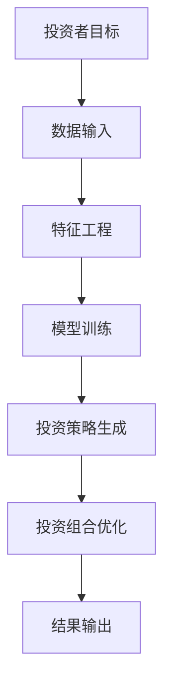
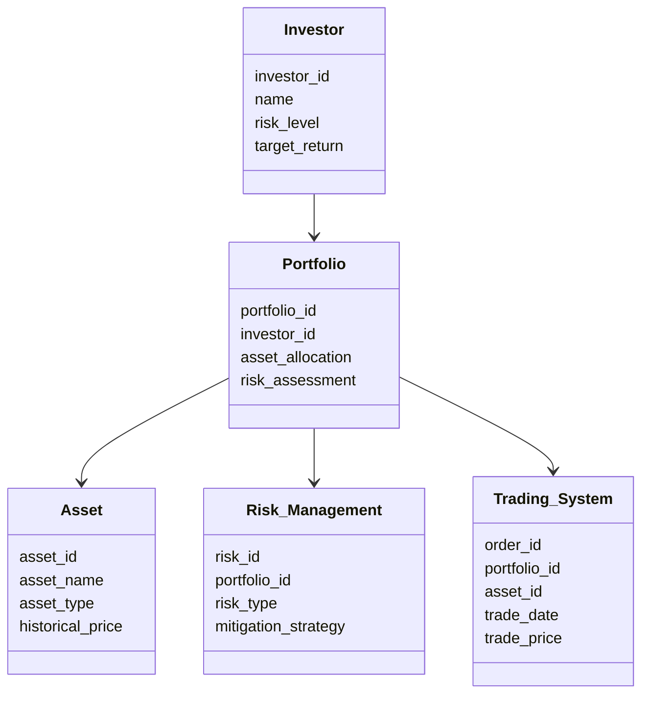
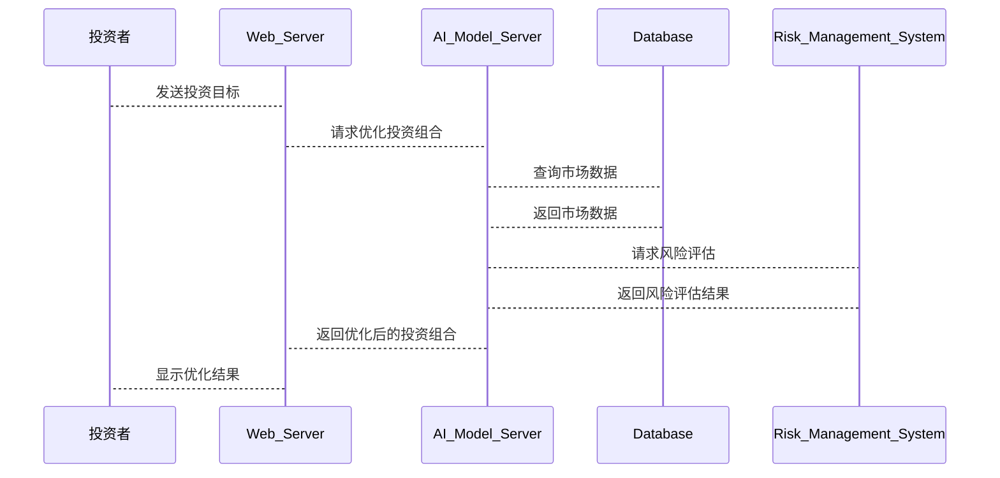

                 


# AI驱动的智能投资组合管理解决方案

> 关键词：AI驱动，投资组合管理，智能投资，机器学习，风险管理，资产配置

> 摘要：本文将详细介绍AI驱动的智能投资组合管理解决方案，从背景、技术基础、核心算法到系统架构和项目实战，全面解析如何利用人工智能技术优化投资组合管理，降低风险，提高收益。

---

# 第一部分：AI驱动的智能投资组合管理背景与基础

## 第1章：AI驱动的智能投资组合管理概述

### 1.1 投资组合管理的背景与意义

#### 1.1.1 投资组合管理的基本概念
投资组合管理是指通过科学的方法对资产进行配置和调整，以实现收益最大化和风险最小化的过程。传统的投资组合管理依赖于人工分析和经验判断，但随着市场的复杂化和数据量的爆炸式增长，这种方法逐渐暴露出效率低下、决策滞后等问题。

#### 1.1.2 传统投资组合管理的局限性
- 依赖人工判断，主观性较强。
- 数据分析能力有限，难以处理海量数据。
- 风险预测能力不足，难以应对复杂市场环境。
- 无法实时调整，错失市场机会。

#### 1.1.3 AI技术在投资组合管理中的优势
- 高效的数据处理能力，能够快速分析海量数据。
- 精准的预测能力，通过机器学习算法提高市场预测准确性。
- 自动化调整能力，实时跟踪市场变化并优化投资组合。
- 可扩展性，能够处理复杂的投资场景和多样化的需求。

### 1.2 AI驱动投资的背景与现状

#### 1.2.1 AI技术在金融领域的应用现状
人工智能技术已经在金融领域得到了广泛应用，包括智能投顾、风险管理、高频交易等多个方面。AI技术的应用不仅提高了金融行业的效率，还为投资者带来了更高的收益。

#### 1.2.2 智能投资组合管理的兴起
随着AI技术的成熟，智能投资组合管理逐渐成为投资领域的热点。通过AI技术，投资者可以实现个性化的资产配置和动态调整，从而更好地应对市场波动。

#### 1.2.3 当前市场中的AI投资工具与平台
目前市场中已经涌现出许多AI驱动的投资工具和平台，例如量化交易平台、智能投顾系统等。这些工具通过AI算法为投资者提供个性化的投资建议和策略。

### 1.3 本书的核心目标与内容框架

#### 1.3.1 本书的核心目标
本书旨在通过系统化的分析和实践，展示如何利用AI技术优化投资组合管理，帮助读者理解AI在投资组合管理中的核心作用。

#### 1.3.2 本书的主要内容框架
- 第一部分：AI驱动的智能投资组合管理背景与基础。
- 第二部分：AI驱动投资组合管理的核心算法与理论。
- 第三部分：AI驱动投资组合管理的系统架构与设计。
- 第四部分：AI驱动投资组合管理的项目实战。
- 第五部分：AI驱动投资组合管理的最佳实践与小结。

#### 1.3.3 本书的读者群体与适用场景
本书适合金融从业者、数据科学家、投资经理以及对AI技术感兴趣的读者阅读。无论是想了解AI如何改变投资组合管理，还是想实际操作AI驱动的投资策略，读者都能从中获得启发。

---

## 第2章：AI驱动投资组合管理的技术基础

### 2.1 人工智能与机器学习基础

#### 2.1.1 人工智能的基本概念
人工智能（AI）是指通过模拟人类智能的计算机系统，能够实现感知、学习、推理和决策等功能。

#### 2.1.2 机器学习的核心算法
机器学习是人工智能的核心技术之一，常用的算法包括：
- **监督学习**：基于标记数据的训练，如线性回归、支持向量机（SVM）。
- **无监督学习**：基于无标记数据的训练，如聚类分析、主成分分析（PCA）。
- **强化学习**：通过试错机制优化决策，如Q-Learning、深度强化学习。

#### 2.1.3 深度学习与强化学习简介
深度学习通过多层神经网络模型提取数据特征，强化学习通过奖励机制优化决策策略。两者在投资组合管理中都有重要应用。

### 2.2 数据分析与特征工程

#### 2.2.1 数据分析的基本流程
- 数据收集：从多个数据源获取市场数据、历史价格、财务指标等。
- 数据清洗：处理缺失值、异常值和重复数据。
- 数据转换：对数据进行标准化、归一化等处理。
- 数据建模：利用机器学习算法进行数据分析和预测。

#### 2.2.2 特征工程的核心步骤
- 特征选择：从大量数据中提取关键特征，如收益率、波动率、相关性等。
- 特征构造：通过数据变换生成新的特征，如移动平均、技术指标等。
- 特征降维：通过主成分分析等方法减少特征维度。

#### 2.2.3 数据清洗与预处理方法
- 删除缺失值或用均值/中位数填充。
- 处理异常值，如使用Z-score方法检测异常值。
- 数据标准化：将数据转换为均值为0，标准差为1的分布。

### 2.3 风险管理与优化算法

#### 2.3.1 风险管理的基本概念
风险管理是投资组合管理的核心内容之一，主要包括风险识别、风险评估和风险控制。

#### 2.3.2 现代投资组合理论（MPT）简介
MPT通过优化资产配置，使得投资组合在给定风险下收益最大化，或者在给定收益下风险最小化。

#### 2.3.3 基于AI的优化算法
- **遗传算法**：模拟生物进化过程，用于全局优化。
- **模拟退火算法**：通过模拟热力学退火过程，寻找全局最优解。
- **粒子群优化算法**：通过模拟鸟群觅食过程，优化问题解。

---

## 第3章：AI驱动投资组合管理的核心概念与联系

### 3.1 投资组合管理的核心概念

#### 3.1.1 投资组合的构成要素
- 资产类别：股票、债券、基金等。
- 资产比例：各类资产在投资组合中的占比。
- 风险收益比：投资组合的预期收益与风险的匹配程度。

#### 3.1.2 投资组合的风险与收益关系
- 风险与收益呈正相关关系，高风险投资通常伴随着高收益。

#### 3.1.3 投资组合的动态调整机制
- 根据市场变化和投资者目标，定期调整投资组合的构成。

### 3.2 AI算法与投资组合管理的结合

#### 3.2.1 AI算法在投资决策中的作用
- 提供数据驱动的决策支持。
- 优化资产配置策略。
- 预测市场趋势和风险。

#### 3.2.2 投资组合优化的AI模型框架
- 数据输入：市场数据、投资者目标。
- 模型构建：基于机器学习算法构建预测模型。
- 结果输出：优化后的资产配置方案。

#### 3.2.3 AI驱动投资组合管理的流程图（Mermaid）



### 3.3 投资组合管理的实体关系图

#### 3.3.1 投资组合管理的ER图（Mermaid）

```mermaid
erDiagram
    INVESTOR(investor_id, name, risk_level)
    ASSET(asset_id, asset_name, asset_type)
    PORTFOLIO(portfolio_id, investor_id, target_return, risk_tolerance)
    HOLDING(holding_id, portfolio_id, asset_id, holding_percentage)
    RISK(risk_id, portfolio_id, risk_type, risk_level)
```

#### 3.3.2 数据流与交互关系（Mermaid）


---

## 第4章：AI驱动投资组合管理的系统架构与设计

### 4.1 系统功能设计（领域模型Mermaid类图）



### 4.2 系统架构设计（Mermaid架构图）


### 4.3 系统接口设计

- **API接口**：
  - `/api/portfolio/optimization`：优化投资组合。
  - `/api/risk/assessment`：评估投资组合风险。
  - `/api/trading/order`：生成交易订单。

### 4.4 系统交互设计（Mermaid序列图）



---

## 第5章：AI驱动投资组合管理的项目实战

### 5.1 环境搭建

#### 5.1.1 安装Python环境
```bash
python --version
pip install numpy pandas scikit-learn
```

#### 5.1.2 安装Jupyter Notebook
```bash
pip install jupyter
jupyter notebook
```

### 5.2 系统核心实现源代码

#### 5.2.1 数据处理代码
```python
import numpy as np
import pandas as pd

# 数据获取
data = pd.read_csv('market_data.csv')

# 数据清洗
data = data.dropna()
data = data.iloc[:, [0, 1, 2, 3]]

# 特征工程
from sklearn.preprocessing import StandardScaler
scaler = StandardScaler()
scaled_data = scaler.fit_transform(data)
```

#### 5.2.2 算法实现代码
```python
from sklearn.linear_model import LinearRegression
from sklearn.metrics import mean_squared_error

# 模型训练
model = LinearRegression()
model.fit(X_train, y_train)

# 模型预测
y_pred = model.predict(X_test)
print('MSE:', mean_squared_error(y_test, y_pred))
```

### 5.3 实际案例分析与详细解读

#### 5.3.1 投资组合优化案例
假设投资者的风险承受能力为中等，目标收益率为8%。通过AI算法优化，投资组合的配置如下：
- 股票：60%
- 债券：30%
- 基金：10%

#### 5.3.2 风险管理案例
通过AI算法预测，市场将在未来三个月内出现波动。投资组合调整如下：
- 减少高风险资产的持仓比例。
- 增加现金储备，应对潜在的市场下跌。

### 5.4 项目小结

#### 5.4.1 核心代码总结
- 数据处理：清洗、标准化、特征提取。
- 模型训练：线性回归、随机森林、深度学习模型。
- 投资组合优化：遗传算法、模拟退火算法。

#### 5.4.2 实际应用总结
- AI算法能够显著提高投资组合管理的效率和准确性。
- 数据质量和模型选择对投资组合的收益和风险有重要影响。
- 实时监控和动态调整是实现智能化投资组合管理的关键。

---

## 第6章：AI驱动投资组合管理的最佳实践与小结

### 6.1 最佳实践 Tips

#### 6.1.1 数据质量的重要性
- 确保数据的完整性和准确性。
- 使用多种数据源进行交叉验证。

#### 6.1.2 模型选择的注意事项
- 根据具体问题选择合适的算法。
- 进行模型的交叉验证和调优。

#### 6.1.3 系统架构的设计原则
- 模块化设计，便于维护和扩展。
- 异常处理机制，确保系统的稳定性。

### 6.2 小结

通过本书的系统讲解和实践，我们深入探讨了AI驱动的智能投资组合管理解决方案。从技术基础到系统架构，从算法实现到实际案例，我们全面展示了如何利用AI技术优化投资组合管理，降低风险，提高收益。

### 6.3 注意事项

- 投资有风险，AI算法的结果仅供参考，需结合市场实际情况进行决策。
- 数据质量和模型选择对投资结果有重要影响，需谨慎对待。
- 系统的实时性和稳定性是实现智能化投资管理的关键。

### 6.4 拓展阅读

- 《机器学习实战》
- 《Python金融大数据分析》
- 《投资学基础》

---

# 作者：AI天才研究院/AI Genius Institute & 禅与计算机程序设计艺术/Zen And The Art of Computer Programming

