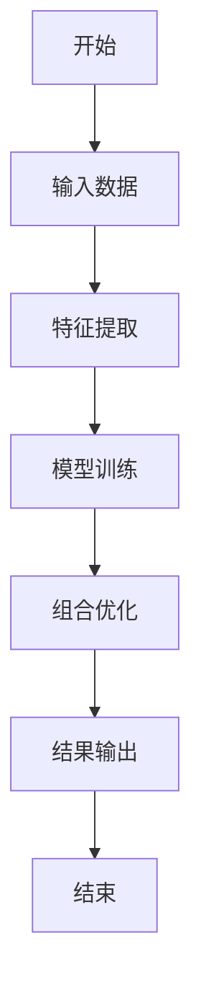
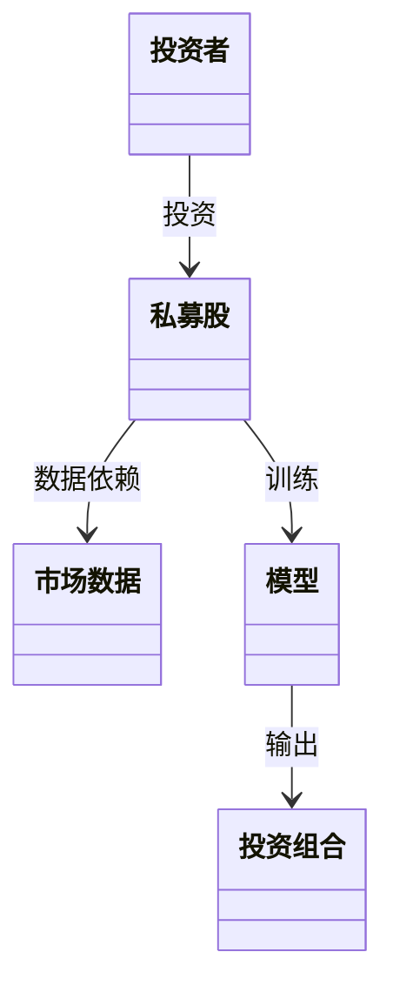
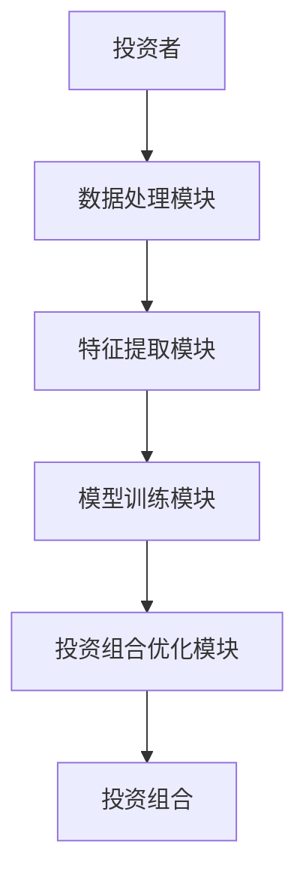

                 


# AI驱动的私募股权投资组合构建

> 关键词：AI驱动，私募股权投资，投资组合，风险管理，算法优化，系统架构

> 摘要：本文探讨了如何利用人工智能技术优化私募股权投资组合的构建过程。通过分析私募股权投资的核心特点，结合AI驱动的优势，详细阐述了从数据特征提取、模型训练到组合优化的全过程。文章还提供了系统的架构设计方案、算法实现的数学模型以及实际项目案例，为读者提供了从理论到实践的全面指导。

---

## 第1章: 私募股权投资与AI驱动的概述

### 1.1 私募股权投资的定义与特点

#### 1.1.1 私募股权投资的定义
私募股权投资（Private Equity Investment）是指通过投资于非公开交易的企业股权，以获取资本增值和分红收益的一种投资方式。其核心在于通过长期持有优质企业的股权，实现资本的增值。

#### 1.1.2 私募股权投资的核心特点
1. **高门槛**：私募股权投资通常面向机构投资者或高净值个人，具有较高的资金门槛。
2. **长周期**：私募股权投资的持有周期较长，通常为3-7年，注重企业的长期发展。
3. **高风险与高收益并存**：私募股权投资的风险较高，但潜在收益也远超其他投资方式。
4. **个性化投资策略**：私募股权基金通常根据市场环境和企业情况制定个性化的投资策略。

#### 1.1.3 私募股权投资的市场现状与发展趋势
近年来，全球私募股权投资市场持续增长，特别是在科技领域和新兴行业，私募股权投资表现尤为突出。随着大数据和人工智能技术的发展，越来越多的私募股权基金开始采用AI驱动的投资策略，以提高投资决策的效率和准确性。

---

### 1.2 AI驱动的私募股权投资的背景与意义

#### 1.2.1 AI技术在金融领域的应用背景
人工智能技术在金融领域的应用已经非常广泛，尤其是在高频交易、风险评估、市场预测等领域。私募股权投资作为金融领域的重要组成部分，也开始尝试引入AI技术，以优化投资组合的构建和管理。

#### 1.2.2 AI驱动私募股权投资的核心优势
1. **数据处理能力**：AI能够快速处理海量数据，提取关键特征，帮助投资者发现潜在的投资机会。
2. **预测能力**：通过机器学习模型，AI可以预测企业的未来表现，优化投资决策。
3. **风险管理**：AI能够实时监控市场变化，识别潜在风险，帮助投资者制定风险管理策略。

#### 1.2.3 AI在私募股权投资中的潜在价值
AI技术的应用可以显著提高私募股权投资的效率和准确性，降低投资风险，同时优化资源配置，推动私募股权投资行业的创新和发展。

---

### 1.3 私募股权投资组合构建的基本概念

#### 1.3.1 投资组合的定义与目标
投资组合是指将资金分配到多个不同的资产或项目中，以分散风险并实现收益最大化。私募股权投资组合的构建目标是通过优化资产配置，实现收益与风险的最佳平衡。

#### 1.3.2 组合构建的基本原则与方法
1. **分散化原则**：通过投资于不同行业、不同阶段的企业，降低组合的整体风险。
2. **风险收益匹配原则**：根据投资者的风险承受能力和收益目标，选择合适的企业和资产。
3. **动态调整原则**：根据市场环境和企业表现，定期调整投资组合。

#### 1.3.3 组合构建中的风险与收益平衡
私募股权投资组合的构建需要在风险和收益之间找到最佳平衡点。通过AI技术，可以更精准地评估风险，优化资产配置，实现风险收益的最优匹配。

---

## 第2章: AI驱动私募股权投资的核心概念与联系

### 2.1 核心概念原理

#### 2.1.1 数据驱动的投资决策
AI驱动的私募股权投资依赖于大量数据，包括企业的财务数据、市场数据、行业数据等。通过对这些数据的分析，AI可以提取关键特征，帮助投资者制定科学的投资决策。

#### 2.1.2 AI算法在组合优化中的应用
通过机器学习算法，AI可以优化投资组合的配置，提高收益，降低风险。常见的算法包括线性回归、支持向量机（SVM）、随机森林等。

#### 2.1.3 风险管理与AI预测
AI可以通过预测模型，评估企业的潜在风险，帮助投资者制定风险管理策略，降低投资组合的整体风险。

---

### 2.2 核心概念属性对比表

| 概念          | 属性          | 描述                                                                 |
|---------------|---------------|----------------------------------------------------------------------|
| 数据特征      | 独立性        | 数据点之间的独立性，影响模型的准确性和稳定性。                               |
| 模型评估      | 准确性        | 模型预测的准确性，通过交叉验证等方法进行评估。                               |
| 风险管理      | 稳定性        | 风险控制的稳定性，通过动态调整投资组合实现风险与收益的平衡。                 |

---

### 2.3 ER实体关系图

```mermaid
er
  entity 私募股权 {
    <属性> 投资金额
    <属性> 投资期限
    <属性> 风险等级
  }
  entity AI模型 {
    <属性> 模型类型
    <属性> 训练数据
    <属性> 预测结果
  }
  relationship 投资决策 {
    私募股权 -[1..n]-> AI模型
  }
```

---

## 第3章: AI驱动私募股权投资组合构建的算法原理

### 3.1 算法原理概述

#### 3.1.1 优化目标
投资组合优化的目标是最大化收益，同时最小化风险。数学上，目标函数可以表示为：
$$ \text{目标函数: } \min_w \sum_{i=1}^n w_i^2 $$
其中，\( w_i \) 是第 \( i \) 个资产的权重。

#### 3.1.2 约束条件
组合优化需要满足以下约束条件：
$$ \sum_{i=1}^n w_i = 1 $$
即，投资组合的总权重为1。

#### 3.1.3 求解方法
通过拉格朗日乘数法，可以求解上述优化问题。具体步骤如下：

1. **构建拉格朗日函数**：
$$ L(w, \lambda) = \sum_{i=1}^n w_i^2 - \lambda \left( \sum_{i=1}^n w_i - 1 \right) $$

2. **求导并求解**：
对 \( w_i \) 和 \( \lambda \) 求偏导，得到：
$$ \frac{\partial L}{\partial w_i} = 2w_i - \lambda = 0 $$
$$ \frac{\partial L}{\partial \lambda} = \sum_{i=1}^n w_i - 1 = 0 $$

解得：
$$ w_i = \frac{\lambda}{2} $$
$$ \sum_{i=1}^n w_i = 1 \Rightarrow \lambda = \frac{2}{n} $$

因此，最优权重为：
$$ w_i = \frac{1}{n} $$

---

### 3.2 算法流程图



---

### 3.3 数学模型与公式

#### 3.3.1 投资组合优化模型
$$ \text{目标函数: } \min_w \sum_{i=1}^n w_i^2 $$
$$ \text{约束条件: } \sum_{i=1}^n w_i = 1 $$

#### 3.3.2 风险调整模型
$$ \text{风险调整收益} = \text{收益} - \text{风险} \times \text{风险系数} $$

---

## 第4章: 系统分析与架构设计方案

### 4.1 问题场景介绍

#### 4.1.1 投资组合优化的典型问题
私募股权投资组合优化的典型问题包括：
1. 如何选择最优的企业进行投资？
2. 如何动态调整投资组合以应对市场变化？
3. 如何利用AI技术提高投资决策的效率和准确性？

#### 4.1.2 AI驱动的解决方案
通过构建AI驱动的私募股权投资系统，可以实现以下目标：
1. 自动化数据收集与处理
2. 智能化投资决策
3. 动态风险控制

---

### 4.2 系统功能设计

#### 4.2.1 领域模型


#### 4.2.2 系统架构图


---

## 第5章: 项目实战

### 5.1 环境安装与配置

#### 5.1.1 Python环境安装
安装Python 3.8及以上版本，并安装以下库：
```bash
pip install numpy pandas scikit-learn matplotlib
```

#### 5.1.2 数据集准备
准备私募股权相关数据，包括企业的财务数据、市场数据等。

---

### 5.2 系统核心实现源代码

#### 5.2.1 数据处理代码
```python
import pandas as pd

# 读取数据
data = pd.read_csv('private_equity_data.csv')

# 数据清洗
data.dropna(inplace=True)
data = data[~data['行业'].isnull()]
```

#### 5.2.2 模型训练代码
```python
from sklearn.ensemble import RandomForestRegressor
import numpy as np

# 特征提取
X = data.drop('收益', axis=1)
y = data['收益']

# 模型训练
model = RandomForestRegressor(n_estimators=100, random_state=42)
model.fit(X, y)
```

#### 5.2.3 组合优化代码
```python
import numpy as np

# 定义目标函数
def portfolio_optimization(weights):
    return np.sum(weights**2)

# 约束条件
constraint = {
    'type': 'eq',
    'fun': lambda w: np.sum(w) - 1
}

# 求解优化问题
from scipy.optimize import minimize

result = minimize(portfolio_optimization, np.ones(len(X.columns)) / len(X.columns), constraints=[constraint])
print(result.x)
```

---

### 5.3 实际案例分析

#### 5.3.1 数据分析
通过对某私募股权基金的历史数据进行分析，提取企业的财务数据、市场数据等关键特征。

#### 5.3.2 模型预测
利用随机森林模型预测企业的未来收益，并评估投资组合的风险。

#### 5.3.3 投资组合优化
通过优化算法，确定最优的投资组合，实现收益与风险的平衡。

---

## 第6章: 最佳实践与总结

### 6.1 最佳实践

#### 6.1.1 数据质量的重要性
确保数据的准确性和完整性，是AI驱动私募股权投资的基础。

#### 6.1.2 模型选择与调优
根据具体场景选择合适的模型，并通过交叉验证等方法进行调优。

#### 6.1.3 风险管理
定期监控市场变化，动态调整投资组合，降低整体风险。

---

### 6.2 小结

AI技术的应用为私募股权投资的组合构建带来了新的机遇和挑战。通过数据驱动的投资决策、智能化的模型优化和动态的风险管理，可以显著提高投资效率和收益。

---

### 6.3 注意事项

1. **数据隐私**：私募股权数据通常涉及敏感信息，需注意数据隐私和合规性。
2. **模型解释性**：复杂的AI模型可能难以解释，需确保模型的可解释性。
3. **持续学习**：市场环境不断变化，需持续更新模型和数据。

---

### 6.4 拓展阅读

1. **书籍**：
   - 《机器学习实战》
   - 《私募股权投资基金运作实务》
2. **论文**：
   - "Portfolio Optimization Using Machine Learning"
   - "Risk Management in Private Equity Investments"
3. **在线资源**：
   - Towards Data Science: AI in Finance
   - Quantitative Investment with Python

---

## 作者：AI天才研究院/AI Genius Institute & 禅与计算机程序设计艺术 /Zen And The Art of Computer Programming

