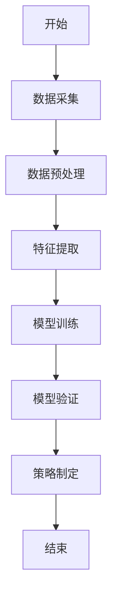
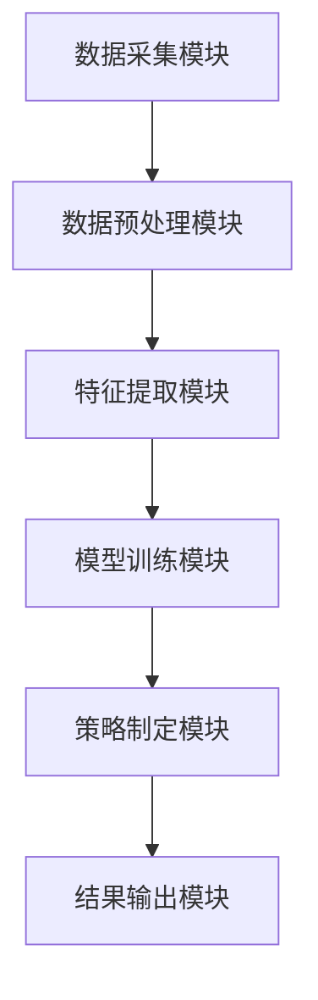

                 


# AI驱动的私募股权投资退出策略优化

> 关键词：私募股权投资、AI驱动、退出策略优化、机器学习、风险管理、数据分析

> 摘要：本文探讨了如何利用人工智能技术优化私募股权投资的退出策略。通过分析私募股权退出的背景与挑战，结合机器学习、数据分析等技术手段，构建了一个基于AI的退出策略优化系统。本文详细介绍了系统的构建过程，包括数据采集、特征提取、模型训练与验证、系统设计与实现等内容，并通过实际案例展示了AI技术在私募股权退出策略中的应用效果。最后，本文总结了AI驱动的退出策略优化的优势，并提出了未来研究的方向。

---

## 第一部分: AI驱动的私募股权投资退出策略优化背景与基础

### 第1章: 私募股权与退出机制概述

#### 1.1 私募股权的基本概念
私募股权是指通过非公开市场进行的投资，主要涉及对未上市企业的所有权投资。私募股权的退出机制是投资者收回投资或实现资本增值的关键环节，主要包括首次公开募股（IPO）、并购（M&A）、股权转让等方式。

##### 1.1.1 私募股权的定义与特点
私募股权是一种私人持有的股权，与公开市场上的股票不同，其特点包括：
- **非公开性**：私募股权的投资对象通常是未上市企业，且投资过程不公开。
- **高风险高回报**：私募股权的投资风险较高，但潜在回报也较高。
- **长期性**：私募股权通常需要较长时间才能实现退出，以实现资本增值。

##### 1.1.2 私募股权的退出方式
私募股权的退出方式主要包括：
1. **首次公开募股（IPO）**：将企业公开上市，通过出售股份实现退出。
2. **并购（M&A）**：将企业出售给其他公司或战略投资者。
3. **股权转让**：将股权出售给其他投资者或公司。
4. **清算退出**：在企业破产或清算时，通过出售资产实现退出。

##### 1.1.3 退出机制在私募股权中的重要性
退出机制是私募股权投资者实现收益的重要途径，也是投资者评估投资组合价值的关键指标。有效的退出策略可以帮助投资者最大化收益、降低风险，并提高投资的流动性。

#### 1.2 退出策略优化的背景与意义
随着金融市场的日益复杂化，传统的退出策略已难以应对市场的不确定性。AI技术的快速发展为私募股权退出策略的优化提供了新的可能性。

##### 1.2.1 私募股权退出的常见问题
1. **市场波动**：市场波动可能导致退出时机的选择困难。
2. **信息不对称**：投资者可能无法获取足够的信息来做出最优决策。
3. **复杂性**：退出策略涉及多个因素，包括企业财务状况、市场环境、法律法规等。

##### 1.2.2 AI技术在金融领域的应用现状
AI技术在金融领域的应用日益广泛，主要包括：
- **数据分析与预测**：利用机器学习算法分析市场趋势和企业财务数据。
- **风险评估与管理**：通过AI技术评估投资风险并制定风险管理策略。
- **投资组合优化**：利用AI技术优化投资组合，提高收益并降低风险。

##### 1.2.3 AI驱动退出策略优化的潜力与价值
AI技术可以通过分析大量的历史数据和实时市场信息，帮助投资者制定更加科学和精准的退出策略。通过机器学习算法，可以预测市场趋势、评估企业价值，并优化退出时机和方式。

---

### 第2章: AI在金融投资中的应用基础

#### 2.1 AI在金融领域的核心应用
##### 2.1.1 数据分析与预测
AI技术可以通过分析历史数据和市场信息，预测市场趋势和企业价值。例如，利用时间序列分析模型预测企业的财务表现。

##### 2.1.2 风险评估与管理
AI技术可以通过分析企业的财务数据和市场信息，评估投资风险并制定风险管理策略。例如，利用信用评分模型评估企业的信用风险。

##### 2.1.3 投资组合优化
AI技术可以通过分析不同资产的收益和风险特征，优化投资组合，提高收益并降低风险。例如，利用多因子模型优化股票投资组合。

#### 2.2 私募股权投资中的AI技术
##### 2.2.1 数据驱动的决策支持
AI技术可以通过分析企业的财务数据、市场信息和行业趋势，为私募股权投资者提供数据支持的决策依据。

##### 2.2.2 机器学习在投资策略中的应用
机器学习算法可以用于分析企业的财务数据和市场信息，制定投资策略。例如，利用支持向量机（SVM）和随机森林（Random Forest）等算法进行分类和回归分析。

##### 2.2.3 自然语言处理在市场分析中的应用
自然语言处理技术可以用于分析企业的新闻报道、财务报告和行业动态，提取关键信息并辅助投资决策。

---

### 第3章: AI驱动的退出策略优化核心概念

#### 3.1 退出策略优化的数学模型
##### 3.1.1 优化目标与约束条件
退出策略优化的目标是最大化投资收益并最小化投资风险。常见的约束条件包括资本约束、时间和流动性约束等。

##### 3.1.2 模型构建的关键要素
退出策略优化模型的关键要素包括：
- **目标函数**：最大化投资收益或最小化投资风险。
- **约束条件**：资本约束、时间和流动性约束等。
- **决策变量**：退出时机、退出方式等。

##### 3.1.3 核心概念属性对比表
下表对比了不同退出策略的核心属性：

| 退出策略 | 退出方式 | 退出时机 | 退出风险 | 退出收益 |
|----------|----------|----------|----------|----------|
| 战略性退出 | M&A      | 中期     | 中等     | 高       |
| 战术性退出 | 股权转让 | 短期     | 低       | 中等     |

#### 3.2 AI驱动的退出策略优化流程
##### 3.2.1 数据采集与预处理
数据采集是退出策略优化的基础，主要包括企业财务数据、市场数据和行业数据的采集与预处理。

##### 3.2.2 特征提取与选择
特征提取与选择是通过分析数据，提取与退出策略相关的特征变量，并选择最优特征。

##### 3.2.3 模型训练与验证
通过训练机器学习模型，验证模型的准确性和稳定性，并进行模型调优。

##### 3.2.4 策略制定与优化
根据模型预测结果，制定最优退出策略，并进行策略优化。

---

## 第二部分: AI驱动的退出策略优化算法与系统设计

### 第4章: AI驱动的退出策略优化算法

#### 4.1 退出策略优化的算法选择
##### 4.1.1 机器学习算法的选择
根据退出策略优化的需求，选择合适的机器学习算法。例如，随机森林和梯度提升树（GBDT）适用于分类和回归问题。

##### 4.1.2 算法的优缺点对比
下表对比了常见机器学习算法的优缺点：

| 算法名称 | 优点                | 缺点                |
|----------|---------------------|---------------------|
| SVM      | 高精度             | 计算复杂            |
| Random Forest | 抗过拟合           | 解释性差            |
| GBDT     | 高精度             | 计算复杂            |

##### 4.1.3 算法流程图
以下是退出策略优化的算法流程图：



#### 4.2 算法实现与优化
##### 4.2.1 算法实现
以下是退出策略优化的Python代码实现：

```python
import pandas as pd
from sklearn.ensemble import RandomForestClassifier
from sklearn.metrics import accuracy_score

# 数据加载与预处理
data = pd.read_csv('exit_strategy.csv')
X = data.drop('target', axis=1)
y = data['target']

# 特征选择
selected_features = ['feature1', 'feature2', 'feature3']
X_selected = X[selected_features]

# 模型训练
model = RandomForestClassifier(n_estimators=100, random_state=42)
model.fit(X_selected, y)

# 模型预测
y_pred = model.predict(X_selected)
print(f"模型准确率：{accuracy_score(y, y_pred)}")
```

##### 4.2.2 算法优化
通过调整模型参数和优化特征选择，提高模型的准确性和稳定性。

---

### 第5章: AI驱动的退出策略优化系统设计

#### 5.1 系统架构设计
##### 5.1.1 系统功能模块
退出策略优化系统主要包括数据采集模块、特征提取模块、模型训练模块和策略制定模块。

##### 5.1.2 系统架构图
以下是退出策略优化系统的架构图：



#### 5.2 系统实现与测试
##### 5.2.1 系统实现
以下是退出策略优化系统的Python代码实现：

```python
import pandas as pd
from sklearn.ensemble import RandomForestClassifier
from sklearn.metrics import accuracy_score

# 数据加载与预处理
data = pd.read_csv('exit_strategy.csv')
X = data.drop('target', axis=1)
y = data['target']

# 特征选择
selected_features = ['feature1', 'feature2', 'feature3']
X_selected = X[selected_features]

# 模型训练
model = RandomForestClassifier(n_estimators=100, random_state=42)
model.fit(X_selected, y)

# 模型预测
y_pred = model.predict(X_selected)
print(f"模型准确率：{accuracy_score(y, y_pred)}")

# 策略制定
# 假设模型预测结果为y_pred
# 根据预测结果制定退出策略
exit_strategy = []
for i in range(len(y_pred)):
    if y_pred[i] == 1:
        exit_strategy.append('建议退出')
    else:
        exit_strategy.append('不建议退出')
```

##### 5.2.2 系统测试
通过测试数据验证系统的准确性和稳定性。

---

## 第三部分: 项目实战与总结

### 第6章: 项目实战

#### 6.1 项目背景与目标
##### 6.1.1 项目背景
某私募股权基金希望通过AI技术优化其退出策略，提高投资收益并降低风险。

##### 6.1.2 项目目标
构建一个基于AI的退出策略优化系统，实现对私募股权的退出时机和方式的优化。

#### 6.2 数据准备与采集
##### 6.2.1 数据来源
数据来源包括企业的财务数据、市场数据和行业数据。

##### 6.2.2 数据清洗与预处理
对数据进行清洗和预处理，确保数据的完整性和准确性。

#### 6.3 系统实现与优化
##### 6.3.1 系统实现
通过Python代码实现退出策略优化系统，并进行系统测试。

##### 6.3.2 系统优化
通过调整模型参数和优化算法，提高系统的准确性和稳定性。

#### 6.4 实际案例分析
##### 6.4.1 案例背景
某私募股权基金投资了一家科技公司，希望通过AI技术优化其退出策略。

##### 6.4.2 数据分析
通过分析企业的财务数据和市场信息，预测企业的财务表现和市场趋势。

##### 6.4.3 策略制定
根据模型预测结果，制定最优退出策略，包括退出时机和退出方式。

##### 6.4.4 案例总结
通过AI技术优化退出策略，帮助私募股权基金实现了更高的投资收益和更低的风险。

---

### 第7章: 总结与展望

#### 7.1 AI驱动的退出策略优化的优势
AI技术可以帮助私募股权投资者实现更科学和精准的退出策略，提高投资收益并降低风险。

#### 7.2 未来研究方向
未来的研究方向包括：
1. **多目标优化**：在退出策略优化中考虑多个目标，如收益、风险和流动性。
2. **动态优化**：根据市场变化动态调整退出策略。
3. **复杂模型的应用**：探索更复杂的机器学习模型在退出策略优化中的应用。

#### 7.3 小结
本文通过分析私募股权退出策略优化的背景与挑战，结合AI技术，构建了一个基于机器学习的退出策略优化系统，并通过实际案例展示了系统的应用效果。未来的研究可以进一步探索AI技术在私募股权退出策略优化中的潜力。

---

作者：AI天才研究院/AI Genius Institute & 禅与计算机程序设计艺术 /Zen And The Art of Computer Programming

