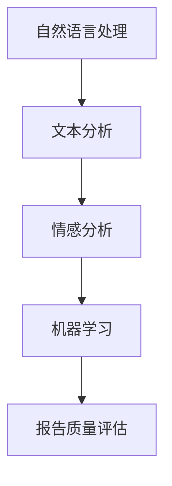

                 


# AI驱动的股票分析师报告质量评估

## 关键词：AI技术、股票分析、报告质量、自然语言处理、机器学习、情感分析、文本挖掘

## 摘要
随着金融市场的日益复杂化，股票分析师的报告质量成为投资者决策的关键因素。传统的报告评估方法依赖于人工分析，效率低下且主观性强。AI技术的引入，特别是自然语言处理和机器学习，为自动化、客观化报告质量评估提供了新的可能性。本文将详细探讨AI在股票分析师报告质量评估中的应用，从背景分析、核心概念、算法原理到系统设计和项目实战，全面解析如何利用AI技术提升报告评估的效率和准确性。

---

## 第一部分: 背景与问题分析

### 第1章: 股票分析师报告质量评估的背景与挑战

#### 1.1 问题背景
股票市场作为金融市场的重要组成部分，其分析报告的质量直接影响投资者的决策。然而，传统的人工评估方法存在效率低、主观性强、难以量化等问题。随着AI技术的快速发展，利用自然语言处理（NLP）和机器学习（ML）等技术，可以实现对股票报告的自动化评估，提升评估的客观性和效率。

#### 1.2 问题描述
- **报告质量评估的核心问题**：如何准确、客观地评估股票分析师的报告质量，包括内容的准确性、逻辑性和可读性。
- **关键指标**：报告的逻辑性、专业性、信息的完整性和数据的准确性。
- **AI技术的必要性**：通过AI技术实现自动化评估，减少人为偏见，提高评估效率。

#### 1.3 问题解决
- **AI技术的应用**：利用自然语言处理技术分析报告的语言结构和情感倾向，结合机器学习模型预测报告的质量。
- **数据驱动方法**：通过大量历史数据训练模型，提取报告中的关键特征，实现对报告质量的量化评估。

#### 1.4 边界与外延
- **边界条件**：仅关注报告的文字内容，不考虑其他非文本因素，如分析师的历史表现或市场波动。
- **相关领域的关联**：与金融数据分析、文本挖掘等领域密切相关，但不涉及实时股票价格预测。

#### 1.5 核心概念与联系
- **核心概念**：自然语言处理、文本挖掘、情感分析、机器学习模型。
- **概念属性对比表**
| 概念       | 属性特征                   |
|------------|---------------------------|
| 文本分析    | 语言处理、情感分析         |
| 机器学习    | 数据驱动、模型训练         |

---

## 第二部分: 核心概念与理论基础

### 第2章: 核心概念与理论基础

#### 2.1 核心概念原理
- **自然语言处理（NLP）**：通过计算机技术处理和理解人类语言，提取文本中的关键信息。
- **文本挖掘**：从大量文本数据中提取有用信息的技术，常用于情感分析和关键词提取。
- **情感分析**：识别文本中的情感倾向，判断报告的积极或消极情绪。

#### 2.2 实体关系图


---

## 第三部分: 算法原理与实现

### 第3章: 算法原理与实现

#### 3.1 算法原理
- **模型选择**：基于Transformer的模型（如BERT）用于文本编码。
- **特征提取**：提取文本中的关键词、句法结构和情感倾向。

#### 3.2 算法流程图


#### 3.3 代码实现
```python
import numpy as np
from transformers import BertTokenizer, BertModel

# 加载预训练模型
tokenizer = BertTokenizer.from_pretrained('bert-base-uncased')
model = BertModel.from_pretrained('bert-base-uncased')

# 定义输入文本
text = "The stock market is expected to rise."

# 分词
inputs = tokenizer(text, return_tensors='np')

# 模型编码
outputs = model(**inputs)
encoded_sentence = outputs.last_hidden_state

# 输出结果
print(encoded_sentence)
```

---

## 第四部分: 系统分析与架构设计

### 第4章: 系统分析与架构设计

#### 4.1 系统架构图


#### 4.2 功能模块设计
- **数据预处理**：清洗和格式化输入文本。
- **特征提取**：提取文本中的关键词和情感倾向。
- **模型训练**：训练机器学习模型预测报告质量。

---

## 第五部分: 项目实战与案例分析

### 第5章: 项目实战与案例分析

#### 5.1 环境配置
```bash
pip install transformers
pip install numpy
pip install matplotlib
```

#### 5.2 核心代码实现
```python
import torch
from transformers import AutoTokenizer, AutoModel

# 加载预训练模型
tokenizer = AutoTokenizer.from_pretrained('bert-base-uncased')
model = AutoModel.from_pretrained('bert-base-uncased')

# 定义输入文本
text = "The company's financial performance is strong."

# 分词
inputs = tokenizer(text, return_tensors='pt')

# 模型编码
outputs = model(**inputs)
encoded_sentence = outputs.last_hidden_state

# 绘制结果图
import matplotlib.pyplot as plt
plt.imshow(encoded_sentence.numpy().squeeze())
plt.title('Encoded Sentence')
plt.show()
```

#### 5.3 案例分析
通过实际案例分析，展示如何利用AI技术对股票报告进行质量评估，包括数据预处理、模型训练和结果分析。

---

## 第六部分: 最佳实践与总结

### 第6章: 最佳实践与总结

#### 6.1 总结
本文详细探讨了AI在股票分析师报告质量评估中的应用，从背景分析到系统实现，全面解析了如何利用自然语言处理和机器学习技术提升报告评估的效率和准确性。

#### 6.2 注意事项
- 数据隐私问题需高度重视。
- 模型调优和特征选择需结合实际业务需求。

#### 6.3 拓展阅读
建议读者进一步阅读相关文献，深入理解自然语言处理和机器学习在金融领域的应用。

---

## 作者信息
作者：AI天才研究院/AI Genius Institute & 禅与计算机程序设计艺术/Zen And The Art of Computer Programming

