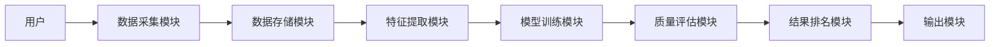

                 


# AI驱动的股票分析师报告质量评估与排名

> **关键词**: AI, 股票分析, 报告质量评估, 自然语言处理, 机器学习, 系统架构设计

> **摘要**: 本文探讨了如何利用人工智能技术对股票分析师的报告质量进行评估与排名。通过分析报告的内容、语言风格及逻辑结构，结合自然语言处理和机器学习算法，建立了一个自动化评估系统。该系统不仅提高了评估效率，还提升了结果的准确性。文章详细介绍了系统的设计思路、算法实现、系统架构，并通过实际案例展示了系统的应用效果。

---

## 第一部分：背景与概念

### 第1章：股票分析师报告质量评估的背景与挑战

#### 1.1 股票分析行业的现状

股票分析行业是一个高度依赖专业技能和经验的领域。传统的股票分析主要依赖分析师的个人经验和主观判断，这种模式存在以下问题：

- **信息过载**：每天发布的股票报告数量庞大，分析师难以快速筛选出高质量的报告。
- **主观性**：不同分析师的分析标准不一，导致报告质量参差不齐。
- **效率低下**：人工评估报告质量耗时长，难以满足实时性需求。

#### 1.2 报告质量评估的重要性

报告质量直接影响投资者的决策，高质量的报告能够帮助投资者做出明智的投资选择。然而，传统的人工评估方式存在以下问题：

- **一致性不足**：不同评估人员的标准不一，导致评估结果缺乏可比性。
- **效率低下**：人工评估耗时长，难以应对海量报告的评估需求。
- **成本高昂**：需要大量专业人员进行评估，增加了企业的运营成本。

#### 1.3 AI驱动的解决方案

人工智能技术的引入为股票分析行业带来了新的可能性。AI可以通过自然语言处理和机器学习算法，自动评估报告的质量，实现以下目标：

- **提高评估效率**：AI可以在短时间内处理大量报告，显著提高评估效率。
- **增强评估一致性**：AI基于统一的标准进行评估，确保结果的一致性。
- **降低评估成本**：自动化评估减少了对大量专业人员的依赖，降低了成本。

---

### 第2章：AI驱动的股票分析核心概念

#### 2.1 自然语言处理在报告分析中的应用

自然语言处理（NLP）技术在股票分析中的应用主要体现在以下几个方面：

1. **文本相似度计算**：通过计算不同报告之间的相似度，识别出重复或低质量的报告。
2. **关键词提取**：从报告中提取关键信息，如行业术语、公司名称等，帮助评估报告的专业性。
3. **情感分析**：分析报告中的情感倾向，判断报告的积极或消极态度。

#### 2.2 机器学习模型在质量评估中的作用

机器学习模型在股票分析师报告质量评估中的作用主要体现在以下几个方面：

1. **分类模型**：将报告分为高质量和低质量两类，帮助筛选出优质报告。
2. **回归模型**：预测报告的质量评分，提供量化评估结果。
3. **模型优化**：通过不断优化模型参数，提高评估的准确性和可靠性。

#### 2.3 核心概念与联系

以下是核心概念的对比表格：

| **概念**       | **描述**                                                                 |
|----------------|--------------------------------------------------------------------------|
| 文本相似度     | 通过计算文本之间的相似性，识别出内容重复的报告。                      |
| 关键词提取     | 从文本中提取关键信息，帮助判断报告的专业性和准确性。                  |
| 情感分析       | 分析文本中的情感倾向，识别报告的情感色彩。                            |
| 分类模型       | 将报告分为高质量和低质量两类，帮助筛选优质报告。                      |
| 回归模型       | 预测报告的质量评分，提供量化评估结果。                                |

---

## 第三部分：算法与模型实现

### 第3章：算法原理与实现

#### 3.1 数据预处理

数据预处理是机器学习模型训练的重要步骤，包括以下几个方面：

1. **文本清洗**：去除无用信息，如停用词、标点符号等。
2. **文本分词**：将文本分割成有意义的词语或短语。
3. **向量表示**：将文本转换为向量表示，常用的方法有词袋模型、TF-IDF、Word2Vec等。

#### 3.2 特征提取

特征提取是将文本数据转化为模型可以处理的特征向量。常用的方法包括：

1. **TF-IDF**：基于词频-逆文档频率的特征提取方法。
2. **Word2Vec**：通过神经网络训练得到词向量表示。
3. **BERT**：基于预训练的双向Transformer模型，提取文本的深度语义特征。

#### 3.3 模型训练

模型训练是通过已标注的数据集训练机器学习模型。常用的算法包括：

1. **逻辑回归**：适用于二分类问题，如高质量报告与低质量报告的分类。
2. **支持向量机（SVM）**：适用于小规模数据集的分类问题。
3. **随机森林**：适用于特征较多的分类问题，具有较强的鲁棒性。

#### 3.4 模型评估与优化

模型评估是通过测试集验证模型的性能，常用指标包括准确率、召回率、F1分数等。模型优化可以通过以下方式进行：

1. **参数调优**：通过网格搜索或贝叶斯优化方法调整模型参数。
2. **特征工程**：进一步优化特征，如特征选择、特征组合等。
3. **模型集成**：通过集成学习方法（如投票、加权平均）提升模型性能。

---

### 第4章：系统架构与设计

#### 4.1 系统功能设计

系统功能设计包括以下几个模块：

1. **数据采集**：从股票分析平台获取报告数据。
2. **特征提取**：对报告文本进行特征提取，生成特征向量。
3. **模型训练**：基于特征向量训练机器学习模型。
4. **质量评估**：使用训练好的模型对新报告进行质量评估。
5. **结果排名**：根据评估结果对报告进行排序，输出最终排名。

#### 4.2 系统架构设计

以下是系统架构的Mermaid图：



---

## 第四部分：项目实战

### 第5章：项目实战

#### 5.1 环境安装

项目实战需要以下环境：

- **Python**：推荐使用最新版本。
- **库依赖**：包括numpy、pandas、scikit-learn、spacy、tensorflow等。

安装命令：

```bash
pip install numpy pandas scikit-learn spacy tensorflow
python -m spacy download en_core_web_sm
```

#### 5.2 核心实现

以下是核心代码示例：

```python
import numpy as np
from sklearn.feature_extraction.text import TfidfVectorizer
from sklearn.svm import SVC
from sklearn.metrics import accuracy_score

# 数据预处理
def preprocess(text):
    # 文本清洗
    text = text.lower()
    text = text.replace('\n', ' ')
    text = text.replace('\t', ' ')
    # 分词
    words = text.split()
    return ' '.join(words)

# 特征提取
vectorizer = TfidfVectorizer()
X = vectorizer.fit_transform(corpus)

# 模型训练
model = SVC()
model.fit(X.toarray(), labels)

# 模型评估
y_pred = model.predict(X_test.toarray())
print("Accuracy:", accuracy_score(y_test, y_pred))
```

#### 5.3 案例分析

通过实际案例分析，展示系统在实际中的应用效果。例如，分析某段时间内分析师的报告质量，输出评估结果和排名。

---

## 第五部分：总结与展望

### 第6章：总结与展望

#### 6.1 总结

本文详细介绍了AI驱动的股票分析师报告质量评估与排名系统的设计与实现。通过自然语言处理和机器学习技术，实现了报告的自动化评估和排名，显著提高了评估效率和准确性。

#### 6.2 展望

未来，随着AI技术的不断发展，股票分析领域将更加依赖智能化工具。以下是未来可能的研究方向：

1. **深度学习模型**：探索使用深度学习模型（如BERT、GPT）进一步提升评估准确性。
2. **实时分析**：开发实时报告分析系统，实现动态评估和排名。
3. **多模态分析**：结合文本、图像等多种数据源，提升评估的全面性。

---

## 作者信息

作者：AI天才研究院/AI Genius Institute & 禅与计算机程序设计艺术/Zen And The Art of Computer Programming

