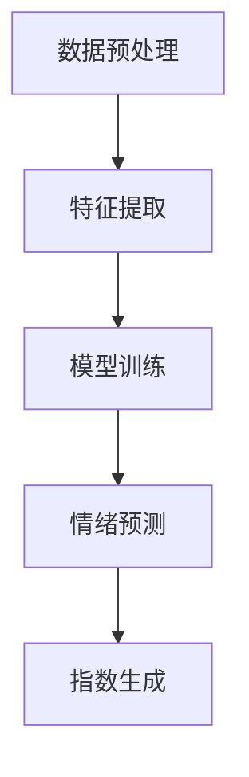
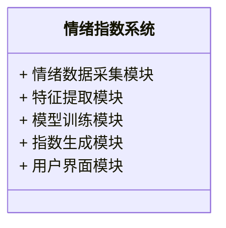
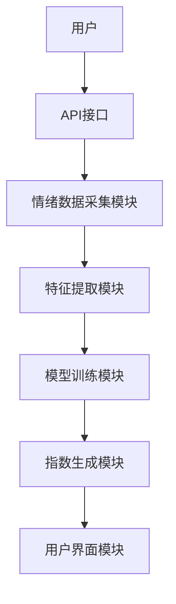
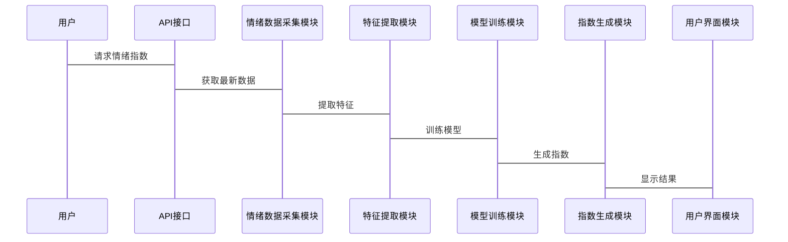

                 


# AI驱动的股票市场情绪指数开发

## 关键词：AI驱动，股票市场，情绪指数，算法开发，金融分析

## 摘要：  
本文详细探讨了利用人工智能技术开发股票市场情绪指数的全过程，从核心概念的定义到算法的实现，再到系统的架构设计和项目实战，全面解析了情绪指数在金融分析中的应用价值和实现方法。文章结合理论与实践，通过具体案例分析，展示了如何利用AI技术构建高效、准确的股票市场情绪指数，为投资者提供科学的决策支持。

---

## 第一部分：AI驱动的股票市场情绪指数开发背景与基础

### 第1章：股票市场情绪指数开发背景

#### 1.1 股票市场情绪指数的定义与作用  
股票市场情绪指数是一种量化投资者情绪的指标，反映了市场参与者对某只股票或整个市场的看法和信心。它可以帮助投资者预测市场趋势、评估风险，并为投资决策提供参考。  

- **情绪指数的定义**：情绪指数通过收集和分析市场参与者的行为数据（如交易量、社交媒体情绪、新闻标题等），量化市场情绪的波动。  
- **情绪指数的作用**：  
  - 帮助投资者识别市场情绪的变化，捕捉市场拐点。  
  - 为量化交易策略提供输入数据，提升交易模型的准确性。  
  - 用于风险管理和投资组合优化。  

#### 1.2 AI技术在金融领域的应用背景  
AI技术在金融领域的应用日益广泛，尤其是在高频交易、风险管理和市场分析方面。AI能够通过自然语言处理（NLP）、机器学习等技术，从非结构化数据中提取情绪信息，为情绪指数的开发提供了技术支持。  

- **AI在金融行业的应用现状**：  
  - 自然语言处理（NLP）用于分析新闻、社交媒体和公司财报的情绪。  
  - 机器学习算法用于预测市场趋势和风险评估。  
  - 大数据分析技术用于整合多源数据，提升情绪指数的准确性。  

#### 1.3 本章小结  
本章介绍了股票市场情绪指数的定义和作用，并分析了AI技术在金融领域的应用背景。情绪指数作为量化市场情绪的重要工具，其开发离不开AI技术的支持。下一章将深入探讨情绪指数开发的核心概念与联系。

---

### 第2章：情绪指数开发的核心概念与联系

#### 2.1 情绪指数的核心概念  
情绪指数的开发涉及多个核心概念，包括情绪数据的收集、特征提取、模型训练和指数生成等。  

- **情绪数据的收集**：数据来源包括社交媒体（如Twitter、Reddit）、新闻网站、财经论坛等。  
- **情绪特征的提取**：通过NLP技术提取文本中的情绪特征，如情感强度、关键词频率等。  
- **情绪模型的训练**：使用机器学习算法（如随机森林、神经网络）训练情绪分类模型。  
- **情绪指数的生成**：根据模型预测结果，生成反映市场情绪的指数值。  

#### 2.2 核心概念的原理与联系  
情绪指数的开发是一个多步骤的过程，各核心概念之间相互关联，共同构建完整的指数体系。  

- **情绪数据与特征提取**：情绪数据是情绪指数的基础，特征提取是将数据转化为可用于模型训练的特征向量的过程。  
- **模型训练与指数生成**：模型训练决定了情绪预测的准确性，指数生成则是将预测结果转化为具体指数值的关键步骤。  

#### 2.3 情绪指数的ER实体关系图  
以下是情绪指数开发的实体关系图：  

```mermaid
erDiagram
    情绪指数 <---+--- 情绪数据
    情绪数据 ||--o-- 情绪特征
    情绪特征 ||--o-- 情绪模型
    情绪模型 ||--o-- 情绪指数
```

#### 2.4 本章小结  
本章详细介绍了情绪指数开发的核心概念及其相互关系，并通过ER图展示了各概念之间的联系。下一章将深入探讨情绪指数开发的算法原理。

---

## 第二部分：情绪指数开发的算法原理

### 第3章：情绪指数开发的算法原理

#### 3.1 情绪指数开发的算法概述  
情绪指数的开发主要依赖于自然语言处理（NLP）和机器学习算法。以下是常用算法的概述：  

- **自然语言处理（NLP）**：用于从文本数据中提取情绪特征，如情感强度、关键词频率等。  
- **机器学习算法**：用于训练情绪分类模型，如支持向量机（SVM）、随机森林（Random Forest）、长短期记忆网络（LSTM）等。  

#### 3.2 情绪指数开发的算法流程  
以下是情绪指数开发的算法流程图：  



#### 3.3 情绪指数开发的Python实现  
以下是情绪指数开发的Python代码示例：  

```python
import numpy as np
import pandas as pd
from sklearn.model_selection import train_test_split
from sklearn.linear_model import LogisticRegression

# 数据加载与预处理
data = pd.read_csv('sentiment_data.csv')
X = data['text'].values
y = data['label'].values

# 数据分割
X_train, X_test, y_train, y_test = train_test_split(X, y, test_size=0.2)

# 模型训练
model = LogisticRegression()
model.fit(X_train, y_train)

# 模型预测
y_pred = model.predict(X_test)

# 情绪指数生成
emotion_index = np.mean(y_pred)
```

#### 3.4 情绪指数开发的数学模型与公式  
以下是情绪指数开发的数学模型：  

$$ 情绪指数 = \sum_{i=1}^{n} w_i \times f_i $$  

其中，$w_i$ 是第 $i$ 个特征的权重，$f_i$ 是第 $i$ 个特征的值。

---

## 第三部分：系统分析与架构设计

### 第4章：系统分析与架构设计

#### 4.1 问题场景介绍  
情绪指数开发系统的应用场景包括：  
- **实时监控**：实时分析市场情绪，提供即时情绪指数。  
- **历史分析**：基于历史数据，分析市场情绪的变化趋势。  
- **预警系统**：当情绪指数达到预设阈值时，触发预警。  

#### 4.2 系统功能设计  
以下是系统功能设计的类图：  



#### 4.3 系统架构设计  
以下是系统架构设计的架构图：  



#### 4.4 系统接口设计  
以下是系统接口设计的序列图：  



---

## 第四部分：项目实战

### 第5章：项目实战

#### 5.1 环境安装与配置  
以下是环境安装与配置的步骤：  

1. 安装Python和必要的库：  
   ```bash
   pip install numpy pandas scikit-learn
   ```

2. 安装NLP工具：  
   ```bash
   pip install nltk
   ```

3. 安装可视化工具：  
   ```bash
   pip install matplotlib
   ```

#### 5.2 核心代码实现  
以下是核心代码实现：  

```python
import numpy as np
import pandas as pd
from sklearn.model_selection import train_test_split
from sklearn.linear_model import LogisticRegression

# 数据加载与预处理
data = pd.read_csv('sentiment_data.csv')
X = data['text'].values
y = data['label'].values

# 数据分割
X_train, X_test, y_train, y_test = train_test_split(X, y, test_size=0.2)

# 模型训练
model = LogisticRegression()
model.fit(X_train, y_train)

# 模型预测
y_pred = model.predict(X_test)

# 情绪指数生成
emotion_index = np.mean(y_pred)
print(f"情绪指数为：{emotion_index}")
```

#### 5.3 案例分析  
以下是案例分析：  
假设我们有一个包含社交媒体评论的数据集，我们可以通过上述代码训练一个情绪分类模型，并生成对应的情绪指数。通过分析评论的情绪，我们可以预测市场情绪的变化趋势。

---

## 第五部分：最佳实践、小结与注意事项

### 第6章：最佳实践、小结与注意事项

#### 6.1 最佳实践  
- **数据清洗**：确保数据质量，去除噪声数据。  
- **模型调优**：通过交叉验证优化模型参数。  
- **实时更新**：定期更新模型，确保情绪指数的准确性。  

#### 6.2 本章小结  
本文详细探讨了AI驱动的股票市场情绪指数开发的全过程，从核心概念的定义到算法的实现，再到系统的架构设计和项目实战，全面解析了情绪指数在金融分析中的应用价值和实现方法。  

#### 6.3 注意事项  
- **数据隐私**：在处理用户数据时，需遵守相关隐私保护法规。  
- **模型稳定性**：确保模型的稳定性和可解释性。  
- **风险管理**：在实际应用中，需结合其他市场指标进行综合分析。  

---

## 作者：AI天才研究院/AI Genius Institute & 禅与计算机程序设计艺术 /Zen And The Art of Computer Programming

---

以上是《AI驱动的股票市场情绪指数开发》的技术博客文章的完整大纲和内容。希望这篇文章能够为读者提供清晰、全面的指导，帮助他们在实际应用中开发出高效的股票市场情绪指数。

