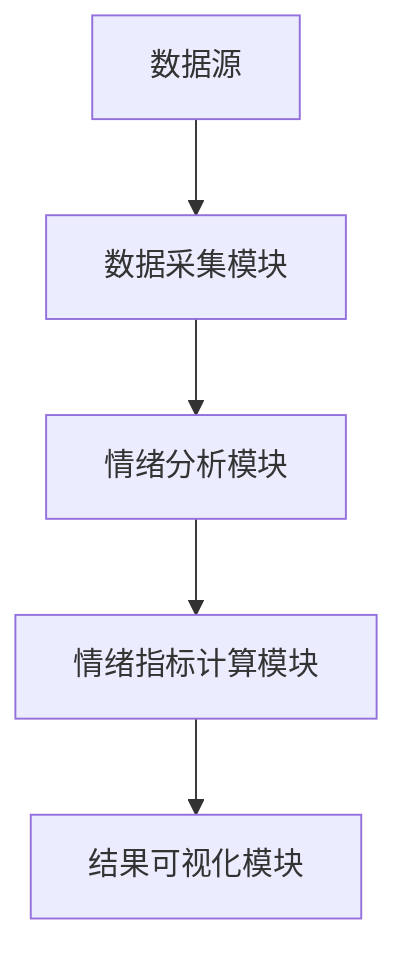

                 


# AI驱动的股票市场情绪指标开发与应用

> 关键词：AI，股票市场，情绪指标，情感分析，量化交易

> 摘要：本文详细探讨了如何利用人工智能技术开发股票市场情绪指标，并分析其在投资决策中的应用。通过理论与实践结合，介绍情绪指标的开发过程，包括数据采集、算法实现、系统架构设计及实际案例分析，帮助读者理解情绪指标在股票市场中的重要性与应用价值。

---

## 第一章：股票市场情绪指标的背景与意义

### 1.1 情绪指标在股票市场中的作用

#### 1.1.1 情绪指标的定义与核心概念
股票市场情绪指标（Market Sentiment Indicators）是反映投资者对市场看法和情绪的量化指标。通过分析新闻、社交媒体、交易数据等信息，可以捕捉市场参与者的乐观或悲观情绪，从而辅助投资决策。

#### 1.1.2 情绪指标在投资决策中的应用价值
情绪指标可以帮助投资者预测市场波动、识别市场拐点，并优化投资策略。例如，当市场情绪过于乐观时，可能预示着市场回调的风险。

#### 1.1.3 情绪指标与传统技术分析的结合
情绪指标与传统技术分析指标（如移动平均线、RSI等）结合，可以提供更全面的市场分析工具。

### 1.2 AI技术在金融领域的应用现状

#### 1.2.1 AI在金融分析中的主要应用场景
AI技术广泛应用于金融数据挖掘、风险评估、量化交易等领域。情绪分析是AI在金融中的重要应用之一。

#### 1.2.2 情绪分析在股票市场中的技术挑战
数据噪声、情感表达的多样性、实时性要求高等问题，增加了情绪指标开发的难度。

#### 1.2.3 当前市场对AI情绪指标的需求
随着投资者对市场情绪的关注增加，AI情绪指标的需求日益增长，尤其是在高频交易和量化投资中。

---

## 第二章：情绪指标的核心概念与理论基础

### 2.1 情绪指标的分类与特征

#### 2.1.1 基于文本的情绪指标
通过分析新闻、社交媒体评论等文本数据，提取市场情绪。例如，使用自然语言处理（NLP）技术对文本进行情感分类。

#### 2.1.2 基于交易数据的情绪指标
通过分析交易量、订单簿等数据，量化市场的买卖力量，反映市场情绪。

#### 2.1.3 情绪指标的多维度属性对比
| 属性         | 基于文本的情绪指标 | 基于交易数据的情绪指标 |
|--------------|--------------------|------------------------|
| 数据来源     | 文本数据           | 交易数据               |
| 计算复杂度   | 较高               | 较低                   |
| 适用场景     | 长期情绪分析       | 短期情绪分析           |

### 2.2 情绪分析的核心原理

#### 2.2.1 情感分析的基本流程
1. 数据预处理：清洗和标注数据。
2. 特征提取：提取文本或交易数据中的特征。
3. 情感分类：使用机器学习或深度学习模型进行分类。

#### 2.2.2 情感强度计算方法
情感强度可以通过加权平均、回归模型等方式计算。例如：
$$ 情感强度 = \sum (情感权重 \times 词语情感值) $$

#### 2.2.3 情绪指标的时间序列特征
情绪指标通常具有周期性，可以通过时间序列分析预测未来走势。

---

## 第三章：情绪指标的算法实现原理

### 3.1 基于NLP的情感分析算法

#### 3.1.1 基于词袋模型的文本特征提取
使用词袋模型提取文本关键词，并计算关键词的情感值。

#### 3.1.2 基于深度学习的情感分类模型
使用LSTM或Transformer模型进行情感分类。例如：
$$ P(\text{情感} | \text{文本}) = \text{模型}(\text{文本}) $$

#### 3.1.3 情感强度预测的回归算法
使用线性回归或随机森林模型预测情感强度。例如：
$$ y = \beta_0 + \beta_1 x_1 + \beta_2 x_2 + \epsilon $$

### 3.2 情绪指标的统计与数学模型

#### 3.2.1 情绪强度的标准化处理
将情感强度标准化到0-1范围，便于后续分析。

#### 3.2.2 基于时间序列的波动分析
使用ARIMA模型分析情绪指标的波动性。例如：
$$ y_t = \phi_1 y_{t-1} + \theta_1 \epsilon_{t-1} + \epsilon_t $$

#### 3.2.3 情绪指标与股价的相关性计算
通过协方差或相关系数衡量情绪指标与股价的相关性。例如：
$$ \text{相关系数} = \frac{\text{协方差}(X,Y)}{\sigma_X \sigma_Y} $$

---

## 第四章：情绪指标的系统架构设计

### 4.1 系统功能模块划分

#### 4.1.1 数据采集模块
从新闻网站、社交媒体等来源采集数据。

#### 4.1.2 情绪分析模块
对采集的数据进行情感分析，生成情绪指标。

#### 4.1.3 情绪指标计算模块
根据分析结果，计算综合情绪指标。

#### 4.1.4 结果可视化模块
将情绪指标可视化，便于投资者参考。

### 4.2 系统架构设计

#### 4.2.1 系统整体架构图


#### 4.2.2 模块间的交互关系
模块间通过API进行数据传递和通信。

#### 4.2.3 系统的扩展性设计
支持多种数据源和多种情绪分析算法的扩展。

---

## 第五章：情绪指标开发的实战项目

### 5.1 项目环境与工具安装

#### 5.1.1 开发环境配置
推荐使用Python 3.8及以上版本，安装Jupyter Notebook用于开发。

#### 5.1.2 数据采集工具安装
安装`requests`和`BeautifulSoup`用于网页数据采集。

#### 5.1.3 模型训练框架选择
使用`TensorFlow`或`PyTorch`进行模型训练。

### 5.2 核心代码实现

#### 5.2.1 文本数据预处理代码
```python
import pandas as pd
from sklearn.model_selection import train_test_split
from tensorflow.keras.preprocessing.text import Tokenizer

# 加载数据
data = pd.read_csv('data.csv')

# 分割数据
X_train, X_test, y_train, y_test = train_test_split(data['text'], data['label'], test_size=0.2)
```

#### 5.2.2 情感分类模型训练代码
```python
from tensorflow.keras.layers import Dense, Embedding, GlobalAveragePooling1D
from tensorflow.keras.models import Model
from tensorflow.keras.preprocessing.text import Tokenizer

# 创建词嵌入模型
tokenizer = Tokenizer()
tokenizer.fit_on_texts(X_train)
word_index = tokenizer.word_index

# 构建模型
input_dim = len(word_index) + 1
embedding_dim = 100

model = Sequential()
model.add(Embedding(input_dim, embedding_dim, input_length=max_length))
model.add(GlobalAveragePooling1D())
model.add(Dense(1, activation='sigmoid'))
model.compile(optimizer='adam', loss='binary_crossentropy', metrics=['accuracy'])
model.fit(X_train, y_train, epochs=10, batch_size=32)
```

---

## 第六章：情绪指标的实际应用与案例分析

### 6.1 情绪指标在投资策略中的应用

#### 6.1.1 基于情绪指标的买卖信号生成
当情绪指标超过阈值时，触发买入或卖出信号。

#### 6.1.2 情绪指标与技术指标的结合
将情绪指标与RSI、MACD等技术指标结合，提高预测准确性。

#### 6.1.3 情绪指标在风险管理中的应用
通过情绪指标监控市场风险，调整投资组合。

### 6.2 实际案例分析

#### 6.2.1 某行业的情绪指标分析
分析科技股的情绪指标，预测其股价波动。

#### 6.2.2 情绪指标与股价波动的相关性分析
通过回归分析，验证情绪指标与股价的相关性。

#### 6.2.3 情绪指标在实际投资中的表现
展示情绪指标在实际投资中的表现，验证其有效性。

---

## 第七章：情绪指标开发的最佳实践与注意事项

### 7.1 开发中的常见问题与解决方案

#### 7.1.1 数据质量对情绪指标的影响
确保数据来源可靠，减少噪声。

#### 7.1.2 模型过拟合的防范措施
使用交叉验证和正则化技术防止过拟合。

#### 7.1.3 情绪指标的实时性优化
优化算法和数据处理流程，提高实时性。

### 7.2 情绪指标的未来发展方向

#### 7.2.1 多模态情绪分析的潜力
结合文本、图像等多种数据源进行情绪分析。

#### 7.2.2 情绪指标的个性化定制
根据投资者需求，定制个性化的情绪指标。

#### 7.2.3 情绪指标在量化交易中的应用前景
情绪指标有望成为量化交易中的重要因子。

---

## 第八章：项目总结与拓展阅读

### 8.1 项目总结

#### 8.1.1 项目目标
开发一个基于AI的情绪指标系统，帮助投资者做出更明智的决策。

#### 8.1.2 项目成果
成功开发了一个实时情绪指标系统，并验证了其在实际投资中的有效性。

### 8.2 拓展阅读

#### 8.2.1 推荐书籍
- 《Python机器学习实战》
- 《量化交易入门》

#### 8.2.2 推荐博客
- [机器学习在金融中的应用](https://example.com)

---

作者：AI天才研究院/AI Genius Institute & 禅与计算机程序设计艺术 /Zen And The Art of Computer Programming

