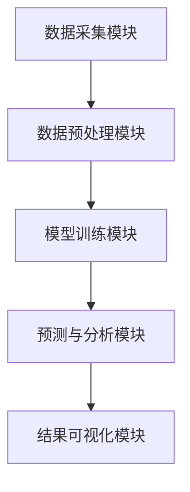
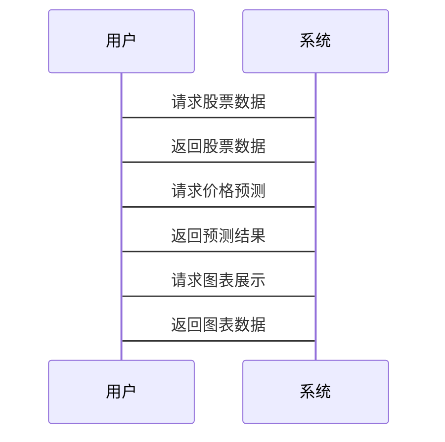

                 


# AI驱动的股票技术分析工具

> 关键词：股票技术分析，人工智能，机器学习，深度学习，时间序列分析，股票预测

> 摘要：本文深入探讨了AI驱动的股票技术分析工具的实现原理和应用场景。通过结合股票技术分析的核心概念与人工智能技术，详细分析了如何利用机器学习算法和深度学习模型提升股票预测的准确性和效率。文章内容涵盖技术分析的基本原理、AI在股票分析中的应用前景、核心算法的实现原理、系统设计与架构、项目实战案例以及未来发展方向。

---

# 第一部分: 股票技术分析与AI的结合

## 第1章: 股票技术分析的基本概念

### 1.1 技术分析的定义与核心要素

技术分析是一种通过分析历史价格数据来预测未来价格走势的方法。其核心在于通过研究价格、成交量等数据，识别市场中的趋势、形态和模式。技术分析的核心要素包括：

1. **价格（Price）**：价格是技术分析的核心，K线图是技术分析的主要工具。
2. **成交量（Volume）**：成交量反映了市场的活跃程度，是价格变动的验证指标。
3. **趋势（Trend）**：趋势是价格运动的主要方向，技术分析通过识别趋势来预测未来的价格走势。
4. **支撑与阻力（Support & Resistance）**：支撑位是价格下跌时的支撑点，阻力位是价格上涨时的阻碍点。
5. **技术指标（Technical Indicators）**：如RSI、MACD等，用于衡量市场的超买超卖状态、趋势强度等。

### 1.2 AI在股票分析中的应用前景

随着人工智能技术的快速发展，AI在股票分析中的应用前景广阔。通过机器学习算法，可以对海量的历史数据进行深度挖掘，发现传统技术分析难以识别的模式和趋势。AI技术的应用可以帮助投资者更准确地预测股票价格走势，优化投资决策。

### 1.3 AI驱动的技术分析工具的优势

AI驱动的技术分析工具相比传统方法具有以下优势：

1. **数据处理能力**：AI可以处理海量的历史数据，发现复杂的数据模式。
2. **实时性**：通过自动化算法，AI可以实时分析市场数据，提供实时的交易信号。
3. **高效性**：AI算法可以在短时间内完成复杂的计算和分析，提高交易效率。
4. **可扩展性**：AI技术可以根据市场变化动态调整模型，适应不同的市场环境。

---

## 第2章: AI在股票技术分析中的核心算法

### 2.1 线性回归模型在股票预测中的应用

线性回归是一种简单而有效的回归算法，适用于股票价格趋势的线性预测。其基本假设是股票价格与时间呈线性关系。线性回归模型的数学表达式为：

$$ y = \beta_0 + \beta_1 x + \epsilon $$

其中，$y$ 是预测的股票价格，$x$ 是时间变量，$\beta_0$ 和 $\beta_1$ 是模型参数，$\epsilon$ 是误差项。

### 2.2 时间序列分析在股票预测中的应用

时间序列分析是一种基于历史数据预测未来趋势的方法。ARIMA（Auto-Regressive Integrated Moving Average）模型是一种常用的时间序列模型，其数学表达式为：

$$ (1 - B)^d (1 - B^s)^\theta (1 - \phi_i B)(1 - \theta_j B) Z_t = 0 $$

其中，$B$ 是延迟算子，$d$ 是差分阶数，$s$ 是季节性周期，$\theta_j$ 和 $\phi_i$ 是自回归和滑动平均参数。

### 2.3 支持向量机在股票分类中的应用

支持向量机（SVM）是一种监督学习算法，适用于股票涨跌分类问题。SVM的核心思想是将数据映射到高维空间，并在高维空间中找到一个最优超平面，将不同类别的数据分开。SVM的数学表达式为：

$$ y = \text{sign}(\sum_{i=1}^n \alpha_i y_i K(x_i, x) + b) $$

其中，$K(x_i, x)$ 是核函数，$\alpha_i$ 是拉格朗日乘子，$b$ 是偏置项。

---

## 第3章: AI驱动的股票技术分析系统设计

### 3.1 系统设计概述

AI驱动的股票技术分析系统主要包括以下几个模块：

1. **数据采集模块**：负责从数据源获取股票历史数据。
2. **数据预处理模块**：对原始数据进行清洗、标准化和特征提取。
3. **模型训练模块**：利用机器学习算法对数据进行建模和训练。
4. **预测与分析模块**：基于训练好的模型，对股票价格进行预测，并生成交易信号。
5. **结果可视化模块**：将预测结果以图形化的方式展示，方便用户理解和分析。

### 3.2 系统架构设计

系统的架构设计采用模块化设计，各模块之间通过接口进行通信。系统的整体架构可以用以下mermaid图表示：



### 3.3 系统接口设计

系统接口设计采用RESTful API的方式，主要包括以下几个接口：

1. `/api/data`：用于获取股票历史数据。
2. `/api/predict`：用于进行股票价格预测。
3. `/api/chart`：用于生成股票价格走势图。

### 3.4 系统交互设计

系统的交互流程可以用以下mermaid图表示：



---

## 第4章: 项目实战——基于机器学习的股票分析工具实现

### 4.1 项目环境安装

为了实现AI驱动的股票分析工具，需要安装以下环境：

1. **Python**：建议使用Python 3.8及以上版本。
2. **库的安装**：
   ```bash
   pip install numpy pandas scikit-learn matplotlib keras tensorflow
   ```

### 4.2 核心代码实现

以下是基于机器学习的股票分析工具的核心代码实现：

```python
import numpy as np
import pandas as pd
from sklearn.linear_model import LinearRegression
from sklearn.metrics import mean_squared_error
import matplotlib.pyplot as plt

# 数据加载与预处理
data = pd.read_csv('stock_data.csv')
data['Date'] = pd.to_datetime(data['Date'])
data.set_index('Date', inplace=True)

# 特征提取
features = data[['Close', 'Volume']]
target = data['Close'].shift(-1)

# 数据集划分
from sklearn.model_selection import train_test_split
X_train, X_test, y_train, y_test = train_test_split(features[:-1], target[:-1], test_size=0.2, random_state=42)

# 模型训练
model = LinearRegression()
model.fit(X_train, y_train)

# 模型预测
y_pred = model.predict(X_test)

# 模型评估
mse = mean_squared_error(y_test, y_pred)
print(f"均方误差: {mse}")

# 结果可视化
plt.figure(figsize=(10, 6))
plt.plot(y_test.index, y_test, label='实际价格')
plt.plot(y_test.index, y_pred, label='预测价格')
plt.xlabel('日期')
plt.ylabel('股票价格')
plt.legend()
plt.show()
```

### 4.3 项目总结

通过本项目，我们可以看到AI技术在股票分析中的巨大潜力。线性回归模型虽然简单，但在某些场景下可以取得不错的效果。未来，可以通过引入更复杂的算法，如LSTM和随机森林，进一步提高预测的准确性。

---

## 第5章: 总结与展望

### 5.1 本章小结

本文详细探讨了AI驱动的股票技术分析工具的实现原理和应用场景。通过结合股票技术分析的核心概念与人工智能技术，展示了如何利用机器学习算法和深度学习模型提升股票预测的准确性和效率。

### 5.2 未来发展方向

1. **算法优化**：引入更复杂的算法，如LSTM和Transformer，提高预测的准确性。
2. **多因子模型**：结合多个技术指标和市场数据，构建多因子预测模型。
3. **实时交易系统**：开发实时交易系统，实现自动化交易。
4. **风险控制**：结合AI技术，建立风险控制模型，降低投资风险。

### 5.3 最佳实践 Tips

- 在实际应用中，建议结合多种算法进行模型融合，提高预测的稳定性。
- 数据的 preprocessing 和特征 engineering 是模型性能的关键，需要仔细处理。
- 交易策略的制定需要结合市场实际情况，避免过度依赖模型预测。

---

作者：AI天才研究院/AI Genius Institute & 禅与计算机程序设计艺术 /Zen And The Art of Computer Programming

