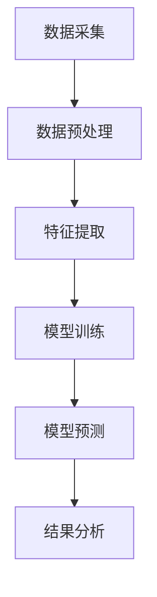
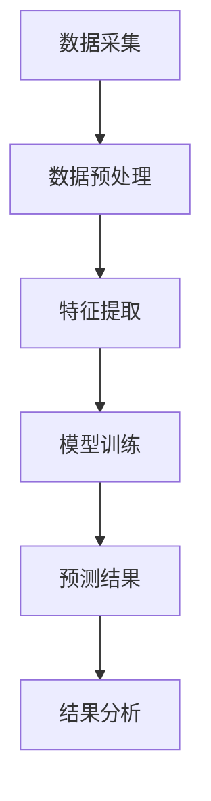
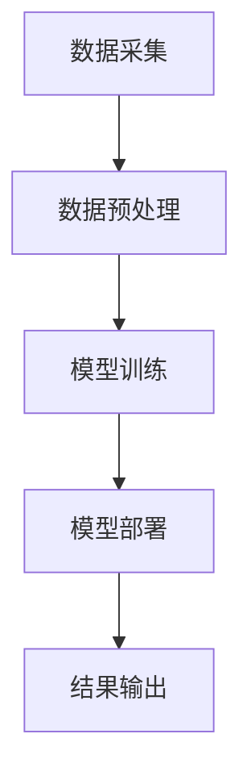

                 


# AI驱动的股票筛选工具

> 关键词：AI驱动，股票筛选，机器学习，量化投资，技术实现

> 摘要：本文将详细介绍AI驱动的股票筛选工具的实现原理、技术架构和应用场景。通过分析股票筛选的核心算法，结合实际项目案例，探讨如何利用人工智能技术提升股票筛选的效率和准确性。文章内容涵盖从数据采集到模型部署的完整流程，帮助读者全面理解AI在股票筛选中的应用。

---

# 第1章: AI在股票筛选中的应用

## 1.1 股票筛选的基本概念

股票筛选是指通过分析股票的财务数据、市场表现、行业趋势等因素，找出符合特定投资策略的股票。传统股票筛选方法依赖于人工分析，耗时且容易受到主观因素的影响。随着人工智能技术的发展，AI驱动的股票筛选工具逐渐成为投资者的重要工具。

## 1.2 AI技术在股票筛选中的优势

AI技术能够快速处理大量数据，发现传统方法难以察觉的模式和趋势。通过机器学习算法，AI可以基于历史数据预测未来表现，帮助投资者做出更科学的投资决策。

## 1.3 股票筛选的核心问题

- 数据采集与清洗
- 特征提取与选择
- 模型训练与优化
- 模型部署与应用

## 1.4 本章小结

通过AI技术，股票筛选工具能够提高投资效率和准确性。本文将从算法原理、系统设计、项目实战等多个方面，深入探讨AI驱动的股票筛选工具的实现细节。

---

# 第2章: AI驱动股票筛选的核心算法

## 2.1 线性回归模型

线性回归是一种简单而有效的回归算法，适用于预测股票的价格走势。其数学模型如下：

$$ y = \beta_0 + \beta_1x_1 + \beta_2x_2 + ... + \beta_nx_n $$

其中，$y$ 是预测目标，$x_i$ 是输入特征，$\beta_i$ 是对应的系数。

### 2.1.1 线性回归的实现流程



## 2.2 随机森林模型

随机森林是一种基于决策树的集成算法，具有较强的抗过拟合能力。其核心思想是通过构建多棵决策树，并将它们的预测结果进行投票或平均。

### 2.2.1 随机森林的实现流程



## 2.3 神经网络模型

神经网络是一种模拟人脑神经网络结构的深度学习算法，适用于复杂的非线性关系建模。

### 2.3.1 神经网络的实现流程


## 2.4 算法比较与选择

从准确率、计算复杂度、适用场景等多个维度对比线性回归、随机森林和神经网络模型的优缺点，选择最适合具体场景的算法。

---

# 第3章: 系统架构设计

## 3.1 系统功能模块划分

### 3.1.1 数据采集模块
负责从股票数据库中获取历史数据、财务数据、市场数据等。

### 3.1.2 数据预处理模块
对原始数据进行清洗、标准化、特征工程等处理，确保数据质量。

### 3.1.3 模型训练模块
基于预处理后的数据，选择合适的算法训练模型。

### 3.1.4 模型部署模块
将训练好的模型部署到生产环境，提供实时股票筛选服务。

## 3.2 系统架构设计图



## 3.3 接口设计与交互流程

### 3.3.1 API接口设计
定义RESTful API接口，提供股票筛选服务的调用方式。

### 3.3.2 用户交互流程
用户通过API提交筛选条件，系统返回符合要求的股票列表。

---

# 第4章: 项目实战

## 4.1 环境安装与配置

### 4.1.1 安装Python环境
使用Anaconda安装Python 3.8及以上版本。

### 4.1.2 安装依赖库
安装Pandas、NumPy、Scikit-learn、XGBoost等机器学习库。

## 4.2 核心代码实现

### 4.2.1 数据预处理代码

```python
import pandas as pd
import numpy as np

# 数据加载
data = pd.read_csv('stock_data.csv')

# 数据清洗
data.dropna(inplace=True)

# 特征工程
data['return'] = data['close'].pct_change()
data['volatility'] = data['return'].std()
```

### 4.2.2 模型训练代码

```python
from sklearn.model_selection import train_test_split
from sklearn.ensemble import RandomForestClassifier

# 数据分割
X = data.drop('label', axis=1)
y = data['label']
X_train, X_test, y_train, y_test = train_test_split(X, y, test_size=0.2)

# 模型训练
model = RandomForestClassifier(n_estimators=100)
model.fit(X_train, y_train)

# 模型评估
print(f"Accuracy: {model.score(X_test, y_test):.3f}")
```

## 4.3 代码解读与优化

分析上述代码的实现细节，优化数据预处理和模型训练的效率，例如使用更高效的特征选择方法或调参技巧。

## 4.4 案例分析

以实际股票数据为例，展示如何通过AI驱动的股票筛选工具筛选出表现优异的股票，并分析其表现。

---

# 第5章: 案例分析与经验总结

## 5.1 案例分析

选择一个具体的股票数据集，详细分析AI驱动的股票筛选工具在该案例中的应用过程。

## 5.2 经验总结

总结在项目实施过程中遇到的问题及解决方案，分享一些最佳实践。

---

# 第6章: 总结与展望

## 6.1 本章总结

回顾全文内容，总结AI驱动股票筛选工具的核心技术点和实现方法。

## 6.2 未来展望

展望AI技术在股票筛选领域的未来发展方向，例如深度学习模型的优化、多模态数据的融合等。

---

# 作者信息

作者：AI天才研究院/AI Genius Institute  
联系邮箱：contact@aicourse.com  
GitHub链接：https://github.com/ai-genius-institute  

---

通过以上结构，读者可以系统地了解AI驱动股票筛选工具的实现过程，并掌握相关技术的核心要点。

