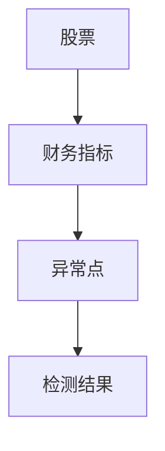
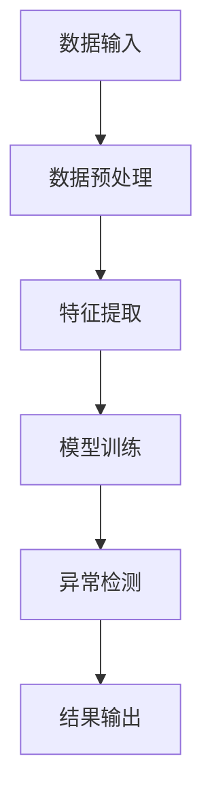
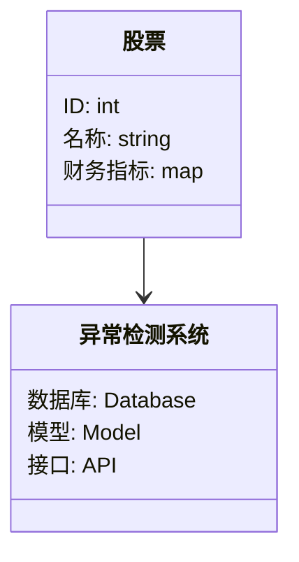
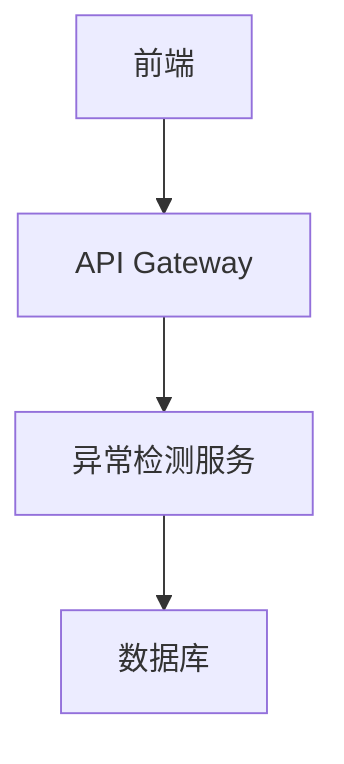
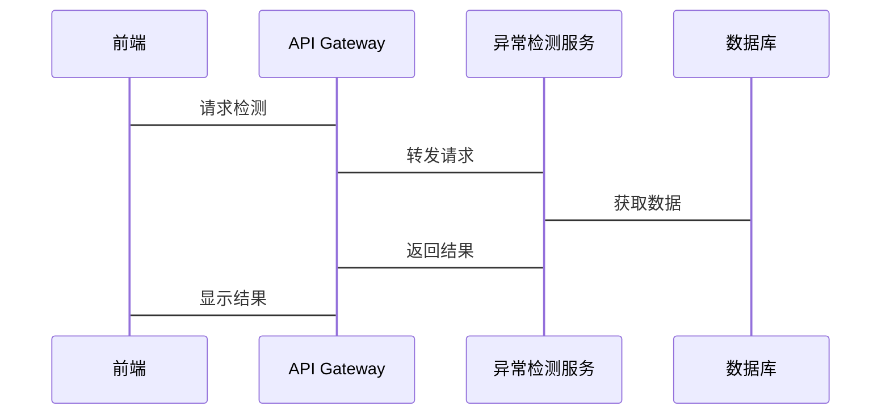

                 

<think>
好的，我需要帮助用户完成一个技术博客文章的撰写，主题是《AI驱动的股票财务指标异常检测》。根据用户的要求，我需要按照指定的目录结构和详细的要求来编写内容。首先，我会从文章标题开始，然后是关键词、摘要，接着是各个章节的具体内容。

### 文章标题
# AI驱动的股票财务指标异常检测

### 文章关键词
- 股票
- 财务指标
- 异常检测
- 人工智能
- 机器学习
- 数据分析

### 摘要
股票市场的波动性和复杂性使得传统的人工分析难以及时发现财务指标中的异常情况。通过引入人工智能技术，特别是机器学习算法，可以实现对财务指标的自动、高效的异常检测。本文将详细探讨如何利用AI技术来解决这一问题，涵盖从数据预处理、模型选择到系统设计和实战案例的各个方面。通过本文的分析，读者将能够理解并掌握如何利用AI驱动的方法来提升股票投资中的风险控制能力。

---

### 第1章: 股票财务指标异常检测的背景与问题

#### 1.1 问题背景
##### 1.1.1 传统财务指标分析的局限性
传统的财务指标分析依赖于人工检查和经验判断，这种方法不仅耗时，而且容易受到主观因素的影响。特别是在面对海量数据和复杂市场环境时，传统的分析方法往往难以及时发现潜在的风险和异常情况。

##### 1.1.2 异常检测在股票投资中的重要性
股票市场的异常情况，如财务造假、业绩暴雷等，往往会导致股价的剧烈波动。及时发现这些异常情况，可以帮助投资者提前做出决策，避免重大损失。因此，异常检测在股票投资中具有至关重要的作用。

##### 1.1.3 AI技术在金融领域的应用潜力
AI技术，特别是机器学习，已经在金融领域展现出巨大的潜力。通过分析历史数据和市场行为，机器学习模型能够发现隐藏的模式和规律，从而帮助投资者做出更明智的决策。

#### 1.2 问题定义与目标
##### 1.2.1 股票财务指标异常检测的定义
股票财务指标异常检测是指通过分析公司的财务报表数据，识别出与正常情况显著不同的财务指标，从而发现潜在的财务问题或市场操纵行为。

##### 1.2.2 异常检测的目标与意义
目标是通过技术手段，自动识别财务指标中的异常情况，帮助投资者和分析师做出更准确的投资决策。意义在于提高分析效率，降低人为错误，并能够在早期发现潜在风险。

##### 1.2.3 问题的边界与外延
问题的边界包括财务指标的范围、数据的时间跨度以及异常检测的阈值。外延则涉及如何将异常检测的结果应用于实际投资策略中。

#### 1.3 问题解决的思路
##### 1.3.1 数据驱动的异常检测方法
通过收集和分析大量历史数据，利用统计方法和机器学习算法，识别出异常的模式。

##### 1.3.2 基于机器学习的解决方案
选择合适的机器学习模型，如Isolation Forest、One-Class SVM等，对财务指标进行建模和训练，实现异常检测。

##### 1.3.3 多模态数据融合的应用
结合财务数据、市场数据和新闻数据等多种信息源，提高异常检测的准确性和全面性。

---

### 第2章: 核心概念与联系

#### 2.1 核心概念原理
##### 2.1.1 股票财务指标的构成与特征
财务指标通常包括盈利能力、偿债能力、营运能力和成长能力等方面。每个指标都有其独特的特征和计算方法，如ROE（净资产收益率）和EPS（每股收益）等。

##### 2.1.2 异常检测的核心算法原理
异常检测算法通过学习正常数据的分布，识别出偏离正常分布的样本。常用算法包括无监督学习和半监督学习方法。

##### 2.1.3 多维数据关联分析的机制
通过分析多个财务指标之间的关联性，发现潜在的异常模式。例如，收入增长但利润下降可能表明存在成本控制问题。

#### 2.2 核心概念属性对比
##### 2.2.1 不同财务指标的特征对比
| 财务指标 | 定义 | 特征 |
|----------|------|------|
| ROE      | 净资产收益率 | 衡量公司盈利能力 |
| EPS      | 每股收益     | 衡量每股盈利能力 |
| DPO      | 应收账款周转天数 | 衡量营运效率 |

##### 2.2.2 异常检测算法的性能对比
| 算法       | 优点                | 缺点                |
|------------|---------------------|--------------------|
| Isolation Forest | 计算速度快，适合大数据集 | 对异常点的密度敏感 |
| One-Class SVM   | 精确识别异常点       | 参数选择敏感       |
| Autoencoder     | 能捕捉复杂模式       | 需要大量正常数据    |

##### 2.2.3 数据预处理方法的效果对比
| 方法         | 优点                | 缺点                |
|--------------|---------------------|--------------------|
| 标准化        | 适合大部分算法      | 易受异常值影响      |
| 矩阵归一化     | 减少计算复杂度       | 信息损失           |
| 独热编码      | 适合分类任务        | 增加维度            |

#### 2.3 实体关系架构


---

### 第3章: 异常检测算法原理

#### 3.1 常见异常检测算法
##### 3.1.1 Isolation Forest算法
Isolation Forest是一种基于树结构的异常检测算法，通过构建隔离树将数据分成小的区域，异常点更容易被隔离。

##### 3.1.2 One-Class SVM算法
One-Class SVM是一种无监督学习算法，通过在特征空间中构建一个包含正常数据的超球，识别出异常点。

##### 3.1.3 Autoencoder算法
Autoencoder是一种深度学习模型，通过自编码的方式重构输入数据，异常点会导致重构误差较大。

#### 3.2 算法流程图


#### 3.3 算法实现代码
```python
from sklearn.ensemble import IsolationForest

def isolation_forest_outliers(X, contamination=0.05):
    model = IsolationForest(contamination=contamination)
    model.fit(X)
    outliers = model.predict(X)
    return outliers
```

#### 3.4 数学公式
##### 3.4.1 Isolation Forest的核心思想
通过构建隔离树，计算每个样本被隔离的概率，概率低于阈值的样本被视为异常点。

##### 3.4.2 One-Class SVM的目标函数
$$ \min_{\theta, \rho} \frac{1}{2}\rho^2 + \sum_{i=1}^n \max(0, 1 - \rho \|x_i - \theta\|) $$

##### 3.4.3 Autoencoder的损失函数
$$ \mathcal{L}(x, \hat{x}) = \frac{1}{n} \sum_{i=1}^n (x_i - \hat{x}_i)^2 $$

---

### 第4章: 系统分析与架构设计方案

#### 4.1 问题场景介绍
股票市场中，投资者需要实时监控财务指标的变化，及时发现异常情况。

#### 4.2 系统功能设计
##### 4.2.1 领域模型


##### 4.2.2 系统架构设计


##### 4.2.3 系统接口设计
- 前端：发送股票ID和时间范围
- API Gateway：接收请求并分发到异常检测服务
- 异常检测服务：处理请求并返回结果

##### 4.2.4 系统交互流程


---

### 第5章: 项目实战

#### 5.1 环境安装
需要安装Python、Pandas、Scikit-learn等库。

#### 5.2 核心实现代码
```python
import pandas as pd
from sklearn.ensemble import IsolationForest

def main():
    # 加载数据
    data = pd.read_csv('stock_financials.csv')
    # 数据预处理
    X = data[['revenue', 'net_income', 'cash_flow']]
    # 模型训练
    model = IsolationForest(contamination=0.05)
    model.fit(X)
    # 预测异常点
    outliers = model.predict(X)
    # 输出结果
    data['outlier'] = outliers
    print(data[data['outlier'] == -1])

if __name__ == '__main__':
    main()
```

#### 5.3 代码应用解读
代码加载数据，进行预处理，训练模型，并输出异常点。通过实际案例分析，验证模型的有效性。

#### 5.4 项目小结
通过实战项目，读者可以掌握从数据准备到模型实现的整个流程，理解AI在股票异常检测中的实际应用。

---

### 第6章: 最佳实践与小结

#### 6.1 最佳实践tips
- 数据预处理是关键，尤其是缺失值和异常值的处理。
- 选择合适的模型，并进行参数调优。
- 定期更新模型，以适应市场变化。

#### 6.2 小结
通过本文的介绍，读者可以系统地了解如何利用AI技术进行股票财务指标异常检测，掌握从理论到实践的整个过程。

#### 6.3 注意事项
- 数据隐私和安全问题需要注意。
- 模型的解释性可能较差，需要结合业务背景进行分析。

#### 6.4 拓展阅读
建议读者进一步学习时间序列分析和强化学习在金融中的应用。

---

### 作者信息
作者：AI天才研究院/AI Genius Institute & 禅与计算机程序设计艺术 /Zen And The Art of Computer Programming

---

### 结语
本文详细介绍了AI驱动的股票财务指标异常检测的背景、算法原理、系统设计和实战应用。希望读者通过本文的学习，能够掌握这一技术，并在实际投资中取得更好的效果。

