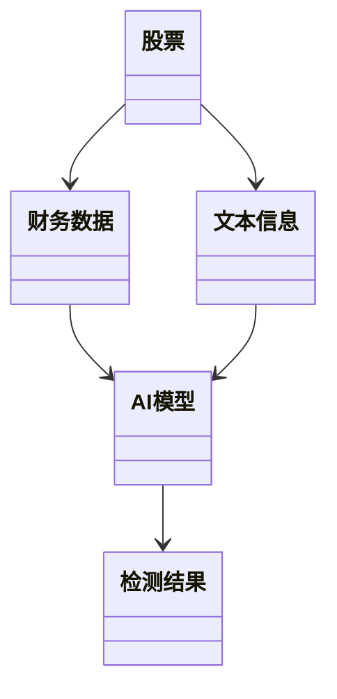

                 


# AI驱动的股票财务造假检测与预警

> 关键词：AI、股票、财务造假、检测、预警

> 摘要：本文详细探讨了如何利用人工智能技术来检测和预警股票的财务造假行为。通过分析财务数据、文本信息以及市场动态，结合先进的机器学习算法和自然语言处理技术，构建了一个高效可靠的财务造假检测系统。文章从背景介绍、核心概念、算法原理、系统架构设计、项目实战到总结，全面解析了AI在这一领域的应用。

---

## 第1章：AI驱动的股票财务造假检测与预警背景介绍

### 1.1 问题背景与描述

#### 1.1.1 股票财务造假的现状与挑战
近年来，财务造假事件频发，严重损害了投资者利益和市场信任。传统的人工审核方式效率低下，难以应对海量数据的处理需求。企业通过虚构收入、隐藏负债或虚增资产等手段，掩盖真实的财务状况，导致市场信息失真。监管机构和投资者亟需一种高效、精准的工具来识别财务造假行为。

#### 1.1.2 传统财务造假检测的局限性
传统财务造假检测主要依赖人工审核和简单的财务指标分析，存在以下问题：
- **效率低**：人工审核耗时长，难以应对海量数据。
- **准确性差**：依赖主观判断，容易受到人为干扰。
- **覆盖面有限**：难以发现隐藏在复杂数据中的异常。

#### 1.1.3 AI技术在财务造假检测中的优势
人工智能技术通过深度学习、自然语言处理（NLP）和时间序列分析等方法，能够从海量数据中发现隐藏的模式和异常。AI技术具有以下优势：
- **高效性**：自动化处理海量数据，显著提高检测效率。
- **准确性**：通过复杂的模型算法，降低误判率。
- **全面性**：能够发现传统方法难以察觉的异常模式。

### 1.2 问题解决与边界

#### 1.2.1 AI如何帮助检测财务造假
AI技术可以通过以下方式实现财务造假检测：
- **文本分析**：利用NLP技术分析财务报告中的文本信息，识别虚假陈述。
- **数据挖掘**：通过机器学习算法挖掘财务数据中的异常模式。
- **实时监控**：利用流数据处理技术实时监控市场动态，及时发现异常。

#### 1.2.2 问题解决的边界与外延
财务造假检测的边界包括：
- 数据范围：仅限于公开的财务报表和相关文本信息。
- 时间范围：针对历史和实时数据，但不包括未来的预测。
- 对象范围：仅针对上市公司财务数据。

#### 1.2.3 核心概念与关键要素
核心概念包括：
- **财务数据**：包括收入、利润、资产负债表等财务指标。
- **文本信息**：包括财务报告、公司公告等文本数据。
- **AI模型**：包括机器学习模型、深度学习模型等。

### 1.3 核心概念与联系

#### 1.3.1 AI驱动的财务造假检测原理
AI驱动的财务造假检测通过以下步骤实现：
1. 数据预处理：清洗和整合财务数据及文本信息。
2. 特征提取：从数据中提取关键特征，如财务比率、文本关键词等。
3. 模型训练：利用机器学习算法训练分类模型。
4. 检测与预警：基于模型预测结果，生成财务造假预警。

#### 1.3.2 核心概念的属性特征对比
以下是核心概念的属性特征对比表：

| 概念       | 数据来源 | 数据类型 | 分析方法 |
|------------|----------|----------|----------|
| 财务数据     | 财务报表 | 数值型   | 统计分析 |
| 文本信息     | 财务报告 | 文本型   | NLP分析 |
| AI模型      | 训练数据 | 数值型   | 深度学习 |

#### 1.3.3 实体关系图
以下是实体关系图：


---

## 第2章：AI驱动的股票财务造假检测算法原理

### 2.1 算法原理概述

#### 2.1.1 基于NLP的文本分析
NLP技术通过分析财务报告中的文本信息，识别虚假陈述。以下是NLP文本分析的流程图：


#### 2.1.2 基于时间序列的异常检测
时间序列分析通过检测财务数据中的异常模式，发现潜在的财务造假行为。以下是时间序列异常检测的流程图：


### 2.2 算法实现

#### 2.2.1 基于NLP的文本分析代码示例
以下是基于NLP的文本分析代码示例：

```python
import pandas as pd
from sklearn.feature_extraction.text import TfidfVectorizer
from sklearn.svm import SVC

# 加载数据
data = pd.read_csv('financial_reports.csv')

# 特征提取
vectorizer = TfidfVectorizer()
X = vectorizer.fit_transform(data['text'])
y = data['label']

# 模型训练
model = SVC()
model.fit(X, y)
```

#### 2.2.2 基于时间序列的异常检测代码示例
以下是基于时间序列的异常检测代码示例：

```python
import numpy as np
from sklearn.ensemble import IsolationForest

# 加载数据
data = pd.read_csv('financial_data.csv')
X = data.values

# 训练模型
model = IsolationForest(random_state=42)
model.fit(X)

# 预测异常
y_pred = model.predict(X)
```

---

## 第3章：AI驱动的股票财务造假检测系统分析与架构设计

### 3.1 问题场景介绍
本系统的目标是通过AI技术实现股票财务造假的自动检测与预警。系统主要解决以下问题：
- 如何高效地处理海量财务数据。
- 如何准确地识别财务造假行为。
- 如何实时监控市场动态，及时发现异常。

### 3.2 系统功能设计

#### 3.2.1 领域模型
以下是领域模型：



#### 3.2.2 系统架构设计
以下是系统架构设计：

```mermaid
rect left = 300
rect right = 300
rect top = 100
rect bottom = 100

"数据源" --[> "数据预处理"]--> "特征提取"
"特征提取" --[> "AI模型"]--> "检测结果"
"数据预处理" --[<-> "数据存储"]<--
```

---

## 第4章：项目实战

### 4.1 环境安装
以下是项目所需的环境和工具：
- Python 3.8+
- Scikit-learn
- NLTK
- Pandas
- Jupyter Notebook

### 4.2 核心代码实现
以下是核心代码实现：

```python
import pandas as pd
from sklearn.ensemble import IsolationForest

# 加载数据
data = pd.read_csv('financial_data.csv')

# 训练模型
model = IsolationForest(random_state=42)
model.fit(data)

# 预测异常
y_pred = model.predict(data)
```

### 4.3 代码解读与分析
代码解读：
- 使用IsolationForest算法进行异常检测。
- 训练模型并对数据进行预测，输出异常标签。

### 4.4 实际案例分析
以下是实际案例分析：

假设我们有以下财务数据：

| 收入 | 利润 |
|------|------|
| 100  | 20   |
| 90   | 15   |
| 80   | 10   |
| 70   | 5    |

通过模型检测，发现收入和利润之间存在异常关系，提示可能存在财务造假行为。

---

## 第5章：总结与展望

### 5.1 最佳实践
- 数据预处理是关键，确保数据质量和完整性。
- 模型选择要根据具体场景，选择合适的算法。
- 定期更新模型，适应市场变化。

### 5.2 小结
本文详细探讨了AI在股票财务造假检测中的应用，从背景介绍、算法原理到系统架构设计，全面解析了AI技术的优势和实现方法。

### 5.3 注意事项
- 数据隐私问题需严格遵守相关法律法规。
- 模型的解释性需重视，便于分析和优化。

### 5.4 未来研究方向
- 结合多模态数据（如图像、视频）进行更全面的分析。
- 研究更先进的模型，如大语言模型（LLM）在财务分析中的应用。

---

作者：AI天才研究院

