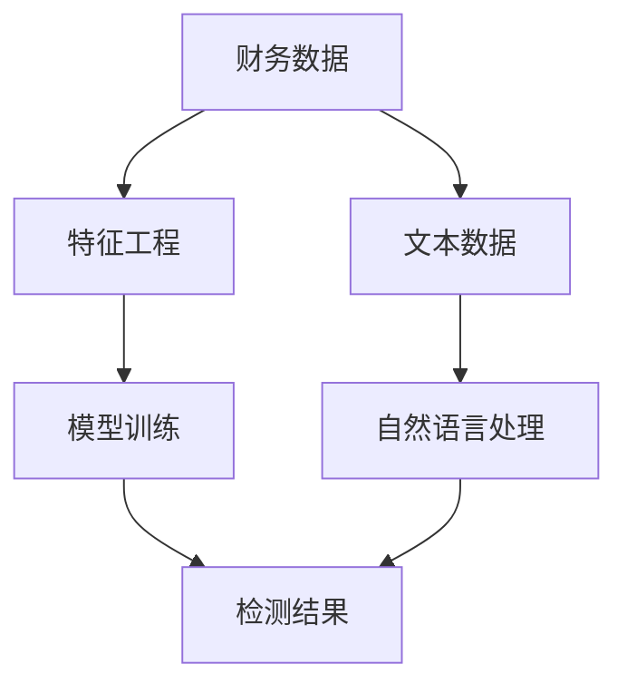
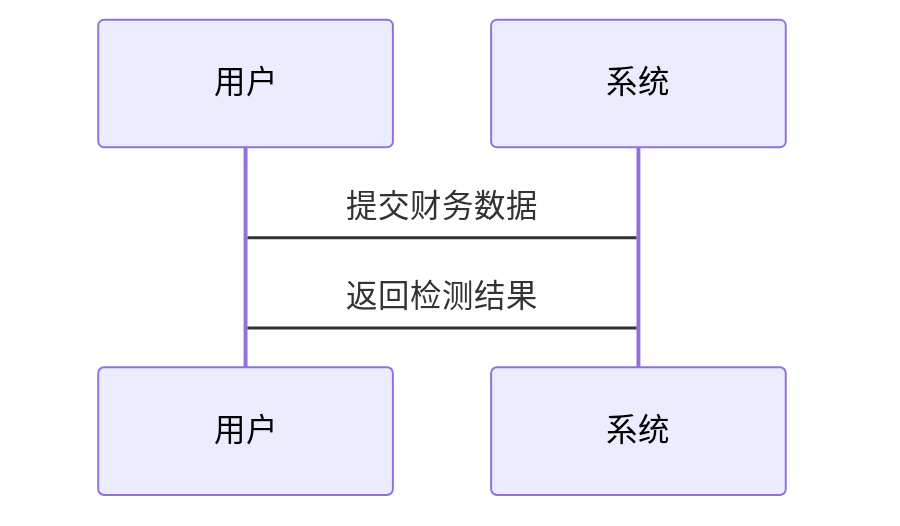

                 


# AI驱动的股票财务造假检测模型

> **关键词**: AI, 股票, 财务造假, 深度学习, 机器学习, 自然语言处理, 财务数据

> **摘要**: 本文探讨了利用人工智能技术检测股票市场中的财务造假行为。通过分析财务数据的特征，结合传统机器学习和深度学习算法，构建了一个高效的财务造假检测模型。文章详细介绍了模型的设计思路、算法实现、系统架构以及实际应用案例，展示了AI在金融监管中的巨大潜力。

---

## 第一部分: 背景介绍

### 第1章: 股票财务造假检测的背景与挑战

#### 1.1 股票财务造假的背景介绍
股票市场的健康发展离不开真实的财务信息。然而，财务造假行为屡见不鲜，严重破坏了市场的公平性和投资者的信心。传统的财务审计方法效率低、成本高，难以应对日益复杂的造假手段。

#### 1.2 股票财务造假检测的难点
- **数据获取的挑战**: 财务数据可能存在缺失、延迟或不完整的问题。
- **数据特征的复杂性**: 财务数据具有时间序列特性，且不同公司之间的特征差异显著。
- **模型的可解释性问题**: 复杂的深度学习模型往往难以解释其决策过程。

#### 1.3 AI技术在财务造假检测中的应用前景
- **AI技术的优势**: 能够快速处理大量数据，发现隐藏的模式和异常。
- **传统方法的局限性**: 传统审计方法依赖人工经验，效率低下。
- **AI驱动检测的创新点**: 结合深度学习和自然语言处理技术，实现对财务数据和文本的多维度分析。

---

## 第二部分: 核心概念与联系

### 第2章: 股票财务造假检测的核心概念

#### 2.1 股票财务数据的特征分析
- **时间序列特性**: 财务数据具有时间依赖性。
- **异相关性**: 不同时间点的财务数据可能存在相关性。
- **异常值**: 数据中可能存在的异常值是财务造假的线索。

#### 2.2 AI模型的核心原理
- **机器学习**: 通过特征提取和分类器训练，识别数据中的异常模式。
- **深度学习**: 利用神经网络模型捕捉数据的复杂特征。
- **自然语言处理**: 分析财务报告中的文本信息，识别潜在的造假行为。

#### 2.3 模型的输入与输出
- **输入数据**: 财务报表数据、公司新闻、市场数据等。
- **输出结果**: 检测结果（正常/异常）、异常程度评分。

#### 2.4 核心概念关系图


---

## 第三部分: 算法原理

### 第3章: 模型算法的选择与实现

#### 3.1 传统机器学习算法
- **支持向量机（SVM）**: 适用于分类问题，但对高维数据处理能力有限。
- **随机森林（Random Forest）**: 能够处理高维数据，具有较强的鲁棒性。
- **线性回归（Linear Regression）**: 适用于预测问题，但对非线性关系处理能力较弱。

#### 3.2 深度学习算法
- **循环神经网络（RNN）**: 适用于处理时间序列数据。
- **卷积神经网络（CNN）**: 适用于图像和序列数据的特征提取。
- **变量自回归神经网络（VAR-Net）**: 专门用于时间序列数据的预测和异常检测。

#### 3.3 混合模型
- **LSTM模型**: 用于捕捉时间序列中的长程依赖关系。
- **BERT模型**: 用于分析财务报告中的文本信息。
- **深度学习与传统算法的结合**: 通过集成学习提升模型性能。

#### 3.4 模型的训练与优化
- **数据增强技术**: 通过数据变换增加训练数据的多样性。
- **超参数调优**: 使用网格搜索或随机搜索优化模型参数。
- **模型的交叉验证**: 通过K折交叉验证评估模型的泛化能力。

---

## 第四部分: 系统分析与架构设计

### 第4章: 系统架构与功能设计

#### 4.1 系统功能模块
- **数据采集模块**: 从数据库或API获取财务数据。
- **特征工程模块**: 对数据进行清洗、转换和特征提取。
- **模型训练模块**: 使用训练数据训练AI模型。
- **结果分析模块**: 输出检测结果并提供解释。

#### 4.2 系统架构设计


#### 4.3 系统接口设计
- **输入接口**: 接收财务数据和相关文本信息。
- **输出接口**: 输出检测结果和异常评分。

#### 4.4 系统交互设计


---

## 第五部分: 项目实战

### 第5章: 项目实现与案例分析

#### 5.1 环境安装
- **Python 3.8+**
- **TensorFlow 2.0+**
- **Scikit-learn 0.24+**
- **BeautifulSoup4 4.9.3**
- **pandas 1.3.0**

#### 5.2 核心实现代码
```python
import pandas as pd
import numpy as np
from sklearn.ensemble import RandomForestClassifier
from sklearn.metrics import accuracy_score

# 数据加载
data = pd.read_csv('financial_data.csv')

# 特征选择
X = data[['revenue', 'net_income', 'total_assets']]
y = data['is_fraud']

# 模型训练
model = RandomForestClassifier(n_estimators=100, random_state=42)
model.fit(X, y)

# 模型预测
y_pred = model.predict(X)

# 模型评估
print("Accuracy:", accuracy_score(y, y_pred))
```

#### 5.3 实际案例分析
- **案例背景**: 某公司财务数据异常，模型检测出其可能存在造假行为。
- **数据特征**: 收入与资产不匹配，现金流异常。
- **模型输出**: 预测结果为异常，且异常评分为0.85。

---

## 第六部分: 总结与展望

### 第6章: 总结与注意事项

#### 6.1 总结
本文构建了一个基于AI的股票财务造假检测模型，通过结合传统机器学习和深度学习技术，实现了对财务数据的高效分析。模型在准确性和可解释性方面都取得了较好的效果。

#### 6.2 注意事项
- **数据质量**: 数据的完整性和准确性直接影响模型性能。
- **模型调优**: 需要根据实际情况调整模型参数。
- **法律合规**: 在实际应用中需遵守相关法律法规。

#### 6.3 拓展阅读
- 推荐阅读《深度学习》（Deep Learning, Ian Goodfellow著）。
- 参考相关论文：《Stock Market Fraud Detection Using AI》。

---

**作者**: AI天才研究院/AI Genius Institute & 禅与计算机程序设计艺术 /Zen And The Art of Computer Programming

