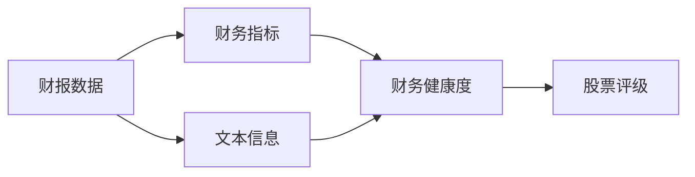

                 


# AI驱动的股票财报质量评估

> 关键词：AI, 股票财报, 财务指标, 自然语言处理, 深度学习, 文本挖掘

> 摘要：本文探讨了如何利用人工智能技术，特别是深度学习和自然语言处理，来评估股票财报的质量。文章从背景、核心概念、算法原理、系统架构到实际案例，详细阐述了AI在股票财报分析中的应用，展示了如何通过多模态数据融合和先进算法模型来提升财报评估的准确性和效率。

---

## 第一部分: AI驱动的股票财报质量评估背景与概念

### 第1章: 股票财报质量评估的背景与问题

#### 1.1 股票财报质量评估的背景

股票市场的波动性和复杂性使得投资者和分析师需要依赖可靠的财务信息来进行决策。传统的财务报表分析依赖于人工判断和经验，存在效率低下、主观性强、容易出错等问题。随着人工智能技术的发展，AI在金融领域的应用逐渐成熟，特别是在股票财报质量评估方面展现出巨大潜力。

#### 1.2 AI驱动财报质量评估的核心概念

AI驱动的股票财报质量评估通过整合财务数据和文本信息，利用机器学习模型对财务健康状况进行自动化分析。这种技术能够快速处理大量数据，识别潜在风险，并提供客观的评估结果。与传统方法相比，AI技术在数据处理速度、准确性以及复杂模式识别方面具有显著优势。

#### 1.3 财报质量评估的核心要素

- **财务指标分析**：通过分析收入、利润、负债等财务指标，评估企业的财务健康状况。
- **文本信息挖掘**：从财报中的文字描述中提取隐含信息，识别潜在风险或机会。
- **多维度数据融合**：结合财务数据、市场数据、新闻数据等多种信息源，进行全面评估。

### 第2章: AI驱动财报质量评估的核心概念与联系

#### 2.1 核心概念原理

AI在财报质量评估中的核心作用体现在以下几个方面：

- **数据融合**：通过整合财务数据和文本信息，构建多模态数据集，提升模型的综合判断能力。
- **模式识别**：利用深度学习模型识别复杂的财务模式和趋势，发现潜在问题。
- **实时分析**：通过自动化处理，实现对实时财报数据的快速评估，满足投资者的实时需求。

#### 2.2 核心概念属性对比

以下是对几种关键概念的对比分析：

- **财务指标与文本信息的对比**：
  - 财务指标：量化数据，直接反映企业的财务状况。
  - 文本信息：定性描述，提供背景和解释，帮助理解财务数据的含义。

- **不同AI模型的性能对比**：
  - 监督学习：适用于有标签的数据，模型性能稳定。
  - 无监督学习：适用于无标签数据，适合发现隐藏模式。
  - 深度学习：在复杂模式识别方面表现优异，但需要大量数据和计算资源。

- **数据来源与模型效果的关系**：
  - 数据来源的多样性和质量直接影响模型的准确性和鲁棒性。

#### 2.3 实体关系图

以下是一个简单的实体关系图，展示了财报数据、财务指标、文本信息和股票评级之间的关系：



### 第3章: AI驱动财报质量评估的算法原理

#### 3.1 算法原理概述

AI驱动的股票财报质量评估通常采用深度学习模型，尤其是监督学习方法。模型需要处理多种数据类型，包括结构化财务数据和非结构化文本数据。以下是典型的算法流程：

- 数据预处理：清洗和整合财务数据、文本数据。
- 模型训练：使用神经网络模型（如LSTM、BERT）进行训练，提取特征。
- 模型评估：通过验证集评估模型性能，调整超参数。
- 预测与分析：对新数据进行预测，生成股票评级。

#### 3.2 算法流程图

以下是一个简化的算法流程图：


#### 3.3 算法数学模型

在模型训练过程中，常用的损失函数和优化器如下：

- 损失函数：
  $$L = \frac{1}{n}\sum_{i=1}^{n}(y_i - \hat{y_i})^2$$

- 优化器：
  $$\theta_{new} = \theta_{old} - \eta \cdot \nabla L$$

#### 3.4 本章小结

本章详细介绍了AI驱动财报质量评估的算法原理，包括数据预处理、模型训练、评估和优化过程。通过合理的模型设计和优化，可以显著提升评估的准确性和效率。

---

## 第二部分: 系统分析与架构设计

### 第4章: 系统分析与架构设计

#### 4.1 问题场景介绍

在股票市场中，投资者需要快速、准确地评估企业的财报质量，以做出投资决策。传统的分析方法依赖人工判断，效率低且容易出错。通过构建AI驱动的系统，可以实现自动化、智能化的财报评估。

#### 4.2 系统功能设计

系统主要包括以下几个功能模块：

- 数据采集模块：从数据库或网络获取财务数据和文本信息。
- 数据预处理模块：清洗和整合数据，处理缺失值和异常值。
- 模型训练模块：训练深度学习模型，提取特征并进行预测。
- 结果分析模块：生成股票评级，并提供详细的分析报告。

#### 4.3 系统架构图

以下是一个简化的系统架构图：

```mermaid
graph LR
    Client --> API Gateway
    API Gateway --> DataCollector
    DataCollector --> DataPreprocessor
    DataPreprocessor --> ModelTrainer
    ModelTrainer --> ModelEvaluator
    ModelEvaluator --> ResultAnalyzer
    ResultAnalyzer --> Client
```

#### 4.4 本章小结

本章描述了AI驱动股票财报质量评估系统的整体架构，包括各个模块的功能设计和交互流程。通过合理的系统设计，可以实现高效的财报评估。

---

## 第三部分: 项目实战

### 第5章: 项目实战

#### 5.1 环境安装

以下是项目所需的环境和工具：

- Python 3.8+
- TensorFlow 2.0+
- Keras 2.2.5+
- NLTK 3.6+

#### 5.2 核心代码实现

以下是一个简单的代码示例，展示如何使用深度学习模型进行财报评估：

```python
import numpy as np
import tensorflow as tf
from tensorflow.keras import layers

# 数据预处理
# 假设我们已经将数据分为训练集和测试集
train_data = ...  # 训练数据
train_labels = ...  # 对应的标签
test_data = ...     # 测试数据
test_labels = ...   # 对应的标签

# 构建模型
model = tf.keras.Sequential([
    layers.Dense(64, activation='relu'),
    layers.Dense(32, activation='relu'),
    layers.Dense(1, activation='sigmoid')
])

# 编译模型
model.compile(optimizer='adam', loss='binary_crossentropy', metrics=['accuracy'])

# 训练模型
model.fit(train_data, train_labels, epochs=10, batch_size=32)

# 评估模型
loss, accuracy = model.evaluate(test_data, test_labels)
print(f"Loss: {loss}, Accuracy: {accuracy}")
```

#### 5.3 代码应用解读与分析

- 数据预处理：确保数据的格式和一致性，去除噪声，提高模型性能。
- 模型构建：选择合适的网络结构，通过层数和节点数调整模型复杂度。
- 训练过程：通过迭代优化模型参数，逐步提高模型准确率。
- 模型评估：通过测试集评估模型的泛化能力，调整超参数以优化性能。

#### 5.4 实际案例分析

以下是一个实际案例的分析过程：

1. 数据采集：从公开数据库获取某上市公司的财报数据和文本信息。
2. 数据预处理：清洗数据，去除缺失值和异常值。
3. 模型训练：使用训练数据训练深度学习模型。
4. 模型评估：使用测试数据评估模型性能。
5. 结果分析：根据模型输出生成股票评级，提供投资建议。

#### 5.5 本章小结

本章通过实际案例展示了AI驱动股票财报质量评估的具体实现过程，从环境搭建到代码实现，再到结果分析，帮助读者理解如何将理论应用于实践。

---

## 第四部分: 总结与展望

### 第6章: 总结与展望

#### 6.1 最佳实践 tips

- 数据预处理是关键，确保数据质量和一致性。
- 选择合适的模型和算法，根据数据类型和任务需求进行调整。
- 定期更新模型，适应市场变化和新的数据。

#### 6.2 小结

本文详细探讨了AI驱动股票财报质量评估的背景、核心概念、算法原理、系统架构和实际案例。通过合理的系统设计和算法优化，可以显著提升财报评估的准确性和效率。

#### 6.3 注意事项

- 数据隐私和安全问题需要高度重视。
- 模型的解释性需要加强，以便投资者更好地理解评估结果。
- 需要结合市场实际情况，调整模型参数和评估指标。

#### 6.4 拓展阅读

建议读者进一步阅读以下内容：

- 深度学习在金融领域的应用。
- 多模态数据融合的技术细节。
- 自然语言处理在财务文本分析中的应用。

---

## 作者信息

作者：AI天才研究院/AI Genius Institute & 禅与计算机程序设计艺术 /Zen And The Art of Computer Programming

---

通过以上结构和内容，我们系统地介绍了AI驱动股票财报质量评估的各个方面，从理论到实践，帮助读者全面理解和应用这一技术。

