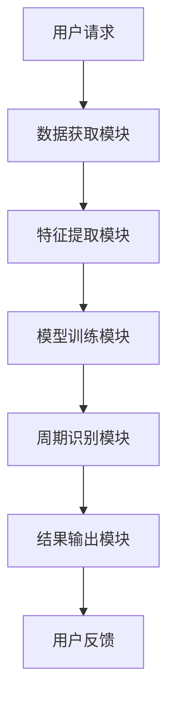
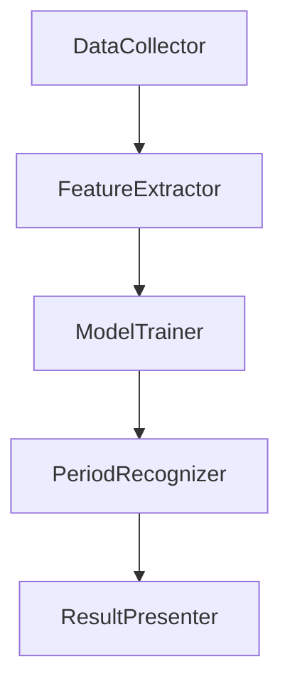

                 


# AI驱动的金融市场周期识别系统

> 关键词：AI驱动、金融市场、周期识别、时间序列分析、机器学习、深度学习、系统架构

> 摘要：本文介绍了一种基于人工智能的金融市场周期识别系统，该系统结合了时间序列分析、特征工程和机器学习模型，能够自动识别市场周期并提供交易策略支持。文章详细阐述了系统的背景、核心概念、算法原理、系统架构设计以及实际项目案例，为读者提供了从理论到实践的全面指导。

---

# 第一部分: AI驱动的金融市场周期识别系统概述

## 第1章: AI驱动的金融市场周期识别系统背景

### 1.1 问题背景与目标

#### 1.1.1 金融市场周期性与波动性分析
金融市场具有显著的周期性特征，价格波动往往呈现出周期性变化。传统的周期识别方法依赖于经验分析和统计指标，但这种方法存在主观性强、效率低、难以捕捉复杂模式等问题。AI技术的应用为金融市场周期识别提供了新的可能性。

#### 1.1.2 传统金融市场周期识别的局限性
传统周期识别方法通常基于均值回归、移动平均线等技术，但这些方法在面对复杂市场环境和高频数据时显得力不从心。此外，传统方法难以处理非线性关系和高维数据，导致周期识别的准确性和实时性不足。

#### 1.1.3 AI技术在金融周期识别中的优势
AI技术，特别是机器学习和深度学习，具有强大的模式识别和数据处理能力。通过AI驱动的周期识别系统，可以自动提取复杂市场特征，实时分析数据，显著提高周期识别的准确性和效率。

### 1.2 问题描述与解决思路

#### 1.2.1 金融市场周期识别的核心问题
金融市场周期识别的核心问题在于如何从海量数据中提取有效的周期特征，并准确识别当前市场所处的周期阶段。这需要结合时间序列分析、特征工程和机器学习模型。

#### 1.2.2 AI驱动的解决方案概述
AI驱动的周期识别系统通过以下步骤实现：数据采集与预处理、特征提取、模型训练与优化、周期识别与预测。系统利用机器学习算法，如LSTM和随机森林，结合时间序列特征，实现对市场周期的自动识别。

#### 1.2.3 系统目标与功能定位
系统的目标是为金融从业者提供一个高效、准确的周期识别工具，帮助其制定交易策略和风险管理计划。系统功能定位包括数据采集、特征提取、模型训练、周期识别和结果输出。

### 1.3 系统边界与外延

#### 1.3.1 金融周期识别的边界条件
金融周期识别的边界条件包括数据范围、时间分辨率和市场环境。系统需要明确数据来源、数据范围和时间粒度，以确保周期识别的准确性和适用性。

#### 1.3.2 系统功能的外延与扩展
系统功能的外延与扩展包括多市场支持、多周期分析、实时更新和自适应学习。系统可以扩展到支持不同市场和不同时间周期的分析，同时能够实时更新模型参数，适应市场变化。

#### 1.3.3 相关领域的关联性分析
金融周期识别与风险管理、投资策略、市场预测等领域密切相关。通过周期识别，系统可以帮助投资者制定更科学的交易策略，降低投资风险。

### 1.4 核心概念与组成要素

#### 1.4.1 金融市场周期的定义与特征
金融市场周期是指市场价格在一定时间内呈现的涨跌交替的周期性变化。其特征包括周期性、波动性和非线性。

#### 1.4.2 AI驱动系统的核心要素
AI驱动系统的核心要素包括数据采集模块、特征提取模块、模型训练模块、周期识别模块和结果输出模块。

#### 1.4.3 系统架构与功能模块
系统架构包括数据预处理模块、特征提取模块、模型训练模块、周期识别模块和用户交互模块。各模块协同工作，实现周期识别的完整流程。

---

## 第2章: AI驱动的金融市场周期识别系统核心概念

### 2.1 核心概念原理

#### 2.1.1 时间序列分析的基本原理
时间序列分析是通过分析历史数据，识别数据中的趋势、季节性和随机性成分，预测未来趋势。常用方法包括ARIMA、GARCH和LSTM等。

#### 2.1.2 金融市场数据特征提取方法
金融市场数据特征提取方法包括均值、方差、自相关性、波动率等统计特征，以及趋势、周期和噪声等模式特征。

#### 2.1.3 周期识别算法的基本框架
周期识别算法的基本框架包括数据预处理、特征提取、模型训练和周期识别。不同算法适用于不同类型的周期特征。

### 2.2 核心概念对比分析

#### 2.2.1 不同周期识别方法的对比
不同周期识别方法的对比包括传统统计方法、机器学习方法和深度学习方法的对比。每种方法各有优缺点，适用于不同场景。

#### 2.2.2 AI模型与传统模型的性能对比
AI模型在处理复杂数据和非线性关系方面具有明显优势，但在计算资源和模型解释性方面可能不如传统模型。

#### 2.2.3 不同特征提取方法的效果分析
不同特征提取方法的效果分析包括统计特征、技术指标和模式特征的对比。不同特征提取方法对周期识别的影响需要结合具体场景分析。

### 2.3 实体关系图与流程图

#### 2.3.1 ER实体关系图
```
```mermaid
er
  actor: 用户
  system: 周期识别系统
  market_data: 市场数据
  model: AI模型
  result: 周期识别结果
  actor --> system: 提交请求
  system --> market_data: 获取数据
  system --> model: 训练模型
  model --> result: 输出结果
  system --> actor: 返回结果
```
```

#### 2.3.2 系统流程图
```

```

---

## 第3章: 算法原理与实现

### 3.1 时间序列分析算法

#### 3.1.1 ARIMA模型原理
ARIMA模型是一种常用的统计模型，用于时间序列预测。模型通过自回归和滑动平均部分捕捉数据的自相关性和平稳性。

公式：
$$ ARIMA(p, d, q) $$
其中，p为自回归阶数，d为差分阶数，q为滑动平均阶数。

#### 3.1.2 LSTM网络原理
LSTM（长短期记忆网络）是一种特殊的RNN，能够有效捕捉时间序列中的长距离依赖关系。

公式：
$$ f_t = \sigma(W_{f}x_t + U_{f}h_{t-1} + b_f) $$
$$ i_t = \sigma(W_{i}x_t + U_{i}h_{t-1} + b_i) $$
$$ o_t = \sigma(W_{o}x_t + U_{o}h_{t-1} + b_o) $$
$$ c_t = f_t \odot c_{t-1} + i_t \odot tanh(W_{c}x_t + U_{c}h_{t-1} + b_c) $$
$$ h_t = o_t \odot tanh(c_t) $$

---

### 3.2 特征提取与选择

#### 3.2.1 统计特征提取
统计特征包括均值、方差、偏度、峰度等，用于描述数据分布特征。

#### 3.2.2 技术指标提取
技术指标包括移动平均线、MACD、RSI等，用于捕捉市场趋势和超买超卖信号。

#### 3.2.3 时间序列特征提取
时间序列特征包括自相关性、周期性、趋势性等，用于识别数据中的模式和周期性特征。

---

### 3.3 机器学习模型选择

#### 3.3.1 分类模型选择
分类模型包括随机森林、支持向量机（SVM）、K近邻（KNN）等，用于将周期识别任务转化为分类问题。

#### 3.3.2 回归模型选择
回归模型包括线性回归、岭回归、弹性网络等，用于预测周期长度和周期阶段。

#### 3.3.3 集成学习模型选择
集成学习模型包括梯度提升树（GBDT）、XGBoost、LightGBM等，用于提高模型的准确性和鲁棒性。

---

## 第4章: 系统架构与设计

### 4.1 系统架构设计

#### 4.1.1 系统功能模块
系统功能模块包括数据采集模块、特征提取模块、模型训练模块、周期识别模块和用户交互模块。

#### 4.1.2 系统架构图
```

```

---

## 第5章: 项目实战与应用

### 5.1 环境安装与配置

#### 5.1.1 系统环境要求
需要安装Python、NumPy、Pandas、Scikit-learn、Keras、TensorFlow等库。

#### 5.1.2 数据获取与预处理
从金融数据源获取历史价格数据，进行数据清洗和标准化处理。

### 5.2 核心代码实现

#### 5.2.1 数据采集模块
```python
import pandas as pd
import requests

def get_market_data(symbol, start_date, end_date):
    url = f"https://api.example.com/stock/{symbol}"
    params = {
        'start': start_date,
        'end': end_date
    }
    response = requests.get(url, params=params)
    data = pd.DataFrame(response.json())
    return data
```

#### 5.2.2 特征提取模块
```python
def extract_features(data):
    # 统计特征
    mean = data['close'].mean()
    std = data['close'].std()
    
    # 技术指标
    macd = data['close'].ewm(span=12).mean() - data['close'].ewm(span=26).mean()
    
    return {'mean': mean, 'std': std, 'macd': macd}
```

#### 5.2.3 模型训练模块
```python
from sklearn.ensemble import RandomForestClassifier

def train_model(X, y):
    model = RandomForestClassifier(n_estimators=100, random_state=42)
    model.fit(X, y)
    return model
```

#### 5.2.4 周期识别模块
```python
def recognize_period(model, data):
    features = extract_features(data)
    prediction = model.predict([features])
    return prediction[0]
```

---

## 第6章: 总结与展望

### 6.1 总结
本文介绍了AI驱动的金融市场周期识别系统，详细阐述了系统的背景、核心概念、算法原理和系统架构设计。通过实际案例分析，展示了系统的实现过程和应用价值。

### 6.2 未来展望
未来的研究方向包括优化模型性能、提高系统的实时性和扩展性，以及探索新的特征提取方法。此外，还可以结合区块链技术，实现更加安全和高效的金融周期识别系统。

---

作者：AI天才研究院/AI Genius Institute & 禅与计算机程序设计艺术 /Zen And The Art of Computer Programming

