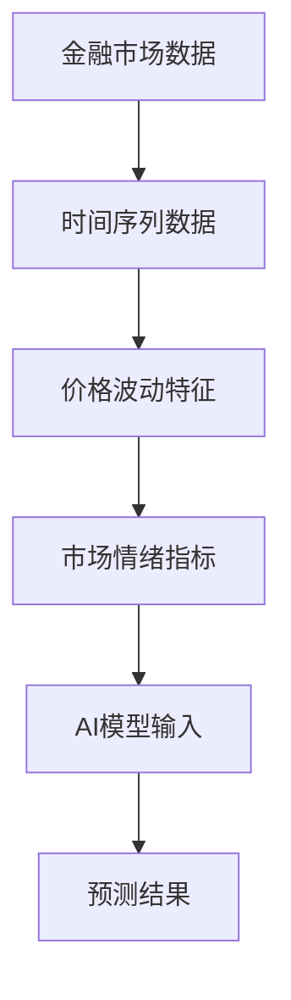
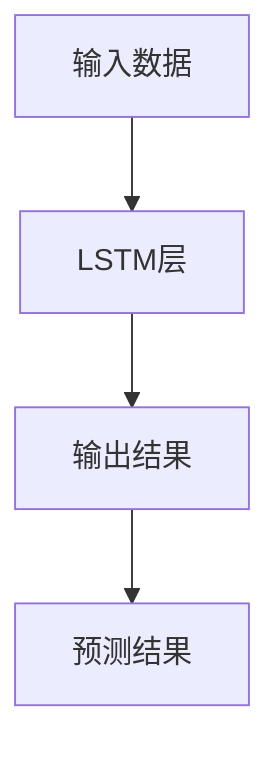
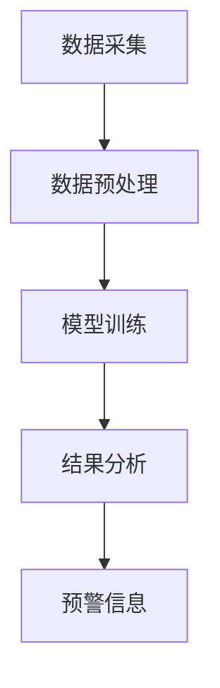

                 


# AI驱动的金融市场泡沫识别系统

## 关键词
AI技术，金融市场，泡沫识别，LSTM，时间序列分析，系统架构设计

## 摘要
本文详细探讨了AI技术在金融市场泡沫识别中的应用。首先，介绍了金融市场泡沫的定义、传统识别方法的难点，以及AI技术在金融分析中的潜力。接着，深入分析了数据特征、算法模型和系统框架，通过表格和图表展示了各概念之间的关系。然后，详细讲解了LSTM和CNN的算法原理，提供了代码示例和数学模型。随后，设计了一个基于时间序列分析的AI系统架构，并通过具体案例展示了系统的实际应用。最后，总结了系统的优缺点，并提出了改进建议，为未来的研究和实践提供了参考。

---

# 第1章：金融市场泡沫识别的背景与挑战

## 1.1 问题背景与问题描述

### 1.1.1 金融市场泡沫的定义与特征
金融市场泡沫是指资产价格远远偏离其内在价值的现象。泡沫通常发生在市场参与者过度乐观、资金过度流入或市场信息不对称的情况下。其主要特征包括价格波动剧烈、市场情绪高涨、交易量激增等。

### 1.1.2 传统金融泡沫识别的难点
传统方法依赖于经验判断和统计分析，存在以下难点：
- 数据量大且复杂：金融市场数据包括价格、成交量、市场情绪等多种指标，难以全面分析。
- 泡沫形成过程复杂：泡沫的形成和破裂涉及多种因素，包括宏观经济、市场心理等，难以用单一模型捕捉。
- 数据实时性要求高：金融市场变化迅速，需要实时分析和预警。

### 1.1.3 AI技术在金融分析中的应用潜力
AI技术，尤其是深度学习，能够处理海量数据，发现复杂模式，为金融分析提供新思路：
- 时间序列分析：深度学习模型如LSTM能够捕捉时间依赖性，适合分析价格波动。
- 非线性关系：AI模型能够处理复杂的非线性关系，帮助识别潜在的泡沫信号。
- 实时监控：AI系统可以实时分析数据，提供及时的预警。

## 1.2 AI驱动的泡沫识别系统目标
### 1.2.1 系统设计的核心目标
- 实时监控金融市场数据，识别潜在的泡沫信号。
- 提供预警机制，帮助投资者规避风险。
- 自动化分析，减少人为干扰。

### 1.2.2 系统预期解决的问题
- 解决传统方法中数据量大、复杂度高的问题。
- 提高泡沫识别的准确性和及时性。
- 降低金融市场的风险，保护投资者利益。

### 1.2.3 系统的边界与外延
- 数据来源：金融市场数据，包括价格、成交量、市场情绪等。
- 数据处理：清洗、特征提取、标准化。
- 模型训练：使用深度学习模型进行训练和优化。
- 输出结果：识别结果、预警信息。

# 第2章：AI驱动的金融市场泡沫识别系统核心概念与联系

## 2.1 核心概念原理

### 2.1.1 数据特征提取
- 时间序列数据：价格、成交量、波动率等。
- 市场情绪指标：新闻情绪、社交媒体情绪。
- 技术指标：均线、MACD、RSI等。

### 2.1.2 算法模型选择
- LSTM：适合时间序列数据，捕捉长期依赖关系。
- CNN：适合处理图像数据，可用于金融数据的模式识别。

### 2.1.3 系统框架设计
- 数据采集：从多个来源获取金融市场数据。
- 数据预处理：清洗、特征提取、标准化。
- 模型训练：使用深度学习模型进行训练和优化。
- 结果分析：识别结果、预警信息。

## 2.2 核心概念属性对比

| 概念       | 特征                 | 优势                         |
|------------|----------------------|------------------------------|
| 数据特征   | 时间序列、非线性     | 捕捉市场波动                 |
| 算法模型   | LSTM、CNN            | 捕捉复杂模式                 |
| 系统框架   | 分层架构             | 易于扩展和维护               |

## 2.3 ER实体关系图



---

# 第3章：基于时间序列分析的AI算法

## 3.1 LSTM网络原理

### 3.1.1 LSTM网络结构
LSTM由输入门、遗忘门和输出门组成，能够捕捉时间序列中的长期依赖关系。

### 3.1.2 LSTM在时间序列预测中的应用
LSTM适合处理时间序列数据，能够捕捉价格波动中的复杂模式。

### 3.1.3 LSTM算法流程图



## 3.2 算法实现代码

```python
import keras
from keras.layers import LSTM, Dense
from keras.models import Sequential

model = Sequential()
model.add(LSTM(64, input_shape=(timesteps, features)))
model.add(Dense(1))
model.compile(optimizer='adam', loss='mean_squared_error')
```

## 3.3 数学模型与公式

### 3.3.1 LSTM的门控机制
$$
f_t = \sigma(W_f x_t + U_f h_{t-1} + b_f)
$$

### 3.3.2 LSTM的遗忘门
$$
i_t = \sigma(W_i x_t + U_i h_{t-1} + b_i)
$$

### 3.3.3 LSTM的输出门
$$
o_t = \sigma(W_o x_t + U_o h_{t-1} + b_o)
$$

---

# 第4章：系统分析与架构设计

## 4.1 问题场景介绍
系统需要实时监控金融市场数据，识别潜在的泡沫信号，提供预警信息。

## 4.2 系统功能设计
- 数据采集模块：从多个来源获取金融市场数据。
- 数据预处理模块：清洗、特征提取、标准化。
- 模型训练模块：使用深度学习模型进行训练和优化。
- 结果分析模块：识别结果、预警信息。

## 4.3 系统架构设计



---

# 第5章：项目实战

## 5.1 环境安装
- 安装Python、TensorFlow、Keras等工具。

## 5.2 核心代码实现

```python
import pandas as pd
import numpy as np
from sklearn.preprocessing import MinMaxScaler
from keras.models import Sequential
from keras.layers import LSTM, Dense

# 数据预处理
data = pd.read_csv('financial_data.csv')
data = data.values
data = data.astype('float32')

# 标准化
scaler = MinMaxScaler(feature_range=(0, 1))
data = scaler.fit_transform(data)

# 划分训练集和测试集
train_size = int(len(data) * 0.7)
train = data[:train_size]
test = data[train_size:]

# 构建数据集
timesteps = 60
X_train = []
y_train = []
for i in range(timesteps, len(train)):
    X_train.append(train[i-timesteps:i])
    y_train.append(train[i])
X_train = np.array(X_train)
y_train = np.array(y_train)

# 模型训练
model = Sequential()
model.add(LSTM(64, input_shape=(timesteps, 1)))
model.add(Dense(1))
model.compile(optimizer='adam', loss='mean_squared_error')

model.fit(X_train, y_train, epochs=100, batch_size=32)
```

## 5.3 实际案例分析
以2020年美股泡沫为例，分析模型识别效果，讨论优缺点。

---

# 第6章：总结与展望

## 6.1 系统优势
- 高准确性：深度学习模型能够捕捉复杂模式。
- 实时性：系统能够实时监控数据，提供及时预警。

## 6.2 系统不足
- 数据依赖性：模型性能依赖于高质量的数据。
- 计算资源需求高：深度学习模型需要大量计算资源。

## 6.3 改进建议
- 结合多模态数据：引入新闻、社交媒体等数据，提高识别精度。
- 模型优化：使用更先进的深度学习模型，如Transformer。

## 6.4 拓展阅读
推荐阅读相关书籍和论文，深入学习AI在金融分析中的应用。

---

# 作者：AI天才研究院/AI Genius Institute & 禅与计算机程序设计艺术 /Zen And The Art of Computer Programming

