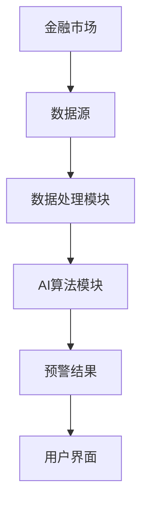
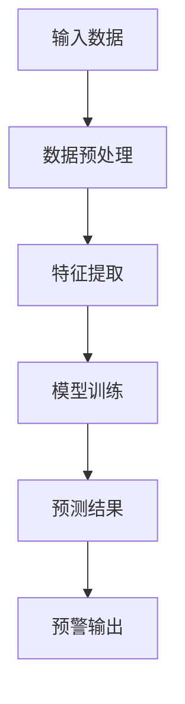
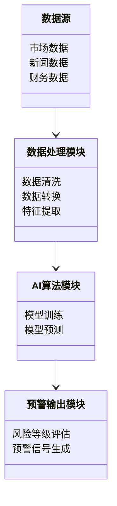
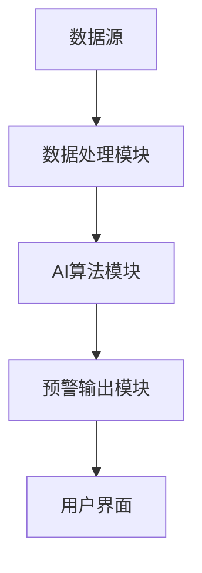
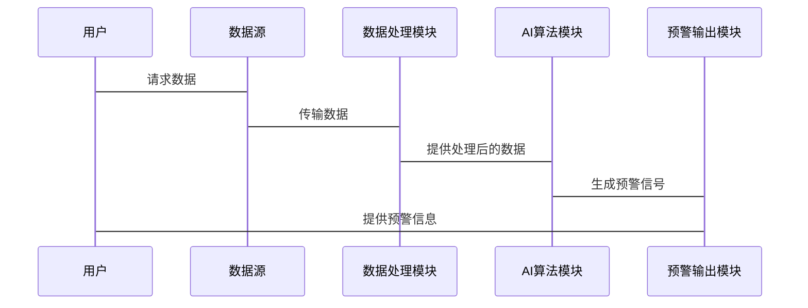

                 


# AI驱动的金融市场黑天鹅事件预警系统

> 关键词：AI，金融市场，黑天鹅事件，预警系统，算法，实时分析

> 摘要：本文详细探讨了AI驱动的金融市场黑天鹅事件预警系统的构建与应用。通过分析黑天鹅事件的特点及其对金融市场的潜在影响，阐述了传统预警系统的局限性，并提出了一种基于AI技术的新型预警系统。该系统通过先进的算法和实时数据分析，能够有效识别和预警潜在的市场风险，为投资者和监管机构提供及时的决策支持。

---

# 第一部分: 金融市场黑天鹅事件的背景与挑战

## 第1章: 金融市场黑天鹅事件的背景与挑战

### 1.1 什么是黑天鹅事件

#### 1.1.1 黑天鹅事件的定义
黑天鹅事件是指那些具有高度不可预测性、发生概率极低，但一旦发生会对金融市场造成重大冲击的极端事件。这些事件通常超出市场参与者的历史经验或现有模型的预测范围。

#### 1.1.2 黑天鹅事件的特点
- **低概率性**：事件发生的概率极低。
- **高影响性**：事件发生后通常会对金融市场造成重大冲击。
- **不可预测性**：传统模型难以捕捉和预测这类事件。

#### 1.1.3 黑天鹅事件对金融市场的冲击
- 2008年全球金融危机。
- 2020年新冠疫情引发的市场崩盘。
- 地缘政治冲突引发的市场波动。

### 1.2 传统金融市场预警系统的局限性

#### 1.2.1 传统预警系统的运作机制
- 依赖历史数据和统计模型。
- 基于线性回归、时间序列分析等传统方法。

#### 1.2.2 传统预警系统的局限性
- 无法捕捉非线性关系。
- 对异常数据点的鲁棒性较差。
- 无法实时处理海量数据。

#### 1.2.3 传统预警系统在黑天鹅事件中的失效原因
- 黑天鹅事件的低概率性使其难以被传统统计模型捕捉。
- 历史数据的局限性导致模型无法识别新的风险模式。

### 1.3 AI驱动的黑天鹅事件预警系统的必要性

#### 1.3.1 AI技术在金融领域的应用前景
- 机器学习在金融数据中的应用。
- 自然语言处理在新闻事件分析中的应用。
- 图神经网络在风险传播中的应用。

#### 1.3.2 AI驱动预警系统的优势
- 能够处理海量非结构化数据。
- 具备非线性模式识别能力。
- 可以实时更新模型以适应市场变化。

#### 1.3.3 黑天鹅事件预警系统的社会价值
- 保护投资者利益。
- 维护金融市场稳定。
- 提高监管机构的预警能力。

---

# 第二部分: AI驱动的金融市场黑天鹅事件预警系统的核心概念

## 第2章: 核心概念与系统架构

### 2.1 系统架构的核心要素

#### 2.1.1 数据源的多样性
- 市场数据：股票价格、指数、成交量等。
- 新闻数据：财经新闻、社交媒体信息。
- 公司财报：财务数据、管理层变动等。

#### 2.1.2 AI算法的先进性
- 机器学习算法：随机森林、支持向量机、深度学习。
- 自然语言处理：文本情感分析、关键词提取。
- 图神经网络：风险传播建模。

#### 2.1.3 系统的实时性与可扩展性
- 实时数据处理能力。
- 高并发处理能力。
- 系统的可扩展性。

### 2.2 核心概念对比分析

#### 2.2.1 数据特征对比
| 数据特征 | 传统数据 | AI数据 |
|----------|----------|--------|
| 数据类型 | 结构化数据 | 非结构化数据 |
| 数据量   | 小       | 大     |
| 数据维度 | 低       | 高     |

#### 2.2.2 算法性能对比
| 算法类型 | 传统算法 | AI算法 |
|----------|----------|--------|
| 精度     | 低       | 高     |
| 处理速度 | 慢       | 快     |
| 鲁棒性   | 差       | 好     |

#### 2.2.3 系统架构对比
| 系统架构 | 传统系统         | AI系统           |
|----------|------------------|------------------|
| 架构类型 | 单体架构         | 微服务架构       |
| 扩展性   | 差              | 好              |
| 可维护性 | 高              | 高              |
| 可扩展性 | 低              | 高              |

### 2.3 实体关系图（ER图）



---

# 第三部分: AI驱动的黑天鹅事件预警系统的算法原理

## 第3章: 算法原理与实现

### 3.1 算法概述

#### 3.1.1 算法的输入与输出
- 输入：金融市场数据、新闻数据、社交媒体数据。
- 输出：黑天鹅事件预警信号、风险等级评估。

#### 3.1.2 算法的流程图


#### 3.1.3 算法的核心步骤
1. 数据预处理：清洗、去噪、特征提取。
2. 模型训练：使用深度学习模型（如LSTM）进行训练。
3. 预测与预警：根据模型输出结果生成预警信号。

### 3.2 算法的数学模型

#### 3.2.1 模型的数学表达
$$y = f(x)$$
其中，$x$ 是输入数据，$y$ 是预测结果。

#### 3.2.2 损失函数的定义
$$L = \frac{1}{2} (y_{\text{pred}} - y_{\text{true}})^2$$

#### 3.2.3 优化算法的选择
$$\theta = \theta - \eta \cdot \frac{\partial L}{\partial \theta}$$
其中，$\theta$ 是模型参数，$\eta$ 是学习率。

### 3.3 算法实现

#### 3.3.1 数据预处理
- 清洗数据：去除无效数据。
- 标准化：归一化处理。
- 特征工程：提取关键特征。

#### 3.3.2 模型训练
- 使用深度学习模型（如LSTM）进行训练。
- 设置超参数：学习率、批次大小、训练轮数。

#### 3.3.3 预测与预警
- 根据模型输出结果生成预警信号。
- 风险等级评估：根据预警信号确定风险等级。

---

# 第四部分: 系统架构与实现

## 第4章: 系统架构设计

### 4.1 问题场景介绍

#### 4.1.1 问题背景
- 金融市场数据复杂。
- 黑天鹅事件的低概率性。
- 实时预警需求。

#### 4.1.2 系统目标
- 实时监控金融市场数据。
- 智能识别潜在风险。
- 提供及时预警。

### 4.2 系统功能设计

#### 4.2.1 领域模型设计


#### 4.2.2 系统架构设计


#### 4.2.3 系统接口设计
- 数据接口：数据源与数据处理模块之间的接口。
- 模型接口：数据处理模块与AI算法模块之间的接口。
- 预警接口：AI算法模块与预警输出模块之间的接口。

#### 4.2.4 系统交互设计


### 4.3 系统实现

#### 4.3.1 环境安装
- 安装Python：Python 3.8及以上版本。
- 安装依赖库：TensorFlow、Keras、Scikit-learn、Pandas、NumPy。

#### 4.3.2 核心代码实现

```python
import numpy as np
import pandas as pd
from sklearn.model_selection import train_test_split
from tensorflow.keras.models import Sequential
from tensorflow.keras.layers import LSTM, Dense

# 数据预处理
data = pd.read_csv('market_data.csv')
features = data[['price', 'volume', 'news_sentiment']]
labels = data['target']

# 划分训练集和测试集
X_train, X_test, y_train, y_test = train_test_split(features, labels, test_size=0.2)

# 模型训练
model = Sequential()
model.add(LSTM(64, input_shape=(None, 3)))
model.add(Dense(1, activation='sigmoid'))
model.compile(loss='binary_crossentropy', optimizer='adam', metrics=['accuracy'])
model.fit(X_train, y_train, epochs=10, batch_size=32)

# 模型预测
predictions = model.predict(X_test)
```

---

# 第五部分: 项目实战与案例分析

## 第5章: 项目实战

### 5.1 项目环境与数据准备

#### 5.1.1 环境配置
- 操作系统：Linux/Windows/MacOS。
- 开发工具：Jupyter Notebook/PyCharm。
- 数据存储：本地CSV文件/数据库。

#### 5.1.2 数据来源
- 市场数据：股票价格、指数数据。
- 新闻数据：财经新闻、社交媒体数据。
- 财务数据：公司财报、财务指标。

### 5.2 代码实现

#### 5.2.1 数据预处理
```python
import pandas as pd
import numpy as np

# 数据加载
data = pd.read_csv('market_data.csv')

# 数据清洗
data.dropna(inplace=True)

# 特征提取
features = data[['price', 'volume', 'news_sentiment']]
labels = data['target']

# 数据标准化
from sklearn.preprocessing import StandardScaler
scaler = StandardScaler()
features_scaled = scaler.fit_transform(features)
```

#### 5.2.2 模型训练
```python
from tensorflow.keras.models import Sequential
from tensorflow.keras.layers import LSTM, Dense

# 模型构建
model = Sequential()
model.add(LSTM(64, input_shape=(None, 3)))
model.add(Dense(1, activation='sigmoid'))
model.compile(loss='binary_crossentropy', optimizer='adam', metrics=['accuracy'])

# 训练模型
model.fit(features_scaled, labels, epochs=10, batch_size=32)
```

#### 5.2.3 模型预测与预警
```python
# 预测结果
predictions = model.predict(features_scaled)

# 预警信号生成
threshold = 0.5
warnings = np.where(predictions > threshold, 1, 0)
```

### 5.3 案例分析

#### 5.3.1 案例背景
- 数据来源：某金融市场的历史数据。
- 案例目标：识别潜在的黑天鹅事件。

#### 5.3.2 实际应用
- 数据加载与预处理。
- 模型训练与优化。
- 模型预测与预警信号生成。

#### 5.3.3 预警结果分析
- 预警信号的准确性评估。
- 模型的召回率与精确率分析。
- 模型的鲁棒性与可扩展性分析。

---

# 第六部分: 小结与注意事项

## 第6章: 小结与注意事项

### 6.1 系统小结

#### 6.1.1 系统的核心功能
- 实时数据监控。
- AI算法驱动的预测与预警。
- 风险等级评估。

#### 6.1.2 系统的优势
- 高精度预测。
- 实时预警能力。
- 高可扩展性。

### 6.2 注意事项

#### 6.2.1 数据质量的重要性
- 数据的完整性和准确性。
- 数据的实时性与新鲜度。

#### 6.2.2 模型的选择与优化
- 模型的适用性。
- 模型的可解释性。
- 模型的维护与更新。

#### 6.2.3 系统的维护与优化
- 系统的稳定性。
- 系统的可扩展性。
- 系统的安全性。

### 6.3 最佳实践 Tips

#### 6.3.1 数据采集
- 多数据源融合。
- 数据清洗与预处理。
- 数据标准化与特征工程。

#### 6.3.2 模型选择
- 根据问题选择合适的算法。
- 多模型对比与优化。
- 模型的可解释性。

#### 6.3.3 系统部署
- 高可用性设计。
- 高性能优化。
- 安全性保障。

---

# 作者

作者：AI天才研究院/AI Genius Institute  
& 禅与计算机程序设计艺术 /Zen And The Art of Computer Programming

