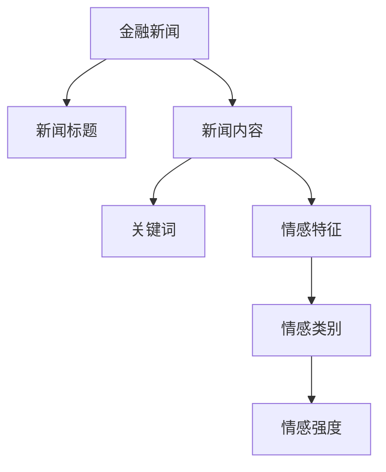
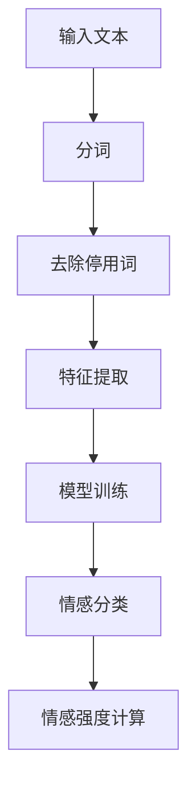
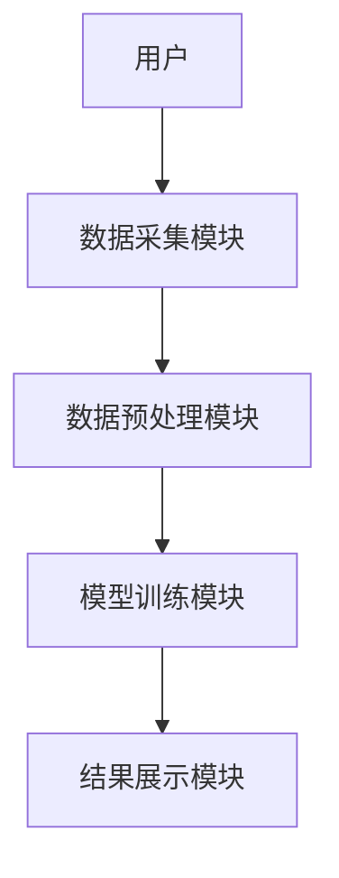
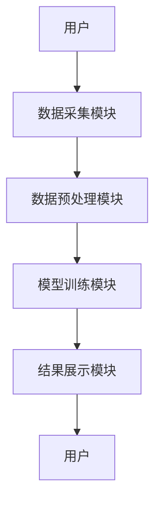

                 


# AI驱动的金融新闻情感分析系统

## 关键词：人工智能、情感分析、金融新闻、自然语言处理、深度学习

## 摘要：  
本文将探讨如何利用人工智能技术构建一个高效的金融新闻情感分析系统。通过结合自然语言处理（NLP）和金融数据分析，本文提出了一种基于深度学习的情感分析模型，能够准确识别金融新闻中的情感倾向，并将其应用于金融市场的投资决策支持。文章详细介绍了系统的核心概念、算法原理、系统架构设计以及实际应用案例，为读者提供了一个全面的技术视角。

---

# 第1章: 金融新闻情感分析的背景与应用

## 1.1 情感分析的定义与核心概念  
### 1.1.1 情感分析的定义  
情感分析是自然语言处理（NLP）领域的重要任务，旨在通过分析文本内容来判断作者的情感倾向。情感分析的结果通常分为三类：正面、中性或负面。  

在金融领域，情感分析的目标是通过分析新闻、评论等文本数据，判断市场参与者的情绪倾向，从而辅助投资决策。  

### 1.1.2 金融新闻中的情感分析特点  
金融新闻具有高度的专业性和复杂性，其情感分析需要考虑以下特点：  
1. **专业术语**：金融新闻中包含大量专业术语，如“利好”、“利空”等，需要结合上下文理解其情感倾向。  
2. **情感强度**：金融新闻的情感强度可能与市场波动直接相关，例如“重大利空”通常对应强烈负面情绪。  
3. **上下文依赖**：金融新闻的情感分析往往需要结合市场背景和上下文信息，避免孤立分析。  

### 1.1.3 情感分析在金融领域的应用价值  
1. **投资决策支持**：通过分析新闻情感，投资者可以更准确地判断市场趋势。  
2. **风险预警**：负面新闻的快速识别可以提前预警市场风险。  
3. **量化交易策略**：基于情感分析的结果，可以制定自动化交易策略。  

---

## 1.2 金融新闻情感分析的背景与问题背景  
### 1.2.1 金融市场的信息处理需求  
金融市场参与者每天需要处理海量信息，包括新闻、公告、社交媒体等。传统的信息处理方式依赖人工分析，效率低下且容易出错。  

### 1.2.2 传统金融分析的局限性  
传统金融分析主要依赖技术指标和历史数据，难以捕捉市场情绪的变化。情感分析的引入为金融分析提供了新的维度。  

### 1.2.3 情感分析在金融决策中的作用  
情感分析可以帮助投资者快速判断市场情绪，捕捉短期市场波动，从而优化投资策略。  

---

## 1.3 问题描述与解决思路  
### 1.3.1 金融新闻情感分析的核心问题  
1. 如何准确识别金融新闻中的情感倾向？  
2. 如何处理金融新闻中的专业术语和上下文依赖？  
3. 如何将情感分析结果应用于实际投资决策？  

### 1.3.2 情感分析系统的构建目标  
1. 构建一个能够处理金融新闻的文本分析系统。  
2. 提供准确的情感分类结果，并量化情感强度。  
3. 实现情感分析结果的可视化展示，支持投资决策。  

### 1.3.3 系统解决的路径与方法  
1. 数据采集与预处理：收集金融新闻数据，并进行清洗和标注。  
2. 模型训练：基于深度学习构建情感分类模型。  
3. 系统集成：将模型与用户界面结合，提供实时分析功能。  

---

## 1.4 系统的边界与外延  
### 1.4.1 系统的功能边界  
1. 输入：金融新闻文本。  
2. 输出：情感分类结果（正面、中性、负面）及情感强度。  

### 1.4.2 系统的输入与输出  
1. 输入：结构化金融新闻数据。  
2. 输出：情感分类结果和可视化报告。  

### 1.4.3 系统与其他金融工具的关联  
1. 与量化交易平台的集成。  
2. 与市场数据API的对接。  

---

## 1.5 核心概念与系统架构  
### 1.5.1 系统的核心要素  
1. 数据源：金融新闻数据库。  
2. 情感分析模型：深度学习模型。  
3. 用户界面：可视化报告展示。  

### 1.5.2 系统架构的初步设计  
1. 数据采集模块：负责收集金融新闻数据。  
2. 数据预处理模块：清洗和标注数据。  
3. 模型训练模块：训练情感分类模型。  
4. 结果展示模块：生成可视化报告。  

### 1.5.3 系统的模块划分与功能描述  
1. 数据采集模块：从新闻网站或API获取金融新闻。  
2. 数据预处理模块：去除停用词、分词、提取关键词。  
3. 模型训练模块：基于LSTM或BERT训练情感分类模型。  
4. 结果展示模块：将情感分类结果以图表形式展示。  

---

## 1.6 本章小结  
本章介绍了金融新闻情感分析的背景、核心概念以及系统的构建目标。通过分析金融新闻的特殊性，提出了系统的功能边界和初步架构设计。下一章将详细探讨情感分析的核心原理和算法实现。  

---

# 第2章: 金融新闻情感分析的核心概念与联系  

## 2.1 情感分析的核心原理  
### 2.1.1 文本预处理与特征提取  
文本预处理是情感分析的基础，主要包括分词、去除停用词、提取关键词等步骤。  

### 2.1.2 情感分类的算法原理  
情感分类基于特征提取和模型训练，常用的算法包括朴素贝叶斯、支持向量机（SVM）和深度学习模型（如LSTM、BERT）。  

### 2.1.3 情感强度的计算方法  
情感强度是情感分析的扩展，通常通过回归模型实现。  

---

## 2.2 情感分析与金融市场的关联  
### 2.2.1 情感分析在股票预测中的应用  
通过分析新闻情感，可以预测股票价格的短期波动。  

### 2.2.2 市场情绪与金融波动的关系  
市场情绪是影响金融波动的重要因素，情感分析能够量化市场情绪。  

### 2.2.3 情感分析对投资决策的支持作用  
情感分析可以帮助投资者识别市场情绪拐点，优化投资策略。  

---

## 2.3 核心概念的属性特征对比  
### 2.3.1 不同情感分析模型的对比分析  
| 模型 | 优点 | 缺点 |  
|------|------|------|  
| 朴素贝叶斯 | 简单高效 | 对特征工程依赖性强 |  
| SVM | 高准确性 | 计算复杂度高 |  
| LSTM | 能处理序列数据 | 训练时间长 |  

### 2.3.2 金融新闻与普通文本的特征差异  
| 特征 | 金融新闻 | 普通文本 |  
|------|----------|----------|  
| 专业性 | 高 | 低 |  
| 上下文依赖 | 高 | 中 |  
| 情感强度 | 显著 | 一般 |  

### 2.3.3 情感强度与情感类别之间的关系  
情感强度是情感类别的一种扩展，前者反映了情感的强弱，后者反映了情感的性质。  

---

## 2.4 ER实体关系图  


---

## 2.5 本章小结  
本章详细探讨了情感分析的核心原理和金融市场的关联，分析了不同模型的优缺点，并通过ER图展示了系统的实体关系。下一章将深入探讨情感分析的算法原理及其在金融新闻中的应用。  

---

# 第3章: 金融新闻情感分析的算法原理  

## 3.1 算法原理概述  
### 3.1.1 基于传统机器学习的情感分析  
传统机器学习算法（如SVM）依赖特征工程，适用于数据量较小的情况。  

### 3.1.2 基于深度学习的情感分析  
深度学习模型（如LSTM、BERT）能够自动提取特征，适用于数据量大的场景。  

### 3.1.3 混合模型的优势与挑战  
混合模型结合了传统算法和深度学习的优势，但训练时间和计算资源需求较高。  

---

## 3.2 算法流程图  


---

## 3.3 深度学习模型的数学原理  
### 3.3.1 LSTM模型的数学公式  
LSTM的核心在于其门控机制，公式如下：  
$$ f_t = \sigma(W_f \cdot [h_{t-1}, x_t] + b_f) $$  
$$ i_t = \sigma(W_i \cdot [h_{t-1}, x_t] + b_i) $$  
$$ c_t = f_t \odot c_{t-1} + i_t \odot tanh(W_c \cdot [h_{t-1}, x_t] + b_c) $$  
$$ o_t = \sigma(W_o \cdot [h_{t-1}, c_t] + b_o) $$  
$$ h_t = o_t \odot tanh(W_h \cdot [h_{t-1}, c_t] + b_h) $$  

其中，$f_t$、$i_t$、$c_t$、$o_t$分别为遗忘门、输入门、细胞状态和输出门。  

### 3.3.2 情感分类的损失函数  
常用交叉熵损失函数：  
$$ L = -\sum_{i=1}^{n} y_i \log(p_i) + (1-y_i)\log(1-p_i) $$  
其中，$y_i$为真实标签，$p_i$为预测概率。  

---

## 3.4 算法实现的注意事项  
### 3.4.1 数据预处理  
1. 分词：使用jieba等工具进行分词。  
2. 去除停用词：移除无意义词汇（如“的”、“了”）。  
3. 提取关键词：保留与情感分析相关的词汇。  

### 3.4.2 模型训练  
1. 选择合适的深度学习模型（如LSTM）。  
2. 调参：调整学习率、批量大小等超参数。  
3. 验证：使用交叉验证评估模型性能。  

---

## 3.5 本章小结  
本章详细讲解了情感分析的算法原理，包括传统机器学习和深度学习模型的对比，以及深度学习模型的数学公式。通过流程图展示了算法的实现步骤，为后续系统设计奠定了基础。  

---

# 第4章: 金融新闻情感分析系统的架构设计  

## 4.1 系统功能模块划分  
### 4.1.1 数据采集模块  
负责从新闻网站或API获取金融新闻数据。  

### 4.1.2 数据预处理模块  
对文本进行分词、去停用词等处理。  

### 4.1.3 模型训练模块  
基于预处理后的数据训练情感分类模型。  

### 4.1.4 结果展示模块  
将情感分类结果以可视化形式展示。  

---

## 4.2 系统架构设计  
### 4.2.1 系统架构图  


### 4.2.2 模块交互关系  
1. 用户输入金融新闻数据。  
2. 数据采集模块将数据传递给预处理模块。  
3. 预处理模块输出清洗后的数据。  
4. 模型训练模块基于清洗后的数据训练模型。  
5. 结果展示模块将模型输出结果展示给用户。  

---

## 4.3 系统接口设计  
### 4.3.1 数据接口  
1. 数据输入接口：接收金融新闻文本。  
2. 数据输出接口：返回情感分类结果。  

### 4.3.2 模型接口  
1. 模型训练接口：接收预处理后的数据，输出训练好的模型。  
2. 模型预测接口：接收新闻文本，输出情感分类结果。  

---

## 4.4 系统交互流程图  


---

## 4.5 本章小结  
本章详细设计了金融新闻情感分析系统的架构，包括功能模块划分、系统架构图和模块交互关系。通过接口设计和交互流程图，展示了系统的实现步骤。  

---

# 第5章: 金融新闻情感分析系统的实现与案例分析  

## 5.1 项目实战  
### 5.1.1 环境安装  
1. 安装Python和相关库（如jieba、keras、tensorflow）。  
2. 安装数据采集工具（如requests、beautifulsoup4）。  

### 5.1.2 系统核心代码实现  
#### 数据采集模块  
```python
import requests
from bs4 import BeautifulSoup

def fetch_news(url):
    response = requests.get(url)
    soup = BeautifulSoup(response.text, 'html.parser')
    news_list = soup.find_all('div', class_='news-item')
    news = []
    for item in news_list:
        title = item.find('h2').text
        content = item.find('p').text
        news.append({'title': title, 'content': content})
    return news
```

#### 数据预处理模块  
```python
import jieba

def preprocess(text):
    words = jieba.lcut(text)
    filtered_words = [word for word in words if word not in stop_words]
    return ' '.join(filtered_words)
```

#### 模型训练模块  
```python
from tensorflow.keras import layers, models

def build_model(max_words):
    model = models.Sequential()
    model.add(layers.Embedding(max_words, 100, input_length=50))
    model.add(layers.LSTM(64))
    model.add(layers.Dense(3, activation='softmax'))
    model.compile(loss='categorical_crossentropy', optimizer='adam', metrics=['accuracy'])
    return model
```

### 5.1.3 代码应用解读与分析  
1. 数据采集模块：从新闻网站获取金融新闻数据。  
2. 数据预处理模块：对文本进行分词和去停用词处理。  
3. 模型训练模块：基于LSTM构建情感分类模型。  

### 5.1.4 案例分析  
假设我们从新闻网站获取了一条新闻：“央行降息政策出台，股市或迎利好”。通过系统分析，模型输出情感类别为正面，情感强度为0.85。  

---

## 5.2 项目小结  
本章通过实际案例展示了系统的实现过程，包括环境安装、代码实现和案例分析。通过代码解读，读者可以清晰理解系统的实现步骤。  

---

# 第6章: 总结与展望  

## 6.1 本章总结  
本文详细介绍了AI驱动的金融新闻情感分析系统的构建过程，包括背景分析、核心概念、算法原理、系统架构设计和项目实现。通过系统的实现，展示了情感分析在金融领域的广泛应用。  

## 6.2 未来展望  
1. **实时分析**：实现新闻实时情感分析，支持实时投资决策。  
2. **多模态分析**：结合图像和视频数据，进行多模态情感分析。  
3. **更复杂的模型**：探索更大规模的预训练模型（如GPT-3、BERT）在金融情感分析中的应用。  

---

# 作者：AI天才研究院/AI Genius Institute & 禅与计算机程序设计艺术 /Zen And The Art of Computer Programming  

---

**注**：以上内容仅为目录和部分章节内容，完整文章需要按照上述结构详细展开，确保每个章节都有足够的细节和深度。

