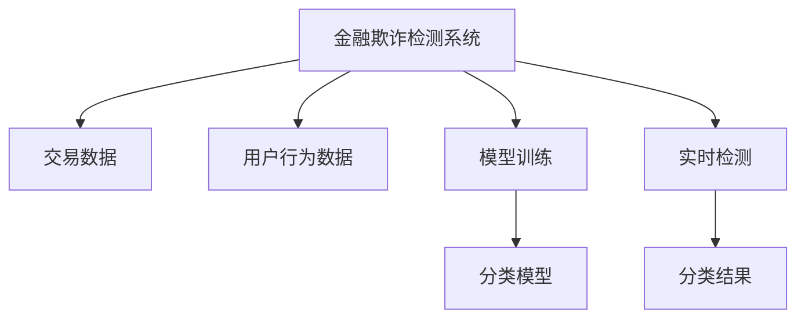
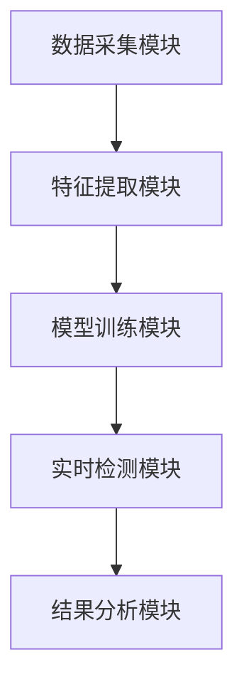
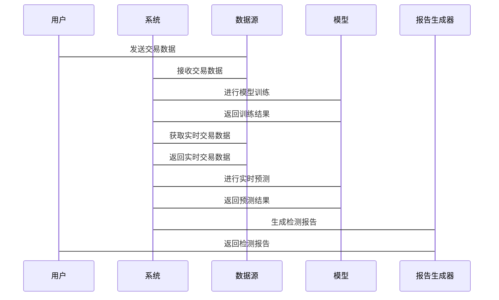

                 


# AI驱动的金融欺诈检测系统

## 关键词：
- AI驱动
- 金融欺诈
- 机器学习
- 深度学习
- 数据挖掘

## 摘要：
本文详细探讨了AI技术在金融欺诈检测中的应用，分析了传统方法的局限性，介绍了基于机器学习和深度学习的欺诈检测系统的核心概念、算法原理、系统架构和项目实现。通过实际案例分析，展示了AI驱动的金融欺诈检测系统在提升检测效率和准确性方面的优势，同时提出了系统设计和优化的最佳实践。

---

# 第一部分: AI驱动的金融欺诈检测系统背景与概述

## 第1章: 金融欺诈检测的背景与问题

### 1.1 金融欺诈的现状与挑战

#### 1.1.1 金融欺诈的定义与类型
金融欺诈是指通过欺骗、误导或其他非法手段，从金融机构或客户处获取不正当利益的行为。常见的金融欺诈类型包括：

- **信用卡欺诈**：未经授权的交易或盗用信用卡信息。
- **洗钱**：通过一系列复杂的交易掩盖资金来源。
- **虚假账户**：使用虚假身份开设账户进行欺诈活动。
- **内幕交易**：利用未公开信息进行证券交易谋利。

#### 1.1.2 传统金融欺诈检测的局限性
传统的欺诈检测方法主要依赖规则-based系统，例如基于阈值的交易监控、人工审核等。然而，这种方法存在以下问题：

- **规则复杂性**：需要手动制定和维护大量规则，难以覆盖所有可能的欺诈场景。
- **滞后性**：依赖历史数据和已知欺诈模式，无法及时发现新型欺诈行为。
- **效率低下**：人工审核耗时耗力，难以应对海量交易数据。

#### 1.1.3 AI技术在金融欺诈检测中的优势
AI技术，特别是机器学习和深度学习，能够通过分析大量数据自动识别模式和异常行为，具有以下优势：

- **实时性**：能够快速处理交易数据，实时检测欺诈行为。
- **自适应性**：能够根据新的数据自动调整模型，适应欺诈手段的变化。
- **高准确性**：通过训练模型，能够识别复杂和隐蔽的欺诈模式。

### 1.2 AI驱动的金融欺诈检测的核心概念

#### 1.2.1 问题背景与问题描述
金融欺诈检测的核心问题是如何从大量金融交易数据中识别出异常交易，这些异常交易可能是欺诈行为的前兆或直接证据。传统的基于规则的系统难以应对新型欺诈手段，而AI技术可以通过数据分析和模式识别，提供更高效的解决方案。

#### 1.2.2 问题解决的思路与方法
AI驱动的金融欺诈检测系统通常采用以下思路：

1. **数据收集**：收集交易数据、用户行为数据等。
2. **特征提取**：从数据中提取有用的特征，例如交易金额、时间、地点等。
3. **模型训练**：使用机器学习或深度学习算法训练分类模型。
4. **实时检测**：将实时交易数据输入模型，识别异常交易。

#### 1.2.3 核心概念的边界与外延
金融欺诈检测系统的边界包括：

- **输入数据**：交易数据、用户行为数据。
- **输出结果**：正常交易或异常交易的分类结果。
- **模型更新**：根据新数据不断优化模型。

系统的外延包括：

- **预防措施**：通过欺诈检测系统提前阻止欺诈行为。
- **用户反馈**：向用户发送欺诈提醒或警告。

#### 1.2.4 核心要素与概念结构
以下是金融欺诈检测系统的概念结构图：



---

## 第2章: AI技术在金融欺诈检测中的应用前景

### 2.1 人工智能与金融行业的深度融合

#### 2.1.1 人工智能技术的快速发展
近年来，人工智能技术取得了显著进展，特别是在自然语言处理、计算机视觉和机器学习领域。这些技术为金融行业的智能化转型提供了有力支持。

#### 2.1.2 金融行业数字化转型的需求
随着金融行业的数字化转型，金融机构需要更加高效和智能的系统来应对复杂的金融环境。AI技术能够帮助金融机构提高效率、降低成本，并增强客户体验。

#### 2.1.3 AI驱动的金融欺诈检测的潜力
AI技术在金融欺诈检测中的潜力巨大。通过深度学习和自然语言处理，可以实现对复杂欺诈模式的识别和预测。

### 2.2 金融欺诈检测系统的核心目标与价值

#### 2.2.1 系统目标与功能定位
金融欺诈检测系统的主要目标是识别和预防金融欺诈行为。其功能定位包括：

- **实时监控**：对交易数据进行实时监控，识别异常交易。
- **预测分析**：通过历史数据预测未来的欺诈行为。
- **用户行为分析**：分析用户行为，识别潜在的欺诈风险。

#### 2.2.2 系统价值与社会意义
金融欺诈检测系统的价值不仅在于保护金融机构的利益，还在于维护金融市场的稳定和用户的信任。通过减少欺诈行为，可以提升金融系统的整体安全性。

#### 2.2.3 系统在金融安全中的作用
金融欺诈检测系统在金融安全中起着至关重要的作用。它能够帮助金融机构及时发现和应对潜在的金融风险，保障金融市场的健康发展。

---

## 第3章: 金融欺诈检测系统的法律与伦理问题

### 3.1 数据隐私与合规性

#### 3.1.1 数据收集与使用的法律约束
在金融欺诈检测中，数据的收集和使用需要遵守相关法律法规，例如欧盟的《通用数据保护条例》（GDPR）。

#### 3.1.2 AI系统中的数据隐私保护
AI系统需要确保数据的隐私和安全，防止数据泄露和滥用。

#### 3.1.3 合规性要求与实践
金融机构需要遵守数据隐私和安全的合规性要求，确保AI系统的合法性和合规性。

### 3.2 伦理与公平性问题

#### 3.2.1 AI算法的公平性与透明性
AI算法的公平性是金融欺诈检测系统中的一个重要问题。需要确保算法不会对某些群体产生不公平的影响。

#### 3.2.2 欺诈检测中的偏见与歧视
在AI算法中，如果数据存在偏见，可能会导致算法对某些群体的歧视。

#### 3.2.3 如何平衡效率与伦理
在追求检测效率的同时，需要平衡算法的公平性和透明性，确保系统的伦理合规性。

---

## 第4章: 金融欺诈检测系统的研究现状

### 4.1 国内外研究进展

#### 4.1.1 国内研究现状
国内在AI驱动的金融欺诈检测方面取得了一定的进展，但整体水平与国际相比仍有差距。

#### 4.1.2 国际研究前沿
国际上，深度学习和强化学习在金融欺诈检测中的应用研究较为前沿。

#### 4.1.3 研究热点与趋势
当前的研究热点包括：

- **深度学习模型**：如卷积神经网络（CNN）、循环神经网络（RNN）等。
- **联邦学习**：通过多方数据协作提升模型性能。
- **解释性AI**：提高模型的可解释性，增强用户信任。

### 4.2 现有系统的主要问题与改进方向

#### 4.2.1 现有系统的局限性
现有的金融欺诈检测系统存在以下问题：

- **数据稀疏性**：欺诈交易数据通常较少，导致模型难以有效训练。
- **模型可解释性差**：深度学习模型的黑箱特性使得解释欺诈检测结果较为困难。
- **实时性不足**：部分系统在实时性方面存在不足，难以应对高频交易环境。

#### 4.2.2 改进方向
未来的改进方向包括：

- **多模态数据融合**：结合交易数据、用户行为数据和外部数据，提升检测精度。
- **模型解释性增强**：通过可解释性模型提高欺诈检测结果的可信度。
- **实时性优化**：通过优化算法和系统架构，提升系统的实时性。

---

# 第二部分: 核心概念与技术原理

## 第5章: 欺诈检测的核心概念与技术原理

### 5.1 机器学习与深度学习在欺诈检测中的应用

#### 5.1.1 机器学习的基础原理
机器学习是一种通过数据训练模型的技术，分为监督学习、无监督学习和半监督学习。

#### 5.1.2 深度学习的核心原理
深度学习是一种基于人工神经网络的机器学习技术，能够处理复杂的非线性关系。

#### 5.1.3 机器学习与深度学习的对比
以下是机器学习与深度学习的对比图：

```mermaid
table
"属性", "机器学习", "深度学习"
"数据需求", "需要大量特征工程", "需要大量数据"
"模型复杂度", "简单", "复杂"
"特征工程", "重要", "相对不重要"
```

### 5.2 特征工程与数据预处理

#### 5.2.1 特征工程的重要性
特征工程是机器学习中的关键步骤，能够显著影响模型的性能。

#### 5.2.2 数据预处理的步骤
数据预处理包括以下步骤：

1. **数据清洗**：处理缺失值、异常值和重复值。
2. **特征提取**：从原始数据中提取有用的特征。
3. **特征转换**：对特征进行标准化、归一化等处理。

#### 5.2.3 关键特征的识别
关键特征的识别可以通过特征重要性分析来实现。

### 5.3 模型训练与优化

#### 5.3.1 模型训练的流程
模型训练的流程包括：

1. **数据分割**：将数据划分为训练集和测试集。
2. **模型选择**：选择合适的机器学习算法。
3. **模型训练**：使用训练数据训练模型。
4. **模型评估**：使用测试数据评估模型性能。

#### 5.3.2 模型优化的策略
模型优化的策略包括：

- **超参数调优**：通过网格搜索或随机搜索优化模型参数。
- **特征选择**：通过特征选择方法减少冗余特征。
- **模型集成**：通过集成学习提升模型性能。

---

## 第6章: 深度学习模型在欺诈检测中的应用

### 6.1 深度学习模型的基本原理

#### 6.1.1 卷积神经网络（CNN）
卷积神经网络主要用于图像识别任务，但在金融欺诈检测中也可以用于处理时间序列数据。

#### 6.1.2 循环神经网络（RNN）
循环神经网络适合处理序列数据，如时间序列交易数据。

#### 6.1.3 图神经网络（GNN）
图神经网络适合处理图结构数据，如社交网络中的欺诈检测。

### 6.2 深度学习模型的优缺点

#### 6.2.1 优点
- **非线性建模能力强**：能够处理复杂的非线性关系。
- **自动特征提取**：能够自动从数据中提取特征，减少特征工程的工作量。

#### 6.2.2 缺点
- **计算资源需求高**：需要大量的计算资源进行训练。
- **模型解释性差**：深度学习模型通常是黑箱模型，难以解释结果。

---

# 第三部分: 算法原理

## 第7章: 传统机器学习算法在欺诈检测中的应用

### 7.1 逻辑回归

#### 7.1.1 逻辑回归的原理
逻辑回归是一种常用的分类算法，适用于二分类问题。

#### 7.1.2 逻辑回归的优缺点
- **优点**：简单易用，解释性强。
- **缺点**：对非线性关系建模能力有限。

#### 7.1.3 逻辑回归的数学公式
逻辑回归的损失函数为：
$$
L(\theta) = -\frac{1}{m} \sum_{i=1}^{m} [y_i \ln h(\theta;x_i) + (1-y_i)\ln(1-h(\theta;x_i))]
$$
其中，$h(\theta;x_i) = \frac{1}{1+\exp(-\theta^T x_i)}$。

### 7.2 随机森林

#### 7.2.1 随机森林的原理
随机森林是一种基于决策树的集成学习算法，通过随机采样和特征随机化提高模型的泛化能力。

#### 7.2.2 随机森林的优缺点
- **优点**：具有较强的抗过拟合能力，适合处理高维数据。
- **缺点**：计算资源需求较高。

#### 7.2.3 随机森林的Python实现
以下是随机森林的Python实现示例：

```python
from sklearn.ensemble import RandomForestClassifier
from sklearn.model_selection import train_test_split

# 数据准备
X_train, X_test, y_train, y_test = train_test_split(X, y, test_size=0.2)

# 模型训练
model = RandomForestClassifier(n_estimators=100)
model.fit(X_train, y_train)

# 模型预测
y_pred = model.predict(X_test)
```

### 7.3 线性判别分析（LDA）

#### 7.3.1 LDA的原理
LDA是一种用于分类的线性模型，通过寻找最优的线性组合将数据投影到低维空间。

#### 7.3.2 LDA的优缺点
- **优点**：适合小样本数据，计算效率高。
- **缺点**：对高维数据的处理能力有限。

---

## 第8章: 深度学习算法在欺诈检测中的应用

### 8.1 卷积神经网络（CNN）

#### 8.1.1 CNN的原理
CNN主要用于图像识别任务，但也可以用于处理时间序列数据。

#### 8.1.2 CNN的优缺点
- **优点**：适合处理局部特征，能够捕捉数据的时空信息。
- **缺点**：需要大量的计算资源。

#### 8.1.3 CNN的Python实现
以下是CNN的Python实现示例：

```python
import torch
import torch.nn as nn
import torch.optim as optim

# 定义模型
class SimpleCNN(nn.Module):
    def __init__(self):
        super(SimpleCNN, self).__init__()
        self.conv1 = nn.Conv2d(1, 6, 5)
        self.pool = nn.MaxPool2d(2, 2)
        self.fc = nn.Linear(6*5*5, 10)

    def forward(self, x):
        x = self.conv1(x)
        x = self.pool(x)
        x = x.view(-1, 6*5*5)
        x = self.fc(x)
        return x

# 模型训练
model = SimpleCNN()
criterion = nn.CrossEntropyLoss()
optimizer = optim.SGD(model.parameters(), lr=0.001)

for epoch in range(10):
    for inputs, labels in dataloaders['train']:
        outputs = model(inputs)
        loss = criterion(outputs, labels)
        loss.backward()
        optimizer.step()
```

### 8.2 循环神经网络（RNN）

#### 8.2.1 RNN的原理
RNN适用于处理序列数据，如时间序列交易数据。

#### 8.2.2 RNN的优缺点
- **优点**：适合处理序列数据，能够捕捉时间依赖性。
- **缺点**：存在梯度消失或爆炸问题。

#### 8.2.3 RNN的Python实现
以下是RNN的Python实现示例：

```python
import torch
import torch.nn as nn
import torch.optim as optim

# 定义模型
class SimpleRNN(nn.Module):
    def __init__(self, input_size, hidden_size, output_size):
        super(SimpleRNN, self).__init__()
        self.rnn = nn.RNN(input_size, hidden_size, batch_first=True)
        self.fc = nn.Linear(hidden_size, output_size)

    def forward(self, x):
        out, _ = self.rnn(x)
        out = self.fc(out[:, -1, :])
        return out

# 模型训练
model = SimpleRNN(input_size=1, hidden_size=4, output_size=2)
criterion = nn.MSELoss()
optimizer = optim.Adam(model.parameters(), lr=0.001)

for epoch in range(10):
    for inputs, labels in dataloaders['train']:
        outputs = model(inputs)
        loss = criterion(outputs, labels)
        loss.backward()
        optimizer.step()
```

### 8.3 图神经网络（GNN）

#### 8.3.1 GNN的原理
GNN适用于处理图结构数据，如社交网络中的欺诈检测。

#### 8.3.2 GNN的优缺点
- **优点**：适合处理图结构数据，能够捕捉节点之间的关系。
- **缺点**：计算复杂度较高。

#### 8.3.3 GNN的Python实现
以下是GNN的Python实现示例：

```python
import torch
import torch.nn as nn
import torch.nn.functional as F

# 定义模型
class SimpleGCN(nn.Module):
    def __init__(self, input_size, hidden_size, output_size):
        super(SimpleGCN, self).__init__()
        self.gc1 = nn.Linear(input_size, hidden_size)
        self.gc2 = nn.Linear(hidden_size, output_size)

    def forward(self, x, A):
        x = torch.mm(A, x)
        x = F.relu(x)
        x = torch.mm(x, A.T)
        x = self.gc2(x)
        return x

# 模型训练
model = SimpleGCN(input_size=2, hidden_size=4, output_size=2)
criterion = nn.MSELoss()
optimizer = optim.Adam(model.parameters(), lr=0.001)

for epoch in range(10):
    for inputs, labels, A in dataloaders['train']:
        outputs = model(inputs, A)
        loss = criterion(outputs, labels)
        loss.backward()
        optimizer.step()
```

---

# 第四部分: 系统分析与架构设计

## 第9章: 金融欺诈检测系统的系统分析

### 9.1 问题场景介绍

#### 9.1.1 问题背景
金融欺诈检测系统需要实时监控交易数据，识别异常交易。

#### 9.1.2 问题分析
系统需要处理海量交易数据，实时性要求高，同时需要保证检测的准确性。

#### 9.1.3 需求分析
- **功能需求**：实时检测、历史分析、用户行为分析。
- **性能需求**：高吞吐量、低延迟。
- **安全性需求**：数据安全、系统安全。

### 9.2 系统功能设计

#### 9.2.1 系统功能模块划分
系统功能模块包括：

1. **数据采集模块**：负责采集交易数据。
2. **特征提取模块**：负责从数据中提取特征。
3. **模型训练模块**：负责训练欺诈检测模型。
4. **实时检测模块**：负责实时检测交易数据。
5. **结果分析模块**：负责分析检测结果。

#### 9.2.2 功能模块的交互关系
以下是功能模块的交互关系图：



### 9.3 系统架构设计

#### 9.3.1 系统架构图
以下是系统的架构图：


#### 9.3.2 系统组件设计
系统组件设计包括：

1. **数据采集模块**：使用API接口采集交易数据。
2. **特征提取模块**：使用特征工程方法提取特征。
3. **模型训练模块**：使用机器学习或深度学习算法训练模型。
4. **实时检测模块**：将实时交易数据输入模型，识别异常交易。
5. **结果分析模块**：分析检测结果，生成报告。

---

## 第10章: 系统接口设计与交互流程

### 10.1 系统接口设计

#### 10.1.1 数据接口
数据接口包括：

- **输入接口**：接收交易数据。
- **输出接口**：输出检测结果。

#### 10.1.2 模型接口
模型接口包括：

- **训练接口**：接收训练数据，训练模型。
- **预测接口**：接收实时数据，进行预测。

### 10.2 系统交互流程

#### 10.2.1 交互流程图
以下是系统的交互流程图：



---

# 第五部分: 项目实战

## 第11章: 金融欺诈检测系统的项目实战

### 11.1 环境搭建与数据准备

#### 11.1.1 环境搭建
安装必要的Python库：

```bash
pip install numpy pandas scikit-learn torch matplotlib
```

#### 11.1.2 数据准备
使用公开的金融交易数据集，如Kaggle上的信用卡欺诈检测数据集。

### 11.2 系统核心实现

#### 11.2.1 特征工程实现
编写特征工程代码：

```python
import pandas as pd
import numpy as np

# 数据加载
data = pd.read_csv('creditcard.csv')

# 特征选择
selected_features = ['amount', 'time', 'v1', 'v2', ..., 'v28']
X = data[selected_features]
y = data['class']

# 数据分割
from sklearn.model_selection import train_test_split

X_train, X_test, y_train, y_test = train_test_split(X, y, test_size=0.2)
```

#### 11.2.2 模型训练与优化
编写模型训练代码：

```python
from sklearn.ensemble import RandomForestClassifier
from sklearn.metrics import accuracy_score

# 模型训练
model = RandomForestClassifier(n_estimators=100)
model.fit(X_train, y_train)

# 模型预测
y_pred = model.predict(X_test)

# 模型评估
print(accuracy_score(y_test, y_pred))
```

#### 11.2.3 实时检测实现
编写实时检测代码：

```python
import joblib

# 加载已训练模型
model = joblib.load('fraud_detection_model.pkl')

# 实时检测
def detect_fraud(transaction):
    prediction = model.predict([transaction])
    return prediction[0]
```

### 11.3 案例分析与结果解读

#### 11.3.1 案例分析
分析一个典型的欺诈交易案例：

```python
transaction = [250, 12:30, ...]
prediction = detect_fraud(transaction)
print(f"预测结果为：{prediction}")
```

#### 11.3.2 检测结果解读
解释模型的预测结果，分析可能的欺诈行为。

### 11.4 系统优化与改进

#### 11.4.1 模型优化
通过超参数调优提高模型性能。

#### 11.4.2 系统优化
优化系统架构，提高系统的实时性和准确性。

---

## 第12章: 最佳实践与系统小结

### 12.1 最佳实践

#### 12.1.1 数据预处理
确保数据质量，进行充分的特征工程。

#### 12.1.2 模型选择
选择合适的算法，进行充分的模型调优。

#### 12.1.3 系统优化
优化系统架构，确保系统的高效运行。

### 12.2 小结与展望

#### 12.2.1 小结
本文详细介绍了AI驱动的金融欺诈检测系统的核心概念、算法原理、系统架构和项目实现。

#### 12.2.2 展望
未来，随着AI技术的不断发展，金融欺诈检测系统将更加智能化和高效化。

---

# 第六部分: 最佳实践与展望

## 第13章: 最佳实践与注意事项

### 13.1 最佳实践

#### 13.1.1 数据安全
确保数据的安全性，防止数据泄露。

#### 13.1.2 模型解释性
提高模型的解释性，增强用户信任。

#### 13.1.3 系统实时性
优化系统的实时性，确保及时检测欺诈行为。

### 13.2 注意事项

#### 13.2.1 数据隐私
遵守数据隐私相关法律法规，保护用户隐私。

#### 13.2.2 系统维护
定期维护系统，确保系统的稳定性和安全性。

#### 13.2.3 模型更新
定期更新模型，适应新的欺诈手段。

---

## 第14章: 总结与未来展望

### 14.1 总结

本文系统地介绍了AI驱动的金融欺诈检测系统的背景、核心概念、技术原理、系统架构和项目实现。通过实际案例分析，展示了AI技术在金融欺诈检测中的巨大潜力。

### 14.2 未来展望

随着AI技术的不断发展，金融欺诈检测系统将更加智能化和高效化。未来的研究方向包括：

- **多模态数据融合**：通过结合多种数据源提高检测精度。
- **模型解释性增强**：提高模型的透明性和可信度。
- **实时性优化**：通过优化算法和系统架构，提升系统的实时性。

---

## 作者信息

作者：AI天才研究院/AI Genius Institute & 禅与计算机程序设计艺术 /Zen And The Art of Computer Programming

