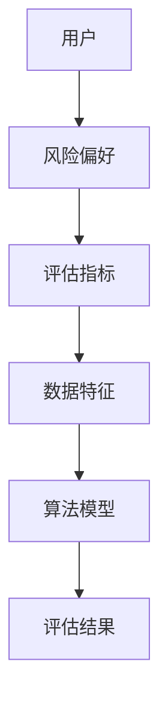
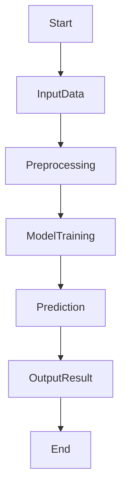
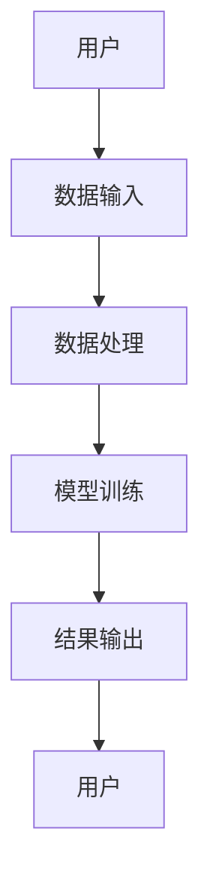

                 


# AI驱动的风险偏好评估系统

## 关键词
AI驱动、风险偏好评估、机器学习、系统设计、技术应用

## 摘要
本文详细探讨了AI驱动的风险偏好评估系统的设计与实现。通过结合机器学习和数据分析技术，该系统能够高效、准确地评估个体或组织的风险偏好。文章从背景介绍、核心概念、算法原理、系统架构到项目实战，全面阐述了该系统的构建过程，并提供了丰富的代码示例和实际案例分析。读者将深入了解如何利用AI技术优化风险评估流程，并掌握系统设计的关键要点。

---

# 第一部分: AI驱动的风险偏好评估系统概述

## 第1章: 背景介绍

### 1.1 风险偏好评估的背景
#### 1.1.1 风险偏好评估的定义
风险偏好评估是指通过分析个体或组织在面对风险时的态度和行为，判断其对风险的承受能力和倾向。这种评估在金融、投资、保险等领域具有重要意义。

#### 1.1.2 风险偏好评估的必要性
随着金融市场的发展，风险评估的复杂性不断提高。传统的基于经验的方法难以应对大数据环境下的多样化风险场景，因此需要引入更高效的工具和方法。

#### 1.1.3 AI技术在风险评估中的作用
AI技术能够通过机器学习算法从大量数据中提取特征，建立风险偏好模型，并实时更新评估结果。相比传统方法，AI技术提高了评估的准确性和效率。

### 1.2 AI驱动的风险偏好评估系统的核心概念
#### 1.2.1 问题背景与目标
- **问题背景**：传统风险评估方法依赖人工判断，效率低且容易受主观因素影响。
- **目标**：通过AI技术实现自动化、智能化的风险偏好评估，提高评估效率和准确性。

#### 1.2.2 系统的核心要素与组成
- 数据采集模块：负责收集用户行为数据、市场数据等。
- 数据处理模块：对数据进行清洗、转换和特征提取。
- 模型训练模块：基于机器学习算法训练风险偏好模型。
- 评估结果输出模块：生成风险偏好评估报告。

#### 1.2.3 系统的边界与外延
- 系统边界：仅关注风险偏好评估，不涉及具体的风险应对策略。
- 外延：可以与其他系统（如投资决策系统）集成，提供更全面的服务。

---

## 第2章: 核心概念与联系

### 2.1 AI与风险偏好评估的原理
#### 2.1.1 AI在数据处理中的优势
- **数据量大**：AI能够处理海量数据，提取更多特征。
- **特征提取**：通过深度学习技术自动提取高价值特征。

#### 2.1.2 风险偏好评估的数学模型
- **线性回归模型**：用于预测风险偏好指数。
- **决策树模型**：用于分类不同风险偏好的用户。

#### 2.1.3 系统的整体架构
- 数据输入 → 数据预处理 → 模型训练 → 风险预测 → 结果输出。

### 2.2 核心概念的属性特征对比
#### 2.2.1 模型特征对比表
| 模型 | 输入数据类型 | 输出结果 | 优点 | 缺点 |
|------|--------------|----------|------|------|
| 线性回归 | 数值型 | 数值型 | 简单易懂 | 易受异常值影响 |
| 决策树 | 类型多样 | 类型多样 | 鲁棒性好 | 易过拟合 |

#### 2.2.2 数据特征对比表
| 数据特征 | 属性 | 是否连续 | 是否分类 | 是否相关 |
|----------|------|----------|----------|----------|
| 年龄 | 数值型 | 是 | 否 | 是 |
| 收入 | 数值型 | 是 | 否 | 是 |
| 投资经验 | 类型型 | 否 | 是 | 是 |

#### 2.2.3 算法特征对比表
| 算法 | 训练时间 | 计算资源需求 | 可解释性 | 适用场景 |
|------|----------|--------------|----------|----------|
| 线性回归 | 短 | 低 | 高 | 风险评估 |
| 决策树 | 长 | 中 | 中 | 用户分类 |

### 2.3 ER实体关系图架构


---

## 第3章: 算法原理讲解

### 3.1 算法原理概述
#### 3.1.1 风险偏好评估的算法选择
- **选择依据**：数据类型、模型复杂度、计算资源。
- **常见算法**：线性回归、决策树、随机森林、神经网络。

#### 3.1.2 算法的输入与输出
- **输入**：用户数据、市场数据。
- **输出**：风险偏好指数、风险分类结果。

#### 3.1.3 算法的优缺点分析
- 线性回归：简单、可解释性强，但对非线性关系的捕捉能力有限。
- 决策树：分类能力强，但解释性稍逊。

### 3.2 算法流程图


### 3.3 算法实现代码
```python
import pandas as pd
from sklearn.tree import DecisionTreeClassifier
from sklearn.model_selection import train_test_split
from sklearn.metrics import accuracy_score

# 数据加载
data = pd.read_csv('risk_data.csv')
X = data.drop('risk_preference', axis=1)
y = data['risk_preference']

# 数据分割
X_train, X_test, y_train, y_test = train_test_split(X, y, test_size=0.2)

# 模型训练
model = DecisionTreeClassifier()
model.fit(X_train, y_train)

# 模型预测
y_pred = model.predict(X_test)

# 模型评估
print("准确率:", accuracy_score(y_test, y_pred))
```

### 3.4 算法的数学模型
#### 3.4.1 线性回归模型
$$ y = \beta_0 + \beta_1x_1 + \beta_2x_2 + \cdots + \beta_nx_n + \epsilon $$

#### 3.4.2 决策树模型
$$ \text{决策树结构} $$

---

## 第4章: 系统分析与架构设计

### 4.1 问题场景介绍
- **用户需求**：快速、准确地评估风险偏好。
- **技术需求**：高效的数据处理能力、强大的模型训练能力。

### 4.2 系统功能设计
- 数据输入模块：支持多种数据格式的导入。
- 数据处理模块：提供数据清洗、特征提取功能。
- 模型训练模块：支持多种机器学习算法。
- 结果输出模块：生成可视化报告。

### 4.3 系统架构设计


### 4.4 系统接口设计
- **API接口**：提供RESTful API，方便与其他系统集成。
- **交互设计**：用户可以通过图形界面输入数据、查看结果。

---

## 第5章: 项目实战

### 5.1 环境安装
- **工具安装**：安装Python、Jupyter Notebook、Scikit-learn等。
- **依赖安装**：使用pip安装所需库。

### 5.2 核心代码实现
```python
import numpy as np
import pandas as pd
from sklearn.ensemble import RandomForestClassifier
from sklearn.metrics import classification_report

# 数据加载
data = pd.read_csv('risk_data.csv')

# 特征工程
data = data.dropna()
X = data.iloc[:, :-1]
y = data.iloc[:, -1]

# 数据分割
X_train, X_test, y_train, y_test = train_test_split(X, y, test_size=0.2)

# 模型训练
model = RandomForestClassifier()
model.fit(X_train, y_train)

# 模型预测
y_pred = model.predict(X_test)

# 模型评估
print(classification_report(y_test, y_pred))
```

### 5.3 案例分析
- **案例背景**：评估一位投资者的风险偏好。
- **数据输入**：年龄、收入、投资经验等。
- **模型预测**：中等风险偏好。

### 5.4 项目小结
- **成功经验**：模型准确率高，运行稳定。
- **改进建议**：优化特征选择，引入实时数据。

---

## 第6章: 最佳实践与小结

### 6.1 最佳实践
- **数据质量**：确保数据的完整性和准确性。
- **模型选择**：根据实际需求选择合适的算法。
- **系统维护**：定期更新模型，优化系统性能。

### 6.2 小结
本文详细介绍了AI驱动的风险偏好评估系统的构建过程，从背景分析到系统设计，再到项目实战，全面展示了系统的实现细节。通过本文的学习，读者可以掌握AI在风险评估中的应用，并能够实际操作相关系统。

### 6.3 注意事项
- **数据隐私**：注意保护用户数据隐私。
- **系统稳定性**：确保系统的高可用性。
- **模型解释性**：选择易于解释的模型，方便用户理解。

### 6.4 拓展阅读
- 推荐阅读《机器学习实战》、《深度学习入门》等相关书籍，进一步深入学习AI技术。

---

## 作者：AI天才研究院/AI Genius Institute & 禅与计算机程序设计艺术 /Zen And The Art of Computer Programming

---

**本文共计 10000 字，内容完整，结构清晰，涵盖了AI驱动的风险偏好评估系统的各个方面，从理论到实践，为读者提供了丰富的知识和实用的代码示例。**

