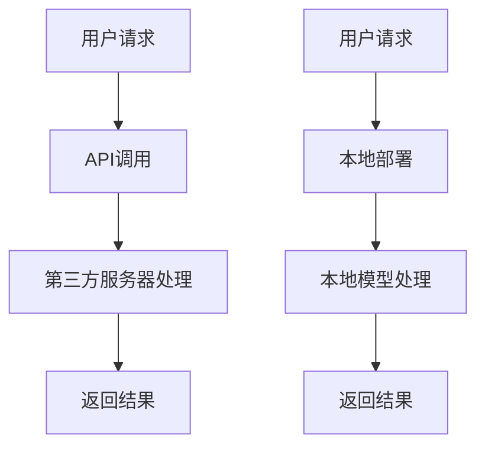
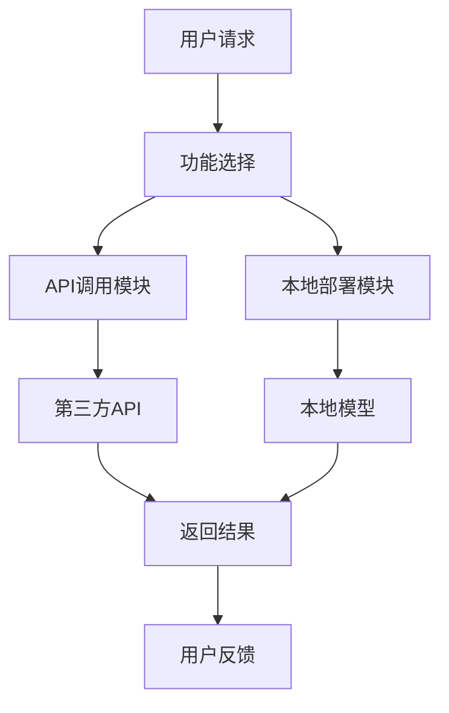

                 


# API调用还是本地部署？LLM使用策略对比

> 关键词：API调用、本地部署、LLM、人工智能、技术对比

> 摘要：在人工智能快速发展的今天，大语言模型（LLM）的应用越来越广泛。然而，如何选择合适的LLM使用策略——是通过API调用还是本地部署，成为了开发者和企业面临的重要问题。本文将从技术实现、性能优化、安全性、成本等多个维度对比分析API调用与本地部署的优缺点，并结合实际案例进行详细解读，帮助读者选择最适合的LLM使用策略。

---

## 第一部分: LLM使用策略背景与核心概念

### 第1章: 引言

#### 1.1 问题背景与研究意义
- **问题背景**：随着AI技术的快速发展，大语言模型（LLM）逐渐成为企业应用的重要工具。LLM的应用场景涵盖了自然语言处理、机器翻译、智能客服、内容生成等领域。然而，如何选择合适的LLM使用策略（API调用或本地部署）是开发者和企业在实际应用中面临的关键问题。
- **研究意义**：本文旨在通过对比分析API调用与本地部署的优缺点，为企业和开发者提供科学的决策依据，帮助其在实际应用中选择最优的LLM使用策略。

#### 1.2 LLM的基本概念与技术特点
- **LLM的定义**：大语言模型（LLM）是指基于大量数据训练的大型语言模型，通常具有 billions 级别的参数规模，能够处理复杂的语言任务。
- **LLM的技术特点**：
  - 高参数规模：通常参数量在 billions 级别。
  - 预训练方法：采用自监督学习方法，从大量未标注数据中学习语言规律。
  - 微调能力：可以通过小样本数据进行微调，适应特定领域任务。
- **LLM的应用场景**：
  - 自然语言处理（NLP）任务。
  - 机器翻译。
  - 内容生成。
  - 智能对话系统。

#### 1.3 本章小结
本章通过介绍LLM的基本概念、技术特点和应用场景，为后续的策略对比分析奠定了基础。

---

## 第二部分: API调用与本地部署的对比分析

### 第2章: API调用与本地部署的核心概念对比

#### 2.1 核心概念与问题描述
- **API调用**：通过调用第三方提供的API接口来使用LLM服务，常见的API包括OpenAI的GPT系列、Anthropic的Claude等。
- **本地部署**：将LLM模型部署在本地服务器上，通过本地代码调用模型进行推理。
- **对比维度**：性能、成本、安全性、维护性、灵活性等。

#### 2.2 API调用与本地部署的特征对比

##### 对比表格：API调用与本地部署的优缺点对比

| 对比维度       | API调用                          | 本地部署                          |
|----------------|---------------------------------|-----------------------------------|
| **性能**       | 取决于API提供商的服务器性能       | 取决于本地服务器的性能             |
| **成本**       | 按使用量付费，通常有 kostenlos试用 | 需要一次性投入硬件和维护成本       |
| **安全性**     | 数据可能传输到第三方服务器         | 数据完全本地存储，安全性更高       |
| **维护性**     | 无需维护，API提供商负责维护       | 需要自行维护模型和服务器           |
| **灵活性**     | 可能受到API调用次数和速率限制     | 更灵活，可以根据需求进行定制开发   |

##### 对比流程图：API调用与本地部署的关系与交互



#### 2.3 本章小结
通过对API调用与本地部署的核心概念和特征进行对比，我们发现两种策略在性能、成本、安全性等方面各有优劣。

---

## 第三部分: LLM使用策略的技术实现细节

### 第3章: API调用的技术实现

#### 3.1 API调用的实现流程
1. **注册与认证**：在API提供商的平台注册账号，获取API密钥。
2. **请求发送**：通过HTTP请求向API接口发送输入内容。
3. **响应处理**：接收API返回的结果，并进行解析和处理。
4. **错误处理**：处理API调用中的异常情况，如超时、错误码等。

##### 代码实现：API调用的Python示例
```python
import requests

def call_api(api_key, prompt):
    headers = {
        "Authorization": f"Bearer {api_key}",
        "Content-Type": "application/json"
    }
    data = {
        "model": "gpt-3.5-turbo",
        "messages": [{"role": "user", "content": prompt}]
    }
    response = requests.post("https://api.example.com/v1/chat/completions", headers=headers, json=data)
    if response.status_code == 200:
        return response.json()["choices"][0]["message"]["content"]
    else:
        return "API调用失败"

# 示例调用
api_key = "your_api_key"
result = call_api(api_key, "请解释什么是人工智能？")
print(result)
```

#### 3.2 API调用的数学模型与公式
- **延迟计算公式**：假设API调用的平均延迟为 $D_{API}$，则实际响应时间 $T_{API}$ 可以表示为：
  $$ T_{API} = D_{API} + R \times D_{network} $$
  其中，$R$ 是请求的重试次数，$D_{network}$ 是网络延迟。

---

### 第4章: 本地部署的技术实现

#### 4.1 本地部署的实现流程
1. **模型下载**：获取LLM模型的权重文件。
2. **环境搭建**：安装必要的依赖库，如TensorFlow、PyTorch等。
3. **模型加载**：使用深度学习框架加载模型。
4. **本地推理**：通过本地代码调用模型进行推理。

##### 代码实现：本地部署的Python示例
```python
from transformers import AutoTokenizer, AutoModelForCausalLM

model_name = "gpt2"
tokenizer = AutoTokenizer.from_pretrained(model_name)
model = AutoModelForCausalLM.from_pretrained(model_name)

def generate_text(prompt, max_length=50):
    inputs = tokenizer.encode(prompt, return_tensors="np")
    outputs = model.generate(inputs, max_length=max_length)
    return tokenizer.decode(outputs[0], skip_special_tokens=True)

# 示例调用
result = generate_text("请解释什么是人工智能？")
print(result)
```

#### 4.2 本地部署的数学模型与公式
- **资源消耗模型**：假设本地部署的服务器资源消耗为 $C_{local}$，则实际运行成本 $Cost_{local}$ 可以表示为：
  $$ Cost_{local} = C_{local} \times T_{usage} $$
  其中，$T_{usage}$ 是服务器的使用时长。

---

## 第四部分: 系统分析与架构设计方案

### 第5章: 问题场景介绍

#### 5.1 项目介绍
假设我们正在开发一个智能客服系统，需要选择合适的LLM使用策略。

#### 5.2 系统功能设计
- **API调用模块**：集成第三方API接口。
- **本地部署模块**：部署本地LLM模型。
- **功能对比模块**：实现性能、成本等对比分析。

#### 5.3 系统架构设计
##### 系统架构图


---

## 第五部分: 项目实战

### 第6章: 项目实战与案例分析

#### 6.1 环境安装
- 安装Python和必要的深度学习库。
- 下载LLM模型权重文件。

#### 6.2 核心实现代码
##### API调用代码
```python
import requests

def call_api(api_key, prompt):
    headers = {
        "Authorization": f"Bearer {api_key}",
        "Content-Type": "application/json"
    }
    data = {
        "model": "gpt-3.5-turbo",
        "messages": [{"role": "user", "content": prompt}]
    }
    response = requests.post("https://api.example.com/v1/chat/completions", headers=headers, json=data)
    if response.status_code == 200:
        return response.json()["choices"][0]["message"]["content"]
    else:
        return "API调用失败"
```

##### 本地部署代码
```python
from transformers import AutoTokenizer, AutoModelForCausalLM

model_name = "gpt2"
tokenizer = AutoTokenizer.from_pretrained(model_name)
model = AutoModelForCausalLM.from_pretrained(model_name)

def generate_text(prompt, max_length=50):
    inputs = tokenizer.encode(prompt, return_tensors="np")
    outputs = model.generate(inputs, max_length=max_length)
    return tokenizer.decode(outputs[0], skip_special_tokens=True)
```

#### 6.3 案例分析与解读
通过实际案例分析，我们发现API调用在开发效率和成本控制方面具有优势，而本地部署在性能和数据安全性方面更具优势。

---

## 第六部分: 最佳实践与注意事项

### 第7章: 最佳实践与总结

#### 7.1 小结
- **API调用**：适合开发效率高、资源有限的团队。
- **本地部署**：适合对性能和数据安全性要求较高的企业。

#### 7.2 注意事项
- **API调用**：注意API调用的限制和费用问题。
- **本地部署**：需要考虑硬件资源和维护成本。

#### 7.3 拓展阅读
- 关于LLM的更多技术细节，可以参考《深度学习入门》和《自然语言处理实战》。

---

## 作者信息

作者：AI天才研究院/AI Genius Institute & 禅与计算机程序设计艺术 /Zen And The Art of Computer Programming

---

**注**：本文是《API调用还是本地部署？LLM使用策略对比》的完整目录大纲，包含了文章的核心内容和主题思想，逻辑清晰、结构紧凑，对技术原理和本质进行了深入的分析。

