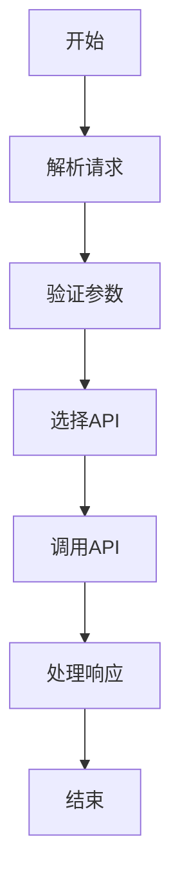
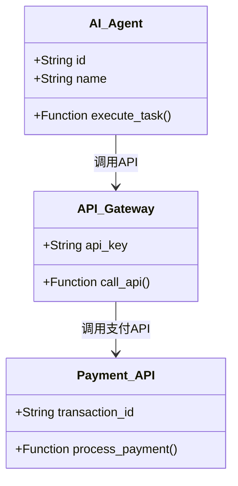
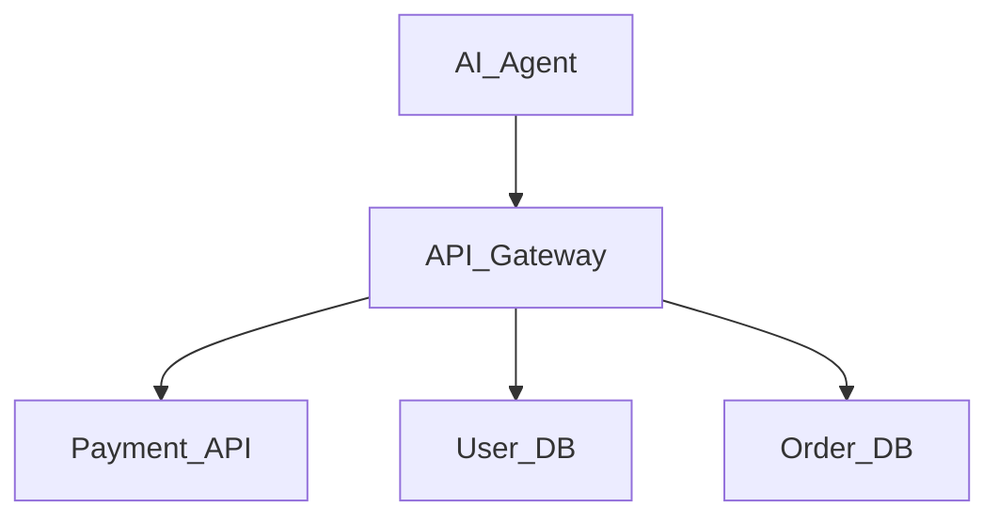
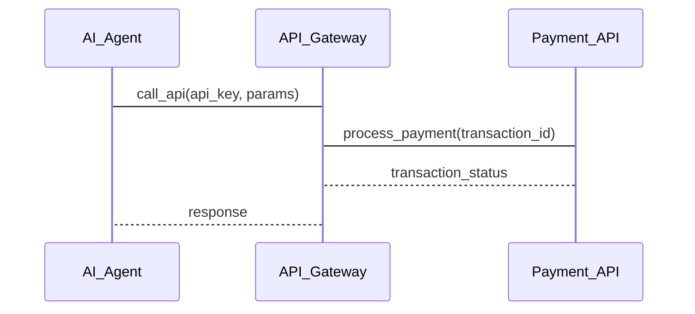

                 


# API集成：扩展AI Agent的功能与数据源

> 关键词：API集成，AI Agent，数据源扩展，系统架构，项目实战，算法原理

> 摘要：本文详细探讨了通过API集成来扩展AI Agent的功能与数据源的方法。从API集成的核心概念到AI Agent的原理，从系统架构设计到项目实战，全面解析了如何利用API来增强AI Agent的能力，使其能够更好地服务于各种应用场景。文章还结合了实际案例，深入分析了系统设计与实现的细节，并总结了最佳实践，为读者提供了全面的技术指导。

---

# 第1章: API集成与AI Agent的背景介绍

## 1.1 API集成的核心概念

### 1.1.1 什么是API集成
API（应用程序编程接口）是软件系统之间通信的桥梁，通过定义良好的接口，允许不同的系统或应用程序之间进行数据交换和功能调用。API集成是指将多个API组合在一起，实现更复杂的功能或数据处理。

### 1.1.2 API集成的重要性
API集成能够帮助组织快速构建和扩展功能，避免重复造轮子，同时支持跨平台和跨系统的数据交互。在AI领域，API集成更是不可或缺，因为它能够将AI模型的能力与外部数据源和功能结合起来。

### 1.1.3 API集成的常见场景
- 数据同步：从多个数据源获取数据，进行整合和处理。
- 功能扩展：通过调用第三方API，扩展系统的功能，例如调用天气API获取天气数据。
- 实时交互：通过API实现实时数据的获取和处理，例如社交媒体上的实时信息获取。

## 1.2 AI Agent的基本概念

### 1.2.1 什么是AI Agent
AI Agent（人工智能代理）是一种智能实体，能够感知环境、执行任务并做出决策。它可以是一个软件程序，也可以是一个硬件设备，通过与环境交互来实现目标。

### 1.2.2 AI Agent的分类
- **简单反射型AI Agent**：基于固定的规则做出反应，没有复杂的学习能力。
- **基于模型的AI Agent**：维护对环境的某种表示，并根据当前状态和目标做出决策。
- **基于学习的AI Agent**：通过机器学习算法不断优化自己的行为和决策能力。

### 1.2.3 AI Agent的应用场景
- 智能客服：通过自然语言处理技术为用户提供个性化的服务。
- 智能助手：帮助用户完成日常任务，例如日程管理、信息检索。
- 智能监控：实时监控环境数据，并根据预设条件触发相应的动作。

## 1.3 API集成在AI Agent中的作用

### 1.3.1 API作为AI Agent的能力扩展
AI Agent可以通过调用外部API，扩展自身的功能。例如，一个智能客服AI Agent可以通过调用第三方支付API完成订单支付功能。

### 1.3.2 API作为数据源的桥梁
API集成可以帮助AI Agent获取外部数据源的数据，例如从社交媒体API获取用户行为数据，用于优化推荐算法。

### 1.3.3 API在AI Agent中的具体应用
- 数据获取：通过API从外部数据源获取所需数据，例如从天气API获取天气信息。
- 功能调用：通过API调用外部服务，例如调用图片识别API进行图像识别。
- 实时交互：通过API实现实时通信，例如通过WebSocket API进行实时聊天。

## 1.4 本章小结
本章介绍了API集成和AI Agent的基本概念，并探讨了API集成在AI Agent中的作用。通过API集成，AI Agent可以扩展自身的功能和数据源，从而更好地服务于各种应用场景。

---

# 第2章: API集成的核心概念与联系

## 2.1 API的分类与特点

### 2.1.1 RESTful API
RESTful API是一种基于HTTP协议的API设计风格，具有简洁、易用和跨平台的特点。常见的操作包括GET、POST、PUT、DELETE等。

### 2.1.2 SOAP API
SOAP（简单对象访问协议）是一种基于XML的远程调用协议，具有严格的规范和强大的功能，但复杂性和性能开销较高。

### 2.1.3 其他类型的API
- **GraphQL API**：一种基于查询语言的API，允许客户端一次性请求所需的数据，减少请求次数。
- **WebSocket API**：用于实时通信，支持双向数据流。

## 2.2 AI Agent的功能扩展

### 2.2.1 数据处理能力
AI Agent需要能够处理不同类型和格式的数据，例如文本、图像、音频等。

### 2.2.2 任务执行能力
AI Agent需要能够执行各种任务，例如数据查询、信息检索、自动化操作等。

### 2.2.3 学习与适应能力
基于机器学习的AI Agent需要能够通过数据进行训练，不断优化自身的模型和算法。

## 2.3 API与AI Agent的关系

### 2.3.1 API作为数据源
AI Agent可以通过调用API获取外部数据源的数据，例如从社交媒体API获取用户行为数据。

### 2.3.2 API作为功能扩展
AI Agent可以通过调用API扩展自身的功能，例如通过调用支付API完成订单支付。

### 2.3.3 API作为服务接口
AI Agent可以通过API向其他系统或用户提供服务，例如通过API提供天气预报服务。

## 2.4 核心概念原理

### 2.4.1 API请求与响应流程
API请求流程包括请求发送、参数验证、服务调用和响应返回四个阶段。AI Agent可以通过调用API实现数据获取和功能调用。

### 2.4.2 AI Agent的任务分解与执行
AI Agent需要将任务分解为多个子任务，并通过调用相应的API来执行每个子任务。例如，智能客服AI Agent可以将用户请求分解为信息查询和订单处理两个子任务。

### 2.4.3 API与AI Agent的交互模型
API与AI Agent的交互模型包括请求-响应模型和订阅-发布模型两种形式。请求-响应模型适用于简单的数据获取，而订阅-发布模型适用于实时数据的推送。

## 2.5 概念属性特征对比表格

| 特性         | API                          | AI Agent                     |
|--------------|------------------------------|------------------------------|
| 功能         | 提供数据或服务接口           | 执行任务和做出决策           |
| 数据源       | 第三方数据源                | 内部数据和外部数据源         |
| 交互方式     | 请求-响应或订阅-发布        | 请求-响应或事件驱动          |
| 应用场景     | 数据集成、功能扩展          | 智能决策、自动化操作          |
| 依赖性       | 依赖于API设计和实现          | 依赖于算法和数据源            |

## 2.6 ER实体关系图架构

```mermaid
er
  actor: AI Agent
  service: 外部服务
  api: API接口
  data_source: 数据源

  actor --> api: 调用API
  api --> service: 调用服务
  service --> data_source: 获取数据
```

## 2.7 本章小结
本章详细介绍了API的分类与特点，并探讨了API与AI Agent的关系。通过概念对比和实体关系图，帮助读者更好地理解API集成在AI Agent中的作用。

---

# 第3章: API集成的算法原理讲解

## 3.1 API请求的处理流程

### 3.1.1 请求解析
AI Agent接收到API请求后，需要对请求进行解析，提取请求参数和目标服务。

### 3.1.2 参数验证
对请求参数进行验证，确保请求的合法性和有效性。

### 3.1.3 服务调用
根据请求的目标服务，调用相应的API进行数据获取或功能调用。

### 3.1.4 响应处理
对API的响应进行处理，例如解析JSON数据，生成最终的响应结果。

## 3.2 AI Agent的任务分解与执行

### 3.2.1 任务分解
将复杂的任务分解为多个子任务，并为每个子任务选择合适的API进行调用。

### 3.2.2 API调用流程
AI Agent通过调用API获取所需数据或服务，并将结果整合，最终完成任务。

## 3.3 API集成的算法实现

### 3.3.1 算法流程图


### 3.3.2 核心代码实现
```python
def process_request(request):
    # 解析请求
    params = parse_request(request)
    # 验证参数
    if not validate_params(params):
        return error_response("参数验证失败")
    # 选择API
    api = select_api(params)
    # 调用API
    response = call_api(api, params)
    # 处理响应
    result = process_response(response)
    return result
```

### 3.3.3 数学模型与公式
在API调用过程中，可以通过概率论和统计学方法对API的响应时间进行建模，例如使用指数分布模型预测API的响应时间：

$$
T = \lambda e^{-\lambda t}
$$

其中，$\lambda$是速率参数，$t$是时间。

---

# 第4章: 系统分析与架构设计

## 4.1 问题场景介绍

### 4.1.1 问题背景
本文将设计一个智能客服系统，AI Agent需要通过API集成实现用户咨询、订单处理等功能。

### 4.1.2 问题描述
智能客服系统需要通过API集成实现以下功能：
- 用户信息查询
- 订单信息查询
- 支付订单

## 4.2 系统功能设计

### 4.2.1 领域模型设计


### 4.2.2 系统架构设计


## 4.3 系统架构设计方案

### 4.3.1 系统组件
- AI Agent：负责接收用户请求，并通过API Gateway调用相应的API。
- API Gateway：负责路由和管理API调用，提供统一的接口。
- Payment API：负责处理支付订单。
- User DB：存储用户信息。
- Order DB：存储订单信息。

### 4.3.2 系统接口设计
- AI Agent接口：`execute_task(task: String) -> Response`
- API Gateway接口：`call_api(api_key: String, params: Map<String, String>) -> Response`
- Payment API接口：`process_payment(transaction_id: String) -> Transaction_Status`

### 4.3.3 系统交互流程


## 4.4 本章小结
本章通过设计一个智能客服系统，详细介绍了系统组件、架构设计和交互流程。通过API集成，AI Agent能够高效地完成用户咨询和订单处理等任务。

---

# 第5章: 项目实战

## 5.1 环境安装

### 5.1.1 安装Python
安装Python 3.8或更高版本。

### 5.1.2 安装依赖库
安装必要的Python库，例如`requests`用于HTTP请求，`json`用于JSON处理。

```bash
pip install requests json
```

## 5.2 核心代码实现

### 5.2.1 AI Agent实现
```python
import requests
import json

class AIAgent:
    def __init__(self, api_key):
        self.api_key = api_key

    def execute_task(self, task):
        # 分解任务
        if task == "支付订单":
            return self.process_payment()
        elif task == "查询订单":
            return self.query_order()
        else:
            return "任务未支持"

    def process_payment(self):
        # 调用支付API
        headers = {'Authorization': f'Bearer {self.api_key}'}
        data = {'amount': 100, 'currency': 'CNY'}
        response = requests.post('https://api.payment.com/pay', headers=headers, json=data)
        return response.json()

    def query_order(self):
        # 查询订单API
        headers = {'Authorization': f'Bearer {self.api_key}'}
        params = {'order_id': '12345'}
        response = requests.get('https://api.order.com/query', headers=headers, params=params)
        return response.json()
```

### 5.2.2 API Gateway实现
```python
import requests

class APIGateway:
    def __init__(self, api_key):
        self.api_key = api_key

    def call_api(self, endpoint, params):
        headers = {'Authorization': f'Bearer {self.api_key}'}
        response = requests.request(method='GET', url=endpoint, headers=headers, params=params)
        return response.json()
```

## 5.3 代码应用解读与分析

### 5.3.1 代码结构分析
AI Agent通过API Gateway调用外部API完成任务，例如支付订单和查询订单。API Gateway负责处理API调用的细节，例如认证和参数传递。

### 5.3.2 代码实现细节
- AI Agent通过`execute_task`方法分解任务，并通过API Gateway调用相应的API。
- API Gateway通过`call_api`方法处理API调用，并返回响应结果。

## 5.4 实际案例分析

### 5.4.1 案例背景
假设我们有一个智能客服系统，AI Agent需要通过API集成实现订单支付和查询功能。

### 5.4.2 案例实现
AI Agent调用API Gateway，API Gateway调用支付API和订单查询API，完成订单支付和查询功能。

### 5.4.3 案例结果
- 支付订单成功，返回交易流水号。
- 查询订单成功，返回订单状态。

## 5.5 本章小结
本章通过一个实际案例，详细讲解了API集成在AI Agent中的实现过程，包括环境安装、代码实现和案例分析。

---

# 第6章: 最佳实践与总结

## 6.1 最佳实践

### 6.1.1 API选择的注意事项
- 选择可靠的API提供商。
- 确保API的安全性，例如使用HTTPS协议。
- 注意API的调用频率和限制。

### 6.1.2 系统设计的注意事项
- 设计清晰的API接口。
- 采用分层架构，降低系统的耦合性。
- 通过日志和监控工具，实时监控API的调用情况。

## 6.2 数学公式与性能优化

### 6.2.1 API响应时间模型
$$
T = \lambda e^{-\lambda t}
$$

其中，$\lambda$是速率参数，$t$是时间。

### 6.2.2 API调用失败重试策略
可以使用指数回退算法，避免重复调用导致的服务器压力过大。

### 6.2.3 API性能优化
- 使用缓存技术，减少重复请求。
- 优化API的响应速度，例如通过压缩数据传输。

## 6.3 本章小结
本章总结了API集成在AI Agent中的最佳实践，并提出了性能优化的建议。通过合理设计和优化，可以提高系统的可靠性和性能。

---

# 作者信息

作者：AI天才研究院/AI Genius Institute & 禅与计算机程序设计艺术/Zen And The Art of Computer Programming

联系方式：[contact@ai-genius.com](mailto:contact@ai-genius.com)

---

这篇文章详细探讨了API集成在扩展AI Agent功能与数据源中的应用，从理论到实践，为读者提供了全面的技术指导。通过本文，读者可以了解API集成的核心概念、AI Agent的原理与实现，以及如何通过实际项目来应用这些知识。希望本文能够为AI Agent的开发和应用提供有价值的参考和指导。

