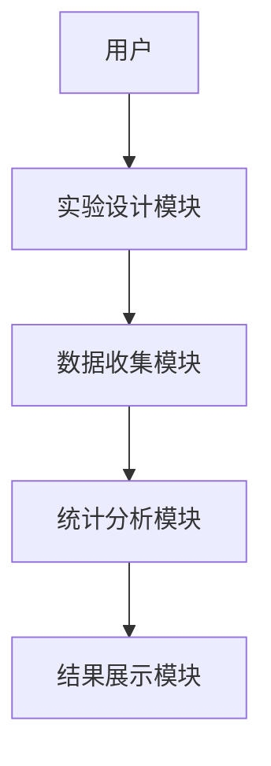

                 


# A/B测试：优化AI Agent的用户体验

> 关键词：A/B测试，用户体验优化，AI Agent，统计显著性，实验设计

> 摘要：本文详细探讨了A/B测试在优化AI Agent用户体验中的应用。通过介绍A/B测试的基本原理、算法模型、系统架构设计以及实际项目案例，本文旨在帮助读者理解如何通过科学的实验方法来提升AI Agent的用户体验。文章从理论到实践，全面分析了A/B测试在AI Agent优化中的关键作用，并提供了丰富的技术细节和实现方案。

---

## 第一部分: A/B测试与AI Agent概述

### 第1章: A/B测试的基本概念与应用

#### 1.1 A/B测试的定义与背景

A/B测试是一种通过对比两个或多个版本（A和B）来评估不同设计方案对用户行为或偏好影响的实验方法。其核心目标是通过统计学手段，找出最优的设计方案，从而提升用户体验和业务目标的达成率。

- **问题背景**：在AI Agent的设计中，用户体验的优化至关重要。由于AI Agent的交互方式复杂，用户行为受到多种因素影响，传统的凭经验优化方法已难以满足需求。
- **问题描述**：AI Agent的设计需要在多个版本之间进行选择，例如不同的交互流程、界面布局或功能模块。如何科学地评估这些设计方案的效果，成为一个关键问题。
- **问题解决**：A/B测试通过随机分配用户到不同的实验组，收集数据并进行统计分析，从而找到最优的设计方案。
- **边界与外延**：A/B测试的核心在于“实验”，其外延包括但不限于用户行为分析、数据驱动的决策和多变量测试。

#### 1.2 AI Agent与用户体验优化

AI Agent是一种能够理解用户需求并提供智能服务的系统。用户体验优化是其设计的核心目标之一。通过A/B测试，可以在不同的用户群体中测试多种设计方案，找到最适合用户习惯的交互方式。

- **用户行为分析**：通过A/B测试，可以观察用户在不同设计方案下的行为变化，例如点击率、完成率等。
- **用户心理模型**：AI Agent的设计需要符合用户的心理预期，A/B测试可以帮助验证不同设计方案是否匹配用户的心理模型。
- **用户界面设计**：通过A/B测试，可以优化AI Agent的界面布局、按钮设计等，提升用户操作的便捷性。

---

### 第2章: A/B测试的核心原理与方法

#### 2.1 A/B测试的基本原理

A/B测试的核心是通过实验设计和统计分析来评估不同设计方案的效果。其基本原理包括以下几个方面：

- **统计学基础**：A/B测试依赖于概率论和假设检验的基本原理，通过计算统计显著性来判断实验结果是否具有实际意义。
- **实验设计**：实验设计需要考虑样本量、对照组与实验组的分配方式、实验的时长等因素。
- **置信区间与假设检验**：通过置信区间评估实验结果的不确定性，通过假设检验判断实验结果是否具有统计显著性。

#### 2.2 A/B测试的实施步骤

实施A/B测试需要遵循以下步骤：

1. **确定目标与假设**：明确实验的目标，例如提高用户点击率，并提出具体的实验假设。
2. **设计实验方案**：确定实验组和对照组的设计方案，例如不同的按钮颜色或页面布局。
3. **数据收集与分析**：通过随机分配用户到不同的组别，收集数据并进行统计分析。
4. **结果解读与决策**：根据统计结果判断实验方案是否有效，并做出相应的优化决策。

---

### 第3章: A/B测试与用户体验优化的结合

#### 3.1 用户体验优化的核心要素

用户体验优化需要关注以下几个核心要素：

- **用户行为分析**：通过A/B测试，可以观察用户在不同设计方案下的行为变化，例如点击率、转化率等。
- **用户心理模型**：通过实验结果，可以验证不同设计方案是否符合用户的心理预期。
- **用户界面设计**：通过A/B测试，可以优化AI Agent的界面布局、按钮设计等，提升用户操作的便捷性。

#### 3.2 A/B测试在用户体验优化中的应用

- **界面优化实验**：通过A/B测试，可以优化AI Agent的界面布局、颜色搭配等，提升用户体验。
- **功能优化实验**：通过A/B测试，可以验证不同功能模块的设计是否符合用户习惯。
- **交互流程优化实验**：通过A/B测试，可以优化AI Agent的交互流程，例如对话的引导方式、反馈的呈现方式等。

---

### 第4章: A/B测试的数学模型与统计方法

#### 4.1 基础统计学概念

- **均值与方差**：均值反映数据的集中趋势，方差反映数据的离散程度。
- **假设检验的基本原理**：通过假设检验，可以判断实验结果是否具有统计显著性。

#### 4.2 A/B测试的统计模型

- **T检验与Z检验**：T检验适用于样本量较小的情况，Z检验适用于样本量较大的情况。
- **单样本与双样本检验**：单样本检验用于比较实验组与对照组的均值差异，双样本检验用于比较两组数据的独立性。

#### 4.3 实验设计的数学模型

- **实验组与对照组的分配**：随机分配用户到实验组和对照组，确保实验结果的可靠性。
- **样本量计算公式**：样本量的计算需要考虑置信水平、置信区间和预期的效应大小。

---

### 第5章: A/B测试的系统架构与实现

#### 5.1 系统架构设计

- **系统功能模块划分**：系统需要包括实验设计模块、数据收集模块、统计分析模块和结果展示模块。
- **领域模型类图**：通过类图展示系统中各模块之间的关系和交互方式。

#### 5.2 系统架构图

通过Mermaid图展示系统架构设计：



#### 5.3 系统接口设计

- **用户请求接口**：用户通过API向系统发送请求，系统随机分配用户到实验组或对照组。
- **系统响应接口**：系统根据用户分配的组别返回相应的界面或功能模块。

---

### 第6章: A/B测试的项目实战

#### 6.1 环境安装

- **Python安装**：安装Python 3.8或更高版本。
- **库的安装**：安装必要的库，例如`numpy`、`pandas`、`scipy`等。

#### 6.2 核心代码实现

以下是一个简单的A/B测试实现示例：

```python
import numpy as np
from scipy.stats import ttest_ind

# 生成实验数据
group_a = np.random.normal(0, 1, 100)
group_b = np.random.normal(0.5, 1, 100)

# 进行T检验
t_stat, p_val = ttest_ind(group_a, group_b)

print(f"T统计量：{t_stat}\nP值：{p_val}")
```

#### 6.3 实际案例分析

通过实际案例分析，展示如何通过A/B测试优化AI Agent的用户体验。例如，优化对话框的按钮颜色，从蓝色到绿色，提升用户的点击率。

#### 6.4 项目小结

通过A/B测试，可以系统地优化AI Agent的用户体验，同时积累宝贵的实验数据，为未来的优化提供依据。

---

## 第七章: 最佳实践与小结

### 7.1 最佳实践

- **选择样本量**：确保样本量足够大，以提高实验结果的可靠性。
- **实验设计**：在设计实验时，需要考虑可能的干扰因素，例如用户的地理位置、时间等。
- **结果分析**：在分析实验结果时，需要结合业务目标和用户体验目标，综合考虑多个因素。

### 7.2 小结

A/B测试是优化AI Agent用户体验的重要工具。通过科学的实验设计和统计分析，可以找到最优的设计方案，提升用户体验和业务目标的达成率。

---

## 作者

作者：AI天才研究院/AI Genius Institute & 禅与计算机程序设计艺术 /Zen And The Art of Computer Programming

