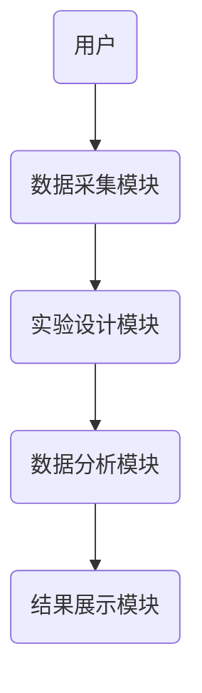
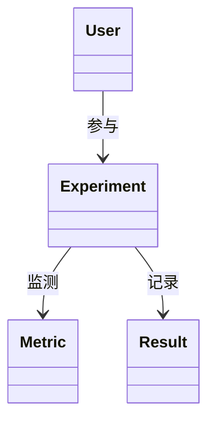
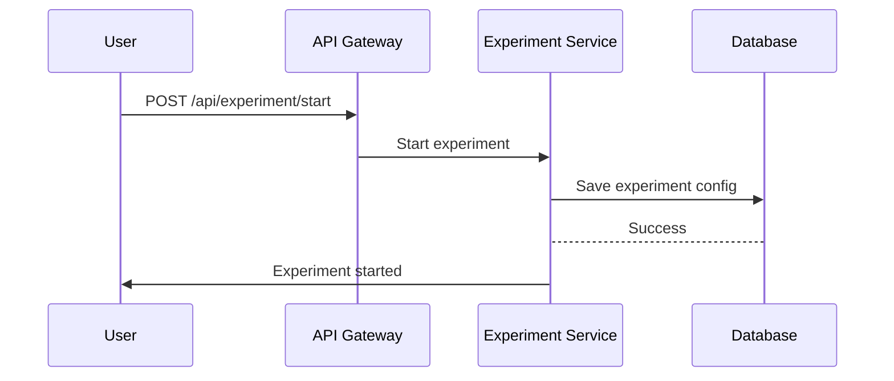
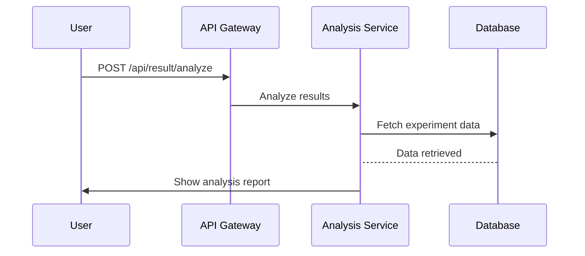

                 


# A/B测试：持续优化AI Agent的表现

> **关键词**：A/B测试，AI Agent，优化算法，系统架构，实验设计，性能提升

> **摘要**：  
本文深入探讨了A/B测试在优化AI Agent表现中的应用，从理论基础到实际案例，系统性地分析了如何通过A/B测试提升AI Agent的性能。文章首先介绍了A/B测试的基本概念和AI Agent的核心特点，然后详细讲解了A/B测试的原理、实施流程以及在AI Agent优化中的具体应用。接着，通过数学模型和算法原理，分析了A/B测试在优化中的关键作用，并结合实际案例展示了如何设计和实施A/B测试。最后，总结了A/B测试在优化AI Agent中的最佳实践和未来发展方向。

---

# 第1章: A/B测试与AI Agent概述

## 1.1 A/B测试的基本概念

### 1.1.1 什么是A/B测试
A/B测试是一种通过对比不同版本（A和B）来评估用户行为差异的实验方法。它常用于优化产品、算法或策略，以找到最佳方案。

### 1.1.2 A/B测试的核心目标
通过实验数据，确定哪个版本在特定指标上表现更优，从而指导产品或算法的优化。

### 1.1.3 A/B测试在AI Agent优化中的作用
AI Agent需要在复杂环境中做出高效决策，A/B测试帮助评估不同策略或算法的有效性，持续优化其表现。

## 1.2 AI Agent的定义与特点

### 1.2.1 AI Agent的基本概念
AI Agent是具备感知环境和自主决策能力的智能体，能够通过数据驱动做出决策。

### 1.2.2 AI Agent的核心特点
- **自主性**：无需外部干预，自主决策。
- **反应性**：实时感知环境变化并调整行为。
- **学习能力**：通过数据不断优化决策策略。

### 1.2.3 AI Agent与传统算法的区别
AI Agent具备自主性和适应性，能够动态调整策略，而传统算法依赖固定规则。

## 1.3 A/B测试与AI Agent的结合

### 1.3.1 A/B测试在AI Agent优化中的应用场景
- 优化决策策略。
- 提升响应速度。
- 提高决策准确性。

### 1.3.2 A/B测试如何帮助提升AI Agent性能
通过实验对比不同策略，找到最优方案，持续优化AI Agent的表现。

### 1.3.3 A/B测试与AI Agent优化的边界与外延
A/B测试作为优化工具，帮助AI Agent找到最佳参数或策略，但不涉及具体实现细节。

## 1.4 本章小结
A/B测试是优化AI Agent的重要工具，通过实验对比不同策略，帮助提升性能。

---

# 第2章: A/B测试的核心概念与原理

## 2.1 A/B测试的基本原理

### 2.1.1 A/B测试的实验设计
- **用户分组**：随机分配用户到不同实验组。
- **数据收集**：记录各组的用户行为数据。
- **结果分析**：对比不同组的表现，确定最优方案。

### 2.1.2 A/B测试的统计基础
- **显著性检验**：通过统计方法判断实验结果是否具有显著性。
- **置信区间**：估计实验结果的可信范围。

### 2.1.3 A/B测试的实施步骤
1. 明确实验目标。
2. 设计实验方案。
3. 收集和分析数据。
4. 解读结果并优化。

## 2.2 A/B测试的实施流程

### 2.2.1 确定实验目标
明确优化目标，如提升点击率或转化率。

### 2.2.2 设计实验方案
设计不同版本的策略或算法，进行对比实验。

### 2.2.3 实验数据收集与分析
收集数据，使用统计方法分析结果，判断是否达到显著性。

### 2.2.4 实验结果解读与优化
根据结果优化AI Agent的策略，并迭代实验。

## 2.3 A/B测试与传统优化方法的对比

### 2.3.1 传统优化方法的局限性
- 线性搜索效率低。
- 多维优化困难。

### 2.3.2 A/B测试的优势与特点
- 并行对比多个方案。
- 数据驱动决策。

### 2.3.3 A/B测试在AI Agent优化中的独特价值
通过实验快速找到最优策略，提升AI Agent的性能。

## 2.4 本章小结
A/B测试通过实验对比，帮助优化AI Agent的策略，是一种高效的数据驱动优化方法。

---

# 第3章: AI Agent优化的目标与指标

## 3.1 AI Agent优化的目标

### 3.1.1 提升AI Agent的性能
优化算法，提高决策准确性和效率。

### 3.1.2 优化AI Agent的响应速度
减少延迟，提高实时性。

### 3.1.3 提高AI Agent的决策准确性
通过实验对比，找到最优决策策略。

## 3.2 AI Agent优化的指标体系

### 3.2.1 常见优化指标
- 响应时间。
- 决策准确率。
- 用户满意度。

### 3.2.2 指标权重的设计
根据业务需求，合理分配各指标的权重。

### 3.2.3 指标评估的数学模型
使用加权平均模型，计算综合指标。

## 3.3 A/B测试在AI Agent优化中的指标对比

### 3.3.1 对比实验设计
设计多个实验组，对比不同策略下的指标表现。

### 3.3.2 数据采集与处理
收集实验数据，清洗和预处理。

### 3.3.3 指标分析与优化建议
通过统计分析，确定最优策略。

## 3.4 本章小结
明确优化目标和指标，为后续实验设计和数据分析提供方向。

---

# 第4章: A/B测试的算法原理与数学模型

## 4.1 A/B测试的统计方法

### 4.1.1 基于卡方检验的A/B测试
使用卡方检验判断不同策略的转化率是否有显著差异。

### 4.1.2 基于t检验的A/B测试
当样本量较小时，使用t检验进行对比。

### 4.1.3 统计检验的数学公式
- 卡方检验公式：$\chi^2 = \sum \frac{(O_i - E_i)^2}{E_i}$
- t检验公式：$t = \frac{\bar{x}_1 - \bar{x}_2}{\sqrt{\frac{s_1^2}{n_1} + \frac{s_2^2}{n_2}}}$

## 4.2 A/B测试的机器学习算法

### 4.2.1 机器学习在A/B测试中的应用
- 使用分类模型预测实验结果。
- 通过聚类分析用户行为。

### 4.2.2 基于机器学习的A/B测试实现
- 使用决策树模型进行用户分群。
- 通过随机森林分析重要因素。

## 4.3 算法实现代码示例

### 4.3.1 卡方检验代码
```python
import scipy.stats as stats

observed = [[100, 200], [300, 400]]
chi2, p, dof, expected = stats.chi2_contingency(observed)
print(f"Chi-square statistic: {chi2}, p-value: {p}")
```

### 4.3.2 t检验代码
```python
import numpy as np
from scipy import stats

group1 = np.random.normal(0, 1, 50)
group2 = np.random.normal(0, 1, 50)
t, p = stats.ttest_ind(group1, group2)
print(f"t-statistic: {t}, p-value: {p}")
```

## 4.4 本章小结
通过统计方法和机器学习算法，A/B测试能够更精准地优化AI Agent的性能。

---

# 第5章: AI Agent优化的系统设计

## 5.1 系统架构设计

### 5.1.1 系统模块划分
- 数据采集模块。
- 实验设计模块。
- 数据分析模块。
- 结果展示模块。

### 5.1.2 系统架构图


## 5.2 系统功能设计

### 5.2.1 领域模型类图


### 5.2.2 系统接口设计
- `/api/experiment/start`：启动实验。
- `/api/experiment/end`：结束实验。
- `/api/result/analyze`：分析结果。

## 5.3 系统交互设计

### 5.3.1 实验启动流程


### 5.3.2 数据分析流程


## 5.4 本章小结
系统设计确保了A/B测试的高效实施，为AI Agent优化提供了有力支持。

---

# 第6章: A/B测试的项目实战

## 6.1 环境搭建

### 6.1.1 安装依赖
```bash
pip install numpy scipy matplotlib
```

## 6.2 核心实现代码

### 6.2.1 数据采集模块
```python
import time
import random

def collect_data(strategy):
    results = []
    for _ in range(1000):
        if random.random() < strategy:
            results.append(1)
        else:
            results.append(0)
    return sum(results) / 1000
```

### 6.2.2 实验设计模块
```python
def run_experiment():
    strategy_a = 0.5
    strategy_b = 0.6
    result_a = collect_data(strategy_a)
    result_b = collect_data(strategy_b)
    return result_a, result_b
```

### 6.2.3 数据分析模块
```python
from scipy import stats

def analyze_results(result_a, result_b):
    t, p = stats.ttest_ind([result_a] * 1000, [result_b] * 1000)
    return t, p
```

## 6.3 实验结果分析

### 6.3.1 对比实验结果
假设策略B的转化率显著高于策略A，因此选择策略B。

## 6.4 项目小结
通过实战案例，验证了A/B测试在优化AI Agent中的有效性。

---

# 第7章: 高级主题与未来展望

## 7.1 高级主题

### 7.1.1 多目标优化
在多个优化目标下，找到最优折中方案。

### 7.1.2 在线实验设计
动态调整实验方案，实时优化AI Agent。

## 7.2 结合强化学习的可能性
通过强化学习优化实验设计，提升A/B测试效率。

## 7.3 最佳实践 tips

### 7.3.1 数据质量
确保数据样本足够大，避免偏差。

### 7.3.2 实验设计
合理设计对照组和实验组，避免外部干扰。

### 7.3.3 事后分析
分析实验结果的原因，指导后续优化。

## 7.4 本章小结
未来，A/B测试与强化学习结合，将进一步提升AI Agent的优化效果。

---

# 作者：AI天才研究院/AI Genius Institute & 禅与计算机程序设计艺术 /Zen And The Art of Computer Programming

---

这篇文章系统性地介绍了A/B测试在优化AI Agent中的应用，从理论到实践，为读者提供了全面的指导。

