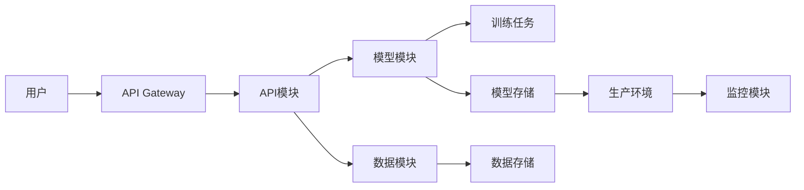
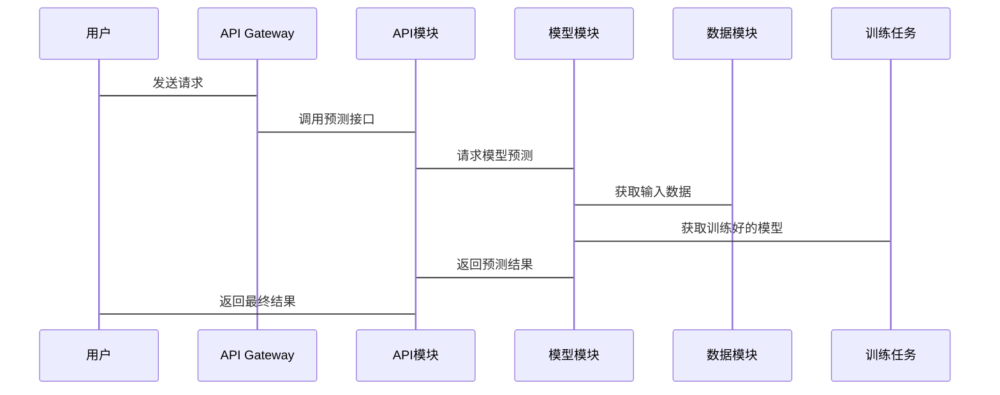

                 


# CI/CD流程：实现AI Agent的持续集成与部署

## 关键词：CI/CD，AI Agent，持续集成，持续部署，DevOps，自动化构建

## 摘要：本文详细探讨了如何在AI Agent的开发和部署过程中应用CI/CD（持续集成与持续部署）流程。通过分析AI Agent的开发流程、CI/CD的核心原理、系统架构设计以及实际项目案例，本文展示了如何利用CI/CD提高AI Agent的开发效率和部署稳定性。文章内容涵盖从基础概念到实战应用的各个方面，帮助读者全面理解并掌握这一技术。

---

## 第一章：CI/CD与AI Agent概述

### 1.1 CI/CD的基本概念

#### 1.1.1 CI与CD的定义与区别

- **CI（持续集成）**：将开发人员的工作分支频繁地合并到主分支，并自动进行构建和测试，确保代码质量。
- **CD（持续部署）**：在CI的基础上，自动将通过测试的代码部署到生产环境，减少人工干预。
- **区别**：CI关注代码的集成和测试，CD关注代码的部署和发布。

#### 1.1.2 CI/CD的核心理念

- **快速反馈**：通过自动化测试快速发现代码问题。
- **持续交付**：确保代码随时可发布到生产环境。
- **减少风险**：通过小步快跑的方式降低每次发布的风险。

### 1.2 AI Agent的基本概念

#### 1.2.1 AI Agent的定义

- AI Agent是一种能够感知环境、自主决策并执行任务的智能体，通常用于自动驾驶、智能助手等领域。

#### 1.2.2 AI Agent的分类

- **基于规则的Agent**：根据预定义的规则执行任务。
- **基于模型的Agent**：使用机器学习模型进行决策和推理。
- **基于强化学习的Agent**：通过与环境交互，学习最优策略。

#### 1.2.3 AI Agent与传统软件开发的差异

| 特性         | 传统软件开发                | AI Agent开发                |
|--------------|-----------------------------|-----------------------------|
| 开发流程     | 线性开发，注重功能实现        | 迭代优化，注重模型训练        |
| 模块化       | 强调代码模块化和复用          | 强调模型模块化和可扩展性      |
| 测试         | 功能测试为主                | 功能测试 + 模型验证          |

### 1.3 CI/CD在AI Agent中的应用

- **自动化模型训练**：将AI模型的训练过程集成到CI/CD pipeline中，确保每次代码提交都能触发训练任务。
- **自动化部署**：将训练好的模型部署到生产环境，支持动态扩展和弹性计算。
- **回滚机制**：当模型在生产环境中出现问题时，能够快速回滚到之前的稳定版本。

---

## 第二章：AI Agent开发流程中的CI/CD应用

### 2.1 AI Agent开发流程概述

#### 2.1.1 数据准备

- 数据收集：从各种来源获取训练数据。
- 数据清洗：处理噪声数据，确保数据质量。
- 数据标注：对数据进行标注，为模型提供训练标签。

#### 2.1.2 模型训练

- 选择模型架构：如神经网络、决策树等。
- 确定训练目标：如分类、回归等。
- 调参优化：通过超参数调优提高模型性能。

#### 2.1.3 API开发

- 设计API接口：如RESTful API。
- 实现API逻辑：将模型封装成可调用的服务。
- 编写测试用例：确保API的功能正确。

### 2.2 CI/CD在AI Agent开发中的应用

#### 2.2.1 自动化构建与测试

- **构建过程**：将代码编译成可执行的程序或容器镜像。
- **单元测试**：自动化运行测试用例，确保代码功能正常。
- **集成测试**：测试各个模块之间的协作，确保系统整体功能正常。

#### 2.2.2 模型训练的自动化

- **训练任务触发**：每当代码提交时，自动启动模型训练任务。
- **训练结果保存**：将训练好的模型保存为可部署的形式，如TensorFlow模型文件。
- **模型评估**：自动评估模型的性能指标，如准确率、召回率等。

#### 2.2.3 模型部署与监控

- **部署流程**：将模型部署到云平台，如AWS、Azure或Google Cloud。
- **动态扩展**：根据请求量自动扩展计算资源。
- **实时监控**：监控模型的运行状态和性能指标，及时发现和解决问题。

---

## 第三章：系统架构设计

### 3.1 系统功能设计

#### 3.1.1 系统模块划分

- **数据模块**：负责数据的收集、清洗和存储。
- **模型模块**：负责模型的训练、优化和部署。
- **API模块**：提供AI Agent的接口，供外部调用。
- **监控模块**：监控系统的运行状态和性能指标。

#### 3.1.2 功能需求

- 数据模块：支持多种数据源的接入和处理。
- 模型模块：支持多种模型算法的训练和部署。
- API模块：提供高性能、可扩展的API服务。
- 监控模块：实时监控系统状态，提供告警功能。

### 3.2 系统架构设计

#### 3.2.1 架构图



#### 3.2.2 接口设计

- **API接口**：定义RESTful API，如`POST /predict`。
- **数据接口**：定义数据导入和导出的接口。
- **监控接口**：定义系统状态查询和告警接口。

#### 3.2.3 交互流程



---

## 第四章：CI/CD Pipeline的实现

### 4.1 环境搭建

#### 4.1.1 工具选择

- **版本控制工具**：使用Git进行代码管理。
- **CI/CD工具**：使用Jenkins或GitHub Actions进行自动化构建和部署。
- **容器化工具**：使用Docker进行容器化部署。
- **云平台**：选择AWS、Azure或Google Cloud作为部署平台。

#### 4.1.2 环境配置

- 安装必要的工具：如Git、Jenkins、Docker、Python等。
- 配置开发环境：如虚拟环境、依赖管理等。

### 4.2 Pipeline配置

#### 4.2.1 Jenkins Pipeline配置

```groovy
pipeline {
    agent any
    stages {
        stage('构建') {
            steps {
                git 'https://github.com/your-repo.git'
                sh 'mvn clean install'
            }
        }
        stage('测试') {
            steps {
                sh 'mvn test'
            }
        }
        stage('部署') {
            steps {
                sh 'mvn deploy'
            }
        }
    }
}
```

#### 4.2.2 GitHub Actions配置

```yaml
name: CI/CD

on:
  push:
    branches: [ main ]

jobs:
  build:
    runs-on: ubuntu-latest
    steps:
      - uses: actions/checkout@v2
      - name: Build
        run: mvn clean install
      - name: Test
        run: mvn test
      - name: Deploy
        run: mvn deploy
```

### 4.3 代码实现

#### 4.3.1 核心代码

- **模型训练代码**：如使用TensorFlow框架训练神经网络模型。
- **API实现代码**：如使用Flask框架实现RESTful API。
- **部署脚本**：如Dockerfile和Compose文件。

#### 4.3.2 代码示例

```python
# 模型训练代码
import tensorflow as tf
from tensorflow.keras import layers

model = tf.keras.Sequential([
    layers.Dense(64, activation='relu'),
    layers.Dense(10, activation='softmax')
])
model.compile(optimizer='adam', loss='sparse_categorical_crossentropy', metrics=['accuracy'])
model.fit(x_train, y_train, epochs=10, batch_size=32)
```

---

## 第五章：项目实战

### 5.1 案例分析

#### 5.1.1 项目背景

- 开发一个基于强化学习的AI Agent，用于游戏自动决策。

#### 5.1.2 实战步骤

1. **数据准备**：收集游戏数据并进行预处理。
2. **模型训练**：使用强化学习算法训练AI Agent。
3. **API开发**：将训练好的模型封装成API服务。
4. **CI/CD配置**：将整个流程自动化，实现持续集成与部署。

### 5.2 代码实现与分析

#### 5.2.1 模型训练代码

```python
import numpy as np
import tensorflow as tf

# 定义强化学习算法
class DQN:
    def __init__(self, state_space, action_space):
        self.state_space = state_space
        self.action_space = action_space
        self.model = self.build_model()

    def build_model(self):
        model = tf.keras.Sequential([
            layers.Dense(24, activation='relu', input_dim=self.state_space),
            layers.Dense(24, activation='relu'),
            layers.Dense(self.action_space, activation='linear')
        ])
        return model
```

#### 5.2.2 API实现代码

```python
from flask import Flask, request, jsonify

app = Flask(__name__)

@app.route('/predict', methods=['POST'])
def predict():
    data = request.json
    state = data['state']
    # 调用强化学习模型进行预测
    action = dqn.model.predict(np.array([state]))
    return jsonify({'action': action})
```

### 5.3 案例总结

- **优势**：通过CI/CD实现了自动化训练和部署，提高了开发效率。
- **挑战**：模型训练时间长，对计算资源要求高。
- **解决方案**：使用云计算平台，提供弹性计算资源。

---

## 第六章：总结与展望

### 6.1 总结

- 本文详细探讨了如何在AI Agent的开发和部署中应用CI/CD流程。
- 通过系统架构设计、CI/CD Pipeline配置和实际案例分析，展示了如何实现AI Agent的持续集成与部署。

### 6.2 最佳实践

- **工具选择**：根据项目需求选择合适的CI/CD工具和云平台。
- **模型优化**：通过超参数调优和模型压缩技术优化AI模型性能。
- **监控与维护**：建立完善的监控体系，及时发现和解决问题。

### 6.3 未来展望

- **自动化模型优化**：结合自动机器学习（AutoML）技术，实现模型的自动优化和部署。
- **边缘计算**：将AI Agent部署到边缘设备，实现低延迟和高实时性的目标。
- **多模态AI**：结合视觉、听觉等多种数据源，实现更加智能的AI Agent。

---

## 作者：AI天才研究院/AI Genius Institute & 禅与计算机程序设计艺术 /Zen And The Art of Computer Programming

