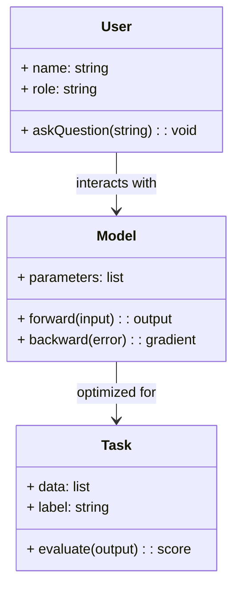
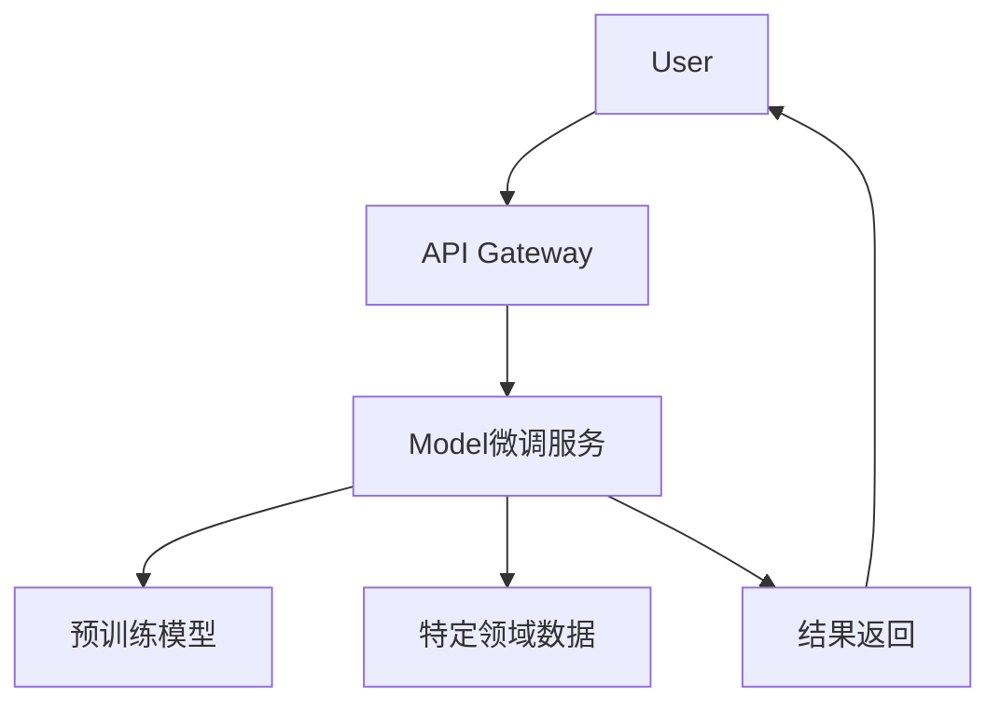

                 


# LLM 微调技巧：针对特定领域优化

> 关键词：大语言模型、微调、领域模型、参数高效微调、模型优化、深度学习、迁移学习  
> 摘要：本文系统地探讨了大语言模型（LLM）的微调技巧，特别是针对特定领域的优化方法。从理论基础到实践应用，详细介绍了微调技术的核心概念、算法原理、数学模型以及系统架构设计，旨在为企业级应用提供指导和参考。

---

## 第一章: LLM 微调技巧概述

### 1.1 问题背景与定义

**大语言模型（LLM）的发展**  
近年来，大语言模型（如GPT系列、BERT等）在自然语言处理领域取得了突破性进展。这些模型通过海量数据的预训练，具备了强大的通用语言理解能力。然而，这些通用模型在特定领域（如医疗、法律、金融）的应用中，往往难以满足领域内的专业需求。

**微调技术的提出**  
微调技术作为一种迁移学习策略，允许在通用模型的基础上，通过在特定领域数据上的进一步训练，提升模型在该领域的性能。这种方法不仅保留了通用模型的强大学习能力，还针对特定任务进行了优化。

**微调技术的定义**  
微调技术是指在预训练好的大语言模型的基础上，使用特定领域或任务的数据进行小规模的再训练过程。通过调整模型参数，使其更好地适应特定场景的需求。

---

### 1.2 微调技术的核心特点

1. **领域适应性**  
   微调技术通过引入特定领域的数据，使模型能够理解并处理该领域的专业术语和语义关系。

2. **参数调整**  
   微调过程中，模型的所有参数（或部分参数）都会被重新优化，以适应新的任务需求。

3. **高效性**  
   相较于从头训练，微调技术利用了预训练模型的特征表示能力，显著降低了训练时间和计算成本。

4. **灵活性**  
   微调技术适用于多种任务类型，包括文本分类、问答系统、机器翻译等。

---

## 第二章: 微调技术的核心概念与联系

### 2.1 微调技术的核心概念

1. **迁移学习**  
   微调技术是迁移学习的一种应用，通过将预训练模型的知识迁移到特定领域任务中。

2. **领域适应**  
   通过特定领域数据的微调，模型能够更好地理解和处理该领域的语义信息。

3. **参数高效微调**  
   在仅调整部分参数的情况下，提升模型在特定领域的性能，降低计算资源消耗。

---

### 2.2 微调技术的核心概念与联系

以下是一个对比表格和ER实体关系图，帮助理解微调技术的关键属性：

#### 对比表格
| 属性           | 微调技术      | 预训练技术      |
|----------------|--------------|----------------|
| 数据来源       | 特定领域数据  | 海量通用数据    |
| 训练目标       | 领域特定任务  | 通用语言任务    |
| 计算成本       | 较低          | 较高            |
| 适用场景       | 领域优化      | 通用任务        |

#### ER实体关系图
```mermaid
er
actor: User
model: LLM
role: 微调
```

---

## 第三章: 微调技术的算法原理

### 3.1 微调技术的算法流程

1. **预训练模型加载**  
   加载一个预训练好的大语言模型，如GPT或BERT。

2. **领域数据准备**  
   收集并整理特定领域的训练数据，包括文本、标签等。

3. **微调过程**  
   在特定领域数据上进行小规模训练，调整模型参数以优化任务目标。

4. **模型评估**  
   使用验证集评估微调后的模型性能，进行必要的超参数调整。

5. **部署与应用**  
   将优化后的模型部署到实际应用场景中。

---

### 3.2 微调技术的数学模型

以下是一个简化的微调过程的数学模型：

#### 损失函数
$$ L = -\sum_{i=1}^{n} y_i \log(p_i) $$

其中，$y_i$ 是真实标签，$p_i$ 是模型预测的概率。

#### 梯度下降
$$ \theta_{new} = \theta_{old} - \eta \cdot \frac{\partial L}{\partial \theta} $$

其中，$\theta$ 是模型参数，$\eta$ 是学习率，$\frac{\partial L}{\partial \theta}$ 是损失函数对参数的梯度。

---

## 第四章: 微调技术的系统分析与架构设计

### 4.1 项目背景与目标

假设我们正在开发一个医疗领域的问答系统，目标是通过微调技术提升模型在医疗领域的回答准确性。

---

### 4.2 系统功能设计

#### 领域模型


---

### 4.3 系统架构设计



---

## 第五章: 项目实战

### 5.1 环境安装与配置

```bash
pip install transformers torch
```

---

### 5.2 核心代码实现

```python
from transformers import AutoModelForQuestionAnswering, AutoTokenizer
import torch

# 加载预训练模型
model = AutoModelForQuestionAnswering.from_pretrained('bert-large-uncased')
tokenizer = AutoTokenizer.from_pretrained('bert-large-uncased')

# 定义微调函数
def fine_tune(model, tokenizer, train_dataset, val_dataset, num_epochs=3):
    optimizer = torch.optim.AdamW(model.parameters(), lr=2e-5)
    for epoch in range(num_epochs):
        model.train()
        for batch in train_loader:
            optimizer.zero_grad()
            inputs = tokenizer(batch['question'], batch['context'], return_tensors='pt')
            outputs = model(**inputs)
            loss = outputs.loss
            loss.backward()
            optimizer.step()
    return model

# 使用微调后的模型进行推理
def evaluate(model, tokenizer, test_dataset):
    model.eval()
    correct = 0
    total = 0
    for batch in test_loader:
        inputs = tokenizer(batch['question'], batch['context'], return_tensors='pt')
        outputs = model(**inputs)
        predicted = outputs.logits.argmax(dim=-1)
        correct += (predicted == batch['answer']).sum().item()
        total += len(batch['answer'])
    accuracy = correct / total
    return accuracy

# 主函数
def main():
    train_dataset = load_train_dataset()
    val_dataset = load_val_dataset()
    test_dataset = load_test_dataset()
    model = fine_tune(model, tokenizer, train_dataset, val_dataset)
    accuracy = evaluate(model, tokenizer, test_dataset)
    print(f"模型准确率：{accuracy}")

if __name__ == "__main__":
    main()
```

---

### 5.3 代码解读与分析

1. **模型加载**  
   使用`transformers`库加载预训练的BERT模型和分词器。

2. **微调函数**  
   在特定领域数据上进行小规模训练，优化模型参数。

3. **评估函数**  
   使用验证集评估模型性能，并计算准确率。

4. **主函数**  
   整合训练和评估过程，输出最终的准确率。

---

## 第六章: 总结与展望

### 6.1 最佳实践 Tips

1. **数据质量**  
   确保特定领域数据的多样性和代表性。

2. **超参数调整**  
   根据任务需求，合理调整学习率和训练轮数。

3. **资源管理**  
   优化计算资源的使用，降低训练成本。

---

### 6.2 本章小结

本文详细介绍了大语言模型微调技术的核心概念、算法原理、系统设计与项目实战。通过理论与实践相结合的方式，为读者提供了从理解到应用的完整指导。

---

## 作者信息

**作者：AI天才研究院/AI Genius Institute & 禅与计算机程序设计艺术 /Zen And The Art of Computer Programming**

---

希望这篇文章能够为读者提供关于LLM微调技巧的系统性认识，并在实际应用中有所帮助！

