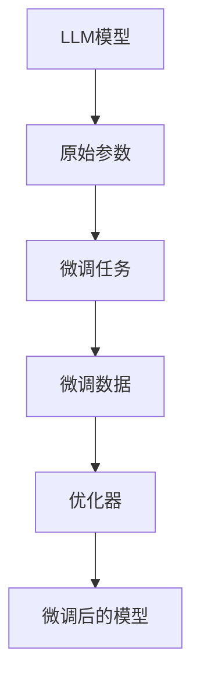
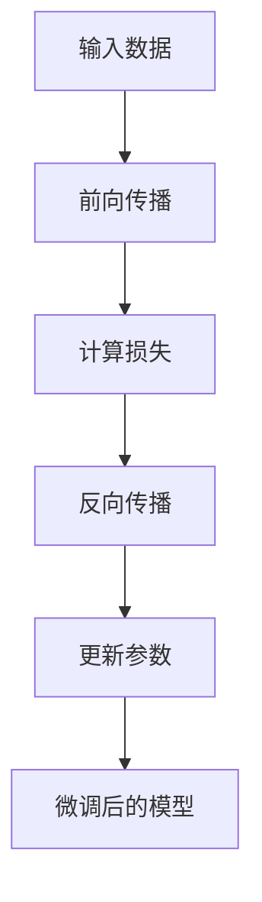
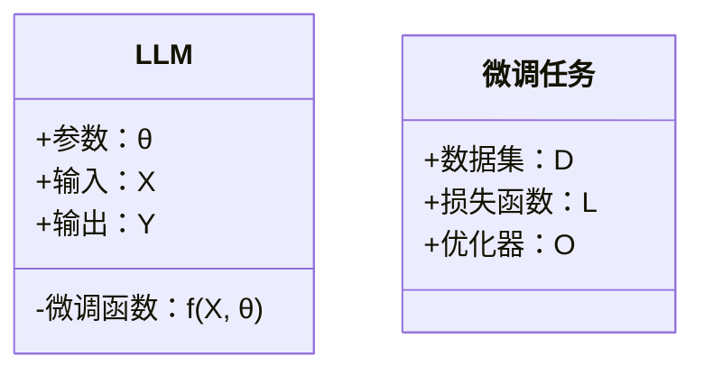
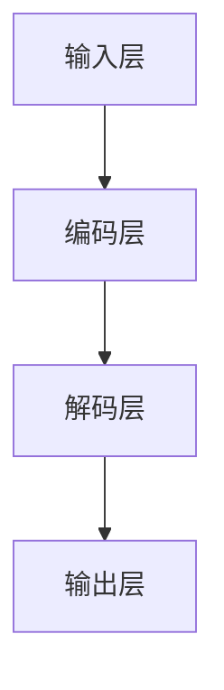

                 


# LLM Fine-tuning技术：定制化AI Agent的关键

> 关键词：LLM微调，定制化AI，参数优化，损失函数，AI代理

> 摘要：本文深入探讨了LLM微调技术在定制化AI代理中的关键作用。通过详细分析背景、核心概念、算法原理、系统架构设计和项目实战，本文为读者提供了全面的技术指导和实践方案，帮助他们在实际应用中高效地优化和定制LLM模型，以满足特定需求。

---

## 第1章: 问题背景与核心概念

### 1.1 问题背景

#### 1.1.1 从通用模型到定制化需求的演进
在AI技术迅速发展的今天，通用大型语言模型（LLM）如GPT-3、PaLM等，虽然功能强大，但难以直接满足特定场景的需求。企业或开发者需要根据具体业务场景对模型进行调整和优化，即微调（Fine-tuning）。

#### 1.1.2 LLM在AI代理中的重要性
LLM作为AI代理的核心，负责理解和生成自然语言。然而，通用模型在特定领域或任务中可能表现不佳，需要通过微调来提升性能。

#### 1.1.3 微调技术的必要性
微调技术通过调整模型参数，使其在特定任务或数据集上表现更优，是定制化AI代理的关键技术。

### 1.2 问题描述

#### 1.2.1 LLM微调的目标与挑战
目标：提升模型在特定任务上的性能；挑战：计算资源消耗大，参数调整复杂。

#### 1.2.2 定制化AI代理的需求分析
企业需要AI代理具备领域特定的知识和能力，而通用模型难以满足这些需求。

#### 1.2.3 微调技术的边界与外延
微调技术不仅适用于语言模型，还可扩展到其他任务如图像识别。

### 1.3 核心概念与联系

#### 1.3.1 LLM微调的原理
通过调整模型参数，使其适应特定任务或数据集。

#### 1.3.2 微调与从头训练的对比分析
| 对比维度 | 微调 | 从头训练 |
|----------|------|----------|
| 计算成本 | 低   | 高       |
| 数据需求 | 少   | 多       |
| 适用场景 | 特定任务优化 | 新任务从零开始 |

#### 1.3.3 微调技术的实体关系图


---

## 第2章: LLM微调的核心原理

### 2.1 微调技术的原理

#### 2.1.1 参数调整机制
通过反向传播和优化器调整参数，使模型输出更接近预期结果。

#### 2.1.2 模型架构优化
根据任务需求调整模型结构，如增加特定层或模块。

#### 2.1.3 损失函数设计
定义合适的损失函数，衡量模型输出与真实值的差距。

### 2.2 微调技术的数学模型

#### 2.2.1 损失函数的数学表达
$$L = \sum_{i=1}^{n} \text{loss}(y_i, \hat{y}_i)$$

#### 2.2.2 优化器的数学模型
$$\theta_{t+1} = \theta_t - \eta \nabla_\theta L$$

### 2.3 微调算法流程


---

## 第3章: LLM微调的系统架构设计

### 3.1 系统功能设计

#### 3.1.1 领域模型设计


### 3.2 系统架构设计

#### 3.2.1 分层架构图


---

## 第4章: 项目实战

### 4.1 环境安装

#### 4.1.1 安装Python和依赖库
```bash
pip install transformers torch
```

#### 4.1.2 配置GPU环境
安装NVIDIA驱动和CUDA，确保PyTorch支持GPU。

### 4.2 核心代码实现

#### 4.2.1 微调函数实现
```python
def fine_tune(model, optimizer, criterion, train_loader, epochs=3):
    for epoch in range(epochs):
        for inputs, labels in train_loader:
            outputs = model(inputs)
            loss = criterion(outputs, labels)
            loss.backward()
            optimizer.step()
            optimizer.zero_grad()
    return model
```

### 4.3 实际案例分析

#### 4.3.1 案例背景
假设我们正在为一个医疗咨询AI代理进行微调。

#### 4.3.2 数据集准备
使用特定领域的医疗数据，如疾病症状和诊断建议。

#### 4.3.3 模型训练与评估
训练后评估模型在医疗咨询任务中的准确率和响应速度。

---

## 第5章: 最佳实践与总结

### 5.1 小结
微调技术是定制化AI代理的核心，能够显著提升模型在特定任务上的性能。

### 5.2 注意事项
- 数据质量至关重要。
- 选择合适的优化器和学习率。
- 定期监控模型性能。

### 5.3 拓展阅读
推荐阅读相关论文和书籍，深入理解微调技术的最新进展。

---

## 作者信息

作者：AI天才研究院/AI Genius Institute & 禅与计算机程序设计艺术 /Zen And The Art of Computer Programming

---

通过本文的系统讲解，读者可以全面理解LLM微调技术的核心原理和应用方法，并在实际项目中高效地进行模型优化和定制。

