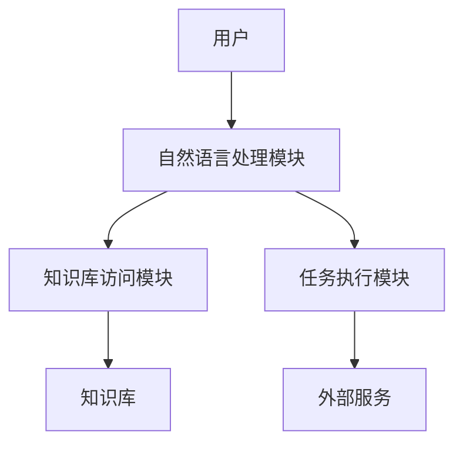

                 


# LLM 驱动的 AI Agent：核心原理与技术栈详解

> 关键词：LLM、AI Agent、大语言模型、人工智能代理、技术栈

> 摘要：本文深入探讨了 LLM 驱动的 AI Agent 的核心原理与技术实现。从 LLM 和 AI Agent 的基本概念出发，详细分析了它们的结合方式及其在实际应用中的表现。文章涵盖了 LLM 的内部机制、AI Agent 的推理原理、系统架构设计以及项目实战等内容，为读者提供了一套完整的 LLM 驱动的 AI Agent 技术解决方案。

---

# 第1章: LLM 驱动的 AI Agent 概述

## 1.1 LLM 和 AI Agent 的基本概念
### 1.1.1 大语言模型（LLM）的定义
- 大语言模型：一种基于深度学习的自然语言处理模型，能够理解和生成人类语言。
- LLM 的特点：
  - 大规模训练数据
  - 复杂的模型架构
  - 强大的上下文理解能力

### 1.1.2 AI Agent 的定义与特点
- AI Agent：一种智能体，能够感知环境并采取行动以实现目标。
- AI Agent 的特点：
  - 自主性
  - 反应性
  - 目标驱动

### 1.1.3 LLM 驱动的 AI Agent 的核心概念
- LLM 作为 AI Agent 的核心驱动力
- AI Agent 通过 LLM 进行自然语言理解和生成
- LLM 的能力决定了 AI Agent 的智能水平

## 1.2 LLM 驱动的 AI Agent 的技术背景
### 1.2.1 大语言模型的发展历程
- 从词袋模型到 Transformer 模型
- 大语言模型的训练目标：最大化语言概率
- 大语言模型的应用：自然语言处理、生成式 AI

### 1.2.2 AI Agent 的历史与现状
- AI Agent 的早期应用：基于规则的系统
- 基于机器学习的 AI Agent：数据驱动的决策
- 当前趋势：结合大语言模型的 AI Agent

### 1.2.3 LLM 与 AI Agent 的结合
- LLM 为 AI Agent 提供强大的语言理解能力
- AI Agent 为 LLM 提供任务导向的执行能力
- 结合 LLM 的 AI Agent 具备更强的通用性和灵活性

## 1.3 LLM 驱动的 AI Agent 的应用场景
### 1.3.1 智能客服
- 自然语言理解：识别用户需求
- 生成式对话：提供个性化的回复
- 任务执行：处理订单、查询信息

### 1.3.2 个性化推荐
- 基于 LLM 的推荐系统
- 生成个性化推荐语
- 动态调整推荐策略

### 1.3.3 自动化任务执行
- AI Agent 作为自动化工具
- LLM 提供任务理解能力
- 自动化执行任务并反馈结果

## 1.4 本章小结
- 介绍了 LLM 和 AI Agent 的基本概念
- 探讨了 LLM 与 AI Agent 的结合方式
- 展示了 LLM 驱动的 AI Agent 的实际应用场景

---

# 第2章: LLM 驱动的 AI Agent 核心原理

## 2.1 大语言模型的内部机制
### 2.1.1 模型架构
- Transformer 模型的结构
- 自注意力机制：理解上下文关系
- 前向传播：生成语言模型的输出

### 2.1.2 训练过程
- 监督学习目标：最大化语言概率
- 优化目标：最小化损失函数
- 训练策略：并行训练、分布式训练

### 2.1.3 推理过程
- 输入：自然语言文本
- 输出：模型预测的概率分布
- 解码策略：贪心解码、随机采样

## 2.2 AI Agent 的推理机制
### 2.2.1 知识表示
- 知识图谱：结构化知识表示
- 表征学习：向量表示知识
- 知识库的构建与管理

### 2.2.2 推理算法
- 基于规则的推理
- 基于概率的推理
- 基于深度学习的推理

### 2.2.3 状态管理
- 状态表示：当前任务和环境信息
- 状态更新：根据新信息调整状态
- 状态记忆：长期记忆和短期记忆

## 2.3 LLM 与 AI Agent 的交互模式
### 2.3.1 单轮对话
- 用户输入：单个问题或指令
- AI Agent 响应：单个回答或行动
- 适合简单任务：信息查询、快速响应

### 2.3.2 多轮对话
- 用户输入：连续的对话
- AI Agent 响应：逐步推理和反馈
- 适合复杂任务：任务分解、逐步执行

### 2.3.3 上下文管理
- 上下文理解：保持对话连贯性
- 上下文记忆：记录对话历史
- 上下文推理：结合历史信息进行推理

## 2.4 本章小结
- 分析了大语言模型的内部机制
- 探讨了 AI Agent 的推理原理
- 总结了 LLM 与 AI Agent 的交互模式

---

# 第3章: LLM 驱动的 AI Agent 技术栈详解

## 3.1 LLM 选择与调优
### 3.1.1 模型选择
- 模型大小：选择适合任务的模型
- 模型性能：准确率、生成能力
- 模型开源：开源模型的优势

### 3.1.2 模型调优
- 参数微调：针对特定任务调整模型
- 数据增强：增加训练数据多样性
- 前置任务：预训练任务优化

### 3.1.3 模型评估
- 评估指标：准确率、BLEU、ROUGE
- 评估方法：自动评估、人工评估
- 模型优化：基于评估结果调整

## 3.2 知识库构建与管理
### 3.2.1 知识库的定义
- 知识库：结构化的知识存储
- 知识表示：实体、关系、属性
- 知识图谱：大规模知识网络

### 3.2.2 知识库的构建方法
- 数据收集：爬取、标注、整理
- 知识抽取：信息抽取、实体识别
- 知识融合：消除冲突、保持一致

### 3.2.3 知识库的更新与维护
- 数据更新：新增、删除、修改
- 知识推理：基于知识图谱的推理
- 知识扩展：动态扩展知识库

## 3.3 对话系统设计
### 3.3.1 对话流程
- 用户输入：自然语言输入
- 系统解析：解析用户需求
- 系统生成：生成回复或行动
- 反馈循环：用户反馈与系统调整

### 3.3.2 对话策略
- 基于规则的对话策略
- 基于模型的对话策略
- 动态调整策略：根据上下文调整

### 3.3.3 对话优化
- 生成优化：优化回复质量
- 响应速度：优化生成速度
- 用户体验：提升对话流畅性

## 3.4 推理引擎实现
### 3.4.1 推理算法
- 基于规则的推理：简单任务
- 基于概率的推理：复杂任务
- 基于深度学习的推理：结合 LLM

### 3.4.2 推理优化
- 并行推理：提高推理速度
- 分层推理：复杂任务分层处理
- 知识剪枝：减少不必要的计算

### 3.4.3 推理结果分析
- 结果验证：检查推理结果的准确性
- 结果解释：解释推理过程
- 结果反馈：反馈给用户或系统

## 3.5 本章小结
- 探讨了 LLM 选择与调优的方法
- 分析了知识库构建与管理的流程
- 总结了对话系统设计的关键点
- 介绍了推理引擎实现的核心技术

---

# 第4章: LLM 驱动的 AI Agent 系统架构设计

## 4.1 系统架构概述
### 4.1.1 分层架构
- 表示层：用户交互界面
- 业务逻辑层：AI Agent 的推理逻辑
- 数据访问层：知识库访问与管理

### 4.1.2 微服务架构
- 服务拆分：独立的服务模块
- 服务通信：RESTful API 或消息队列
- 服务扩展：易于扩展和维护

### 4.1.3 混合架构
- 结合分层和微服务的优势
- 灵活应对复杂任务
- 高扩展性和高可用性

## 4.2 功能模块设计
### 4.2.1 自然语言处理模块
- 文本解析：理解用户输入
- 文本生成：生成回复或行动指令
- 上下文管理：维护对话历史

### 4.2.2 知识库访问模块
- 知识查询：根据需求查询知识库
- 知识推理：基于知识图谱推理
- 知识更新：动态更新知识库

### 4.2.3 任务执行模块
- 任务分解：将复杂任务分解为简单任务
- 任务执行：调用外部服务或工具
- 任务反馈：将结果反馈给用户或系统

## 4.3 系统架构图


## 4.4 本章小结
- 介绍了系统架构的设计思路
- 展示了功能模块的设计方案
- 绘制了系统的架构图
- 总结了系统设计的关键点

---

# 第5章: LLM 驱动的 AI Agent 项目实战

## 5.1 环境安装
### 5.1.1 安装 Python
- 安装步骤：使用 pip 安装 Python
- 环境配置：设置虚拟环境

### 5.1.2 安装 LLM 模型
- 使用 Hugging Face 的开源模型
- 下载预训练模型或微调模型
- 安装必要的库：transformers、torch

### 5.1.3 安装其他依赖
- 安装知识库管理工具
- 安装对话系统框架
- 安装推理引擎

## 5.2 系统核心实现
### 5.2.1 自然语言处理模块
```python
from transformers import AutoTokenizer, AutoModelForCausalLM
tokenizer = AutoTokenizer.from_pretrained('gpt2')
model = AutoModelForCausalLM.from_pretrained('gpt2')
def generate_response(prompt):
    inputs = tokenizer(prompt, return_tensors='np')
    outputs = model.generate(**inputs, max_length=100)
    return tokenizer.decode(outputs[0], skip_special_tokens=True)
```

### 5.2.2 知识库访问模块
```python
from knowledge_base import KnowledgeBase
kb = KnowledgeBase('knowledge.db')
def query_knowledge(prompt):
    return kb.query(prompt)
```

### 5.2.3 任务执行模块
```python
def execute_task(task):
    if task.startswith('order'):
        # 处理订单
    elif task.startswith('query'):
        # 查询信息
    else:
        # 其他任务
```

## 5.3 代码应用解读与分析
### 5.3.1 系统整体流程
- 用户输入：自然语言输入
- 系统解析：解析用户需求
- 系统生成：生成回复或行动指令
- 知识库查询：查询相关信息
- 任务执行：执行具体任务
- 反馈结果：将结果反馈给用户或系统

### 5.3.2 代码实现细节
- 使用 Hugging Face 的开源模型
- 知识库的结构化存储
- 任务执行的模块化设计

## 5.4 实际案例分析
### 5.4.1 案例背景
- 案例目标：实现一个简单的智能客服系统
- 案例需求：用户查询订单信息
- 案例实现：系统解析需求，查询知识库，生成回复

### 5.4.2 案例实现步骤
1. 用户输入：查询订单状态
2. 系统解析：识别任务类型为查询
3. 知识库查询：查询订单信息
4. 生成回复：生成回复文本
5. 反馈结果：将结果返回给用户

## 5.5 项目小结
- 展示了项目的整体实现流程
- 分析了核心代码的实现细节
- 总结了实际案例的实现步骤
- 提供了项目的扩展方向

---

# 第6章: 最佳实践与未来展望

## 6.1 最佳实践 tips
### 6.1.1 模型选择
- 根据任务需求选择合适的模型
- 考虑模型的计算资源需求
- 优先选择开源模型

### 6.1.2 知识库管理
- 定期更新知识库
- 保持知识库的一致性
- 提高知识库的可扩展性

### 6.1.3 系统优化
- 优化推理速度
- 提高生成质量
- 提升系统的稳定性

## 6.2 本章小结
- 总结了项目的最佳实践
- 展望了未来的技术发展趋势
- 提供了读者进一步学习的方向
- 总结了项目的整体内容

---

# 作者：AI天才研究院/AI Genius Institute & 禅与计算机程序设计艺术 /Zen And The Art of Computer Programming

---

以上是《LLM 驱动的 AI Agent：核心原理与技术栈详解》的技术博客文章的完整目录大纲和文章内容。

