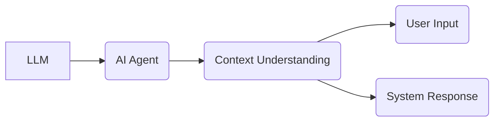
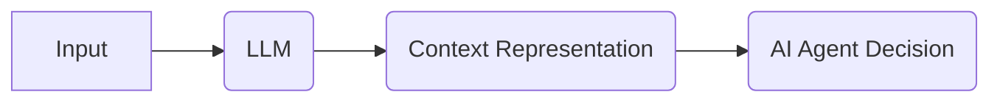
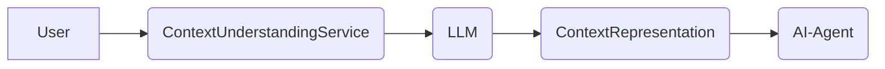

                 


# LLM在AI Agent上下文理解中的应用

## 关键词：LLM, AI Agent, 上下文理解, 自然语言处理, 智能体设计

## 摘要：本文探讨了大语言模型（LLM）在AI Agent上下文理解中的应用，分析了其核心原理、系统架构和实际案例。通过详细的技术分析，展示了如何利用LLM提升AI Agent的上下文理解能力，为智能体设计提供了新的思路和方法。

---

# 第1章: LLM与AI Agent概述

## 1.1 问题背景与描述

### 1.1.1 上下文理解的定义与重要性
上下文理解是指智能系统能够解析和推理输入文本的背景、意图和语境的能力。它是实现人机交互、智能问答和任务自动化的核心技术。

### 1.1.2 LLM在上下文理解中的作用
大语言模型通过大规模预训练，能够捕捉语言中的语义信息，帮助AI Agent更好地理解和处理用户输入。

### 1.1.3 AI Agent的定义与核心功能
AI Agent是一种智能实体，能够感知环境、执行任务并做出决策。其核心功能包括感知、推理、规划和执行。

## 1.2 核心概念与联系

### 1.2.1 LLM与AI Agent的关系
LLM作为AI Agent的核心模块，负责提供语言理解和生成能力，而AI Agent则利用这些能力与用户交互并完成任务。

### 1.2.2 实体关系图


---

# 第2章: LLM与AI Agent的核心原理

## 2.1 核心概念原理

### 2.1.1 LLM的基本原理
大语言模型通过自监督学习，掌握了语言的分布规律，能够生成与输入上下文一致的文本。

### 2.1.2 AI Agent的决策机制
AI Agent根据上下文理解和目标，选择最优行动方案。

### 2.1.3 上下文理解的数学模型
上下文理解可以看作是一个条件概率问题：
$$P(\text{context}|\text{input}) = \prod_{i=1}^n P(\text{context}_i|\text{input}_i)$$

---

## 2.2 算法原理讲解

### 2.2.1 基于LLM的上下文理解算法


### 2.2.2 算法实现
```python
def context_understanding(input_text):
    model = load_llm()
    context = model.generate_context(input_text)
    return context
```

---

## 2.3 数学模型与公式

### 2.3.1 概率分布公式
$$P(\text{context}|\text{input}) = \prod_{i=1}^n P(\text{context}_i|\text{input}_i)$$

### 2.3.2 损失函数公式
$$L = -\sum_{i=1}^n \log P(\text{context}_i|\text{input}_i)$$

---

# 第3章: 系统分析与架构设计

## 3.1 问题场景介绍

### 3.1.1 AI Agent的应用场景
AI Agent广泛应用于智能客服、智能助手和自动化任务处理等领域。

### 3.1.2 上下文理解的系统需求
系统需要实时解析用户输入，保持对话连贯性。

## 3.2 系统功能设计

### 3.2.1 领域模型设计


---

# 第4章: 项目实战

## 4.1 环境安装
需要安装Python、LLM库（如Hugging Face的Transformers）和AI Agent框架。

## 4.2 系统核心实现

### 4.2.1 代码实现
```python
from transformers import AutoTokenizer, AutoModelForCausalLM

def initialize_model():
    model_name = "gpt2"
    tokenizer = AutoTokenizer.from_pretrained(model_name)
    model = AutoModelForCausalLM.from_pretrained(model_name)
    return model, tokenizer

def generate_context(input_text, model, tokenizer):
    inputs = tokenizer(input_text, return_tensors="np")
    outputs = model.generate(inputs.input_ids, max_length=100)
    return tokenizer.decode(outputs[0], skip_special_tokens=True)

model, tokenizer = initialize_model()
context = generate_context("What is the capital of France?", model, tokenizer)
print(context)
```

### 4.2.2 代码解读
该代码展示了如何利用GPT-2模型生成上下文。`generate_context`函数接收输入文本，生成与上下文相关的文本。

## 4.3 案例分析

### 4.3.1 案例1：智能客服
用户输入：“我的订单在哪里？”
系统输出上下文：“查询订单状态。”

### 4.3.2 案例2：智能助手
用户输入：“明天北京天气如何？”
系统输出上下文：“查询明天北京的天气预报。”

## 4.4 项目小结
通过实际案例，展示了LLM在AI Agent上下文理解中的应用。

---

# 第5章: 最佳实践与总结

## 5.1 最佳实践Tips
1. 确保LLM模型与任务匹配。
2. 定期更新模型以适应新数据。
3. 优化上下文表示方法。

## 5.2 小结
LLM在AI Agent上下文理解中的应用显著提升了系统的智能性，为实现更复杂的任务提供了可能性。

## 5.3 注意事项
- 避免过度依赖LLM，结合领域知识。
- 注意模型的训练数据偏见。

## 5.4 拓展阅读
建议阅读《大语言模型的原理与应用》和《智能体设计与实现》。

---

# 作者：AI天才研究院/AI Genius Institute & 禅与计算机程序设计艺术 /Zen And The Art of Computer Programming

