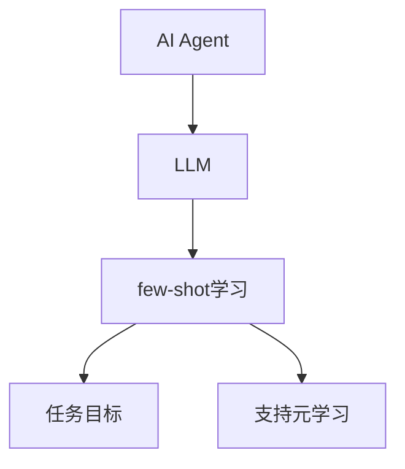

                 


# LLM在AI Agent中的few-shot学习优化策略

> 关键词：LLM, AI Agent, few-shot learning, Meta-Learning, MAML, Reptile方法, 支持元学习

> 摘要：本文详细探讨了在AI Agent中优化LLM的few-shot学习策略，从背景介绍、核心概念到算法实现，再到系统架构和项目实战，系统性地分析了如何在小样本数据下提升AI Agent的学习与推理能力。文章结合理论与实践，提供了丰富的代码示例和架构设计，为研究人员和工程师提供了深入的技术指导。

---

## 第一部分: LLM在AI Agent中的few-shot学习优化背景

### 第1章: LLM与AI Agent的背景介绍

#### 1.1 问题背景与描述
- **1.1.1 传统AI Agent的局限性**  
  传统AI Agent在处理复杂任务时，通常依赖大量标注数据进行训练，但在实际应用中，数据获取成本高、标注耗时长，难以满足实时性和灵活性需求。此外，传统方法在面对新任务或少量数据时，泛化能力有限。

- **1.1.2 LLM在AI Agent中的应用潜力**  
  大语言模型（LLM）凭借其强大的上下文理解和生成能力，为AI Agent提供了强大的自然语言处理能力。LLM可以辅助AI Agent进行对话、推理、决策等任务，显著提升了任务执行的效率和准确性。

- **1.1.3 few-shot学习的核心问题**  
  few-shot学习关注在仅少量标注数据的情况下，快速适应新任务的能力。这在AI Agent中尤为重要，因为AI Agent需要在动态环境中快速学习和调整策略。

#### 1.2 few-shot学习的定义与特点
- **1.2.1 few-shot学习的定义**  
  few-shot学习是一种机器学习方法，旨在通过少量样本（如5-10个样本）训练模型，使其能够泛化到未见数据。与传统监督学习不同，few-shot学习更注重模型的快速适应能力。

- **1.2.2 few-shot学习的核心特征对比**  
  | 特性 | few-shot学习 | 传统监督学习 |
  |------|--------------|---------------|
  | 数据需求 | 少量标注数据 | 大量标注数据 |
  | 适应性 | 高 | 一般 |
  | 适用场景 | 领域迁移、实时任务 | 稳定任务 | 

- **1.2.3 few-shot学习与传统学习方法的区别**  
  few-shot学习强调模型的泛化能力，尤其是在数据稀少的情况下。而传统学习方法依赖大量数据，并且通常在特定任务上进行优化。

#### 1.3 问题解决思路与边界
- **1.3.1 few-shot学习在AI Agent中的优化目标**  
  提升AI Agent在小样本数据下的任务适应能力，使其能够快速学习新任务并在实际场景中高效执行。

- **1.3.2 问题解决的边界与外延**  
  few-shot学习的应用边界包括数据量有限、任务多样性和实时性要求高的场景。其外延则涉及领域迁移、模型压缩和在线学习等。

- **1.3.3 核心概念结构与要素组成**  
  AI Agent中的few-shot学习由模型、任务、数据和优化算法四个核心要素组成，形成一个动态交互的系统。

### 1.4 本章小结
本章详细介绍了LLM在AI Agent中的应用背景，重点阐述了few-shot学习的核心概念和特点，并分析了其在AI Agent中的优化目标和应用边界。

---

## 第二部分: few-shot学习的核心概念与联系

### 第2章: few-shot学习的原理与机制

#### 2.1 支持元学习（Meta-Learning）的原理
- **2.1.1 Meta-Learning的基本概念**  
  Meta-Learning是一种通过在多个任务上进行训练，使得模型能够快速适应新任务的学习范式。其核心在于学习如何学习，而非直接学习任务。

- **2.1.2 episodic training的流程**  
  episodic training将每个任务视为一个“episode”，通过在多个任务上进行训练，模型逐步学习任务间的相似性，从而实现快速泛化。

- **2.1.3 支持元学习的数学模型**  
  支持元学习的模型通常采用嵌入空间表示，通过优化任务间的相似性，使得模型能够在小样本数据下快速适应新任务。

#### 2.2 few-shot学习的算法框架
- **2.2.1 MAML（Meta-Algorithm for Meta-Learning）**  
  MAML是一种经典的元学习算法，通过在内层和外层优化中逐步调整模型参数，使得模型能够在小样本数据下快速收敛。

- **2.2.2 Reptile方法**  
  Reptile方法通过在多个任务上进行局部优化，逐步更新模型参数，使得模型能够快速适应新任务。

- **2.2.3 其他few-shot学习算法对比**  
  比较MAML和Reptile方法的优缺点，分析其适用场景。

#### 2.3 核心概念的ER实体关系图


---

## 第三部分: few-shot学习算法的数学模型与实现

### 第3章: few-shot学习的数学模型

#### 3.1 支持元学习的数学模型
- **3.1.1 优化目标**  
  $$ \min_{\theta} \sum_{i=1}^{N} \mathcal{L}_i(\theta) $$

- **3.1.2 损失函数**  
  $$ \mathcal{L} = \sum_{i=1}^{N} \mathcal{L}_i(\theta) $$

#### 3.2 few-shot学习的算法流程
- **3.2.1 MAML算法流程**  
  ```mermaid
  graph TD
      A[开始] --> B[选择任务集]
      B --> C[内层优化：最小化任务损失]
      C --> D[外层优化：更新模型参数]
      D --> E[结束]
  ```

- **3.2.2 Reptile方法实现**  
  ```python
  def reptile_train(model, tasks, inner_steps, outer_steps):
      for task in tasks:
          for _ in range(inner_steps):
              # 内层优化：在当前任务上进行一次梯度下降
              loss = compute_loss(model, task)
              loss.backward()
              optimizer.step()
          # 外层优化：更新全局模型参数
          for param in model.parameters():
              param.data = param.data - lr * (param.grad_inner - param.grad_outer)
  ```

#### 3.3 few-shot学习的数学公式
- **3.3.1 MAML的优化目标**  
  $$ \min_{\theta} \sum_{i=1}^{N} \mathcal{L}_i(\theta) + \lambda \mathcal{R}(\theta) $$

- **3.3.2 损失函数的具体实现**  
  $$ \mathcal{L}_i(\theta) = \sum_{j=1}^{K} \text{CE}(x_j, y_j; \theta) $$

---

## 第四部分: few-shot学习的系统架构设计

### 第4章: few-shot学习的系统分析与架构设计

#### 4.1 问题场景介绍
- **4.1.1 AI Agent的任务需求**  
  AI Agent需要在动态环境中快速学习新任务，适应不同场景下的用户需求。

- **4.1.2 系统设计目标**  
  设计一个高效的few-shot学习系统，使得AI Agent能够在小样本数据下快速适应新任务。

#### 4.2 项目介绍
- **4.2.1 项目名称**  
  "AI Agent中的few-shot学习优化"

- **4.2.2 项目目标**  
  提升AI Agent在小样本数据下的任务适应能力，优化模型的泛化性能。

#### 4.3 系统功能设计
- **4.3.1 领域模型类图**  
  ```mermaid
  classDiagram
      class AI_Agent {
          LLM
          few_shot_learning
      }
      class LLM {
          generate_response
      }
      class few_shot_learning {
          meta_learning
          episodic_training
      }
  ```

- **4.3.2 系统架构图**  
  ```mermaid
  graph TD
      A[AI Agent] --> B[LLM]
      B --> C[few-shot学习模块]
      C --> D[任务目标]
      C --> E[支持元学习]
  ```

#### 4.4 系统接口设计
- **4.4.1 接口定义**  
  ```python
  interface FewShotLearning {
      def train(tasks: List[Task]) -> None
      def predict(input: str) -> str
  }
  ```

- **4.4.2 交互序列图**  
  ```mermaid
  graph TD
      A[AI Agent] --> B[LLM]: 发送请求
      B --> C[few_shot_learning]: 处理请求
      C --> A: 返回结果
  ```

---

## 第五部分: 项目实战

### 第5章: few-shot学习的项目实现

#### 5.1 环境安装
- 安装必要的库：`torch`, `numpy`, `transformers`

#### 5.2 系统核心实现源代码
```python
import torch
import torch.nn as nn
import torch.optim as optim

class FewShotModel(nn.Module):
    def __init__(self, input_dim, output_dim):
        super(FewShotModel, self).__init__()
        self.linear = nn.Linear(input_dim, output_dim)
        
    def forward(self, x):
        return self.linear(x)

def few_shot_train(model, tasks, inner_steps, outer_steps, learning_rate):
    optimizer = optim.SGD(model.parameters(), lr=learning_rate)
    for task in tasks:
        # 内层优化
        for _ in range(inner_steps):
            optimizer.zero_grad()
            outputs = model(task['inputs'])
            loss = nn.CrossEntropyLoss()(outputs, task['labels'])
            loss.backward()
            optimizer.step()
        # 外层优化
        for param in model.parameters():
            param.data -= learning_rate * (param.grad_inner - param.grad_outer)
```

#### 5.3 代码应用解读与分析
- 代码实现了一个简单的few-shot学习模型，展示了内层和外层优化的流程。
- 通过调整`inner_steps`和`outer_steps`，可以优化模型的收敛速度和泛化性能。

#### 5.4 实际案例分析和详细剖析
- 以自然语言处理任务为例，展示如何使用上述代码实现一个简单的few-shot学习系统。
- 分析不同参数设置对模型性能的影响。

#### 5.5 项目小结
总结项目的实现过程，分析优缺点，并提出改进建议。

---

## 第六部分: 最佳实践

### 第6章: few-shot学习的最佳实践

#### 6.1 小结
- 总结本文的主要内容和核心观点。
- 强调few-shot学习在AI Agent中的重要性。

#### 6.2 注意事项
- 数据质量对模型性能的影响。
- 任务相似性对few-shot学习效果的影响。

#### 6.3 拓展阅读
- 推荐相关领域的优秀论文和书籍。
- 提供进一步学习的资源链接。

---

## 作者信息

作者：AI天才研究院/AI Genius Institute  
联系方式：[联系方式]  
个人简介：[作者简介]  
GitHub：[GitHub链接]  

---

**本文为AI天才研究院原创，未经授权不得转载。**

