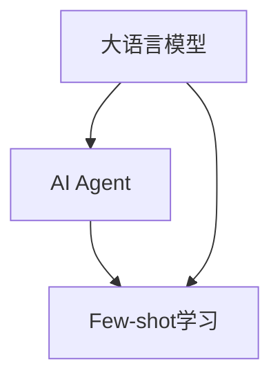
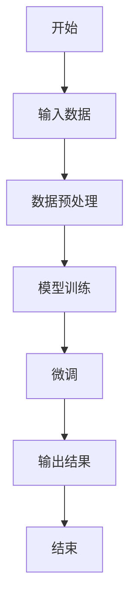
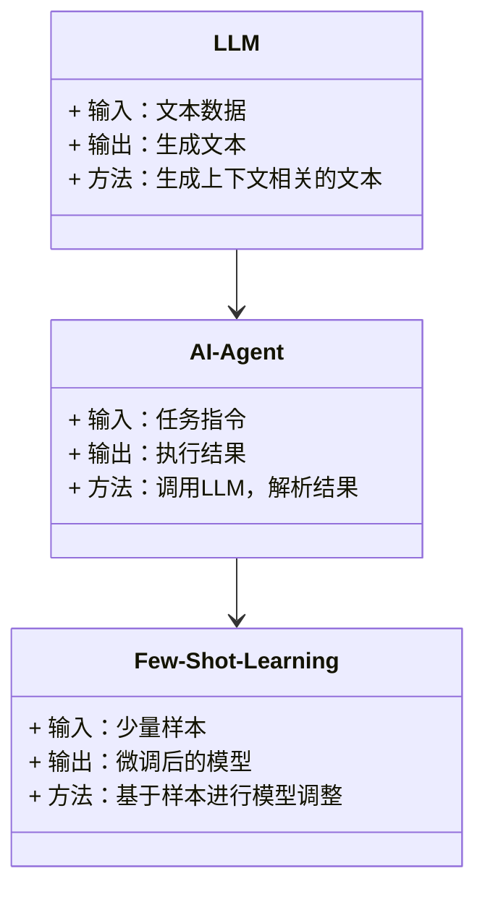
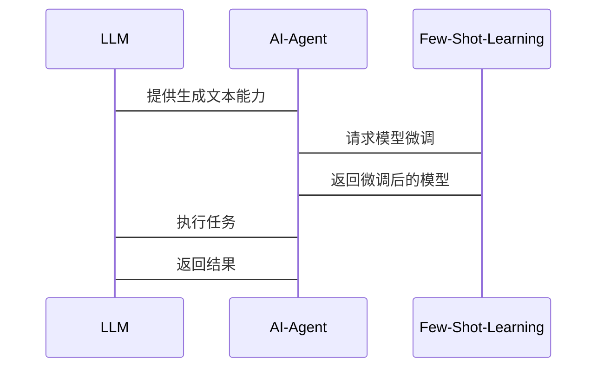

                 


# LLM在AI Agent中的few-shot学习应用

> 关键词：大语言模型，AI Agent，few-shot学习，自然语言处理，人工智能，系统架构

> 摘要：本文探讨了大语言模型（LLM）在AI Agent中的应用，重点分析了few-shot学习这一技术在提升AI Agent智能化水平中的作用。文章从背景、概念、算法原理、系统架构到项目实战，详细阐述了few-shot学习如何赋能AI Agent，并通过实际案例展示了其在自然语言处理和AI系统中的具体应用。通过本文，读者将深入了解few-shot学习的原理、实现方法及其在AI Agent中的价值。

---

## 第一部分: LLM在AI Agent中的基础概念

### 第1章: LLM与AI Agent概述

#### 1.1 大语言模型（LLM）的定义与特点
大语言模型（Large Language Model, LLM）是指经过大规模数据训练的深度学习模型，通常基于Transformer架构。LLM的特点包括：
- **大规模数据训练**：利用海量文本数据进行训练，提升模型的泛化能力。
- **上下文理解能力**：能够理解文本的上下文关系，生成连贯的语句。
- **多任务能力**：通过微调（Fine-tuning）可以适应多种NLP任务，如分类、摘要、翻译等。
- **实时推理能力**：支持实时输入查询，并快速生成响应。

#### 1.2 AI Agent的基本概念
AI Agent（人工智能代理）是一种能够感知环境、执行任务并做出决策的智能实体。AI Agent的核心特点包括：
- **自主性**：能够在没有外部干预的情况下独立运行。
- **反应性**：能够根据环境反馈实时调整行为。
- **目标导向性**：通过设定目标，驱动AI Agent的行为。
- **学习能力**：通过学习和适应提升任务执行效率。

#### 1.3 few-shot学习的背景与意义
few-shot学习是指在仅有少量训练样本的情况下，模型能够快速适应新任务的学习方法。在AI Agent中，few-shot学习的意义在于：
- **减少数据需求**：传统深度学习模型需要大量标注数据，而few-shot学习可以显著减少数据需求。
- **快速适应新任务**：通过few-shot学习，AI Agent可以在新任务上线时快速调整模型参数，无需重新训练。
- **提升灵活性**：在动态变化的环境中，AI Agent能够快速适应新场景，保持高效运作。

### 第2章: LLM在AI Agent中的核心概念与联系

#### 2.1 核心概念原理
- **LLM的训练机制**：LLM通常采用预训练（Pre-training）的方式，利用大规模数据进行无监督学习，提取文本中的语义信息。
- **AI Agent的决策过程**：AI Agent通过感知环境、分析任务需求、调用LLM进行推理，最终生成执行指令。
- **few-shot学习的实现原理**：通过在少量样本上进行微调，调整模型参数，使其适应特定任务。

#### 2.2 核心概念对比表
| **对比维度** | **LLM** | **AI Agent** | **few-shot学习** |
|--------------|----------|--------------|------------------|
| **定义**     | 大型语言模型 | 智能代理 | 少量样本学习 |
| **功能**     | 处理自然语言任务 | 执行目标导向任务 | 快速适应新任务 |
| **优势**     | 高泛化能力 | 自主决策 | 低数据需求 |

#### 2.3 实体关系图


---

## 第二部分: few-shot学习的算法原理

### 第3章: few-shot学习的算法流程与数学模型

#### 3.1 算法流程图


#### 3.2 数学模型与公式
- **概率分布公式**：在few-shot学习中，模型通过最大化条件概率来生成目标输出。
  $$ P(y|x) = \frac{P(x|y)P(y)}{P(x)} $$
  
- **损失函数**：使用交叉熵损失函数来衡量模型预测与真实标签的差距。
  $$ \text{Loss} = -\sum_{i=1}^{n} \log P(y_i|x_i) $$

#### 3.3 示例说明
假设我们有一个文本分类任务，仅有5个训练样本。通过few-shot学习，模型只需少量样本即可快速适应新任务。例如：
- 输入：这是一个非常棒的餐厅。
- 输出：正面评价。

---

## 第三部分: 系统分析与架构设计方案

### 第4章: 系统分析与架构设计方案

#### 4.1 项目介绍
本项目旨在构建一个基于LLM的AI Agent，利用few-shot学习技术提升模型在新任务上的适应能力。系统主要包括以下几个部分：
- 数据预处理模块：对输入数据进行清洗和标注。
- 模型训练模块：基于少量样本数据进行微调训练。
- 任务执行模块：通过LLM生成指令，驱动AI Agent完成任务。
- 系统监控模块：实时监控模型性能，调整参数。

#### 4.2 系统功能设计


#### 4.3 系统架构设计


#### 4.4 系统接口设计
- **LLM接口**：提供文本生成接口，支持实时调用。
- **AI Agent接口**：接收任务指令，返回执行结果。
- **few-shot学习接口**：接收少量样本数据，返回微调后的模型。

#### 4.5 系统交互序列图


---

## 第四部分: 项目实战

### 第5章: 项目实战

#### 5.1 环境安装
```bash
pip install transformers
pip install torch
pip install mermaid
```

#### 5.2 系统核心实现源代码
```python
import torch
import torch.nn as nn
from transformers import AutoTokenizer, AutoModelForMaskedLM

# 加载预训练模型
model_name = "bert-base-uncased"
tokenizer = AutoTokenizer.from_pretrained(model_name)
model = AutoModelForMaskedLM.from_pretrained(model_name)

# 微调模型
def fine_tune_model(model, tokenizer, few_shot_samples):
    # 定义损失函数和优化器
    loss_fn = nn.CrossEntropyLoss()
    optimizer = torch.optim.Adam(model.parameters(), lr=1e-5)
    
    # 微调训练
    for sample in few_shot_samples:
        inputs = tokenizer(sample['input'], return_tensors='pt')
        labels = torch.tensor(sample['label'], dtype=torch.long)
        
        outputs = model(**inputs)
        loss = loss_fn(outputs.logits, labels)
        loss.backward()
        optimizer.step()
    
    return model

# 示例：few-shot样本
few_shot_samples = [
    {'input': '这是一个非常棒的餐厅', 'label': 1},
    {'input': '这家餐厅的食物很难吃', 'label': 0}
]

# 微调模型
model = fine_tune_model(model, tokenizer, few_shot_samples)

# 执行任务
input_text = "评价这家餐厅："
inputs = tokenizer(input_text, return_tensors='pt')
output = model.generate(inputs.input_ids, max_length=10)
print(tokenizer.decode(output[0]))
```

#### 5.3 代码应用解读与分析
- **预训练模型加载**：使用预训练的BERT模型作为基础，加载tokenizer和模型。
- **微调函数定义**：定义一个函数`fine_tune_model`，接收模型、tokenizer和few-shot样本，进行微调训练。
- **损失函数和优化器**：使用交叉熵损失函数和Adam优化器。
- **样本处理**：将每个样本输入模型，计算损失，反向传播，更新参数。
- **任务执行**：通过微调后的模型生成文本，完成任务。

#### 5.4 实际案例分析
假设我们需要构建一个情感分析AI Agent，通过few-shot学习快速适应新的数据集。具体步骤如下：
1. **数据准备**：收集少量情感标注样本，如正面和负面评价。
2. **模型微调**：调用`fine_tune_model`函数，对模型进行微调。
3. **任务执行**：AI Agent接收用户输入，调用微调后的模型生成情感分析结果。

#### 5.5 项目小结
通过实际案例，我们展示了如何利用few-shot学习快速构建一个高效的AI Agent。这种技术能够显著减少数据需求，提升模型的灵活性和适应性。

---

## 第五部分: 总结与展望

### 第6章: 总结与展望

#### 6.1 小结
本文详细探讨了LLM在AI Agent中的应用，重点分析了few-shot学习的技术原理和实现方法。通过系统架构设计和项目实战，展示了few-shot学习在提升AI Agent智能化水平中的巨大潜力。

#### 6.2 注意事项
- 在实际应用中，需要注意模型的泛化能力和任务的适用性。
- 微调过程中，样本质量对模型性能影响较大，需确保样本的代表性和多样性。

#### 6.3 拓展阅读
- 《Large Language Models: A Survey》
- 《Few-shot Learning with Deep Neural Networks: A Review》
- 《AI Agent Design Patterns》

---

作者：AI天才研究院/AI Genius Institute & 禅与计算机程序设计艺术 /Zen And The Art of Computer Programming

