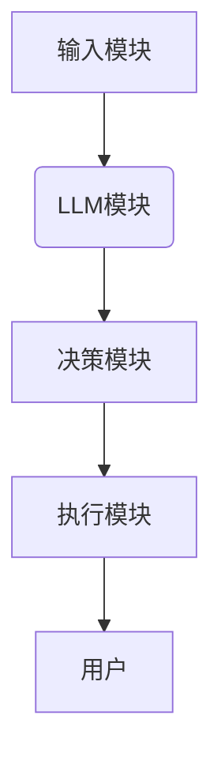

                 


# LLM在AI Agent中的zero-shot能力应用

> 关键词：LLM, AI Agent, Zero-shot learning, 大语言模型, 人工智能代理, 自然语言处理

> 摘要：本文深入探讨了大语言模型（LLM）在AI代理（AI Agent）中的zero-shot能力应用。通过分析LLM与AI Agent的结合，详细讲解了zero-shot学习的原理、算法实现、系统架构设计以及实际项目案例。本文旨在为技术人员和研究人员提供理论支持和实践指导，帮助他们更好地理解和应用LLM在AI Agent中的zero-shot能力。

---

# 正文

## 第1章: LLM与AI Agent概述

### 1.1 LLM的基本概念

#### 1.1.1 大语言模型的定义
大语言模型（Large Language Model，LLM）是指基于深度学习的自然语言处理模型，通常具有大量的参数和训练数据。LLM通过监督学习和无监督学习的结合，能够理解和生成人类语言。

#### 1.1.2 LLM的核心特点
- **大规模**：LLM通常使用海量数据进行训练，参数量通常在数十亿级别。
- **通用性**：LLM能够处理多种语言任务，如文本生成、翻译、问答等。
- **上下文理解**：LLM能够理解上下文关系，并根据上下文生成合理的回答。

#### 1.1.3 LLM与传统NLP模型的区别
传统的NLP模型通常针对特定任务进行训练，如机器翻译、情感分析等，而LLM通过预训练可以处理多种任务，具有更强的通用性。

### 1.2 AI Agent的基本概念

#### 1.2.1 AI Agent的定义
AI Agent（人工智能代理）是指能够感知环境、自主决策并执行任务的智能体。AI Agent通常具有以下特点：
- **自主性**：能够在没有外部干预的情况下独立运行。
- **反应性**：能够根据环境的变化调整自己的行为。
- **目标导向**：具有明确的目标，并能够采取行动来实现这些目标。

#### 1.2.2 AI Agent的核心功能
- **感知环境**：通过传感器或其他输入方式获取环境信息。
- **决策制定**：基于感知信息，通过推理和计算做出决策。
- **执行任务**：根据决策结果执行相应的动作。

#### 1.2.3 AI Agent的应用场景
AI Agent广泛应用于多个领域，如智能助手（如Siri、Alexa）、智能客服、自动驾驶等。

### 1.3 LLM与AI Agent的结合

#### 1.3.1 LLM在AI Agent中的作用
LLM可以作为AI Agent的核心模块，负责理解和生成语言，处理用户输入并生成相应的输出。

#### 1.3.2 LLM与AI Agent的协同工作原理
1. **输入处理**：AI Agent接收用户的输入，将其传递给LLM进行解析。
2. **任务处理**：LLM根据输入生成相应的输出，并将其返回给AI Agent。
3. **决策与执行**：AI Agent根据LLM的输出做出决策，并执行相应的任务。

#### 1.3.3 LLM在AI Agent中的优势
- **强大的语言理解能力**：LLM能够理解复杂的语言指令，提高AI Agent的理解能力。
- **多任务处理能力**：LLM可以处理多种任务，使AI Agent能够执行多种功能。
- **自我改进能力**：通过持续学习，LLM可以不断优化其性能，提高AI Agent的智能水平。

### 1.4 Zero-shot能力的定义与特点

#### 1.4.1 Zero-shot学习的定义
Zero-shot学习是指模型在没有经过特定任务的训练数据的情况下，能够直接处理该任务的能力。

#### 1.4.2 Zero-shot学习的核心特点
- **无需特定任务训练**：模型在训练时只使用通用数据，不需要针对特定任务进行微调。
- **泛化能力强**：模型能够处理多种任务，具有很强的泛化能力。

#### 1.4.3 Zero-shot学习与传统学习方法的区别
传统的学习方法通常需要针对特定任务进行大量数据的微调，而Zero-shot学习通过通用预训练模型可以直接处理新任务。

---

## 第2章: LLM与AI Agent的协同工作原理

### 2.1 LLM在AI Agent中的任务处理流程

#### 2.1.1 任务分析与理解
AI Agent接收用户的指令后，需要对指令进行分析和理解，确定任务的目标和要求。

#### 2.1.2 信息检索与整合
AI Agent需要根据任务目标，从外部获取相关数据或信息，并进行整合。

#### 2.1.3 生成与执行
AI Agent根据整合的信息生成相应的输出，并执行任务。

### 2.2 LLM与AI Agent的交互机制

#### 2.2.1 用户需求的输入与解析
用户通过自然语言输入需求，AI Agent需要将其解析为具体的任务指令。

#### 2.2.2 LLM生成响应
LLM根据解析后的任务指令生成相应的文本或动作指令。

#### 2.2.3 AI Agent的反馈与优化
AI Agent根据LLM的输出结果，做出反馈或优化调整。

### 2.3 Zero-shot能力在LLM中的实现

#### 2.3.1 Zero-shot学习的训练方法
Zero-shot学习通过在通用数据集上进行预训练，使得模型能够理解多种任务的语义。

#### 2.3.2 Zero-shot学习的推理过程
模型在处理新任务时，通过调用预训练的知识和上下文理解能力，生成相应的输出。

#### 2.3.3 Zero-shot学习的优化策略
- **多任务学习**：在预训练过程中，模型同时学习多种任务，提高其Zero-shot能力。
- **知识蒸馏**：通过教师模型将知识传递给学生模型，优化模型的性能。

### 2.4 本章小结

---

## 第3章: LLM与AI Agent的结合：算法原理

### 3.1 LLM的训练过程

#### 3.1.1 预训练过程
模型在通用数据集上进行无监督预训练，学习语言的语法和语义。

#### 3.1.2 微调过程
在特定任务上进行有监督微调，优化模型在特定任务上的性能。

#### 3.1.3 Zero-shot学习的实现
通过预训练模型，直接处理新任务，无需额外的微调。

### 3.2 Zero-shot学习的算法实现

#### 3.2.1 Zero-shot学习的流程
1. **输入处理**：将输入文本传递给预训练模型。
2. **语义理解**：模型理解输入文本的语义和意图。
3. **生成输出**：模型根据理解生成相应的输出。

#### 3.2.2 Zero-shot学习的数学模型
$$ P(y|x) = \text{模型生成的概率分布} $$

### 3.3 本章小结

---

## 第4章: LLM与AI Agent的结合：系统架构设计

### 4.1 系统功能设计

#### 4.1.1 功能模块划分
- **输入模块**：接收用户的输入。
- **LLM模块**：负责理解和生成文本。
- **决策模块**：根据LLM的输出做出决策。
- **执行模块**：执行具体的任务。

#### 4.1.2 功能模块的交互关系
- 输入模块将用户输入传递给LLM模块。
- LLM模块生成输出，传递给决策模块。
- 决策模块做出决策，并传递给执行模块。
- 执行模块执行任务，并将结果反馈给用户。

### 4.2 系统架构设计

#### 4.2.1 系统架构图


### 4.3 系统接口设计

#### 4.3.1 输入接口
- **输入类型**：文本输入。
- **接口协议**：HTTP REST API。

#### 4.3.2 输出接口
- **输出类型**：文本输出。
- **接口协议**：HTTP REST API。

### 4.4 本章小结

---

## 第5章: LLM与AI Agent的结合：项目实战

### 5.1 项目背景

#### 5.1.1 项目目标
开发一个基于LLM的智能客服系统。

#### 5.1.2 项目需求
- 提供用户咨询。
- 自动生成回复。
- 支持多种语言。

### 5.2 环境配置

#### 5.2.1 开发环境
- **编程语言**：Python。
- **深度学习框架**：TensorFlow或PyTorch。
- **LLM模型**：使用预训练的LLM模型。

#### 5.2.2 依赖安装
```bash
pip install tensorflow transformers
```

### 5.3 核心代码实现

#### 5.3.1 LLM模块实现
```python
from transformers import GPT2LMHeadModel, GPT2Tokenizer

model_name = "gpt2"
tokenizer = GPT2Tokenizer.from_pretrained(model_name)
model = GPT2LMHeadModel.from_pretrained(model_name)
```

#### 5.3.2 决策模块实现
```python
def make_decision(input_text):
    inputs = tokenizer.encode(input_text, return_tensors="pt")
    outputs = model.generate(inputs, max_length=100, num_beams=5, temperature=0.7)
    response = tokenizer.decode(outputs[0], skip_special_tokens=True)
    return response
```

### 5.4 功能模块设计

#### 5.4.1 输入模块
```python
def input_handler():
    while True:
        user_input = input("请输入您的问题：")
        yield user_input
```

#### 5.4.2 执行模块
```python
def execute_action(response):
    print("生成的回复：", response)
```

### 5.5 本章小结

---

## 第6章: 总结与展望

### 6.1 总结
本文详细探讨了LLM在AI Agent中的zero-shot能力应用，分析了其原理、算法实现和系统架构设计，并通过项目实战展示了其实际应用。

### 6.2 未来展望
随着LLM技术的不断发展，AI Agent的zero-shot能力将更加智能化和多样化。未来的研究方向包括优化Zero-shot学习的性能、探索新的模型架构以及扩展其应用场景。

### 6.3 最佳实践 Tips
- **模型选择**：选择适合任务的LLM模型。
- **数据处理**：确保数据质量和多样性。
- **系统优化**：优化系统架构，提高性能。

### 6.4 作者小结
作者：AI天才研究院/AI Genius Institute & 禅与计算机程序设计艺术 /Zen And The Art of Computer Programming

---

通过以上内容，我们详细介绍了LLM在AI Agent中的zero-shot能力应用，从理论到实践，为读者提供了全面的指导和参考。

