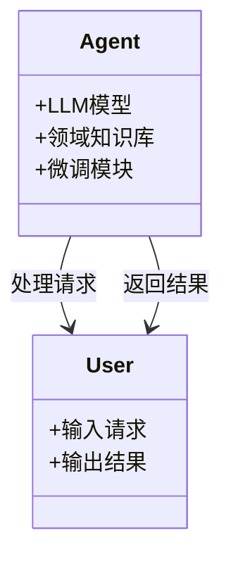

                 


# LLM在AI Agent中的微调技术：适应特定领域需求

## 关键词：LLM、AI Agent、微调技术、领域适应、模型优化、深度学习

## 摘要：本文探讨了在AI Agent中对大语言模型（LLM）进行微调技术的应用，详细分析了如何通过微调使LLM适应特定领域的需求，提升模型在实际场景中的表现。文章从理论基础到实践应用，系统性地介绍了微调技术的核心原理、算法实现、系统架构设计以及项目实战案例，为读者提供了全面的指导和深度的见解。

---

## 第一部分: LLM在AI Agent中的微调技术基础

## 第1章: 问题背景与核心概念

### 1.1 问题背景

#### 1.1.1 大语言模型（LLM）的发展现状

大语言模型（Large Language Model, LLM）近年来取得了突破性进展，如GPT-3、PaLM等模型在自然语言处理任务中表现出色。这些模型通过海量数据训练，具备了强大的通用性。然而，通用模型在特定领域中的表现往往不尽如人意，尤其是在需要高度专业化的场景中，如医疗、法律、金融等领域，通用模型可能无法满足精准需求。

#### 1.1.2 AI Agent的定义与应用场景

AI Agent（人工智能代理）是一种能够感知环境、执行任务并做出决策的智能实体。AI Agent可以是虚拟助手、推荐系统，也可以是自动化工具。AI Agent的核心在于与用户或系统的交互，通过理解需求、执行操作并反馈结果来提供服务。

#### 1.1.3 微调技术在AI Agent中的重要性

为了使LLM在AI Agent中高效工作，模型需要适应特定领域的需求。微调技术通过在特定领域数据上的再训练，调整模型参数，使其更擅长处理领域内的任务。这种技术是AI Agent在专业领域中实现高效应用的关键。

### 1.2 核心概念与联系

#### 1.2.1 LLM与AI Agent的关系

LLM作为AI Agent的核心组件，负责处理语言相关的任务，如理解用户请求、生成响应等。AI Agent通过调用LLM模型，结合领域知识库，提供更精准的服务。

#### 1.2.2 微调技术的核心原理

微调技术是在预训练的LLM基础上，使用特定领域数据进行再训练。通过调整模型参数，使其在特定任务上表现更优。这种技术平衡了通用性和专业性，是AI Agent适应不同场景的关键。

#### 1.2.3 领域适应性与模型性能的对比分析

通过对比分析可以发现，经过微调的模型在特定领域中的准确性和响应速度显著提升，而未微调的模型在通用性任务中表现较好。因此，微调技术是AI Agent在特定领域中实现高效应用的重要手段。

---

## 第2章: 微调技术的核心原理

### 2.1 微调技术的原理

#### 2.1.1 参数微调

参数微调是指在预训练模型的基础上，调整模型的权重参数，使其更适应特定任务。这种方法通过反向传播算法，利用特定领域的数据更新参数，从而提升模型的性能。

#### 2.1.2 知识蒸馏

知识蒸馏是一种通过教师模型指导学生模型学习的技术。在微调过程中，教师模型（通常是预训练的大模型）向学生模型（如小模型或特定领域模型）传递知识，使学生模型在特定领域中表现更佳。

#### 2.1.3 任务适配

任务适配是指根据特定领域的需求，调整模型的输入输出方式，使其更适合执行特定任务。例如，在医疗领域，任务适配可能包括处理医学术语和特定的医疗流程。

### 2.2 微调技术的实现流程

#### 2.2.1 数据预处理

数据预处理是微调过程中的关键步骤。需要将特定领域的数据进行清洗、标注，并转换为模型可接受的格式。例如，可以使用JSON格式存储文本及其标签信息。

#### 2.2.2 模型结构调整

模型结构调整是指根据特定任务的需求，调整模型的层数、注意力机制等结构参数。例如，在法律领域，可能需要增强模型对法律术语的识别能力。

#### 2.2.3 评估指标

评估指标用于衡量微调后模型的性能。常用的指标包括准确率（Accuracy）、F1分数（F1-score）和困惑度（Perplexity）等。

---

## 第3章: 数学模型与算法实现

### 3.1 微调技术的数学模型

#### 3.1.1 损失函数

损失函数用于衡量模型预测值与真实值之间的差异。常用的损失函数包括交叉熵损失（Cross-Entropy Loss）：

$$
L = -\sum_{i=1}^{n} y_i \log(p_i)
$$

其中，$y_i$是真实标签，$p_i$是模型预测的概率。

#### 3.1.2 优化器

优化器用于更新模型参数以最小化损失函数。常用的优化器包括随机梯度下降（SGD）和Adam优化器：

$$
\theta_{t+1} = \theta_t - \eta \cdot \nabla L
$$

其中，$\eta$是学习率，$\nabla L$是损失函数的梯度。

### 3.2 算法流程图


---

## 第4章: 系统分析与架构设计

### 4.1 项目背景与目标

#### 4.1.1 项目背景

随着AI Agent在各个领域的广泛应用，对LLM的微调技术需求日益增加。通过微调技术，可以提升AI Agent在特定领域中的表现，满足用户对专业化服务的需求。

#### 4.1.2 项目目标

本项目旨在研究并实现LLM在AI Agent中的微调技术，通过实验验证微调技术的有效性，并提出优化方案。

#### 4.1.3 项目范围

项目范围包括数据收集、模型微调、性能评估以及结果分析。

### 4.2 系统功能设计

#### 4.2.1 领域模型设计



---

## 第5章: 项目实战与案例分析

### 5.1 环境安装

需要安装的环境包括Python、TensorFlow或PyTorch框架，以及Hugging Face库等。

### 5.2 系统实现

以下是一个简单的微调代码示例：

```python
from transformers import AutoTokenizer, AutoModelForMaskedLM
import torch

# 加载预训练模型
model = AutoModelForMaskedLM.from_pretrained('bert-base-cased')
tokenizer = AutoTokenizer.from_pretrained('bert-base-cased')

# 定义微调函数
def fine_tune_model(train_dataset, val_dataset, num_epochs=3):
    device = torch.device('cuda' if torch.cuda.is_available() else 'cpu')
    model.to(device)
    
    optimizer = torch.optim.Adam(model.parameters(), lr=1e-5)
    criterion = torch.nn.CrossEntropyLoss()
    
    for epoch in range(num_epochs):
        for batch in train_dataset:
            inputs, labels = batch['input_ids'].to(device), batch['labels'].to(device)
            outputs = model(inputs)
            loss = criterion(outputs.logits, labels)
            loss.backward()
            optimizer.step()
            model.zero_grad()
```

### 5.3 案例分析

以医疗领域为例，通过微调技术，可以使模型更准确地理解医学术语和处理医疗数据，从而提高诊断效率和准确性。

---

## 第六部分: 总结与展望

### 6.1 最佳实践

- 数据预处理是关键，确保数据质量和相关性。
- 选择合适的优化器和学习率，避免过拟合。
- 定期验证模型性能，及时调整微调策略。

### 6.2 小结

本文详细探讨了LLM在AI Agent中的微调技术，从理论到实践，全面分析了微调技术的核心原理和实现方法。通过案例分析和代码实现，展示了微调技术在实际应用中的巨大潜力。

### 6.3 注意事项

- 微调过程需要大量计算资源，建议使用云服务器或GPU加速。
- 数据隐私和安全问题需要高度重视，特别是在医疗和金融领域。

### 6.4 拓展阅读

建议读者进一步阅读Hugging Face的官方文档，了解更多微调技术的实现细节和应用场景。

---

## 作者：AI天才研究院 & 禅与计算机程序设计艺术

---

**本文内容来源于实践与思考，旨在为读者提供关于LLM微调技术的深度分析和实用指导。如需进一步探讨或合作，请随时联系作者。**

