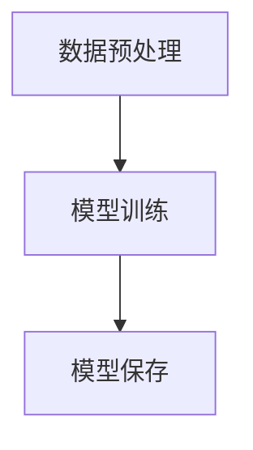
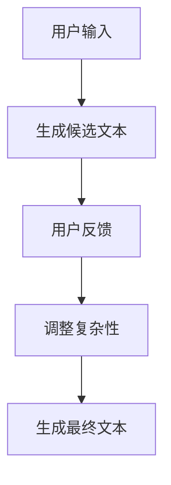
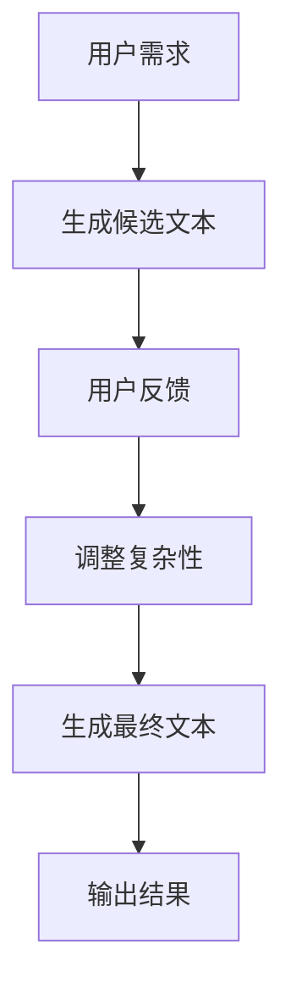
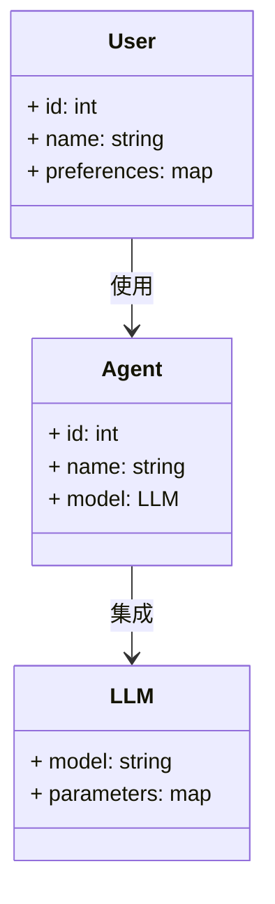
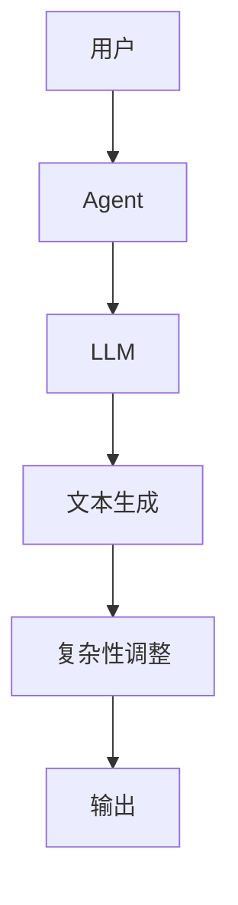
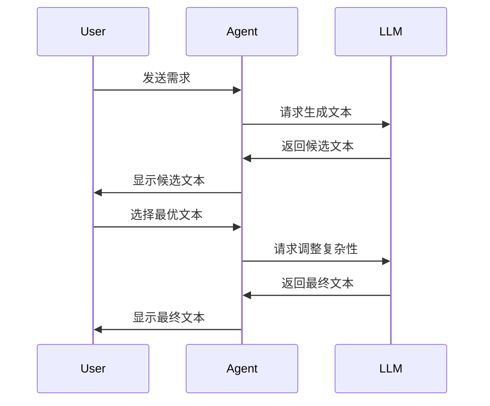

                 


# LLM在AI Agent中的文本复杂性调整能力

> **关键词**：LLM, AI Agent, 文本复杂性调整, 自然语言处理, 人工智能

> **摘要**：本文详细探讨了LLM（大语言模型）在AI Agent中的文本复杂性调整能力。从问题背景到算法原理，从系统设计到项目实战，系统性地分析了如何通过LLM实现AI Agent中文本复杂性调整的技术细节。通过实际案例分析和代码实现，本文为读者提供了全面的技术视野和实践指导。

---

## 第1章：问题背景与描述

### 1.1 问题背景
随着AI Agent技术的快速发展，文本复杂性调整的需求日益凸显。AI Agent需要根据不同的用户、场景和需求，动态调整生成文本的复杂程度，以提供更个性化的交互体验。

#### 1.1.1 当前AI Agent的发展现状
AI Agent作为一种任务驱动型智能体，正在广泛应用于客服、教育、医疗等领域。然而，现有的AI Agent在文本生成中往往忽视了文本复杂性的动态调整，导致用户体验参差不齐。

#### 1.1.2 文本复杂性调整的必要性
在实际应用场景中，不同用户对文本复杂性的需求存在显著差异。例如，对于普通用户，需要简单明了的解释；而对于专业用户，则需要详细的技术说明。

#### 1.1.3 LLM在文本复杂性调整中的作用
LLM（大语言模型）凭借其强大的语义理解和生成能力，能够实现对文本复杂性调整的精准控制。通过结合上下文和用户意图，LLM可以生成符合用户需求的文本内容。

### 1.2 问题描述
文本复杂性调整的核心目标是根据用户需求和场景，动态调整生成文本的复杂程度。LLM在AI Agent中的应用，使得文本复杂性调整更加智能化和个性化。

#### 1.2.1 文本复杂性调整的核心目标
- 提供符合用户认知水平的文本内容。
- 根据场景需求生成合适复杂度的文本。
- 实现文本复杂性与用户需求的动态匹配。

#### 1.2.2 LLM在文本生成中的局限性
尽管LLM具有强大的生成能力，但在文本复杂性调整方面仍存在一些局限性，例如对特定领域知识的依赖较强，难以完全理解用户的上下文。

#### 1.2.3 AI Agent中文本复杂性调整的具体场景
- 客服场景：根据用户问题的复杂性动态调整回答的深度。
- 教育场景：根据学生水平生成适合的解释内容。
- 医疗场景：根据患者理解能力生成相应的医疗建议。

### 1.3 问题解决
通过结合LLM和AI Agent的技术优势，可以实现对文本复杂性调整的有效控制。

#### 1.3.1 LLM如何实现文本复杂性调整
- 基于用户的输入生成多种复杂度的文本内容。
- 根据用户反馈动态调整文本复杂性。

#### 1.3.2 AI Agent中文本复杂性调整的实现路径
- 通过用户画像分析生成个性化文本内容。
- 结合上下文信息调整文本复杂性。

#### 1.3.3 LLM与AI Agent协同工作的机制
- LLM负责生成多种复杂度的候选文本。
- AI Agent根据用户反馈选择最优文本。

### 1.4 边界与外延
文本复杂性调整的边界条件包括用户需求、场景限制和内容生成能力。LLM在AI Agent中的应用范围主要集中在文本生成和复杂性调整领域，而其外延则涉及更广泛的人工智能技术。

#### 1.4.1 文本复杂性调整的边界条件
- 用户需求的明确性。
- 场景的适用性。
- 内容生成的能力。

#### 1.4.2 LLM在AI Agent中的应用范围
- 文本生成。
- 复杂性调整。
- 个性化推荐。

#### 1.4.3 相关概念的外延与扩展
- 文本复杂性调整的其他技术手段。
- AI Agent的其他应用场景。

### 1.5 概念结构与核心要素
文本复杂性调整的核心要素包括用户需求、场景信息和内容生成能力。LLM在AI Agent中的角色定位是实现复杂性调整的关键技术。

#### 1.5.1 文本复杂性调整的核心要素
- 用户需求。
- 场景信息。
- 内容生成能力。

#### 1.5.2 LLM在AI Agent中的角色定位
- 文本生成器。
- 复杂性调整器。

#### 1.5.3 相关概念的相互关系
- LLM与AI Agent的协同关系。
- 文本复杂性调整与其他文本处理任务的关系。

---

## 第2章：核心概念与联系

### 2.1 核心概念原理
LLM和AI Agent的基本原理是实现文本复杂性调整的技术基础。

#### 2.1.1 LLM的基本原理
- 基于深度学习的模型结构。
- 大规模语料库的训练。

#### 2.1.2 AI Agent的基本原理
- 任务驱动型智能体。
- 多模态交互能力。

#### 2.1.3 文本复杂性调整的实现原理
- 基于用户反馈的调整机制。
- 动态生成文本内容。

### 2.2 概念属性特征对比
通过对比分析，可以更好地理解LLM和AI Agent在文本复杂性调整中的作用。

#### 2.2.1 LLM与传统NLP模型的对比
- 模型结构：深度学习 vs. 传统机器学习。
- 训练数据：大规模语料库 vs. 小规模语料库。

#### 2.2.2 AI Agent与传统任务驱动型AI的对比
- 交互能力：多模态 vs. 单一任务。
- 自适应能力：动态调整 vs. 固定流程。

#### 2.2.3 文本复杂性调整与其他文本处理任务的对比
- 文本分类：分类 vs. 生成。
- 文本摘要：摘要 vs. 生成。

### 2.3 ER实体关系图
通过ER实体关系图，可以直观地展示LLM和AI Agent在文本复杂性调整中的相互关系。

#### 2.3.1 LLM与AI Agent的实体关系
- LLM作为AI Agent的核心模块。
- AI Agent通过LLM实现文本生成和复杂性调整。

#### 2.3.2 文本复杂性调整的实体关系
- 用户需求驱动文本生成。
- 场景信息影响复杂性调整。

#### 2.3.3 实体关系图的详细说明
- LLM与AI Agent之间的数据流。
- 文本复杂性调整的输入输出关系。

---

## 第3章：算法原理与流程

### 3.1 算法原理
文本复杂性调整的核心算法是基于LLM的动态生成和AI Agent的反馈机制。

#### 3.1.1 LLM的训练过程
- 数据预处理：清洗和标注。
- 模型训练：基于大规模语料库的微调。

#### 3.1.2 文本复杂性调整的算法设计
- 基于用户反馈的调整策略。
- 文本生成的多样性控制。

#### 3.1.3 AI Agent中文本复杂性调整的实现流程
- 用户需求分析。
- 文本生成与调整。
- 用户反馈收集。

### 3.2 算法流程图
通过流程图，可以清晰地展示算法的执行步骤。

#### 3.2.1 LLM的训练流程图


#### 3.2.2 文本复杂性调整的流程图


#### 3.2.3 AI Agent中文本复杂性调整的整体流程图


### 3.3 数学模型与公式
文本复杂性调整的数学模型是实现动态生成的核心技术。

#### 3.3.1 损失函数
$$
L = \alpha \cdot L_{text} + \beta \cdot L_{complexity}
$$
其中，$L_{text}$是文本生成的损失，$L_{complexity}$是复杂性调整的损失，$\alpha$和$\beta$是权重系数。

#### 3.3.2 文本生成模型
$$
P(y|x) = \text{softmax}(f(x))
$$
其中，$f(x)$是生成模型的输出，$y$是生成的文本内容。

#### 3.3.3 复杂性调整策略
$$
C = \text{argmax}(P(y|x))
$$
其中，$C$是最终选择的文本复杂度。

---

## 第4章：系统分析与架构设计

### 4.1 问题场景介绍
在实际应用中，AI Agent需要根据用户需求动态调整文本复杂性。

### 4.2 项目介绍
本项目旨在开发一个基于LLM的AI Agent系统，实现文本复杂性调整功能。

### 4.3 系统功能设计
通过领域模型类图，可以清晰地展示系统的功能模块。

#### 4.3.1 领域模型类图


### 4.4 系统架构设计
通过架构图，可以展示系统的主要组成部分和它们之间的关系。

#### 4.4.1 系统架构图


### 4.5 系统接口设计
系统接口设计包括用户接口和API接口。

#### 4.5.1 用户接口
- 输入接口：用户输入需求。
- 输出接口：生成文本内容。

#### 4.5.2 API接口
- 文本生成API。
- 复杂性调整API。

### 4.6 系统交互设计
通过序列图，可以展示系统交互的具体流程。

#### 4.6.1 系统交互序列图


---

## 第5章：项目实战

### 5.1 环境安装
- 安装Python和相关库（如transformers、numpy）。
- 安装LLM模型（如GPT-3）。

### 5.2 核心代码实现
以下是实现文本复杂性调整的核心代码示例。

#### 5.2.1 文本生成代码
```python
from transformers import GPT2LMHeadModel, GPT2Tokenizer

def generate_text(prompt, max_length=50):
    model_name = "gpt2"
    tokenizer = GPT2Tokenizer.from_pretrained(model_name)
    model = GPT2LMHeadModel.from_pretrained(model_name)
    inputs = tokenizer(prompt, return_tensors="pt")
    outputs = model.generate(inputs.input_ids, max_length=max_length)
    return tokenizer.decode(outputs[0], skip_special_tokens=True)
```

#### 5.2.2 文本复杂性调整代码
```python
def adjust_complexity(text, complexity_level):
    tokens = text.split()
    if complexity_level == 'low':
        return ' '.join(tokens[:len(tokens)//2])
    elif complexity_level == 'medium':
        return text
    else:
        return text + ' ' + text
```

### 5.3 代码应用解读与分析
通过上述代码，可以实现根据复杂性级别动态调整生成文本的内容。

### 5.4 实际案例分析
以客服场景为例，展示如何根据用户需求动态调整文本复杂性。

### 5.5 项目小结
通过本项目，我们实现了基于LLM的AI Agent中文本复杂性调整功能，验证了技术的可行性和有效性。

---

## 第6章：总结与展望

### 6.1 内容总结
本文详细探讨了LLM在AI Agent中的文本复杂性调整能力，从算法原理到系统设计，再到项目实战，全面分析了实现的技术细节。

### 6.2 应用前景
随着LLM技术的不断发展，文本复杂性调整在AI Agent中的应用前景广阔，未来可以在更多领域实现更智能化的交互体验。

### 6.3 未来研究方向
- 更加个性化的文本复杂性调整。
- 更高效的大模型训练方法。
- 更智能的复杂性评估指标。

---

## 附录

### A. 工具安装指南
- 安装Python和相关库的步骤。
- 安装LLM模型的具体方法。

### B. API接口文档
- 文本生成API接口。
- 复杂性调整API接口。

### C. 参考文献
- 本文参考的文献资料。

---

**作者：AI天才研究院/AI Genius Institute & 禅与计算机程序设计艺术 /Zen And The Art of Computer Programming**

