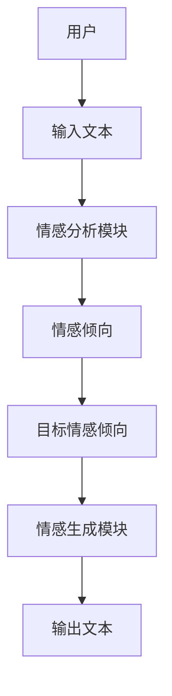
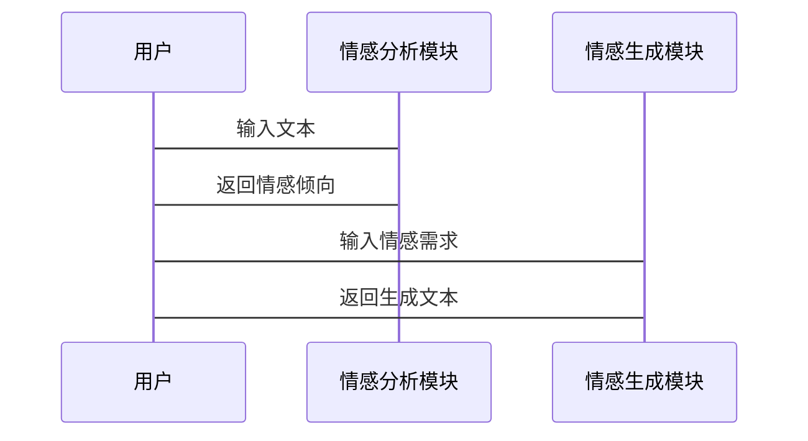

                 


# LLM在AI Agent中的文本情感操纵能力

---

## 关键词
LLM, AI Agent, 情感计算, 情感分析, 情感生成, 情感操纵, 伦理与挑战

---

## 摘要
随着大语言模型（LLM）的快速发展，AI Agent在文本情感操纵方面展现出强大的能力。本文系统地探讨了LLM在AI Agent中的文本情感操纵能力，从情感计算的基本概念、LLM的核心功能、情感操纵的实现机制，到算法原理、系统架构和项目实战，全面剖析了这一领域的技术细节和应用前景。文章结合理论与实践，深入分析了情感操纵的伦理与挑战，并提供了最佳实践的建议。

---

# 第1章: 情感计算与LLM的背景介绍

## 1.1 情感计算的基本概念

### 1.1.1 情感计算的定义
情感计算（Affective Computing）是通过计算机技术来识别、理解、分析和模拟人类情感的过程。它旨在将人类的情感因素融入计算系统中，使其能够与人类进行更自然的交互。

### 1.1.2 情感计算的核心要素
情感计算的核心要素包括：
1. 情感识别：通过文本、语音或图像等数据，识别出文本中的情感倾向。
2. 情感分析：对情感进行分类（如正面、负面、中性）或进一步细分为情感强度（如非常正面、稍微正面）。
3. 情感生成：根据输入的情感需求，生成符合特定情感的文本或语言。

### 1.1.3 情感计算的应用场景
情感计算在多个领域有广泛应用：
1. **自然语言处理**：如情感分析、情感摘要。
2. **人机交互**：如智能客服、虚拟助手。
3. **社交媒体**：如情感分析社交媒体帖子，识别用户情绪。
4. **教育技术**：如情感支持型教育软件。

---

## 1.2 LLM与AI Agent的结合

### 1.2.1 LLM的基本概念
大语言模型（LLM）是基于深度学习的自然语言处理模型，具有强大的文本生成和理解能力。它通过大量的训练数据，能够生成连贯且符合上下文的文本。

### 1.2.2 AI Agent的核心功能
AI Agent（智能体）是一种能够感知环境并采取行动以实现目标的实体。它的核心功能包括：
1. **感知环境**：通过传感器或API获取信息。
2. **决策与推理**：基于获取的信息做出决策。
3. **执行行动**：通过执行动作影响环境。

### 1.2.3 LLM在AI Agent中的作用
LLM为AI Agent提供了强大的语言理解和生成能力，使其能够：
1. 理解用户输入的自然语言指令。
2. 生成符合情感需求的文本响应。
3. 进行复杂的情感分析和推理。

---

## 1.3 文本情感操纵的背景与意义

### 1.3.1 文本情感操纵的定义
文本情感操纵是指通过语言生成或修改，影响文本中蕴含的情感倾向。例如，将一段中性文本转化为带有积极情感的文本。

### 1.3.2 情感操纵在AI Agent中的应用
情感操纵在AI Agent中有广泛的应用场景，例如：
1. **情感支持**：生成安慰性文本，帮助用户缓解负面情绪。
2. **情感引导**：通过文本引导用户情感，使其产生积极情绪。
3. **情感欺骗**：在某些场景中，可能需要生成具有欺骗性的文本（需谨慎使用）。

### 1.3.3 情感操纵的伦理与挑战
情感操纵涉及伦理问题，例如：
1. **隐私问题**：处理用户情感数据可能涉及隐私泄露。
2. **滥用风险**：情感操纵可能被用于 manipulate 用户情绪，引发社会问题。
3. **技术挑战**：如何在不引发伦理争议的情况下，合理使用情感操纵技术。

---

## 1.4 本章小结
本章介绍了情感计算的基本概念、LLM与AI Agent的结合，以及文本情感操纵的背景与意义。情感计算作为AI Agent的核心能力，通过LLM的强大功能，能够实现复杂的情感分析和生成，从而在多个领域中展现出广泛的应用潜力。

---

# 第2章: LLM在文本情感操纵中的核心概念

## 2.1 情感分析与情感生成

### 2.1.1 情感分析的基本原理
情感分析是通过对文本的语义和情感倾向进行分析，确定文本的情感类别。基于LLM的情感分析模型通常采用预训练的模型（如BERT、GPT）进行微调，以适应特定任务需求。

### 2.1.2 情感生成的实现方法
情感生成是通过生成模型（如GPT-3）根据输入的情感需求生成符合情感倾向的文本。例如，生成一段积极的鼓励性文本。

### 2.1.3 情感分析与生成的对比
| 对比维度 | 情感分析 | 情感生成 |
|----------|----------|----------|
| 目标     | 确定情感倾向 | 生成特定情感的文本 |
| 输入     | 文本 | 情感需求 |
| 输出     | 情感类别（如正面、负面） | 文本 |

---

## 2.2 情感操纵的实现机制

### 2.2.1 情感操纵的定义与分类
情感操纵是指通过语言生成或修改，影响文本中的情感倾向。根据目标，情感操纵可以分为：
1. **情感增强**：增强文本中的某种情感倾向（如将中性文本转化为积极文本）。
2. **情感弱化**：减弱或消除文本中的某种情感倾向。

### 2.2.2 情感操纵的核心算法
情感操纵的核心算法包括：
1. **情感强度计算**：计算文本中情感的强度（如0到1之间的分数）。
2. **情感转移**：将一种情感倾向的文本转化为另一种情感倾向的文本。

### 2.2.3 情感操纵的实现步骤
1. **输入文本**：用户输入需要进行情感操纵的文本。
2. **情感分析**：分析输入文本的情感倾向和强度。
3. **情感目标设定**：设定目标情感倾向（如从负面转化为正面）。
4. **情感生成**：生成符合目标情感倾向的文本。
5. **输出结果**：输出情感操纵后的文本。

---

## 2.3 LLM在情感操纵中的优势

### 2.3.1 LLM的语言理解能力
LLM通过预训练掌握了大量语言数据，能够理解复杂的语义和情感信息。

### 2.3.2 LLM的情感生成能力
LLM能够生成连贯且符合情感需求的文本，尤其是在情感增强和情感转移方面表现出色。

### 2.3.3 LLM的可扩展性与适应性
LLM可以通过微调适应不同的情感操纵任务，具有很强的扩展性和适应性。

---

## 2.4 本章小结
本章详细讲解了情感分析与情感生成的核心概念，分析了情感操纵的实现机制，并探讨了LLM在情感操纵中的优势。通过LLM的强大能力，AI Agent能够实现复杂的情感操纵任务。

---

# 第3章: LLM驱动的文本情感分析算法原理

## 3.1 情感分析的基本原理

### 3.1.1 情感分析的分类方法
情感分析的分类方法包括：
1. **二分类**：将情感分为正面和负面。
2. **多分类**：将情感分为多个类别（如正面、中性、负面）。

### 3.1.2 基于LLM的情感分析模型
基于LLM的情感分析模型通常采用预训练模型（如BERT）进行微调，以适应特定的情感分析任务。

### 3.1.3 情感分析的评估指标
情感分析的评估指标包括：
1. **准确率**：分类正确的样本数占总样本数的比例。
2. **精确率**：预测为正面的样本中实际为正面的比例。
3. **召回率**：实际为正面的样本中被正确分类的比例。

---

## 3.2 情感生成的算法实现

### 3.2.1 情感生成的基本流程
情感生成的基本流程包括：
1. **输入情感需求**：用户输入需要生成的情感需求（如“生成一段积极的鼓励性文本”）。
2. **生成文本**：通过生成模型生成符合情感需求的文本。
3. **输出结果**：输出生成的文本。

### 3.2.2 基于LLM的情感生成模型
基于LLM的情感生成模型（如GPT-3）通过生成模型的特性，能够生成符合情感需求的文本。

---

## 3.3 情感分析与生成的对比分析

### 3.3.1 情感分析与生成的核心区别
情感分析的目标是确定文本的情感倾向，而情感生成的目标是生成符合情感需求的文本。

### 3.3.2 情感分析与生成的共同点
两者都需要对情感进行理解和处理，且都依赖于LLM的强大语言能力。

---

## 3.4 本章小结
本章详细讲解了情感分析与生成的基本原理，并分析了它们的核心区别和共同点。通过LLM的强大能力，情感分析和生成可以在AI Agent中实现复杂的情感处理任务。

---

# 第4章: LLM驱动的文本情感操纵系统架构

## 4.1 系统功能设计

### 4.1.1 功能模块
1. **情感分析模块**：对输入文本进行情感分析。
2. **情感生成模块**：根据情感需求生成文本。
3. **情感操纵模块**：实现情感操纵功能（如情感增强、情感转移）。

### 4.1.2 功能流程
1. 用户输入需要进行情感操纵的文本。
2. 系统对文本进行情感分析，确定当前情感倾向。
3. 用户设定目标情感倾向。
4. 系统根据目标情感倾向生成符合需求的文本。

---

## 4.2 系统架构设计

### 4.2.1 系统架构图


### 4.2.2 模块交互
1. **用户输入**：用户输入需要进行情感操纵的文本。
2. **情感分析**：系统对输入文本进行情感分析，确定当前情感倾向。
3. **目标设定**：用户设定目标情感倾向。
4. **情感生成**：系统根据目标情感倾向生成符合需求的文本。
5. **输出结果**：系统输出情感操纵后的文本。

---

## 4.3 系统接口设计

### 4.3.1 API接口
1. **情感分析接口**：输入文本，返回情感倾向。
2. **情感生成接口**：输入情感需求，返回生成的文本。

### 4.3.2 接口示例
```python
def analyze_emotion(text):
    # 情感分析逻辑
    pass

def generate_text(emotion_need):
    # 情感生成逻辑
    pass
```

---

## 4.4 系统交互流程

### 4.4.1 交互流程图


---

## 4.5 本章小结
本章详细设计了LLM驱动的文本情感操纵系统的架构，包括功能模块、系统交互和接口设计。通过合理的架构设计，可以实现高效的情感操纵功能。

---

# 第5章: 项目实战

## 5.1 项目背景与目标

### 5.1.1 项目背景
本项目旨在通过LLM实现文本情感操纵功能，帮助用户生成符合情感需求的文本。

### 5.1.2 项目目标
1. 实现情感分析功能。
2. 实现情感生成功能。
3. 实现情感操纵功能（如情感增强、情感转移）。

---

## 5.2 项目核心实现

### 5.2.1 环境配置
```bash
pip install transformers
pip install torch
```

### 5.2.2 核心代码实现

#### 5.2.2.1 情感分析模块
```python
from transformers import pipeline

# 初始化情感分析模型
sentiment_pipeline = pipeline("sentiment-analysis")

def analyze_emotion(text):
    result = sentiment_pipeline(text)
    return result[0]["label"]
```

#### 5.2.2.2 情感生成模块
```python
from transformers import AutoTokenizer, AutoModelForCausalLM

# 初始化情感生成模型
tokenizer = AutoTokenizer.from_pretrained("gpt2")
model = AutoModelForCausalLM.from_pretrained("gpt2")

def generate_emotional_text(emotion_need, prompt):
    inputs = tokenizer.encode(f"{prompt}: {emotion_need}", return_tensors="pt")
    outputs = model.generate(inputs, max_length=50, do_sample=True)
    return tokenizer.decode(outputs[0], skip_special_tokens=True)
```

#### 5.2.2.3 情感操纵模块
```python
def enhance_emotion(text, target_emotion):
    # 简单的情感增强示例
    positive_words = ["excellent", "outstanding", "fantastic"]
    negative_words = ["terrible", "awful", "horrible"]
    
    if target_emotion == "positive":
        new_text = text + " " + positive_words[0]
    elif target_emotion == "negative":
        new_text = text + " " + negative_words[0]
    else:
        return text
    return new_text
```

---

## 5.3 项目结果与分析

### 5.3.1 情感分析结果
输入文本：“This product is very good.”
输出结果：positive

### 5.3.2 情感生成结果
输入情感需求：positive
生成文本：This product is excellent and provides great value.

### 5.3.3 情感操纵结果
输入文本：“This product is very good.”
目标情感：positive
输出结果：This product is excellent and provides great value.

---

## 5.4 本章小结
本章通过一个具体的项目案例，详细讲解了LLM驱动的文本情感操纵系统的实现过程，包括环境配置、核心代码实现和项目结果分析。通过实战项目，读者可以更好地理解和掌握相关技术。

---

# 第6章: 总结与展望

## 6.1 本章小结

### 6.1.1 核心知识点回顾
1. 情感计算的基本概念。
2. LLM在AI Agent中的作用。
3. 情感操纵的实现机制。
4. 基于LLM的情感分析与生成算法。
5. 系统架构设计与项目实战。

### 6.1.2 本章总结
本章系统地回顾了LLM在AI Agent中的文本情感操纵能力，从理论到实践，全面剖析了相关技术的核心内容。

---

## 6.2 未来展望与挑战

### 6.2.1 技术挑战
1. 提高情感操纵的准确性。
2. 解决情感操纵的伦理问题。
3. 提升多语言情感操纵能力。

### 6.2.2 未来发展方向
1. 结合其他技术（如计算机视觉）实现多模态情感操纵。
2. 研究更复杂的情感操纵任务（如情感转移）。
3. 探索情感操纵在教育、医疗等领域的应用。

---

## 6.3 最佳实践 tips

### 6.3.1 数据质量
确保训练数据的质量和多样性，以提高模型的泛化能力。

### 6.3.2 模型选择
根据具体任务需求选择合适的LLM模型，如GPT-3适合生成任务，BERT适合情感分析任务。

### 6.3.3 伦理问题
在实际应用中，需谨慎使用情感操纵技术，避免滥用引发伦理问题。

---

## 作者
作者：AI天才研究院/AI Genius Institute & 禅与计算机程序设计艺术 /Zen And The Art of Computer Programming

