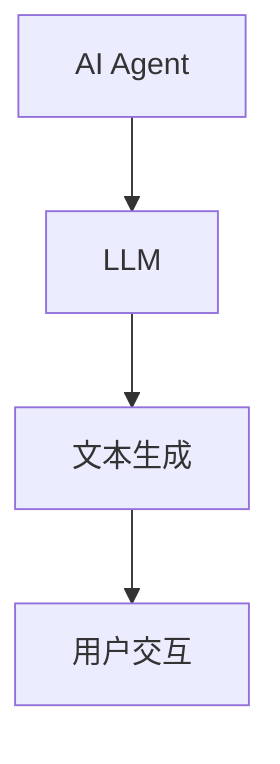
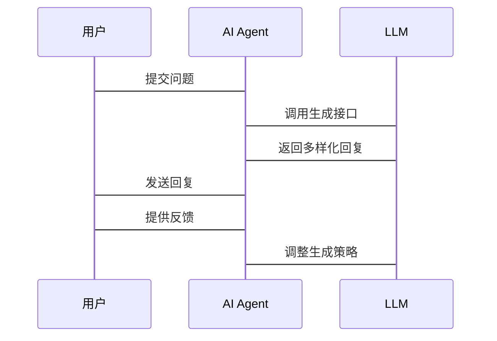

                 


# LLM在AI Agent中的文本生成多样性增强

> 关键词：大语言模型，AI Agent，文本生成，多样性增强，生成对抗网络，AI系统架构

> 摘要：本文详细探讨了如何通过大语言模型（LLM）增强AI Agent中的文本生成多样性。文章从问题背景出发，分析了当前AI Agent文本生成的挑战，并结合LLM的核心原理，提出了多样性的增强策略。通过对比分析和案例研究，深入阐述了算法实现、系统架构设计及实际应用中的最佳实践。

---

# 第一部分: 背景介绍

## 第1章: 问题背景

### 1.1 当前AI Agent文本生成的挑战
在AI Agent的实际应用中，文本生成是其核心功能之一。然而，现有的文本生成技术在多样性方面存在明显不足。例如，在客服系统中，AI Agent生成的回复常常显得机械和重复，缺乏人性化和灵活性。这种单一性不仅影响用户体验，还限制了AI Agent在复杂场景中的应用能力。

### 1.2 问题描述
文本生成的多样性不足主要体现在以下方面：
1. **内容单一性**：生成的文本缺乏变化，无法适应不同用户的需求。
2. **语境适应性差**：无法根据上下文灵活调整生成内容。
3. **情感表达受限**：生成的文本缺乏情感多样性，难以满足情感化交互的需求。

### 1.3 问题解决
引入大语言模型（LLM）是解决上述问题的关键。LLM具有强大的文本生成能力，能够通过大规模数据训练，生成多样化的文本内容。结合AI Agent的任务执行能力，LLM可以显著提升文本生成的多样性和灵活性。

### 1.4 边界与外延
在讨论LLM与AI Agent结合时，需要明确其应用边界。例如，LLM并非适用于所有类型的文本生成场景，其优势主要体现在需要多样化、复杂化生成内容的场景中。此外，文本生成的多样性增强需要在保证生成内容准确性的同时，注重内容的创新性和适应性。

---

## 第2章: 核心概念与联系

### 2.1 LLM的核心原理
大语言模型通过深度学习技术，利用海量数据进行预训练，掌握了丰富的语言模式和上下文关系。其生成机制基于概率分布，能够生成与输入上下文高度相关的内容。这种机制使得LLM在生成文本时具有高度的灵活性和多样性。

### 2.2 AI Agent的核心原理
AI Agent是一种智能代理系统，能够感知环境、理解用户需求，并通过执行任务来满足这些需求。其核心在于任务分解、决策制定和执行优化能力。AI Agent的文本生成能力是其与用户交互的重要组成部分。

### 2.3 LLM与AI Agent的关系
LLM作为AI Agent的核心模块，负责生成多样化的文本内容。AI Agent则通过任务分解和上下文理解，为LLM提供生成目标和上下文信息。两者的结合实现了高度智能化和个性化的文本生成。

---

## 第3章: 算法原理

### 3.1 基于生成对抗网络（GAN）的文本生成
生成对抗网络通过生成器和判别器的对抗训练，不断提升生成文本的质量和多样性。在文本生成任务中，生成器负责生成多样化的文本内容，而判别器则负责评估生成文本的真实性。

#### GAN的数学模型
生成器和判别器的优化目标分别为：
$$
\min_{G} \max_{D} \mathbb{E}_{x \sim p_{\text{data}}(x)}[\log D(x)] + \mathbb{E}_{z \sim p_{z}(z)}[\log (1 - D(G(z)))]
$$

其中，$G$是生成器，$D$是判别器，$x$是真实数据，$z$是噪声输入。

---

## 第4章: 系统分析与架构设计

### 4.1 项目介绍
以一个智能客服系统为例，AI Agent需要通过对话生成多样化的回复，提升用户体验。

### 4.2 系统功能设计
1. **用户输入解析**：识别用户需求和情感倾向。
2. **上下文理解**：构建对话上下文，提供生成目标。
3. **文本生成**：调用LLM生成多样化的回复内容。
4. **反馈优化**：根据用户反馈调整生成策略。

### 4.3 系统架构设计


### 4.4 系统交互设计


---

## 第5章: 项目实战

### 5.1 环境安装
安装必要的依赖包：
```
pip install transformers torch
```

### 5.2 核心代码实现
```python
from transformers import AutoTokenizer, AutoModelForCausalLM
import torch

tokenizer = AutoTokenizer.from_pretrained('gpt2')
model = AutoModelForCausalLM.from_pretrained('gpt2')

def generate_diverse_text(prompt, max_length=50):
    inputs = tokenizer.encode(prompt, return_tensors='pt')
    outputs = model.generate(inputs, max_length=max_length, do_sample=True, temperature=1.2)
    return tokenizer.decode(outputs[0], skip_special_tokens=True)
```

### 5.3 案例分析
在智能客服系统中，生成多样化的回复可以显著提升用户满意度。通过调整生成参数，可以根据不同用户的情感倾向生成相应的回复，从而实现个性化的服务。

---

## 第6章: 最佳实践

### 6.1 小结
通过引入LLM，AI Agent的文本生成能力得到了显著提升。多样化的生成策略和灵活的系统架构设计是实现这一目标的关键。

### 6.2 注意事项
1. **参数调整**：根据具体场景调整生成参数，如温度和采样策略。
2. **数据质量**：确保训练数据的多样性和代表性。
3. **性能优化**：优化生成过程，减少计算开销。

### 6.3 拓展阅读
推荐阅读以下内容：
1. 《生成对抗网络：算法与应用》
2. 《大语言模型在自然语言处理中的应用》

---

## 作者
作者：AI天才研究院 & 禅与计算机程序设计艺术

