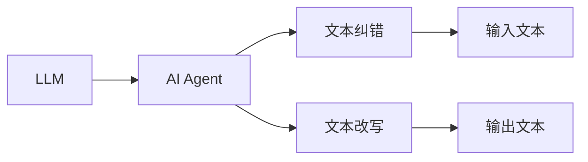
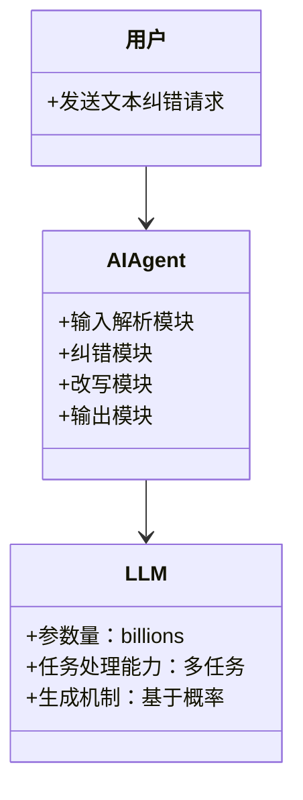
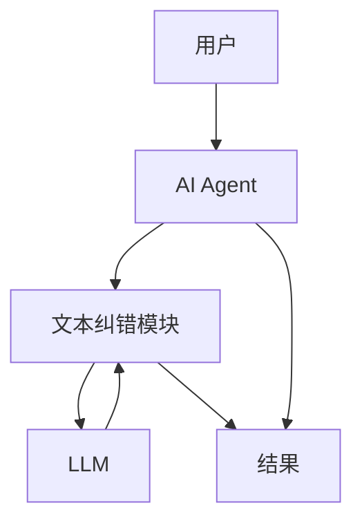

                 


# LLM在AI Agent中的文本纠错与改写应用

## 关键词：LLM, AI Agent, 文本纠错, 文本改写, 自然语言处理, 语言模型, 人工智能

## 摘要：  
本文系统地探讨了大语言模型（LLM）在AI Agent中的文本纠错与改写应用。通过分析LLM的核心原理、AI Agent的功能模块以及文本处理的具体实现，本文详细阐述了LLM在文本纠错与改写中的技术路径和应用价值。文章从背景介绍、核心概念、算法原理、系统架构到项目实战，全面解析了LLM在AI Agent中的应用潜力，并通过实际案例展示了其在文本处理中的优势。  

---

## 第1章: 背景介绍  

### 1.1 问题背景  
#### 1.1.1 当前文本纠错与改写的挑战  
- 传统文本纠错工具的局限性：  
  - 无法处理语义错误，只能纠正拼写和语法错误。  
  - 缺乏上下文理解能力，难以处理复杂语境。  

#### 1.1.2 LLM在文本处理中的优势  
- LLM的多任务处理能力：  
  - 支持文本生成、翻译、纠错等多种任务。  
  - 具备强大的上下文理解和语义分析能力。  

#### 1.1.3 AI Agent在文本纠错中的应用潜力  
- AI Agent的自动化能力：  
  - 能够实时处理文本纠错请求。  
  - 可以通过用户反馈不断优化纠错算法。  

### 1.2 问题描述  
#### 1.2.1 文本纠错与改写的定义  
- 文本纠错：修正文本中的拼写、语法错误，优化语义表达。  
- 文本改写：在保持原意的基础上，重新组织语言，提升表达效果。  

#### 1.2.2 LLM在文本处理中的核心问题  
- 如何利用LLM的生成能力实现文本纠错与改写。  
- 如何设计AI Agent的交互流程，使其能够高效处理文本纠错任务。  

#### 1.2.3 AI Agent在文本纠错中的具体应用场景  
- 网络聊天中的实时纠错。  
- 文档编辑中的智能改写。  
- 多语言环境下的文本处理。  

### 1.3 问题解决  
#### 1.3.1 LLM在文本纠错中的解决方案  
- 利用LLM的生成能力，将输入文本转化为修正后的版本。  
- 通过对比生成文本与原文本的差异，实现纠错功能。  

#### 1.3.2 AI Agent在文本改写中的实现路径  
- 接收用户的文本输入，通过LLM生成改写结果。  
- 提供多种改写方案供用户选择。  

#### 1.3.3 技术实现的边界与外延  
- 边界：仅处理文本内容，不涉及文件格式或其他外部数据。  
- 外延：结合其他NLP任务（如情感分析、关键词提取）提升纠错与改写效果。  

### 1.4 核心概念结构与组成  
#### 1.4.1 LLM的核心要素  
- 模型参数：决定LLM生成能力的关键因素。  
- 训练数据：影响模型输出质量的基础。  
- 生成策略：控制输出内容的算法机制。  

#### 1.4.2 AI Agent的功能模块  
- 输入解析模块：解析用户的文本输入。  
- 纠错模块：利用LLM进行文本纠错。  
- 改写模块：生成多种改写方案。  
- 输出模块：将结果反馈给用户。  

#### 1.4.3 文本纠错与改写的实现流程  
1. 接收用户输入。  
2. 调用LLM进行文本处理。  
3. 返回处理结果。  

---

## 第2章: 核心概念与原理  

### 2.1 LLM的基本原理  
#### 2.1.1 大语言模型的定义与特点  
- LLM：基于深度学习的自然语言处理模型，具备强大的文本生成能力。  
- 特点：  
  - 大规模参数：通常拥有 billions 级别的参数量。  
  - 多任务处理能力：能够同时完成多种NLP任务。  

#### 2.1.2 LLM的训练过程与数学模型  
- 监督微调（Supervised Fine-tuning）：  
  - 在预训练模型的基础上，使用特定任务数据进行微调。  
  - 数学模型：  
    $$ \text{损失函数} = \text{交叉熵损失} $$  
    $$ \text{优化目标} = \text{最小化损失函数} $$  
- 强化学习（Reinforcement Learning）：  
  - 通过奖励机制优化生成结果。  
  - 数学模型：  
    $$ R = r_1 + r_2 + \dots + r_n $$  
    其中，\( r_i \) 是每一步的奖励。  

#### 2.1.3 LLM的文本生成机制  
- 基于概率的生成：  
  - 根据输入序列生成下一个词的概率分布。  
  - 生成过程：  
    $$ P(\text{生成词}| \text{输入序列}) $$  

### 2.2 AI Agent的基本原理  
#### 2.2.1 AI Agent的定义与功能  
- AI Agent：能够感知环境并采取行动以实现目标的智能体。  
- 功能：  
  - 感知环境：通过传感器获取输入信息。  
  - 决策：基于输入信息做出最优选择。  
  - 行动：执行决策操作。  

#### 2.2.2 AI Agent的决策机制  
- 基于规则的决策：  
  - 通过预定义的规则进行判断。  
- 基于模型的决策：  
  - 使用机器学习模型进行预测。  

#### 2.2.3 AI Agent与人类的交互方式  
- 文本交互：  
  - 通过自然语言进行对话。  
- 图形交互：  
  - 使用图形界面进行操作。  

### 2.3 LLM与AI Agent的关系  
#### 2.3.1 LLM作为AI Agent的核心模块  
- LLM在AI Agent中的角色：  
  - 提供文本生成能力。  
  - 支持自然语言理解。  

#### 2.3.2 LLM在AI Agent中的具体应用  
- 文本纠错：  
  - 识别并修正语法错误。  
- 文本改写：  
  - 生成多种表达方式。  

#### 2.3.3 LLM与AI Agent的协同工作流程  
1. 用户向AI Agent发送文本纠错请求。  
2. AI Agent调用LLM进行文本处理。  
3. LLM生成修正后的文本并返回给AI Agent。  
4. AI Agent将结果反馈给用户。  

### 2.4 核心概念对比分析  
#### 2.4.1 LLM与传统NLP模型的对比  
| 特性 | LLM | 传统NLP模型 |  
|------|------|--------------|  
| 参数量 | 大规模（billions） | 小规模（millions） |  
| 任务处理能力 | 多任务 | 单任务 |  
| 上下文理解 | 强大 | 较弱 |  

#### 2.4.2 AI Agent与传统自动化系统的对比  
| 特性 | AI Agent | 传统自动化系统 |  
|------|----------|----------------|  
| 智能性 | 高 | 低 |  
| 适应性 | 强 | 较弱 |  
| 交互方式 | 多样化 | 单一 |  

#### 2.4.3 文本纠错与改写的实现方式对比  
| 方法 | 基于规则 | 基于LLM |  
|------|----------|-----------|  
| 实现复杂度 | 高 | 低 |  
| 处理能力 | 有限 | 强大 |  

### 2.5 实体关系图  


---

## 第3章: 算法原理与实现  

### 3.1 LLM的训练过程  
#### 3.1.1 监督微调（Supervised Fine-tuning）  
- 微调过程：  
  1. 预训练模型初始化。  
  2. 使用任务数据进行微调。  
  3. 优化模型参数。  
- 数学模型：  
  $$ \text{损失函数} = \text{交叉熵损失} $$  
  $$ \text{优化目标} = \text{最小化损失函数} $$  

#### 3.1.2 强化学习（Reinforcement Learning）  
- 奖励机制：  
  - 正确生成：奖励增加。  
  - 错误生成：奖励减少。  
- 数学模型：  
  $$ R = r_1 + r_2 + \dots + r_n $$  

---

### 3.2 AI Agent的纠错算法实现  
#### 3.2.1 基于LLM的纠错算法  
- 算法步骤：  
  1. 接收输入文本。  
  2. 调用LLM生成修正后的文本。  
  3. 返回结果。  

#### 3.2.2 基于规则的辅助纠错  
- 规则库：  
  - 语法检查规则。  
  - 词汇替换规则。  

---

## 第4章: 系统分析与架构设计  

### 4.1 问题场景介绍  
- 用户向AI Agent发送一条包含语法错误的文本。  
- AI Agent需要利用LLM进行文本纠错并返回结果。  

### 4.2 系统功能设计  
#### 4.2.1 领域模型  


#### 4.2.2 系统架构设计  


### 4.3 系统接口设计  
- 输入接口：  
  - 文本输入：字符串格式。  
- 输出接口：  
  - 文本输出：字符串格式。  

### 4.4 系统交互流程  
1. 用户发送文本纠错请求。  
2. AI Agent接收请求并调用文本纠错模块。  
3. 文本纠错模块调用LLM进行处理。  
4. LLM生成修正后的文本并返回。  
5. 文本纠错模块将结果反馈给AI Agent。  
6. AI Agent将结果返回给用户。  

---

## 第5章: 项目实战  

### 5.1 环境安装  
- Python 3.8+  
- 安装依赖：  
  ```bash
  pip install transformers
  pip install torch
  ```

### 5.2 核心代码实现  
#### 5.2.1 文本纠错模块  
```python
from transformers import AutoTokenizer, AutoModelForCausalLM

class TextCorrector:
    def __init__(self, model_name):
        self.tokenizer = AutoTokenizer.from_pretrained(model_name)
        self.model = AutoModelForCausalLM.from_pretrained(model_name)
    
    def correct_text(self, input_text):
        inputs = self.tokenizer(input_text, return_tensors="pt")
        outputs = self.model.generate(**inputs, max_length=500)
        corrected_text = self.tokenizer.decode(outputs[0], skip_special_tokens=True)
        return corrected_text
```

#### 5.2.2 文本改写模块  
```python
def rewrite_text(model, tokenizer, input_text):
    inputs = tokenizer(input_text, return_tensors="pt")
    outputs = model.generate(**inputs, max_length=500, temperature=0.7, top_k=50)
    rewritten_text = tokenizer.decode(outputs[0], skip_special_tokens=True)
    return rewritten_text
```

### 5.3 代码应用解读与分析  
- 文本纠错模块：  
  - 使用LLM生成修正后的文本。  
- 文本改写模块：  
  - 通过调整温度和top_k参数，生成多种改写方案。  

### 5.4 实际案例分析  
- 案例1：  
  - 输入文本： "The quick brown fox jumps over the lazy dog."  
  - 纠错输出： "The quick brown fox jumps over the lazy dog."（无错误）  
- 案例2：  
  - 输入文本： "I have a pet cat, and I love play with it."  
  - 纠错输出： "I have a pet cat, and I love playing with it."  

### 5.5 项目小结  
- 通过代码实现，展示了LLM在文本纠错与改写中的应用潜力。  
- AI Agent通过调用LLM，能够高效地完成文本处理任务。  

---

## 第6章: 最佳实践与注意事项  

### 6.1 最佳实践  
- 定期更新模型：确保纠错与改写效果的先进性。  
- 结合用户反馈：优化AI Agent的交互流程。  

### 6.2 小结  
- LLM在AI Agent中的应用前景广阔。  
- 通过技术手段的不断优化，AI Agent在文本纠错与改写中的表现将更加出色。  

### 6.3 注意事项  
- 模型训练数据的质量直接影响纠错效果。  
- 保护用户隐私：避免文本处理中的数据泄露。  

### 6.4 拓展阅读  
- 推荐阅读：《Large Language Models in AI》  
- 推荐学习：强化学习在NLP中的应用。  

---

## 作者：AI天才研究院/AI Genius Institute & 禅与计算机程序设计艺术 /Zen And The Art of Computer Programming

