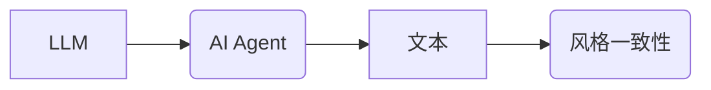
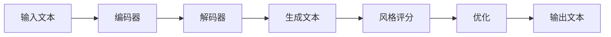
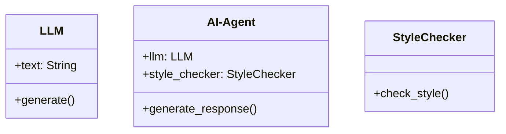
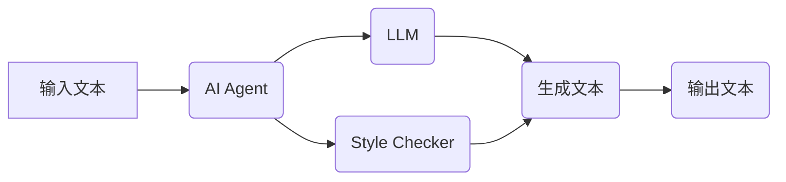
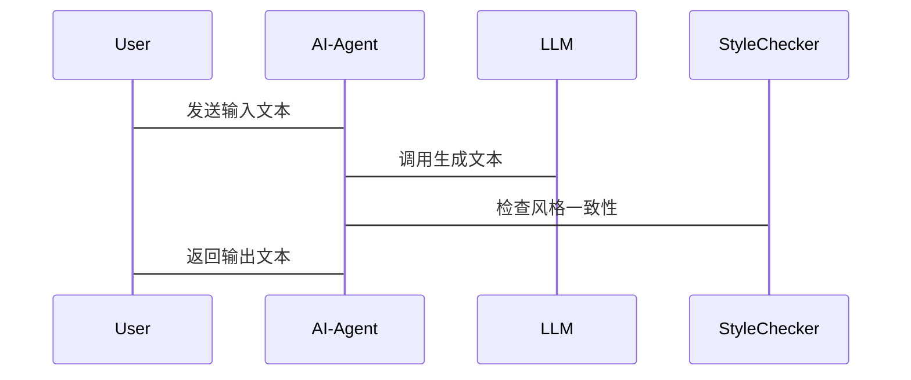

                 


# LLM在AI Agent中的文本风格一致性保持

> 关键词：LLM、AI Agent、文本生成、风格一致性、自然语言处理、人工智能

> 摘要：本文深入探讨了在AI Agent中利用大语言模型（LLM）保持文本风格一致性的关键问题。通过分析LLM与AI Agent的交互机制，本文提出了保持文本风格一致性的解决方案，并详细讲解了相关的算法原理和系统架构设计，最后通过实际案例展示了如何实现这一目标。

---

## 第1章 背景介绍

### 1.1 问题背景

#### 1.1.1 LLM的基本概念
大语言模型（LLM）是指基于深度学习的自然语言处理模型，如GPT系列、BERT系列等。这些模型通过大量数据训练，能够生成连贯且符合语境的文本。LLM的核心在于其强大的文本生成和理解能力，使得它们在各种应用场景中表现出色。

#### 1.1.2 AI Agent的定义与特点
AI Agent（人工智能代理）是一种智能系统，能够感知环境、自主决策并执行任务。AI Agent可以是虚拟助手（如Siri、Alexa）、聊天机器人或自动化工具。其特点是具备自主性、反应性、目标导向性和社会性。

#### 1.1.3 文本风格一致性的意义
在AI Agent与用户交互时，保持文本风格一致性至关重要。这不仅提升用户体验，还能增强AI Agent的可信度和专业性。不一致的文本风格可能导致用户困惑，降低交互效率。

### 1.2 问题描述

#### 1.2.1 LLM在AI Agent中的应用场景
LLM常用于AI Agent的文本生成任务，如对话生成、内容创作和自动回复。这些任务要求生成的文本不仅准确，还要与上下文保持一致的风格。

#### 1.2.2 文本风格一致性问题的提出
在实际应用中，LLM生成的文本可能出现风格漂移，即生成的文本风格与预期不符。例如，一个严肃的客服系统可能突然生成轻松的回复，导致用户体验下降。

#### 1.2.3 问题的边界与外延
文本风格一致性问题的边界包括输入文本的质量、模型的训练数据和参数设置。外延则涉及多模态交互、跨语言风格保持等更复杂的应用场景。

### 1.3 问题解决方法

#### 1.3.1 LLM在AI Agent中的作用
LLM作为AI Agent的核心模块，负责生成符合要求的文本。其作用包括语义理解、上下文跟踪和风格控制。

#### 1.3.2 文本风格一致性保持的必要性
保持文本风格一致性是提升AI Agent性能和用户体验的关键。它确保了交互的连贯性和专业性。

#### 1.3.3 解决方案的初步框架
初步解决方案包括：优化LLM的训练数据、引入风格约束机制、结合领域知识进行风格调整。

### 1.4 核心概念与联系

#### 1.4.1 LLM与AI Agent的关系
LLM是AI Agent的核心组件，负责生成自然语言文本。AI Agent通过调用LLM API实现文本交互。

#### 1.4.2 文本风格一致性的核心要素
- **语境理解**：生成文本需符合当前对话上下文。
- **风格约束**：限制生成文本的语气、用词和结构。
- **领域知识**：结合具体应用场景的知识库。

#### 1.4.3 ER实体关系图架构


---

## 第2章 核心概念与联系

### 2.1 LLM的基本原理

#### 2.1.1 大语言模型的训练机制
LLM通常采用Transformer架构，通过自注意力机制捕捉长距离依赖关系。训练数据包括书籍、网页和其他文本资源。

#### 2.1.2 模型的输入输出机制
输入为文本序列，输出为下一个可能的词或完整的生成文本。模型通过概率分布生成多样化但连贯的文本。

#### 2.1.3 LLM的核心算法特点
- **自注意力机制**：捕捉文本中的长距离依赖。
- **多层结构**：通过多层处理提高语义理解能力。
- **并行计算**：提升训练和推理效率。

### 2.2 AI Agent的定义与特点

#### 2.2.1 AI Agent的基本概念
AI Agent是具有感知、决策和执行能力的智能系统，能够根据环境信息自主完成任务。

#### 2.2.2 AI Agent的类型与应用场景
- **简单反射式Agent**：基于规则直接响应输入。
- **基于模型的反射式Agent**：利用内部模型进行推理和规划。
- **目标驱动的Agent**：根据目标选择最优行动。

应用场景包括客服支持、智能家居控制和自动化办公。

#### 2.2.3 AI Agent与传统程序的区别
AI Agent具备自主性和智能性，能够处理不确定性和复杂环境，而传统程序通常基于固定的规则执行任务。

### 2.3 文本风格一致性的核心要素

#### 2.3.1 文本风格的定义
文本风格是文本在词汇、句式、语气等方面的独特特征，反映了作者或场景的特定偏好。

#### 2.3.2 文本风格的分类
- **正式风格**：用于专业或官方场合，语言严谨。
- **非正式风格**：用于日常交流，语言轻松。
- **中性风格**：适用于中立场景，保持客观。

#### 2.3.3 文本风格一致性保持的关键因素
- **训练数据**：数据集中文本风格的多样性影响模型生成能力。
- **风格约束**：通过参数调节生成文本的风格。
- **领域知识**：结合具体领域知识进行风格调整。

---

## 第3章 算法原理讲解

### 3.1 文本风格一致性保持的算法原理

#### 3.1.1 基于LLM的文本生成算法
LLM通过自注意力机制生成连贯文本。生成过程包括编码器和解码器，分别处理输入和生成输出。

#### 3.1.2 文本风格一致性保持的数学模型
文本风格保持可以通过多种机制实现，如基于概率的风格建模和基于规则的风格控制。

#### 3.1.3 算法的优化策略
- **风格标记**：在生成过程中引入风格标记，约束模型生成符合特定风格的文本。
- **风格评分**：通过风格评分函数，优化生成文本的风格一致性。

### 3.2 算法流程图

#### 3.2.1 算法整体流程


#### 3.2.2 优化策略的具体实现
通过风格标记和风格评分优化生成过程，确保生成文本的风格一致性。

### 3.3 算法代码实现

#### 3.3.1 风格标记的实现
```python
def style_marker(text, style_label):
    # 根据风格标签调整生成参数
    pass
```

#### 3.3.2 风格评分的实现
```python
def style_scoring(text):
    # 计算文本的风格一致性评分
    pass
```

---

## 第4章 系统分析与架构设计

### 4.1 系统功能设计

#### 4.1.1 系统整体架构
AI Agent系统包括输入处理、LLM调用、风格一致性保持和输出生成模块。

#### 4.1.2 领域模型设计


#### 4.1.3 系统架构图


### 4.2 系统接口设计

#### 4.2.1 API接口定义
- `generate_response(input_text: str, style: str) -> str`
- `check_style(text: str) -> float`

#### 4.2.2 接口实现
```python
def generate_response(input_text, style):
    # 实现文本生成和风格一致性保持
    pass
```

### 4.3 系统交互流程

#### 4.3.1 交互流程图


---

## 第5章 项目实战

### 5.1 环境安装

#### 5.1.1 安装Python环境
```bash
python --version
pip install --upgrade pip
```

#### 5.1.2 安装LLM库
```bash
pip install transformers
pip install torch
```

### 5.2 系统核心实现

#### 5.2.1 风格标记实现
```python
def style_marker(text, style_label):
    # 示例实现：根据风格标签调整生成参数
    pass
```

#### 5.2.2 风格评分实现
```python
def style_scoring(text):
    # 示例实现：计算文本的风格一致性评分
    pass
```

### 5.3 案例分析与代码解读

#### 5.3.1 案例分析
通过实际案例展示如何在AI Agent中保持文本风格一致性。

#### 5.3.2 代码解读
详细解读实现代码，说明每部分的功能和优化策略。

### 5.4 项目小结

#### 5.4.1 实战经验总结
总结项目实战中的关键点和经验教训。

#### 5.4.2 注意事项
提醒读者在实际应用中需要注意的问题。

---

## 第6章 最佳实践与小结

### 6.1 小结

#### 6.1.1 核心内容回顾
总结本文的核心内容，强调保持文本风格一致性的关键点。

#### 6.1.2 主要结论
通过优化算法和系统设计，可以在AI Agent中有效保持文本风格一致性。

### 6.2 注意事项

#### 6.2.1 实际应用中的注意事项
- 确保训练数据的质量和多样性。
- 定期更新模型和风格约束规则。
- 监控生成文本的风格一致性。

### 6.3 拓展阅读

#### 6.3.1 相关技术领域
- 多模态风格保持
- 跨语言风格迁移
- 实时风格自适应

---

## 作者信息

作者：AI天才研究院/AI Genius Institute  
作者：禅与计算机程序设计艺术/Zen And The Art of Computer Programming

