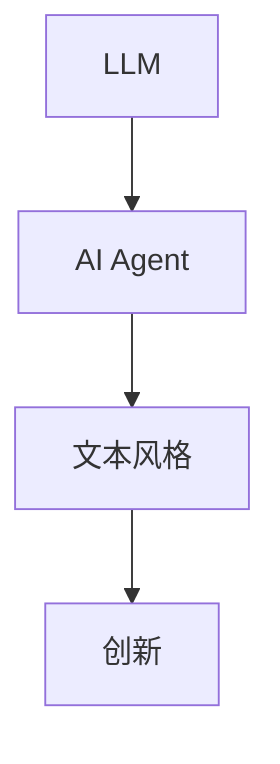
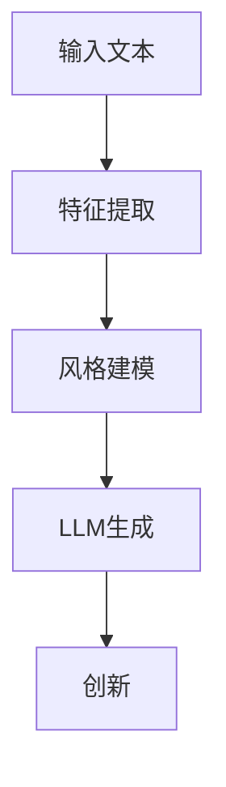
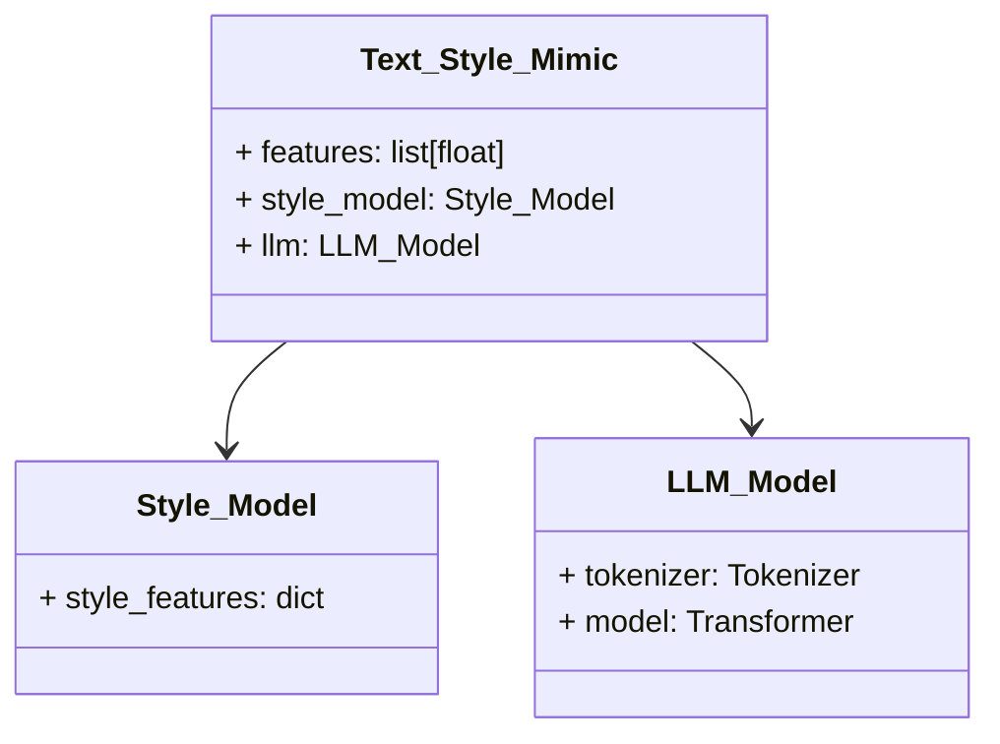
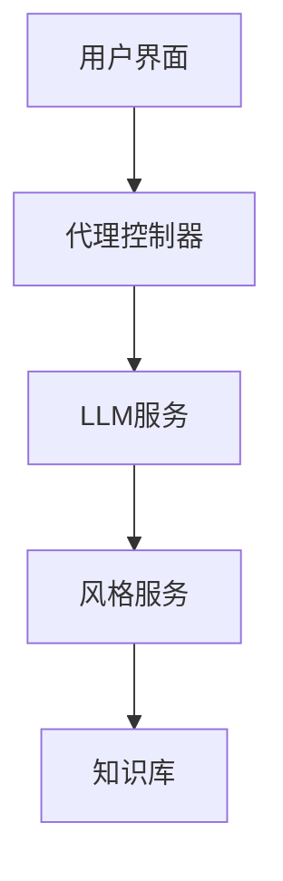
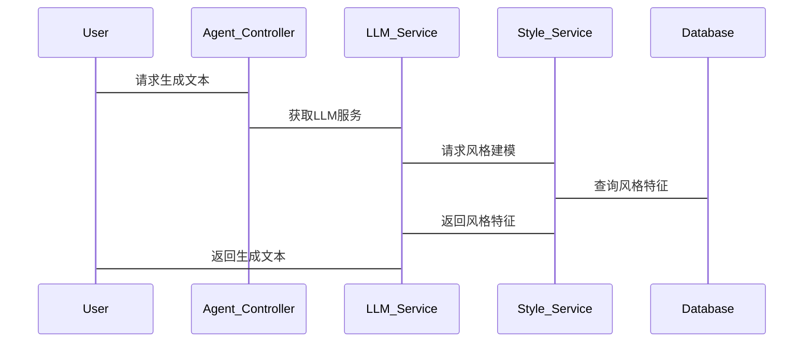

                 


# LLM在AI Agent中的文本风格模仿与创新

> 关键词：LLM, AI Agent, 文本风格, 模仿创新, 语言模型, 人工智能

> 摘要：本文探讨了大语言模型（LLM）在AI代理（AI Agent）中的文本风格模仿与创新的应用。通过分析LLM与AI Agent的核心概念、算法原理、系统设计和项目实战，详细阐述了如何利用LLM实现文本风格的模仿与创新，为AI Agent的智能化文本交互提供了理论与实践的支持。

---

## 目录

1. [背景介绍](#背景介绍)
2. [核心概念与联系](#核心概念与联系)
3. [算法原理讲解](#算法原理讲解)
4. [系统分析与架构设计方案](#系统分析与架构设计方案)
5. [项目实战](#项目实战)
6. [最佳实践](#最佳实践)

---

## 1. 背景介绍

### 1.1 问题背景

- **当前AI Agent的发展现状**：AI Agent作为一种智能化工具，已经在多个领域展现出强大的能力，尤其是在文本处理、任务执行和用户交互方面。
- **LLM在AI Agent中的应用痛点**：尽管LLM在自然语言处理（NLP）方面表现出色，但在AI Agent中实现文本风格的模仿与创新仍存在技术挑战。
- **文本风格模仿与创新的必要性**：AI Agent需要能够理解和模仿人类的文本风格，从而实现更自然的交互。

### 1.2 问题描述

- **LLM在AI Agent中的核心问题**：如何让LLM理解并模仿特定文本风格，同时具备创新能力。
- **文本风格模仿与创新的目标**：通过LLM生成符合特定风格的文本，并在此基础上进行创新。
- **相关技术的边界与外延**：探讨文本风格模仿与创新的边界，以及如何与其他技术（如强化学习、生成对抗网络等）结合。

### 1.3 问题解决

- **LLM与AI Agent的结合方式**：通过LLM提供文本生成能力，AI Agent利用这些能力实现任务。
- **文本风格模仿与创新的关键技术**：结合LLM的生成能力和AI Agent的智能决策机制。
- **解决方案的可行性分析**：分析现有技术的可行性，提出优化方向。

### 1.4 核心概念

- **LLM的定义与特点**：大语言模型是一种基于深度学习的NLP模型，具有强大的文本生成和理解能力。
- **AI Agent的定义与功能**：AI Agent是一种智能代理，能够根据环境信息自主决策并执行任务。
- **文本风格模仿与创新的核心要素**：包括文本特征提取、风格建模和生成创新。

---

## 2. 核心概念与联系

### 2.1 核心概念原理

- **LLM的工作原理**：基于Transformer架构，通过自注意力机制生成上下文相关的文本。
- **AI Agent的决策机制**：通过感知环境信息，结合内部知识库和推理能力做出决策。
- **文本风格模仿与创新的数学模型**：结合文本特征和生成模型，实现风格的动态切换和创新。

### 2.2 核心概念对比

| 对比维度 | LLM | AI Agent | 文本风格模仿与创新 |
|----------|------|-----------|--------------------|
| 核心功能 | 文本生成 | 任务执行 | 风格模仿与创新 |
| 技术基础 | 深度学习 | 多智能体技术 | NLP与生成模型 |
| 应用场景 | 自然语言处理 | 智能交互 | 个性化内容生成 |

### 2.3 实体关系图



---

## 3. 算法原理讲解

### 3.1 算法流程



### 3.2 数学模型

- **文本特征提取**：通过词嵌入（Word Embedding）提取文本的语义特征。
  $$ \text{Word Embedding}(x_i) = E_{x_i} $$
- **风格建模**：基于文本特征构建风格表示。
  $$ \text{Style Representation} = f(E_{x_i}) $$
- **生成模型**：使用LLM生成符合特定风格的文本。
  $$ P(y|x, s) = \text{LLM}(x, s) $$
  其中，\( s \) 是风格参数，\( x \) 是输入文本，\( y \) 是生成文本。

### 3.3 Python实现示例

```python
def extract_features(text):
    # 示例：使用预训练的词嵌入模型提取特征
    return model.encode(text)

def style_model(features):
    # 示例：基于特征的风格建模
    return style_classifier.predict(features)

def llm_generate(features, style):
    # 示例：使用LLM生成文本
    return llm.generate(text=features, style=style)
```

---

## 4. 系统分析与架构设计方案

### 4.1 功能设计



### 4.2 架构设计



### 4.3 接口设计

- **输入接口**：接收用户输入的文本和风格参数。
- **输出接口**：生成符合指定风格的文本并返回。

### 4.4 交互流程



---

## 5. 项目实战

### 5.1 环境安装

- Python 3.8+
- Hugging Face Transformers库
- PyTorch

### 5.2 核心代码实现

```python
from transformers import AutoTokenizer, AutoModelForCausalLM

class Text_Style_Mimic:
    def __init__(self, model_name):
        self.tokenizer = AutoTokenizer.from_pretrained(model_name)
        self.model = AutoModelForCausalLM.from_pretrained(model_name)

    def generate(self, text, style):
        inputs = self.tokenizer(text, return_tensors="np")
        outputs = self.model.generate(inputs.input_ids, max_length=100)
        return self.tokenizer.decode(outputs[0].tolist(), skip_special_tokens=True)
```

### 5.3 代码解读与分析

- **初始化**：加载预训练的LLM模型和分词器。
- **生成函数**：接收输入文本和风格参数，生成符合风格的文本。

### 5.4 案例分析

- **案例1**：模仿新闻报道风格生成新闻标题。
- **案例2**：模仿诗歌风格生成诗句。

### 5.5 项目小结

- **实现细节**：代码实现的关键点和优化技巧。
- **案例总结**：通过具体案例分析LLM在不同风格中的表现。

---

## 6. 最佳实践

### 6.1 小结

- **关键点回顾**：总结LLM在AI Agent中的文本风格模仿与创新的核心技术。
- **经验总结**：分享项目实施中的经验和教训。

### 6.2 注意事项

- **模型选择**：选择合适的LLM模型，考虑计算资源和任务需求。
- **风格多样性**：确保风格库的多样性和覆盖面。
- **用户反馈**：通过用户反馈不断优化生成效果。

### 6.3 拓展阅读

- 推荐相关书籍和论文，供进一步学习参考。

---

## 作者：AI天才研究院/AI Genius Institute & 禅与计算机程序设计艺术/Zen And The Art of Computer Programming

