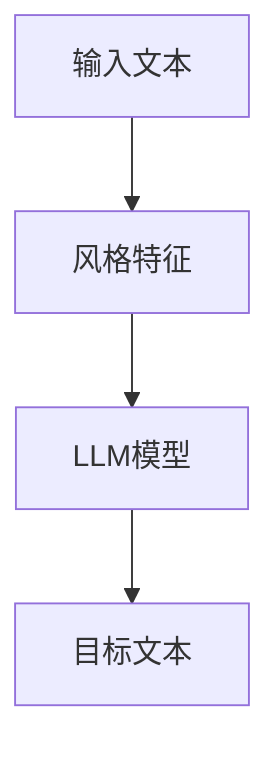
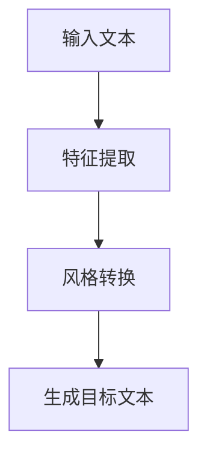
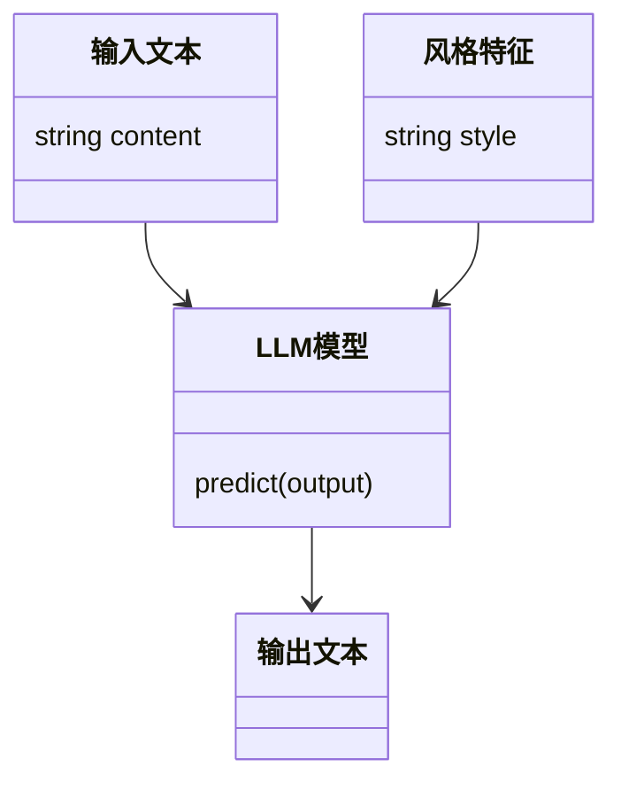
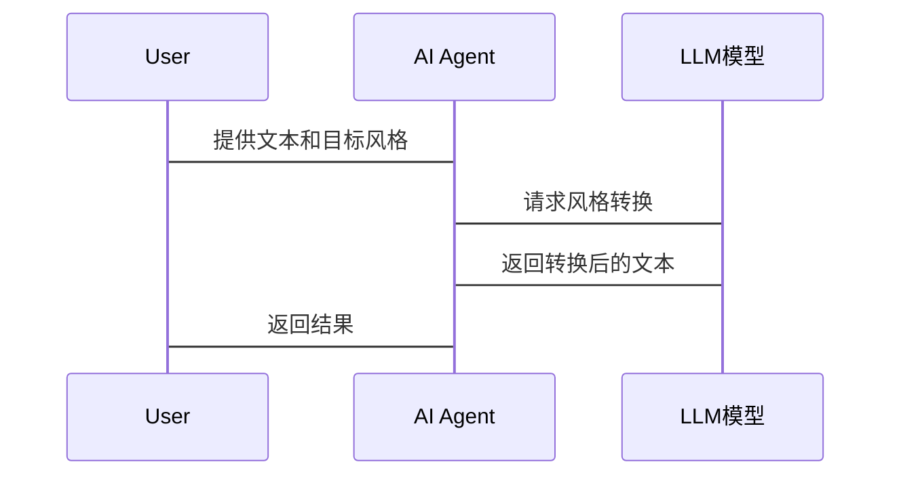

                 


# LLM在AI Agent中的文本风格迁移应用

## 关键词：LLM、文本风格迁移、AI Agent、自然语言处理、文本生成

## 摘要：本文深入探讨了大语言模型（LLM）在AI Agent中的文本风格迁移应用，分析了技术背景、核心概念、算法原理、系统架构，并结合项目实战总结了最佳实践和未来发展方向。

---

# 第1章: 背景介绍与核心概念

## 1.1 问题背景与描述
### 1.1.1 文本风格迁移的定义与目标
文本风格迁移是指将源文本从一种风格转换为另一种风格，如从正式到口语化。目标是保持原文内容不变，仅改变表达方式。

### 1.1.2 LLM在文本风格迁移中的作用
大语言模型通过训练大量文本，能够理解上下文并生成目标风格的文本，解决了传统方法依赖规则的局限性。

### 1.1.3 AI Agent中的应用场景
AI Agent需根据上下文调整输出风格，如客服助手根据用户语气调整回复，提升交互体验。

## 1.2 问题解决与边界
### 1.2.1 核心问题
文本风格迁移的核心问题是如何在保持内容的同时改变风格，LLM通过微调和生成模型实现这一目标。

### 1.2.2 边界与限制
模型对小样本数据效果不佳，且可能产生内容偏差。此外，风格迁移需明确目标，避免歧义。

## 1.3 核心概念与组成
### 1.3.1 LLM的基本原理
LLM通过预训练掌握语言规律，再通过微调适应特定任务。

### 1.3.2 文本风格迁移的关键要素
包括输入文本、目标风格、转换模型，其中模型参数和训练数据至关重要。

### 1.3.3 AI Agent的系统架构
AI Agent通常包括感知层、推理层和执行层，文本风格迁移主要在感知和推理层实现。

---

# 第2章: 核心概念与联系

## 2.1 LLM与文本风格迁移的原理
### 2.1.1 大语言模型的工作机制
通过自注意力机制捕捉文本关系，生成模型基于上下文预测词。

### 2.1.2 文本风格迁移的实现方法
包括特征提取、对抗训练和生成模型微调，每种方法各有优缺点。

## 2.2 核心概念对比表
| 对比项 | 基于规则的方法 | 基于统计的方法 | 基于生成模型的方法 |
|--------|-----------------|-----------------|---------------------|
| 优缺点 | 简单但效果有限   | 更灵活但需大量数据 | 效果佳但计算资源需求高 |

## 2.3 ER实体关系图


---

# 第3章: 算法原理与数学模型

## 3.1 算法原理
### 3.1.1 文本风格迁移的算法流程


### 3.1.2 LLM的训练与微调过程
模型先预训练，再通过特定风格的数据微调。

## 3.2 数学模型与公式
### 3.2.1 损失函数的定义
$$ L = \text{loss}(x, y) $$
常用交叉熵损失函数。

### 3.2.2 优化器的数学表达
$$ \theta_{t+1} = \theta_t - \eta \cdot \nabla L $$
其中，$\eta$为学习率，$\nabla L$为损失函数的梯度。

---

# 第4章: 系统分析与架构设计

## 4.1 项目背景与介绍
本项目旨在提升AI Agent的文本交互能力，使其能根据场景调整输出风格。

## 4.2 系统功能设计
### 4.2.1 领域模型类图


### 4.2.2 系统架构图


## 4.3 接口与交互设计
### 4.3.1 接口设计
定义REST API，如POST /style-transfer，接收文本和目标风格。

### 4.3.2 交互序列图


---

# 第5章: 项目实战

## 5.1 环境安装与配置
安装Python、TensorFlow、Hugging Face库，配置运行环境。

## 5.2 核心代码实现
### 5.2.1 文本风格迁移模型实现
```python
from transformers import T5ForConditionalGeneration, T5Tokenizer

model = T5ForConditionalGeneration.from_pretrained('t5-base')
tokenizer = T5Tokenizer.from_pretrained('t5-base')

def transfer_style(source_text, target_style):
    input_str = f"transfer {source_text} to {target_style}"
    input_ids = tokenizer.encode(input_str, return_tensors='pt')
    outputs = model.generate(input_ids, max_length=50)
    return tokenizer.decode(outputs[0], skip_special_tokens=True)
```

### 5.2.2 AI Agent集成
```python
class AIAgent:
    def __init__(self):
        self.style_transfer = transfer_style()

    def process_query(self, query, target_style):
        processed_text = self.style_transfer(query, target_style)
        return processed_text
```

## 5.3 案例分析与总结
通过客服对话案例，展示从正式到口语化风格的转换，提升用户体验。

---

# 第6章: 最佳实践与小结

## 6.1 最佳实践
- 明确需求，选择合适的模型和方法。
- 处理小样本数据时，可结合规则优化。
- 定期更新模型，保持风格准确性。

## 6.2 总结
本文全面探讨了LLM在AI Agent中的文本风格迁移应用，从理论到实践，提供了详尽的技术指导和实践参考。

## 6.3 注意事项
- 数据质量和多样性影响效果。
- 注意模型的计算资源消耗。
- 避免内容偏差，需谨慎处理。

## 6.4 拓展阅读
建议阅读相关论文和文献，深入理解模型原理和优化方法。

---

# 作者：AI天才研究院 & 禅与计算机程序设计艺术

---

通过以上结构，文章系统地阐述了LLM在AI Agent中的文本风格迁移应用，从背景到实战，层层深入，帮助读者全面理解和应用相关技术。

