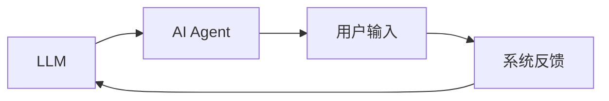
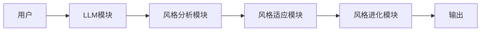

                 


# LLM在AI Agent中的文本风格适应与进化

> 关键词：LLM、AI Agent、文本风格适应、文本风格进化、自然语言处理、人工智能

> 摘要：本文探讨了大语言模型（LLM）在AI Agent中文本风格适应与进化的关键问题，分析了LLM与AI Agent的关系，详细讲解了文本风格适应与进化的算法原理，结合数学模型与系统架构设计，提供了实际的项目实现案例，总结了最佳实践与未来发展方向。

---

## 第1章: 引言

### 1.1 问题背景
在AI Agent的应用中，文本风格的适应与进化是实现自然流畅交互的关键。传统的AI系统往往依赖于固定的规则或模板，难以应对多样化的用户需求和复杂场景。而大语言模型（LLM）的出现，为AI Agent的文本生成能力带来了革命性的提升。

### 1.2 问题描述
- **文本风格适应的重要性**：AI Agent需要根据不同的用户、场景和语境调整输出的语气、语气和表达方式。
- **文本风格进化的必要性**：随着用户需求的变化和环境的变化，AI Agent需要不断优化其文本生成能力。
- **当前挑战**：现有的LLM在适应和进化文本风格方面仍存在诸多限制，如风格漂移、适应速度慢等问题。

---

## 第2章: 核心概念与联系

### 2.1 LLM与AI Agent的关系
- **LLM作为核心模块**：LLM是AI Agent实现文本生成和交互的主要工具。
- **AI Agent对LLM的依赖**：AI Agent通过LLM生成符合用户需求的文本。
- **双向影响**：AI Agent的使用场景影响LLM的训练和优化，而LLM的性能又决定了AI Agent的能力。

### 2.2 核心概念对比分析
- **LLM与传统NLP模型的对比**：
  - LLM具有更大的参数规模和更强的上下文理解能力。
  - 传统NLP模型通常针对特定任务优化，而LLM具有更强的通用性。
- **AI Agent与传统AI系统的对比**：
  - AI Agent具有更强的自主决策能力和动态适应能力。
  - 传统AI系统通常依赖于固定的规则和预定义的逻辑。

### 2.3 实体关系图


---

## 第3章: 算法原理讲解

### 3.1 LLM的训练过程
- **基于Transformer的LLM训练**：使用自注意力机制和前馈网络进行训练。
- **预训练与微调**：通过大规模语料库进行预训练，再在特定任务上进行微调。

### 3.2 文本风格适应的算法
- **风格分析与分类**：通过特征提取和分类模型识别文本风格。
- **风格迁移算法**：使用对抗训练或基于规则的方法将一种风格转换为另一种风格。
- **评估指标**：如BLEU、ROUGE等。

### 3.3 文本风格进化的算法
- **强化学习**：通过奖励机制优化生成文本的风格。
- **生成对抗网络**：通过生成器和判别器的对抗训练进化文本风格。

---

## 第4章: 数学模型与公式

### 4.1 LLM的数学模型
- Transformer模型的数学表达：
  $$\text{Transformer}(x) = \text{FFN}(x)$$

### 4.2 风格适应的数学模型
- 风格分析的损失函数：
  $$L_{\text{style}} = \lambda_1 L_{\text{classification}} + \lambda_2 L_{\text{reconstruction}}$$

### 4.3 风格进化的数学模型
- 强化学习的奖励函数：
  $$R(s, a) = r_1 s_1 + r_2 s_2$$

---

## 第5章: 系统分析与架构设计

### 5.1 系统架构设计


### 5.2 功能模块设计
- **风格分析模块**：识别输入文本的风格特征。
- **风格适应模块**：根据需求调整文本风格。
- **风格进化模块**：通过进化算法优化文本风格。

---

## 第6章: 项目实战

### 6.1 项目环境安装
- 安装必要的库：如Python、TensorFlow、Hugging Face Transformers。

### 6.2 核心实现代码
```python
import tensorflow as tf
from transformers import TFAutoModelForMaskedLM, AutoTokenizer

# 加载预训练模型
model = TFAutoModelForMaskedLM.from_pretrained('bert-base-cased')
tokenizer = AutoTokenizer.from_pretrained('bert-base-cased')

# 定义风格适应函数
def style_adaptation(text, target_style):
    # 分词
    inputs = tokenizer(text, return_tensors='tf')
    # 风格分析
    style_pred = model.predict(inputs)
    # 风格适应
    adapted_text = ...  # 实现风格适应逻辑
    return adapted_text
```

### 6.3 案例分析
- **案例1**：将正式的商务文本转化为口语化的表达。
- **案例2**：根据用户情绪调整文本语气。

---

## 第7章: 总结与展望

### 7.1 总结
- LLM在AI Agent中文本风格适应与进化的重要性。
- 各种算法和系统的实现细节。

### 7.2 展望
- 更加智能化的风格适应与进化算法。
- 结合多模态信息的文本生成。

---

## 作者：AI天才研究院/AI Genius Institute & 禅与计算机程序设计艺术 /Zen And The Art of Computer Programming

---

**本文的版权归作者所有，转载请注明出处。**

