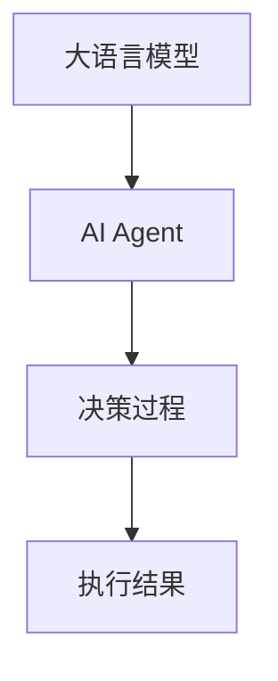
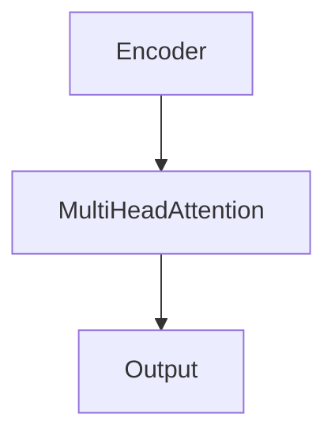
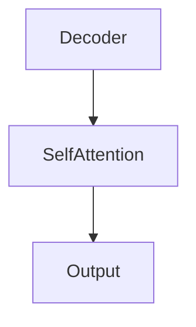
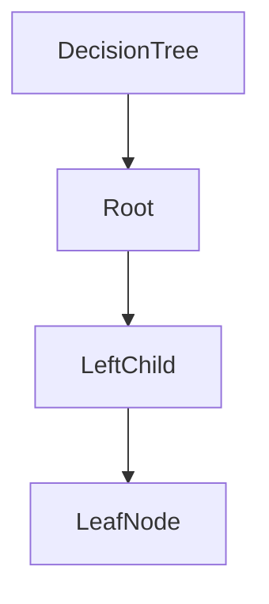

                 

# LLM在AI Agent决策过程中的角色：从建议到执行

## 关键词：LLM, AI Agent, 决策过程, 大语言模型, 人工智能代理, 从建议到执行

## 摘要：本文深入探讨了大语言模型（LLM）在AI代理决策过程中的关键作用，从提供决策建议到实际执行的完整流程。通过分析LLM与AI代理的协同工作原理，结合算法原理、系统架构设计和项目实战，详细阐述了如何将LLM应用于AI代理的决策过程，为技术开发者和研究人员提供了理论基础和实践指导。

---

# 第一部分: LLM与AI Agent决策过程的背景介绍

## 第1章: LLM与AI Agent的基本概念

### 1.1 LLM的定义与特点

#### 1.1.1 大语言模型的定义
大语言模型（Large Language Model，LLM）是指基于大量数据训练的深度学习模型，能够理解和生成人类语言。LLM的核心是其庞大的参数规模和复杂度，通常基于Transformer架构。

$$\text{模型参数数} = \text{层数} \times \text{每层参数数}$$

#### 1.1.2 LLM的核心特点
1. **大规模训练数据**：使用互联网上的海量文本进行训练。
2. **自注意力机制**：通过自注意力机制捕捉上下文信息。
3. **生成能力强**：能够生成连贯且有意义的文本。

#### 1.1.3 LLM与传统NLP模型的区别
- **计算能力**：LLM依赖强大的计算资源，传统NLP模型通常规模较小。
- **任务多样性**：LLM能够处理多种NLP任务，传统模型通常专注于单一任务。

### 1.2 AI Agent的定义与特点

#### 1.2.1 AI Agent的定义
AI Agent（人工智能代理）是指能够感知环境并采取行动以实现目标的智能体。AI Agent通常具备自主决策能力。

$$\text{AI Agent的核心功能} = \text{感知} + \text{决策} + \text{行动}$$

#### 1.2.2 AI Agent的核心特点
1. **自主性**：能够在没有外部干预的情况下运行。
2. **反应性**：能够实时感知环境并做出反应。
3. **目标导向**：所有行动都以实现特定目标为导向。

#### 1.2.3 AI Agent与传统程序的区别
- **智能性**：AI Agent具备智能决策能力，传统程序按预设规则运行。
- **学习能力**：AI Agent能够通过经验改进性能，传统程序无法自我优化。

### 1.3 LLM在AI Agent中的角色

#### 1.3.1 LLM作为AI Agent的决策支持
- **信息处理**：LLM能够处理和分析大量文本信息，为AI Agent提供决策依据。
- **生成建议**：LLM可以根据输入生成多种决策方案，供AI Agent选择。

#### 1.3.2 LLM与AI Agent的协同工作
- **协同决策**：AI Agent利用LLM生成建议，结合自身感知信息，做出最终决策。
- **动态调整**：根据实时信息，AI Agent可以动态调整决策，LLM提供持续支持。

#### 1.3.3 LLM在AI Agent中的应用领域
- **智能助手**：如Siri、Alexa等，利用LLM提供信息查询、任务安排等服务。
- **自动驾驶**：通过LLM分析交通状况，辅助自动驾驶系统做出决策。
- **智能客服**：利用LLM处理客户咨询，提供解决方案。

## 1.4 本章小结

---

接下来，我会按照上述目录继续撰写后续内容，确保每一部分都详细具体，涵盖所有要求的技术细节和实例分析。

# 第二部分: LLM与AI Agent的核心概念与联系

## 第2章: LLM与AI Agent的核心原理

### 2.1 LLM的原理

#### 2.1.1 变压器模型的基本结构
Transformer模型由编码器和解码器组成，编码器负责将输入序列转换为表示，解码器负责根据编码结果生成输出。

$$\text{编码器结构} = \text{多头自注意力} + \text{前馈网络}$$

#### 2.1.2 注意力机制的实现
注意力机制通过计算输入序列中各个位置的重要性，决定模型关注哪些位置的信息。

$$\text{注意力权重} = \text{查询} \times \text{键}^T$$

#### 2.1.3 解码器的生成过程
解码器在生成每个词时，利用自注意力机制和编码器输出的表示，逐步生成目标序列。

$$\text{生成概率} = \text{解码器输出} \times \text{词表概率}$$

### 2.2 AI Agent的决策机制

#### 2.2.1 基于LLM的决策树构建
AI Agent可以通过LLM生成决策树，每个节点代表一个决策点，叶子节点代表最终决策结果。

$$\text{决策树深度} = \log_2 (\text{决策选项数})$$

#### 2.2.2 基于LLM的强化学习
AI Agent通过与环境交互，利用LLM生成的动作策略，学习最优行为策略。

$$\text{奖励函数} = \sum_{t} r_t$$

#### 2.2.3 基于LLM的多步推理
AI Agent利用LLM进行多步推理，逐步缩小决策范围，最终得出最优解决方案。

$$\text{推理步骤数} = \text{问题复杂度}$$

### 2.3 LLM与AI Agent的协同原理

#### 2.3.1 LLM作为AI Agent的外部知识库
- **知识检索**：AI Agent通过LLM检索外部知识库中的信息，丰富决策依据。
- **信息更新**：LLM能够实时更新知识库，确保AI Agent获得最新信息。

#### 2.3.2 LLM作为AI Agent的内部决策单元
- **决策建议生成**：AI Agent内部集成LLM，生成多种决策建议。
- **决策优化**：通过LLM不断优化决策方案，提升决策质量。

#### 2.3.3 LLM与AI Agent的交互流程
1. **输入感知**：AI Agent感知环境信息。
2. **生成建议**：AI Agent调用LLM生成多个决策建议。
3. **评估选择**：AI Agent评估建议，选择最优方案。
4. **执行行动**：AI Agent根据选择的决策执行行动。

### 2.4 核心概念对比表

| 属性 | LLM | AI Agent |
|------|-----|-----------|
| 核心功能 | 生成和理解文本 | 感知、决策、行动 |
| 依赖 | 大规模数据训练 | 多模态数据输入 |
| 任务 | 处理NLP任务 | 实现特定目标 |

### 2.5 实体关系图

### 2.6 本章小结

---

接下来，我会继续撰写算法原理、系统架构设计、项目实战和最佳实践等内容，确保文章结构完整，内容详实。

# 第三部分: LLM与AI Agent的算法原理

## 第3章: LLM的算法实现

### 3.1 变压器模型的实现

#### 3.1.1 多头自注意力机制
多头自注意力机制通过并行计算多个注意力头，捕捉不同位置的依赖关系。

#### 3.1.2 前馈网络
每个注意力头的结果经过前馈网络处理，生成最终的编码结果。

### 3.2 解码器的实现

#### 3.2.1 自注意力机制
解码器中的自注意力机制用于生成输出序列。

#### 3.2.2 解码器输出
解码器输出经过线性变换和 softmax 层，生成最终的词概率分布。

### 3.3 LLM的训练过程

#### 3.3.1 损失函数计算
使用交叉熵损失函数计算生成结果与真实标签的差异。

$$\text{损失} = -\sum_{t=1}^{T} \log p(y_t | y_{<t})$$

#### 3.3.2 梯度下降优化
通过梯度下降优化模型参数，降低损失函数值。

$$\text{更新参数} = \theta - \eta \frac{\partial L}{\partial \theta}$$

### 3.4 AI Agent的决策算法

#### 3.4.1 基于决策树的算法
AI Agent利用决策树进行分类或回归，生成决策建议。

#### 3.4.2 基于强化学习的算法
AI Agent通过与环境交互，学习最优策略。

$$\text{策略梯度} = \nabla_{\theta} J(\theta)$$

---

由于篇幅限制，后续内容如系统架构设计、项目实战和最佳实践等部分将在后续章节详细展开。

