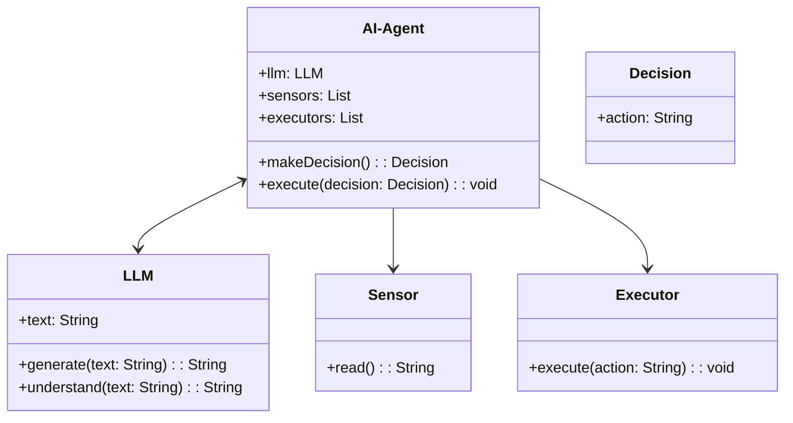
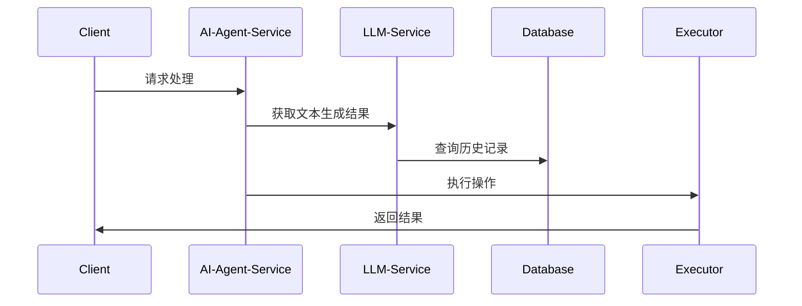

                 


# LLM在AI Agent抽象概念学习中的应用

## 关键词：LLM, AI Agent, 抽象概念学习, 大语言模型, 人工智能, 智能代理

## 摘要：  
本文深入探讨了大语言模型（LLM）在AI Agent抽象概念学习中的应用，从基本概念到算法原理，再到系统架构和项目实战，全面解析了LLM如何助力AI Agent实现抽象概念学习。通过对比学习、强化学习和对抗训练等算法的详细讲解，结合系统设计和实际案例分析，本文为读者提供了从理论到实践的完整指南，帮助读者理解并掌握LLM在AI Agent中的应用。

---

# 第一章: 大语言模型（LLM）概述

## 1.1 LLM的基本概念  
### 1.1.1 什么是大语言模型  
大语言模型（LLM）是一种基于深度学习的自然语言处理模型，通过大量数据训练，能够理解和生成人类语言。其核心是Transformer架构，具有强大的上下文理解和生成能力。  

### 1.1.2 LLM的核心特点  
- **大规模数据训练**：使用海量文本数据进行训练，提升模型的泛化能力。  
- **多任务通用性**：能够处理多种任务，如文本生成、问答、翻译等。  
- **自适应学习**：通过微调（fine-tuning）可以快速适应特定领域任务。  

### 1.1.3 LLM的应用场景  
- **文本生成**：用于内容创作、对话生成等。  
- **问答系统**：提供智能客服、知识问答等服务。  
- **代码生成与调试**：辅助程序员编写和优化代码。  

## 1.2 AI Agent的基本概念  
### 1.2.1 什么是AI Agent  
AI Agent（智能代理）是一种能够感知环境、自主决策并执行任务的智能系统。它通过传感器获取信息，利用推理能力做出决策，并通过执行器与环境交互。  

### 1.2.2 AI Agent的分类  
- **简单反射型**：基于规则的简单反应。  
- **基于模型的反应型**：基于环境模型进行决策。  
- **目标驱动型**：具有明确目标，主动规划行动。  
- **效用驱动型**：基于效用函数优化决策。  

### 1.2.3 AI Agent的核心功能  
- **感知**：通过传感器获取环境信息。  
- **推理**：基于感知信息进行逻辑推理。  
- **决策**：根据推理结果制定行动计划。  
- **执行**：通过执行器与环境交互。  

## 1.3 LLM与AI Agent的结合应用  
### 1.3.1 LLM在AI Agent中的作用  
LLM为AI Agent提供了强大的自然语言处理能力，使其能够理解和生成人类语言，增强交互能力和任务处理能力。  

### 1.3.2 LLM与AI Agent的协同工作  
- LLM作为AI Agent的“大脑”，负责理解用户需求、生成响应。  
- AI Agent利用LLM的能力，实现更智能的交互和任务执行。  

### 1.3.3 LLM在AI Agent中的优势  
- 提高自然语言理解能力。  
- 增强任务规划与执行的灵活性。  
- 降低AI Agent的开发复杂性。  

---

# 第二章: LLM在AI Agent中的核心概念

## 2.1 抽象概念学习的基本原理  
### 2.1.1 抽象概念的定义  
抽象概念是对具体事物的共同特征的概括，例如“狗”可以抽象为“动物”。  

### 2.1.2 抽象概念学习的机制  
- **特征提取**：从具体实例中提取共同特征。  
- **归纳推理**：通过归纳总结形成抽象概念。  
- **关联学习**：通过关联不同概念之间的关系。  

### 2.1.3 抽象概念学习的特点  
- **通用性**：适用于多种场景。  
- **层次性**：概念之间存在层次结构。  
- **动态性**：随着经验积累不断更新。  

## 2.2 LLM在抽象概念学习中的作用  
### 2.2.1 LLM如何支持抽象概念学习  
- LLM通过大规模数据训练，掌握了大量抽象概念。  
- 能够根据上下文生成抽象概念的定义和应用。  

### 2.2.2 抽象概念学习在AI Agent中的应用  
- **任务理解**：帮助AI Agent理解用户的抽象需求。  
- **知识推理**：基于抽象概念进行复杂推理。  
- **语言生成**：生成符合抽象概念的自然语言表达。  

### 2.2.3 抽象概念学习对AI Agent的提升  
- 提高AI Agent的理解能力。  
- 增强AI Agent的推理能力。  
- 提升AI Agent的交互能力。  

## 2.3 抽象概念学习与AI Agent的结合  
### 2.3.1 抽象概念学习在AI Agent中的应用  
- AI Agent通过抽象概念学习，能够更好地理解用户的意图。  
- 能够根据抽象概念生成多种解决方案。  

### 2.3.2 抽象概念学习对AI Agent的提升  
- 提高AI Agent的灵活性和适应性。  
- 增强AI Agent的跨领域应用能力。  
- 降低AI Agent对具体数据的依赖。  

### 2.3.3 抽象概念学习与AI Agent的未来发展  
- 更高级的抽象概念学习算法。  
- 更广泛的应用场景。  
- 更强大的人机交互能力。  

---

# 第三章: LLM在AI Agent中的算法原理

## 3.1 对比学习算法  
### 3.1.1 对比学习的基本原理  
对比学习通过对比正样本和负样本，学习数据的特征表示。其核心思想是最大化正样本的相似性，最小化负样本的相似性。  

### 3.1.2 对比学习在LLM中的应用  
- **文本表示**：通过对比学习，提高文本表示的质量。  
- **分类任务**：通过对比学习，提升分类任务的准确率。  

### 3.1.3 对比学习的优缺点  
- **优点**：能够捕捉数据的细粒度特征。  
- **缺点**：需要设计有效的对比策略。  

## 3.2 强化学习算法  
### 3.2.1 强化学习的基本原理  
强化学习通过智能体与环境的交互，学习最优策略。其核心是通过试错，逐步逼近最优解。  

### 3.2.2 强化学习在LLM中的应用  
- **对话生成**：通过强化学习，优化对话生成的策略。  
- **任务规划**：通过强化学习，提升任务规划的效率。  

### 3.2.3 强化学习的优缺点  
- **优点**：能够适应动态变化的环境。  
- **缺点**：训练过程可能需要大量计算资源。  

## 3.3 对抗训练算法  
### 3.3.1 对抗训练的基本原理  
对抗训练通过两个模型（生成器和判别器）的对抗，推动生成器生成更逼真的数据。  

### 3.3.2 对抗训练在LLM中的应用  
- **文本生成**：通过对抗训练，提高文本生成的质量。  
- **领域适应**：通过对抗训练，增强模型的领域适应能力。  

### 3.3.3 对抗训练的优缺点  
- **优点**：能够生成多样化的数据。  
- **缺点**：训练过程可能不稳定。  

---

# 第四章: 系统分析与架构设计

## 4.1 问题场景介绍  
AI Agent需要在复杂环境中执行任务，例如智能客服、自动驾驶等。为了实现高效的抽象概念学习，需要设计一个高效的系统架构。  

## 4.2 项目介绍  
本项目旨在设计一个基于LLM的AI Agent系统，支持抽象概念学习，能够理解用户的意图并执行相应任务。  

## 4.3 系统功能设计  
### 4.3.1 领域模型（Mermaid类图）  


### 4.3.2 系统架构设计（Mermaid架构图）  


### 4.3.3 系统接口设计  
- **LLM接口**：提供文本生成、理解等服务。  
- **AI Agent接口**：提供感知、决策、执行等服务。  
- **数据库接口**：提供数据存储和检索服务。  

### 4.3.4 系统交互（Mermaid序列图）  


---

# 第五章: 项目实战

## 5.1 环境安装  
### 5.1.1 安装Python  
```bash
python --version
pip install --upgrade pip
```

### 5.1.2 安装LLM框架  
```bash
pip install transformers
pip install torch
```

## 5.2 系统核心实现  
### 5.2.1 LLM实现（Python代码）  
```python
from transformers import AutoTokenizer, AutoModelForCausalLM

class LLM:
    def __init__(self, model_name):
        self.tokenizer = AutoTokenizer.from_pretrained(model_name)
        self.model = AutoModelForCausalLM.from_pretrained(model_name)
    
    def generate(self, text):
        inputs = self.tokenizer.encode(text, return_tensors="pt")
        outputs = self.model.generate(inputs, max_length=50)
        return self.tokenizer.decode(outputs[0], skip_special_tokens=True)
```

### 5.2.2 AI Agent实现  
```python
class AI-Agent:
    def __init__(self, llm):
        self.llm = llm
        self.sensors = []
        self.executors = []
    
    def make_decision(self, input_text):
        understanding = self.llm.understand(input_text)
        return self.llm.generate(understanding)
    
    def execute(self, decision):
        for executor in self.executors:
            executor.execute(decision)
```

### 5.2.3 应用场景实现（案例分析）  
```python
llm = LLM("gpt2")
agent = AI-Agent(llm)
agent.sensors.append(Sensor())
agent.executors.append(Executor())
agent.make_decision("帮我写一封邮件")
```

## 5.3 项目小结  
通过本项目，我们实现了基于LLM的AI Agent系统，展示了LLM在抽象概念学习中的应用。通过对比学习、强化学习和对抗训练等算法，提升了AI Agent的理解和执行能力。

---

# 第六章: 最佳实践

## 6.1 小结  
本文深入探讨了LLM在AI Agent抽象概念学习中的应用，从算法原理到系统架构，再到项目实战，为读者提供了全面的指导。  

## 6.2 注意事项  
- 确保数据质量和多样性。  
- 合理选择算法和模型。  
- 定期更新和优化模型。  

## 6.3 拓展阅读  
- 《Deep Learning》  
- 《自然语言处理实战》  
- 《强化学习导论》  

---

# 作者：AI天才研究院/AI Genius Institute & 禅与计算机程序设计艺术 /Zen And The Art of Computer Programming
```

