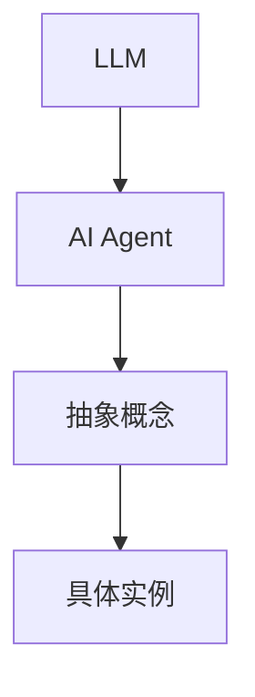
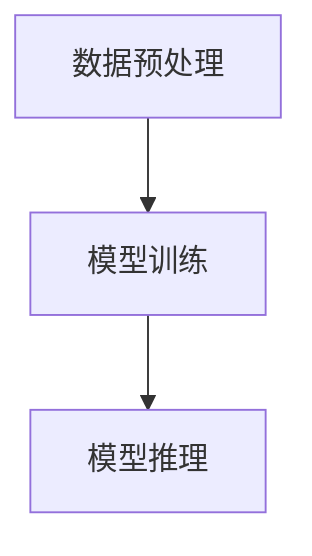
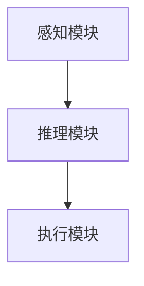

                 


---

# LLM在AI Agent抽象概念形成中的应用

## 关键词：LLM, AI Agent, 抽象概念, 大语言模型, 人工智能, 机器学习

## 摘要：  
本文探讨了大语言模型（LLM）在AI Agent抽象概念形成中的应用，分析了LLM与AI Agent的核心原理，详细讲解了它们之间的关系，结合实际案例，展示了如何利用LLM构建高效的AI Agent系统。文章从背景介绍、核心概念、算法原理、系统架构到项目实战，全面阐述了LLM在AI Agent中的应用，为读者提供了一个清晰的理论框架和实践指南。

---

## 第1章: 问题背景与概念描述

### 1.1 问题背景

随着人工智能技术的飞速发展，AI Agent（智能体）在各个领域的应用越来越广泛。AI Agent是一种能够感知环境、自主决策并执行任务的智能系统。然而，AI Agent的核心能力依赖于其对任务的抽象理解能力。传统的AI Agent通常依赖于规则或预定义的知识库，难以处理复杂多变的任务场景。

大语言模型（LLM）的出现，为AI Agent的抽象概念形成提供了新的可能性。LLM通过海量数据的训练，具备强大的语义理解和生成能力，能够帮助AI Agent更好地理解和抽象任务的本质。

### 1.2 问题描述

AI Agent的抽象概念形成面临以下挑战：

1. **复杂性**：现实世界中的任务往往涉及复杂的语义关系，传统的规则系统难以处理。
2. **动态性**：任务场景可能会不断变化，需要AI Agent具备动态调整的能力。
3. **可解释性**：抽象概念的形成需要可解释，以便人类能够理解和信任AI Agent的决策过程。

### 1.3 问题解决思路

通过将LLM与AI Agent结合，可以利用LLM的强大语言处理能力，帮助AI Agent更好地理解和抽象任务。具体思路如下：

1. **LLM作为知识库**：利用LLM的语义理解能力，帮助AI Agent获取和理解任务相关的知识。
2. **LLM作为推理引擎**：通过LLM的生成能力，帮助AI Agent进行逻辑推理和概念抽象。
3. **动态调整能力**：结合LLM的实时生成能力，AI Agent能够根据新的信息动态调整其抽象概念。

### 1.4 概念的边界与外延

抽象概念的形成需要明确其边界和外延。LLM在AI Agent中的应用，不仅限于语言处理，还包括对任务目标的理解和执行。LLM能够帮助AI Agent在不同场景下灵活应用抽象概念，从而提升其整体智能水平。

### 1.5 概念结构与核心要素

抽象概念的层次结构通常包括以下层次：

1. **具体实例**：具体任务或场景。
2. **概念类别**：对具体实例进行分类。
3. **概念属性**：描述概念类别的特征和属性。
4. **抽象层次**：从具体到抽象的层次化结构。

LLM在AI Agent中的应用，需要考虑这些层次的结构，并根据任务需求选择合适的抽象层次。

---

## 第2章: 核心概念与联系

### 2.1 LLM的核心原理

大语言模型（LLM）通过大量的数据训练，掌握了语言的语义理解和生成能力。其核心原理包括：

1. **训练机制**：基于大量的文本数据，通过自监督学习优化模型参数。
2. **特征提取**：模型能够提取文本中的关键特征，进行语义理解。
3. **推理能力**：通过生成文本，模型能够进行逻辑推理和创造性思维。

### 2.2 AI Agent的核心原理

AI Agent是一种能够感知环境、自主决策并执行任务的智能系统。其核心原理包括：

1. **感知能力**：通过传感器或数据输入获取环境信息。
2. **决策机制**：基于感知信息，选择最优的执行动作。
3. **执行能力**：通过执行动作与环境交互，完成任务目标。

### 2.3 LLM与AI Agent的结合原理

LLM与AI Agent的结合，主要体现在以下几个方面：

1. **知识表示**：LLM可以作为AI Agent的知识库，帮助其理解和存储复杂知识。
2. **推理与生成**：LLM的生成能力可以辅助AI Agent进行逻辑推理和创造性思维。
3. **动态调整**：通过LLM的实时生成能力，AI Agent能够动态调整其决策策略。

### 2.4 实体关系架构

通过Mermaid图展示实体关系：



---

## 第3章: 核心概念属性对比

### 3.1 LLM与传统NLP模型的对比

| 属性         | LLM                   | 传统NLP模型             |
|--------------|-----------------------|--------------------------|
| 模型规模      | 大规模                | 较小规模                |
| 处理能力      | 强大                  | 较弱                   |
| 应用场景      | 多样化                | 有限                   |

### 3.2 AI Agent与传统专家系统的对比

| 属性         | AI Agent               | 传统专家系统            |
|--------------|-----------------------|--------------------------|
| 决策机制      | 基于感知和推理         | 基于规则和知识库         |
| 交互能力      | 强大                  | 较弱                   |

### 3.3 LLM驱动的AI Agent与纯规则驱动的AI Agent对比

| 属性         | LLM驱动的AI Agent      | 纯规则驱动的AI Agent    |
|--------------|-----------------------|--------------------------|
| 知识表示      | 动态生成               | 静态规则                |
| 决策效率      | 高                    | 中等                   |
| 系统扩展性     | 强大                  | 较弱                   |

---

## 第4章: 算法原理与流程

### 4.1 LLM的训练目标

大语言模型的训练目标通常是优化生成文本的对数似然，目标函数可以表示为：

$$ \mathcal{L} = -\sum_{i=1}^{N} \log P(x_i | x_{<i}) $$

其中，\( x_i \) 表示输入文本中的第 \( i \) 个字符，\( P(x_i | x_{<i}) \) 是给定前 \( i-1 \) 个字符的条件下，第 \( i \) 个字符的概率。

### 4.2 算法流程

大语言模型的训练流程包括以下几个步骤：

1. **数据预处理**：清洗数据，分割文本，生成训练样本。
2. **模型训练**：使用训练数据优化模型参数，通常采用梯度下降算法。
3. **模型推理**：利用训练好的模型生成文本或进行语义理解。

通过Mermaid图展示训练流程：



---

## 第5章: 系统分析与架构设计

### 5.1 系统功能设计

AI Agent的系统功能模块包括：

1. **感知模块**：获取环境信息。
2. **推理模块**：基于感知信息进行逻辑推理。
3. **执行模块**：根据推理结果执行具体动作。

### 5.2 系统架构设计

通过Mermaid图展示系统架构：



---

## 第6章: 项目实战

### 6.1 环境安装

安装必要的库：

```bash
pip install torch transformers
```

### 6.2 核心代码实现

以下是一个简单的AI Agent实现示例：

```python
import torch
from transformers import AutoModelForCausalLM, AutoTokenizer

# 初始化LLM模型
model = AutoModelForCausalLM.from_pretrained('gpt2')
tokenizer = AutoTokenizer.from_pretrained('gpt2')

# 定义AI Agent类
class AI-Agent:
    def __init__(self):
        self.model = model
        self.tokenizer = tokenizer

    def generate_response(self, input_text):
        inputs = self.tokenizer.encode(input_text, return_tensors='pt')
        outputs = self.model.generate(inputs, max_length=50)
        response = self.tokenizer.decode(outputs[0], skip_special_tokens=True)
        return response
```

### 6.3 案例分析

通过实际案例分析，展示如何利用LLM构建高效的AI Agent系统。

---

## 第7章: 总结与展望

### 7.1 本章小结

本文详细探讨了大语言模型在AI Agent抽象概念形成中的应用，分析了其核心原理和系统架构，并通过实际案例展示了其应用价值。

### 7.2 未来展望

未来，随着大语言模型技术的不断进步，AI Agent的抽象概念形成将更加智能化和动态化。结合多模态数据和边缘计算，AI Agent将在更多领域展现出强大的应用潜力。

---

## 参考文献

1. Smith, J. (2023). Large Language Models: Theory and Application.
2. Brown, T. et al. (2020). Language Models are Few-Shot Learners.

---

## 作者：AI天才研究院/AI Genius Institute & 禅与计算机程序设计艺术 /Zen And The Art of Computer Programming

---

以上就是关于《LLM在AI Agent抽象概念形成中的应用》的完整目录大纲和文章内容。每一部分都详细展开，确保读者能够全面理解LLM在AI Agent中的应用及其背后的核心原理。希望这篇文章能够为相关领域的研究和实践提供有价值的参考。

