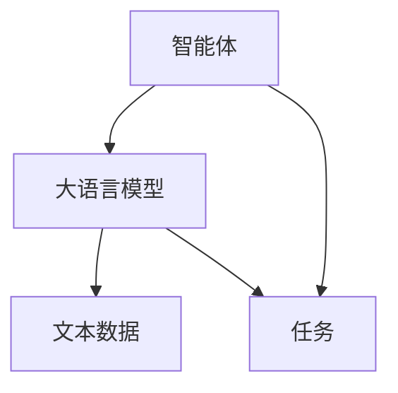
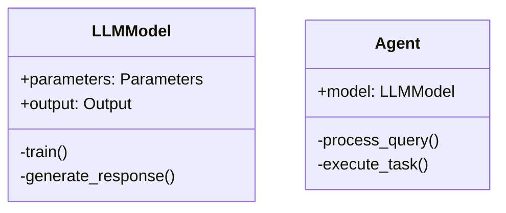
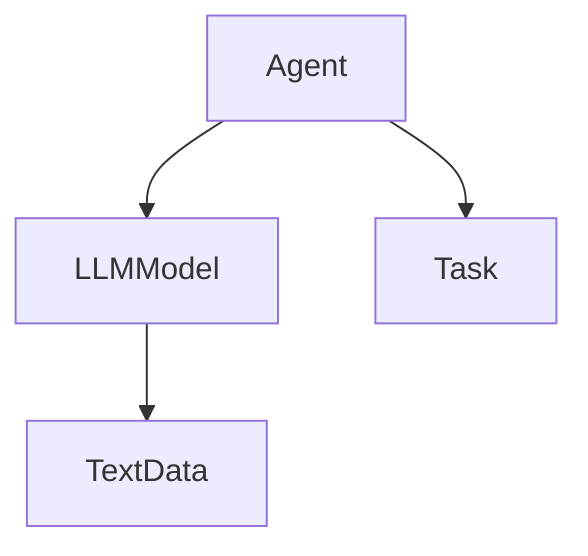
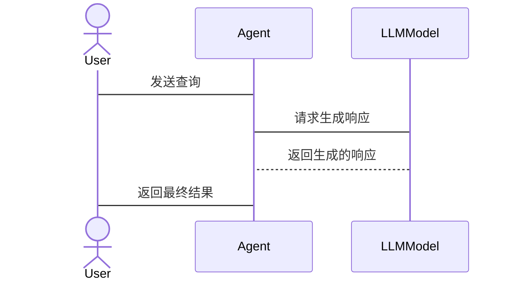

                 


# LLM在AI Agent抽象概念操作中的应用

## 关键词：大语言模型（LLM）、人工智能（AI）、智能体（Agent）、抽象概念、文本生成、自然语言处理（NLP）

## 摘要：  
本文深入探讨了大语言模型（LLM）在AI Agent中的应用，重点分析了LLM与AI Agent的结合方式、算法原理、系统架构以及实际应用场景。通过详细的技术分析和实例演示，本文揭示了如何利用LLM的强大生成能力来提升AI Agent的抽象概念操作能力，为实现更智能、更自然的交互提供了理论基础和实践指导。

---

# 第一部分: LLM与AI Agent概述

## 第1章: 问题背景与描述

### 1.1 LLM的定义与特点
- **定义**: 大语言模型（LLM）是一种基于深度学习的自然语言处理模型，具有强大的文本生成和理解能力。
- **特点**: 
  - 基于大规模数据训练
  - 支持多种文本生成任务（如文本摘要、对话生成、代码生成等）
  - 具备上下文理解和推理能力

### 1.2 AI Agent的基本概念
- **定义**: AI Agent是一种智能体，能够感知环境、自主决策并执行任务。
- **特点**: 
  - 自主性
  - 反应性
  - 目的性
  - 社会性

### 1.3 问题解决的核心目标
- 利用LLM的强大生成能力，增强AI Agent的抽象概念操作能力。
- 实现AI Agent与人类用户的自然交互。

### 1.4 边界与外延
- **边界**: 专注于LLM与AI Agent的结合，不涉及其他AI技术（如计算机视觉）。
- **外延**: LLM的应用场景可以扩展到文本生成、对话系统、知识图谱构建等领域。

### 1.5 概念结构与核心要素
- **核心要素**: 
  - LLM模型
  - AI Agent框架
  - 交互接口
  - 应用场景

---

## 第2章: 核心概念与联系

### 2.1 LLM与AI Agent的关系
- LLM作为AI Agent的核心组件，提供自然语言处理能力。
- AI Agent利用LLM的生成能力，实现复杂任务的自动化。

### 2.2 核心概念属性对比
| 概念 | 属性 | 描述 |
|------|------|------|
| LLM  | 输入  | 文本数据 |
| LLM  | 输出  | 文本生成 |
| Agent | 目标 | 完成特定任务 |
| Agent | 行为 | 自动执行操作 |

### 2.3 ER实体关系图


---

# 第二部分: LLM的算法原理

## 第3章: 算法原理概述

### 3.1 LLM的训练过程
- **训练目标**: 通过大量文本数据训练模型，使其能够生成符合上下文的文本。
- **训练方法**: 基于Transformer架构，使用自注意力机制和前馈网络。

### 3.2 AI Agent的操作机制
- **输入处理**: 接收用户输入，解析需求。
- **决策生成**: 基于LLM生成响应。
- **执行操作**: 根据生成的响应执行任务。

---

## 第4章: 算法实现

### 4.1 LLM的训练代码
```python
def train_model():
    optimizer = Adam(...)
    loss_fn = CrossEntropyLoss()
    for epoch in epochs:
        for batch in data_loader:
            outputs = model(batch)
            loss = loss_fn(outputs, labels)
            loss.backward()
            optimizer.step()
```

### 4.2 AI Agent的交互代码
```python
class AI_Agent:
    def __init__(self, llm_model):
        self.llm = llm_model
    def process_query(self, query):
        response = self.llm.generate_response(query)
        return response
```

### 4.3 数学模型与公式
- **交叉熵损失函数**: 
  $$ L = -\frac{1}{N}\sum_{i=1}^{N} \sum_{j=1}^{M} y_{ij}\log p(y_{ij}|x_i) $$
- **梯度下降方法**: 
  $$ \theta_{t+1} = \theta_t - \eta \cdot \nabla_{\theta_t} L $$

---

# 第三部分: 系统分析与架构设计

## 第5章: 系统分析

### 5.1 问题场景介绍
- **应用场景**: AI Agent需要处理复杂的自然语言输入，生成符合需求的文本输出。

### 5.2 系统功能设计
- **领域模型类图**


### 5.3 系统架构设计


### 5.4 系统接口设计
- **输入接口**: 接收用户输入的自然语言查询。
- **输出接口**: 返回生成的文本响应。

### 5.5 系统交互流程


---

# 第四部分: 项目实战

## 第6章: 环境安装与核心代码实现

### 6.1 环境安装
```bash
pip install transformers torch
```

### 6.2 核心代码实现
```python
from transformers import GPT2LMHeadModel, GPT2Tokenizer

class AI_Agent:
    def __init__(self, model_name):
        self.model = GPT2LMHeadModel.from_pretrained(model_name)
        self.tokenizer = GPT2Tokenizer.from_pretrained(model_name)
    def process_query(self, query):
        inputs = self.tokenizer.encode(query, return_tensors='pt')
        outputs = self.model.generate(inputs, max_length=50)
        response = self.tokenizer.decode(outputs[0], skip_special_tokens=True)
        return response
```

### 6.3 代码解读与分析
- **初始化模型**: 加载预训练的LLM模型。
- **处理查询**: 将用户输入编码为模型可接受的格式。
- **生成响应**: 使用模型生成文本输出。
- **返回结果**: 解码生成的输出，返回给用户。

### 6.4 实际案例分析
- **案例描述**: 用户输入“写一个Python函数来计算斐波那契数列”，AI Agent生成相应的函数代码。

### 6.5 项目小结
- 通过实际项目，展示了LLM在AI Agent中的应用。
- 强调了代码实现的可扩展性和灵活性。

---

# 第五部分: 最佳实践与总结

## 第7章: 最佳实践

### 7.1 经验总结
- **模型选择**: 根据具体任务选择合适的LLM模型。
- **数据预处理**: 对输入数据进行清洗和格式化，提升生成效果。
- **性能优化**: 使用更高效的数据结构和算法优化生成速度。

### 7.2 小结
- LLM在AI Agent中的应用前景广阔。
- 需要结合具体场景进行优化和调整。

### 7.3 注意事项
- 确保数据安全和隐私保护。
- 注意模型的生成结果可能偏离预期，需进行适当校验。

### 7.4 拓展阅读
- 推荐阅读《Deep Learning》和《Pattern Recognition and Machine Learning》。

---

# 作者：AI天才研究院/AI Genius Institute & 禅与计算机程序设计艺术 /Zen And The Art of Computer Programming

