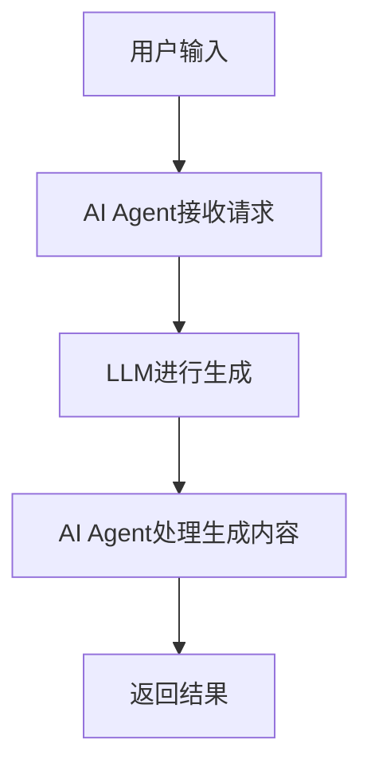
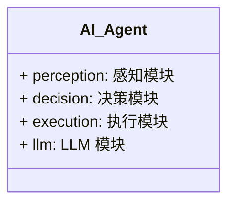
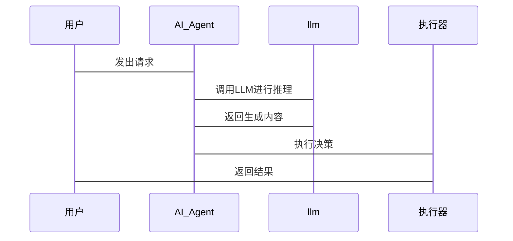

                 


# LLM在AI Agent概念形成与抽象中的作用

> 关键词：LLM, AI Agent, 概念形成, 抽象, 大语言模型, 智能体, 人工智能

> 摘要：本文探讨了大语言模型（LLM）在AI Agent概念形成与抽象中的核心作用。通过分析LLM与AI Agent的背景、核心概念、算法原理、系统架构及项目实战，本文详细阐述了LLM如何帮助AI Agent实现概念的形成与抽象，为AI Agent的未来发展提供了理论与实践的双重支持。

---

## 第一部分：背景介绍

### 第1章：LLM与AI Agent的背景介绍

#### 1.1 问题背景

##### 1.1.1 AI Agent的基本概念
AI Agent（人工智能代理）是指能够感知环境、自主决策并执行任务的智能实体。它可以在没有人类干预的情况下，通过传感器获取信息，并通过执行器与环境交互。AI Agent的核心目标是帮助人类完成复杂的任务，提升效率。

##### 1.1.2 LLM的定义与特点
大语言模型（LLM，Large Language Model）是一种基于深度学习的自然语言处理模型，具有强大的文本生成、理解与推理能力。其特点包括：
- **大规模训练**：基于海量数据进行预训练。
- **多任务能力**：能够处理多种语言任务，如文本生成、问答、翻译等。
- **上下文理解**：能够通过上下文理解复杂的语义关系。

##### 1.1.3 问题的提出与研究意义
AI Agent需要具备强大的语言理解和生成能力，以更好地与人类交互并完成复杂任务。然而，传统方法在处理复杂语义和上下文推理时存在局限性。LLM的引入为AI Agent提供了强大的语言处理能力，使其能够更高效地完成任务。

#### 1.2 问题描述

##### 1.2.1 AI Agent的核心功能
AI Agent的核心功能包括：
1. **感知环境**：通过传感器获取环境信息。
2. **决策与推理**：基于获取的信息进行推理和决策。
3. **执行任务**：通过执行器与环境交互，完成任务。

##### 1.2.2 LLM在AI Agent中的作用
LLM在AI Agent中的作用主要体现在：
1. **自然语言理解**：帮助AI Agent理解人类输入的自然语言指令。
2. **生成与反馈**：生成自然语言输出，并根据反馈优化决策。

##### 1.2.3 当前研究的难点与挑战
当前研究的难点在于如何将LLM与AI Agent的核心功能深度融合，使其具备更强的抽象能力和语义理解能力。

#### 1.3 问题解决

##### 1.3.1 LLM如何帮助AI Agent实现抽象
通过LLM的强大语言处理能力，AI Agent可以对输入信息进行语义抽象，提取关键信息并生成更高层次的语义表示。

##### 1.3.2 LLM在AI Agent概念形成中的应用
LLM通过预训练的语言模型，帮助AI Agent形成对任务、环境和目标的概念化理解。

##### 1.3.3 技术实现的路径与方法
通过将LLM嵌入AI Agent的决策流程中，AI Agent可以更高效地完成任务，并通过反馈机制不断优化自身的理解与生成能力。

#### 1.4 概念结构与核心要素

##### 1.4.1 AI Agent的组成要素
AI Agent的组成要素包括：
1. **感知模块**：负责获取环境信息。
2. **推理模块**：负责对信息进行推理和决策。
3. **执行模块**：负责执行决策结果。

##### 1.4.2 LLM在概念形成中的角色
LLM在概念形成中的角色包括：
1. **语义理解**：帮助AI Agent理解输入指令的语义。
2. **知识表示**：通过预训练的知识库，帮助AI Agent形成概念化的知识表示。
3. **推理支持**：支持AI Agent进行基于语义的推理。

##### 1.4.3 概念的边界与外延
概念的边界是指AI Agent理解的范围，而外延则是指概念的扩展与应用。LLM通过其强大的语言处理能力，可以不断扩展AI Agent的概念边界和外延。

---

## 第二部分：核心概念与联系

### 第2章：LLM与AI Agent的核心概念与联系

#### 2.1 核心概念原理

##### 2.1.1 LLM的工作原理
LLM通过大规模预训练，学习语言的结构和语义关系。其工作原理包括：
1. **预训练**：基于海量数据进行无监督学习。
2. **微调**：根据具体任务进行有监督微调。
3. **生成与推理**：通过解码器生成文本，并通过推理模块优化生成结果。

##### 2.1.2 AI Agent的决策机制
AI Agent的决策机制包括：
1. **感知**：通过传感器获取环境信息。
2. **推理**：基于感知信息进行逻辑推理。
3. **决策**：根据推理结果做出决策。
4. **执行**：通过执行器执行决策结果。

##### 2.1.3 两者结合的理论基础
两者结合的理论基础包括：
1. **符号与分布表示**：LLM提供分布式语义表示，AI Agent提供符号化知识表示。
2. **语义理解与生成**：LLM通过语义理解支持AI Agent的决策，同时通过生成能力提供自然语言输出。

#### 2.2 概念属性特征对比

| 概念属性 | LLM | AI Agent |
|----------|-----|----------|
| 输入 | 文本数据 | 环境信息、用户指令 |
| 输出 | 文本生成 | 决策、执行 |
| 核心能力 | 语言生成与理解 | 感知、推理、决策 |
| 知识库 | 预训练知识库 | 预定义知识库 + 动态知识 |
| 学习方式 | 无监督/有监督 | 监督学习 + 强化学习 |

#### 2.3 ER实体关系图

```mermaid
er
actor: 用户
agent: AI Agent
model: LLM
actor --> agent: 与AI Agent交互
agent --> model: 调用LLM进行推理
model --> agent: 提供生成内容
```

---

## 第三部分：算法原理

### 第3章：LLM与AI Agent的算法原理

#### 3.1 算法原理讲解

##### 3.1.1 LLM的训练过程
LLM的训练过程包括：
1. **预训练**：基于大规模数据进行无监督学习。
2. **微调**：根据具体任务进行有监督微调。
3. **优化**：通过优化算法（如Adam）优化模型参数。

##### 3.1.2 AI Agent的决策流程
AI Agent的决策流程包括：
1. **感知**：获取环境信息。
2. **解析**：解析用户指令。
3. **推理**：基于解析结果进行推理。
4. **决策**：根据推理结果做出决策。
5. **执行**：通过执行器执行决策。

##### 3.1.3 两者结合的算法框架
两者结合的算法框架包括：
1. **LLM作为推理模块**：AI Agent通过调用LLM进行语义推理。
2. **反馈优化**：根据用户反馈优化LLM的生成结果。

#### 3.2 算法流程图



#### 3.3 数学模型与公式

##### 3.3.1 LLM的损失函数
$$ \text{Loss} = -\sum_{i=1}^{n} \log P(w_i | w_{i-1}, ..., w_{i-k}) $$

##### 3.3.2 AI Agent的决策模型
$$ P(a | s) = \text{softmax}(Q(s, a)) $$

---

## 第四部分：系统分析与架构设计

### 第4章：系统分析与架构设计

#### 4.1 问题场景介绍
AI Agent需要在复杂环境中完成任务，如智能助手、机器人控制等。LLM的引入可以提升其语言理解和生成能力。

#### 4.2 系统功能设计

##### 4.2.1 领域模型类图


##### 4.2.2 系统架构图


##### 4.2.3 系统接口设计
AI Agent的接口设计包括：
1. **用户接口**：接收用户指令，返回生成结果。
2. **LLM接口**：调用LLM进行生成与推理。
3. **执行接口**：控制执行器完成任务。

##### 4.2.4 系统交互流程


---

## 第五部分：项目实战

### 第5章：项目实战

#### 5.1 环境安装
安装必要的依赖：
```bash
pip install torch transformers
```

#### 5.2 系统核心实现源代码

##### 5.2.1 LLM与AI Agent的交互代码
```python
import torch
from transformers import AutoTokenizer, AutoModelForCausalLM

class AI_Agent:
    def __init__(self):
        self.llm_tokenizer = AutoTokenizer.from_pretrained("gpt2")
        self.llm_model = AutoModelForCausalLM.from_pretrained("gpt2")
    
    def generate_response(self, input_text):
        inputs = self.llm_tokenizer(input_text, return_tensors="pt")
        outputs = self.llm_model.generate(**inputs, max_length=50)
        return self.llm_tokenizer.decode(outputs[0], skip_special_tokens=True)
```

##### 5.2.2 决策模块实现代码
```python
class DecisionModule:
    def __init__(self):
        self.rules = {
            "天气查询": "查询天气API",
            "时间查询": "获取系统时间"
        }
    
    def make_decision(self, input_text):
        for intent, action in self.rules.items():
            if intent in input_text:
                return action
        return "无法识别"
```

#### 5.3 代码应用解读与分析
通过上述代码，AI Agent能够接收用户输入，调用LLM生成响应，并根据决策模块做出决策。LLM的生成能力提升了AI Agent的语言理解与生成能力，使其能够更好地与用户交互。

#### 5.4 实际案例分析
案例：用户输入“今天北京天气怎么样？”
1. AI Agent接收输入。
2. 决策模块识别出“天气查询”意图。
3. AI Agent调用LLM生成天气查询指令。
4. LLM生成“查询北京天气API”。
5. AI Agent执行天气查询任务，并返回结果。

---

## 第六部分：最佳实践

### 第6章：最佳实践

#### 6.1 小结
通过本文的分析与实践，我们看到LLM在AI Agent的概念形成与抽象中起到了至关重要的作用。LLM的强大语言处理能力显著提升了AI Agent的交互能力和任务完成效率。

#### 6.2 注意事项
1. **数据隐私**：在实际应用中，需注意数据隐私和模型的安全性。
2. **模型优化**：需要不断优化LLM与AI Agent的交互流程，提升效率与准确性。
3. **用户体验**：注重用户体验设计，确保生成结果的自然与流畅。

#### 6.3 拓展阅读
1. **深入学习**：推荐阅读《Deep Learning》（Ian Goodfellow）。
2. **研究论文**：阅读最新的AI Agent与LLM相关研究论文。

---

## 结论

本文详细探讨了LLM在AI Agent概念形成与抽象中的作用，并通过理论分析与实际案例展示了其重要性。未来，随着技术的不断进步，LLM与AI Agent的结合将更加紧密，为人工智能的发展注入新的活力。

---

## 作者

作者：AI天才研究院/AI Genius Institute  
& 禅与计算机程序设计艺术/Zen And The Art of Computer Programming

