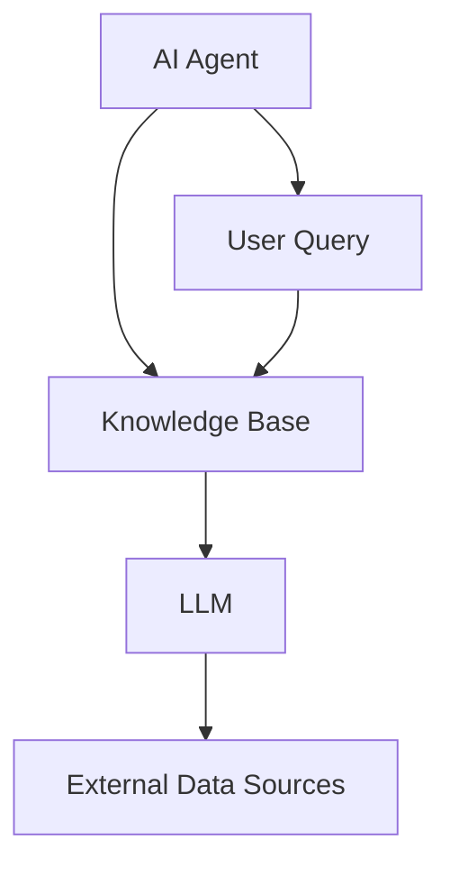
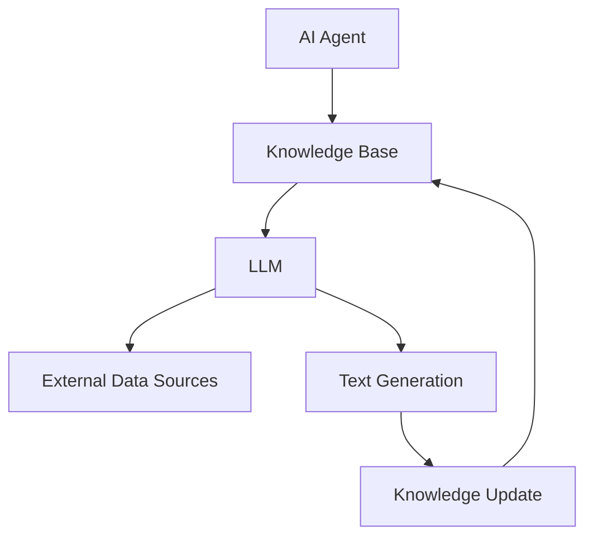

                 


# LLM在AI Agent知识更新中的应用

> 关键词：LLM, AI Agent, 知识更新, 大语言模型, 人工智能, 知识管理

> 摘要：本文详细探讨了大语言模型（LLM）在AI Agent知识更新中的应用，分析了LLM的基本原理、AI Agent的知识表示与推理、知识更新的流程与方法，并通过实际案例展示了如何利用LLM实现高效的知识更新。文章结构清晰，内容详实，适合对AI Agent和大语言模型感兴趣的读者阅读。

---

## 第一部分: LLM在AI Agent知识更新中的应用概述

### 第1章: 背景介绍

#### 1.1 问题背景

随着人工智能技术的快速发展，AI Agent（智能体）在各个领域的应用越来越广泛。AI Agent需要具备持续学习和知识更新的能力，以适应不断变化的环境和用户需求。然而，传统的知识更新方法存在效率低、成本高等问题，难以满足现代AI Agent的需求。

大语言模型（LLM）作为一种强大的自然语言处理工具，具有知识表示、推理和自适应更新的能力。将LLM应用于AI Agent的知识更新，能够显著提升知识更新的效率和准确性。

#### 1.2 问题描述

AI Agent的知识更新涉及多个方面，包括知识的获取、存储、更新和应用。传统的知识更新方法依赖于规则引擎或专家系统，存在以下问题：

1. **知识获取复杂**：需要手动收集和整理大量数据，耗时且成本高。
2. **知识表示单一**：传统知识库的结构化表示难以应对复杂场景。
3. **知识更新缓慢**：面对快速变化的环境，知识更新速度难以满足需求。

通过引入LLM，AI Agent能够实现更高效的知识更新。LLM可以通过自然语言处理技术，自动从文本中提取知识，并通过上下文理解进行推理，从而实现知识的动态更新。

#### 1.3 问题解决

LLM在知识更新中的应用主要体现在以下几个方面：

1. **自动知识获取**：通过LLM对文本数据的处理，AI Agent可以自动获取新知识。
2. **动态知识推理**：LLM能够根据上下文进行推理，帮助AI Agent理解新知识。
3. **知识自适应更新**：LLM能够根据环境变化自动调整知识库，确保知识的准确性。

#### 1.4 边界与外延

尽管LLM在知识更新中具有显著优势，但也存在一定的边界和限制：

1. **数据依赖性**：LLM的性能依赖于训练数据的质量和多样性。
2. **计算资源需求**：LLM的推理过程需要大量的计算资源。
3. **伦理与隐私问题**：知识更新过程中可能涉及敏感数据，需要考虑隐私和伦理问题。

---

### 第2章: 核心概念与联系

#### 2.1 核心概念原理

**AI Agent**：AI Agent是一个能够感知环境并采取行动以实现目标的智能实体。AI Agent需要具备知识表示、推理、规划和学习的能力。

**知识更新**：知识更新是指AI Agent通过获取新信息，更新已有知识库的过程。知识更新的核心在于如何高效地获取、理解和整合新知识。

**LLM**：大语言模型是一种基于深度学习的自然语言处理模型，具有强大的文本生成和理解能力。LLM可以通过文本输入，生成相关的输出，帮助AI Agent完成知识更新。

#### 2.2 实体关系图



**图2-1**：AI Agent与知识库、LLM以及外部数据源的关系图。AI Agent通过LLM从外部数据源获取知识，并将其整合到知识库中。

---

## 第三部分: 算法原理讲解

### 第3章: 算法原理

#### 3.1 LLM的训练过程

大语言模型的训练过程通常包括以下几个步骤：

1. **数据准备**：收集和整理大规模的文本数据。
2. **模型构建**：选择合适的模型架构（如Transformer）。
3. **预训练**：使用大规模数据进行无监督预训练。
4. **微调**：在特定任务上进行有监督微调。

#### 3.2 LLM的知识更新算法

LLM在AI Agent的知识更新中，主要通过以下算法实现：

1. **文本生成**：通过生成式模型，生成与当前知识库相关的新文本。
2. **文本理解**：通过理解式模型，分析新文本的内容，并提取关键信息。
3. **知识整合**：将新信息整合到现有知识库中，更新知识表示。

#### 3.3 算法流程图



**图3-1**：LLM在AI Agent知识更新中的算法流程图。

---

## 第四部分: 系统分析与架构设计

### 第4章: 系统架构设计

#### 4.1 系统功能设计

AI Agent的知识更新系统需要具备以下功能：

1. **知识获取**：从外部数据源获取新知识。
2. **知识理解**：通过LLM理解新知识的内容。
3. **知识整合**：将新知识整合到现有知识库中。
4. **知识推理**：基于新知识进行推理，生成新的结论。

#### 4.2 系统架构图


**图4-1**：AI Agent知识更新系统的架构图。

---

## 第五部分: 项目实战

### 第5章: 项目实战

#### 5.1 环境安装

要实现基于LLM的AI Agent知识更新，需要以下环境：

1. **编程语言**：Python 3.8+
2. **深度学习框架**：TensorFlow或PyTorch
3. **大语言模型**：如GPT-3、BERT等
4. **开发工具**：Jupyter Notebook或IDE

#### 5.2 核心代码实现

以下是实现AI Agent知识更新的核心代码示例：

```python
import transformers
from transformers import AutoTokenizer, AutoModelForCausalLM

# 初始化LLM模型
tokenizer = AutoTokenizer.from_pretrained("gpt2")
model = AutoModelForCausalLM.from_pretrained("gpt2")

# 定义知识更新函数
def update_knowledge_base(new_text):
    inputs = tokenizer.encode(new_text, return_tensors="pt")
    outputs = model.generate(inputs, max_length=100, num_return_sequences=1)
    return tokenizer.decode(outputs[0], skip_special_tokens=True)

# 使用LLM更新知识库
new_text = "最新的研究成果表明，量子计算在优化问题上有重大突破。"
updated_knowledge = update_knowledge_base(new_text)
print(updated_knowledge)
```

#### 5.3 案例分析

以量子计算领域为例，AI Agent通过LLM获取最新的研究成果，并将其整合到知识库中。具体步骤如下：

1. **获取新知识**：AI Agent从学术数据库中获取最新的研究成果。
2. **知识理解**：通过LLM理解研究成果的内容。
3. **知识整合**：将研究成果整合到现有知识库中。
4. **知识推理**：基于新知识生成新的推理结果。

---

## 第六部分: 总结与展望

### 第6章: 总结

本文详细探讨了大语言模型在AI Agent知识更新中的应用，分析了知识更新的核心问题、解决方法以及实现过程。通过实际案例展示了如何利用LLM实现高效的知识更新，为AI Agent的应用提供了新的思路。

### 第7章: 展望

未来，随着大语言模型技术的不断发展，AI Agent的知识更新将更加智能化和自动化。以下是未来的发展方向：

1. **模型优化**：进一步优化LLM的性能，提升知识更新的效率和准确性。
2. **多模态融合**：结合视觉、听觉等多种模态信息，实现更全面的知识更新。
3. **自适应学习**：研究如何让AI Agent具备自适应学习能力，能够根据环境变化自动调整知识库。

---

作者：AI天才研究院/AI Genius Institute & 禅与计算机程序设计艺术 /Zen And The Art of Computer Programming

