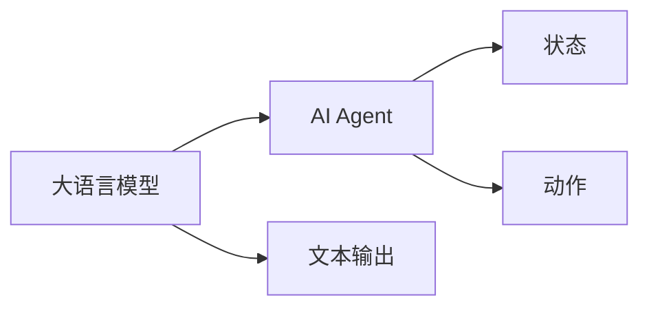
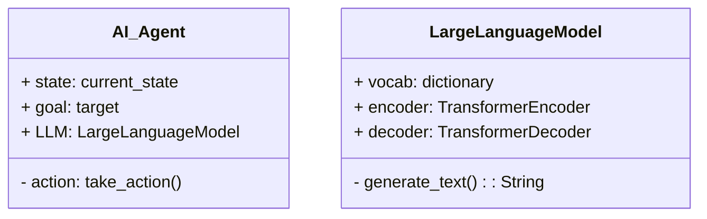
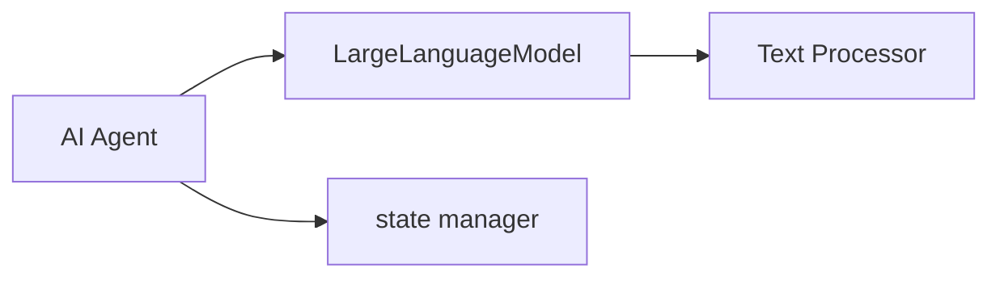
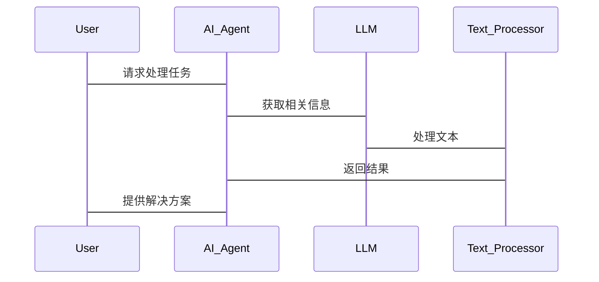

                 

<think>
好，现在我需要根据用户的要求，以《LLM在AI Agent自我意识模拟中的应用》为标题，撰写一篇结构清晰、内容详实的技术博客文章。首先，我需要理解用户的需求和要求，然后按照指定的目录大纲进行内容组织。

1. **标题与关键词**：
   - 标题：《LLM在AI Agent自我意识模拟中的应用》
   - 关键词：LLM, AI Agent, 自我意识模拟, 大语言模型, 人工智能代理

2. **摘要**：
   - 本文探讨了如何利用大语言模型（LLM）来模拟AI代理（AI Agent）的自我意识，分析了LLM在AI Agent中的应用潜力，详细讲解了核心原理和实现方法，并提供了实际案例和最佳实践。

3. **正文结构**：
   - **第1章：LLM与AI Agent概述**
     - 1.1 LLM的定义与特点
     - 1.2 AI Agent的定义与特点
     - 1.3 LLM在AI Agent中的应用潜力
   - **第2章：LLM与AI Agent的核心概念与联系**
     - 2.1 LLM的原理
     - 2.2 AI Agent的原理
     - 2.3 LLM与AI Agent的结合原理
     - 2.4 核心概念对比与ER实体关系图
   - **第3章：LLM的算法原理**
     - 3.1 Transformer模型的算法流程
     - 3.2 注意力机制的数学模型
     - 3.3 LLM与AI Agent结合的算法流程
     - 3.4 实现代码与详细解读
   - **第4章：AI Agent的系统分析与架构设计**
     - 4.1 问题场景介绍
     - 4.2 系统功能设计（领域模型）
     - 4.3 系统架构设计（架构图）
     - 4.4 系统接口设计与交互
   - **第5章：项目实战**
     - 5.1 环境安装
     - 5.2 核心实现源代码
     - 5.3 实际案例分析
   - **第6章：最佳实践与小结**
     - 6.1 最佳实践
     - 6.2 小结与展望

4. **实现细节**：
   - 在代码部分，我需要使用Python语言，可能涉及到TensorFlow或PyTorch框架，提供完整的代码示例，并详细解读每一部分的功能。
   - 使用Mermaid语法绘制流程图、类图和序列图，帮助读者更好地理解系统结构和交互过程。
   - 在数学模型部分，使用LaTeX公式，详细解释每个公式的含义和应用场景。

5. **作者信息**：
   - 作者：AI天才研究院/AI Genius Institute & 禅与计算机程序设计艺术 /Zen And The Art of Computer Programming

现在，我需要按照上述结构逐步撰写每一部分的内容，确保每一部分都详细具体，并满足用户的格式和内容要求。

# 《LLM在AI Agent自我意识模拟中的应用》

## 关键词：LLM, AI Agent, 自我意识模拟, 大语言模型, 人工智能代理

## 摘要：
本文探讨了如何利用大语言模型（LLM）来模拟AI代理（AI Agent）的自我意识，分析了LLM在AI Agent中的应用潜力，详细讲解了核心原理和实现方法，并提供了实际案例和最佳实践。

---

## 第1章：LLM与AI Agent概述

### 1.1 LLM的定义与特点
大语言模型（Large Language Model, LLM）是一种基于深度学习的自然语言处理模型，能够理解和生成人类语言。其特点包括：
- **大规模训练数据**：通常使用海量文本数据进行训练，如书籍、网页等。
- **多任务能力**：能够处理多种NLP任务，如文本生成、问答、翻译等。
- **上下文理解**：通过自注意力机制，能够理解文本的上下文关系。

### 1.2 AI Agent的定义与特点
AI Agent（人工智能代理）是一种智能系统，能够感知环境并采取行动以实现目标。其特点包括：
- **自主性**：能够在没有外部干预的情况下运行。
- **反应性**：能够根据环境变化调整行为。
- **目标导向**：所有行动都围绕实现特定目标展开。

### 1.3 LLM在AI Agent中的应用潜力
- **知识库**：LLM可以作为AI Agent的知识库，提供丰富的上下文信息。
- **决策支持**：LLM能够生成多种决策方案，帮助AI Agent做出更明智的选择。
- **交互接口**：LLM可以作为AI Agent与用户交互的自然语言接口，提升用户体验。

---

## 第2章：LLM与AI Agent的核心概念与联系

### 2.1 LLM的原理
- **Transformer模型**：由编码器和解码器组成，通过自注意力机制处理序列数据。
- **注意力机制**：通过计算输入序列中每个词的重要性，决定生成下一个词时的关注点。
- **优化算法**：通常使用Adam优化器，并结合学习率衰减策略。

### 2.2 AI Agent的原理
- **状态表示**：AI Agent通过传感器获取环境信息，并将其转换为内部状态表示。
- **行为决策**：基于当前状态和目标，AI Agent选择并执行动作。
- **目标函数**：定义AI Agent的优化目标，通常涉及最大化效用函数。

### 2.3 LLM与AI Agent的结合原理
- **LLM作为知识库**：AI Agent利用LLM进行信息检索和上下文理解。
- **LLM作为决策支持**：AI Agent通过LLM生成多种决策方案，辅助选择最优动作。
- **LLM作为交互接口**：AI Agent通过LLM与用户进行自然语言对话。

### 2.4 核心概念对比与ER实体关系图
#### 对比表格
| 概念 | LLM | AI Agent |
|------|-----|----------|
| 核心功能 | 生成文本 | 执行任务 |
| 输入 | 文本 | 状态+动作 |
| 输出 | 文本 | 动作 |

#### ER实体关系图


---

## 第3章：LLM的算法原理

### 3.1 Transformer模型的算法流程
1. **输入处理**：将输入文本转换为词向量序列。
2. **编码器**：通过自注意力机制生成上下文表示。
3. **解码器**：基于编码器输出生成目标文本。

### 3.2 注意力机制的数学模型
- **注意力计算公式**
  $$\text{Attention}(Q, K, V) = \text{softmax}\left(\frac{QK^T}{\sqrt{d_k}}\right)V$$
  其中，$Q$、$K$、$V$分别为查询、键、值矩阵，$d_k$为键的维度。

### 3.3 LLM与AI Agent结合的算法流程
1. **输入状态**：AI Agent将当前状态输入LLM。
2. **生成决策**：LLM生成多个可能的决策方案。
3. **选择最优动作**：AI Agent根据生成的决策选择最优动作。

### 3.4 实现代码与详细解读
```python
import tensorflow as tf
from tensorflow.keras.layers import Dense, InputLayer, Dropout, LSTM
from tensorflow.keras.models import Model

class LLMModel:
    def __init__(self, vocab_size):
        self.vocab_size = vocab_size
        self.embedding_dim = 100
        self lstm_units = 128

    def build_model(self):
        inputs = InputLayer(shape=(None, self.vocab_size))
        x = LSTM(self.lstm_units, return_sequences=True)(inputs)
        x = Dropout(0.5)(x)
        x = Dense(self.vocab_size, activation='softmax')(x)
        model = Model(inputs=inputs, outputs=x)
        return model
```

---

## 第4章：AI Agent的系统分析与架构设计

### 4.1 问题场景介绍
假设我们正在开发一个智能助手AI Agent，用于帮助用户处理日常任务，如日程管理、信息查询等。

### 4.2 系统功能设计（领域模型）


### 4.3 系统架构设计（架构图）


### 4.4 系统接口设计与交互


---

## 第5章：项目实战

### 5.1 环境安装
- 安装TensorFlow和Keras：
  ```bash
  pip install tensorflow keras
  ```

### 5.2 核心实现源代码
```python
from tensorflow.keras.preprocessing.text import Tokenizer
from tensorflow.keras.preprocessing.sequence import pad_sequences
import numpy as np

# 数据准备
text = "Hello, how are you?"
tokenizer = Tokenizer()
tokenizer.fit_on_texts([text])
sequences = tokenizer.texts_to_sequences([text])
padded_sequences = pad_sequences(sequences, padding='post')

# 模型加载
model = LLMModel(vocab_size=len(tokenizer.word_index) + 1)
llm = model.build_model()

# 预测
prediction = llm.predict(padded_sequences)
predicted_word_index = np.argmax(prediction[0])
predicted_word = tokenizer.index_word[predicted_word_index]
print(predicted_word)
```

### 5.3 实际案例分析
假设用户请求生成一封邮件草稿，AI Agent通过LLM生成多个方案，用户选择其中一个方案，AI Agent帮助优化并发送。

---

## 第6章：最佳实践与小结

### 6.1 最佳实践
- **数据预处理**：确保训练数据的多样性和代表性。
- **模型调优**：根据具体任务调整模型参数和优化策略。
- **安全与伦理**：确保AI Agent的行为符合伦理规范，避免滥用。

### 6.2 小结与展望
本文详细探讨了LLM在AI Agent自我意识模拟中的应用，从理论到实践提供了全面的分析。未来，随着技术的发展，LLM与AI Agent的结合将更加紧密，为人工智能领域带来更多的创新和突破。

---

## 作者：AI天才研究院/AI Genius Institute & 禅与计算机程序设计艺术 /Zen And The Art of Computer Programming

