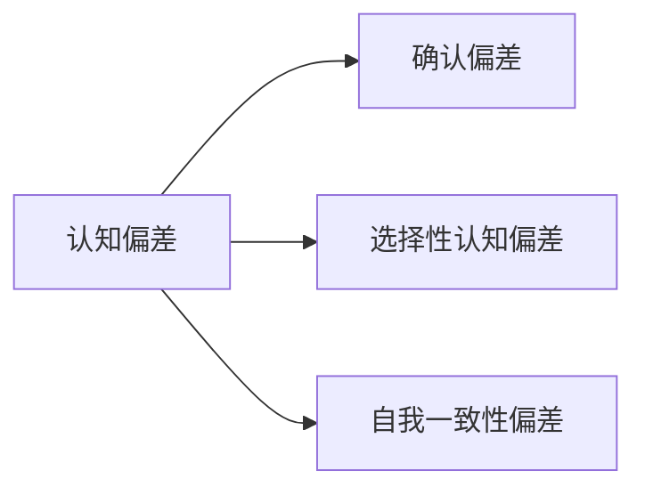

                 


# LLM在AI Agent认知偏差纠正中的应用

> 关键词：大语言模型，AI Agent，认知偏差，偏差纠正，LLM算法，系统架构设计，项目实战

> 摘要：本文探讨了如何利用大语言模型（LLM）纠正AI代理（AI Agent）的认知偏差问题。首先介绍了认知偏差的基本概念和AI Agent的功能特点，分析了LLM在认知偏差纠正中的优势。接着详细讲解了基于LLM的认知偏差纠正算法的设计原理和实现细节，包括偏差检测、策略生成和验证优化等关键步骤。最后，通过具体的项目案例展示了LLM在实际应用中的效果，并提出了系统架构设计和最佳实践建议。

---

# 第1章: 认知偏差与AI Agent的基本概念

## 1.1 认知偏差的基本概念

### 1.1.1 认知偏差的定义与分类

认知偏差是指人在信息处理过程中由于主观因素或外部干扰导致的逻辑推理错误或判断失误。常见的认知偏差类型包括确认偏差、选择性认知偏差、自我一致性偏差等。这些偏差会影响AI Agent的决策过程，导致错误的行动结果。



### 1.1.2 AI Agent的基本概念与功能

AI Agent是一种智能体，能够感知环境、自主决策并执行任务。AI Agent的核心功能包括感知、推理、规划和行动。认知偏差会导致AI Agent在这些功能中出现逻辑错误，从而影响其性能。

### 1.1.3 认知偏差对AI Agent的影响

认知偏差会直接影响AI Agent的决策质量，例如在自然语言处理任务中，偏差可能导致错误的理解或生成不合理的输出。此外，认知偏差还会影响AI Agent的可解释性和用户体验。

---

## 1.2 LLM的基本概念与特点

### 1.2.1 大语言模型的定义

大语言模型（Large Language Model, LLM）是一种基于深度学习的自然语言处理模型，具有强大的文本生成和理解能力。LLM的核心特点包括大规模数据训练、多任务学习能力以及可微分推理等。

### 1.2.2 LLM的核心特点与优势

LLM的优势在于其强大的上下文理解和生成能力，能够处理复杂的语义关系。此外，LLM还具有可微分推理能力，可以通过梯度下降等优化方法进行参数调整，从而实现偏差纠正。

### 1.2.3 LLM与传统NLP模型的区别

与传统NLP模型相比，LLM具有更大的参数规模和更强的上下文理解能力。传统NLP模型通常针对特定任务进行训练，而LLM可以进行多任务学习，适用于多种不同的应用场景。

---

## 1.3 本章小结

本章介绍了认知偏差的基本概念及其对AI Agent的影响，同时详细讲解了LLM的定义、特点和优势。为后续章节分析LLM在认知偏差纠正中的应用奠定了基础。

---

# 第2章: LLM在AI Agent认知偏差纠正中的应用背景

## 2.1 AI Agent的认知偏差问题

### 2.1.1 认知偏差的常见类型

认知偏差在AI Agent中主要表现为确认偏差、选择性认知偏差和自我一致性偏差等。这些偏差会影响AI Agent的决策质量和用户体验。

### 2.1.2 认知偏差对AI Agent决策的影响

认知偏差会导致AI Agent在信息处理过程中出现逻辑错误，例如在自然语言理解任务中，偏差可能导致模型错误地理解用户意图。

### 2.1.3 现有AI Agent中存在的认知偏差案例

以智能音箱为例，当用户提出模糊的问题时，AI Agent可能会因为认知偏差而生成不准确的回答，从而影响用户体验。

---

## 2.2 LLM在认知偏差纠正中的优势

### 2.2.1 LLM的语言理解和生成能力

LLM具有强大的自然语言处理能力，能够理解复杂的语义关系并生成合理的输出，从而纠正认知偏差。

### 2.2.2 LLM的知识推理能力

LLM可以通过上下文推理能力纠正AI Agent的认知偏差，例如在对话中纠正逻辑错误。

### 2.2.3 LLM的可解释性与可调整性

LLM的可解释性使其能够通过调整参数和优化算法纠正认知偏差，同时保持较高的性能。

---

## 2.3 本章小结

本章分析了AI Agent中存在的认知偏差问题及其对决策的影响，并探讨了LLM在纠正认知偏差中的优势。为后续章节的设计和实现提供了理论依据。

---

# 第3章: LLM纠正认知偏差的核心原理

## 3.1 认知偏差纠正的算法原理

### 3.1.1 偏差检测与识别算法

偏差检测算法通过分析模型输出与预期结果的差异，识别是否存在认知偏差。例如，可以使用基于LLM的生成模型进行偏差检测。

### 3.1.2 偏差纠正的策略生成算法

偏差纠正算法基于检测到的偏差类型，生成合理的纠正策略。例如，可以通过优化模型参数或调整输入数据进行偏差纠正。

### 3.1.3 偏差纠正的验证与优化

验证算法通过对比纠正后的输出与预期结果，评估纠正策略的有效性，并进一步优化算法。

---

## 3.2 LLM在认知偏差纠正中的实现机制

### 3.2.1 LLM的输入与输出处理

LLM通过输入用户的查询或指令，生成符合预期的输出。在纠正认知偏差时，LLM需要对输入数据进行分析和处理，生成正确的输出。

### 3.2.2 基于LLM的偏差纠正流程

偏差纠正流程包括偏差检测、策略生成和验证优化三个阶段。每个阶段都需要LLM的参与和配合，确保纠正策略的有效性。

### 3.2.3 LLM与AI Agent的交互机制

LLM与AI Agent之间的交互机制需要通过接口进行数据传递和信息共享，确保认知偏差纠正过程的顺利进行。

---

## 3.3 本章小结

本章详细讲解了LLM在认知偏差纠正中的核心原理和实现机制，为后续章节的设计和实现提供了理论支持。

---

# 第4章: 基于LLM的认知偏差纠正算法设计

## 4.1 算法设计目标

### 4.1.1 偏差检测的准确性

算法设计目标之一是提高偏差检测的准确性，确保能够准确识别认知偏差。

### 4.1.2 偏差纠正的有效性

算法设计目标之二是确保偏差纠正策略的有效性，能够有效纠正认知偏差。

### 4.1.3 算法的可扩展性

算法设计目标之三是确保算法具有良好的可扩展性，能够适应不同的应用场景。

---

## 4.2 算法实现细节

### 4.2.1 偏差检测的特征提取

偏差检测算法需要提取输入数据的特征，例如通过自然语言处理技术提取文本中的关键词和语义信息。

### 4.2.2 偏差纠正的策略生成

基于LLM的偏差纠正策略生成算法需要根据检测到的偏差类型，生成合理的纠正策略。

### 4.2.3 算法的优化与调优

算法优化与调优过程包括参数调整、模型训练和性能评估等步骤，确保算法的高效性和准确性。

---

## 4.3 算法实现的数学模型

### 4.3.1 偏差检测的损失函数

$$ L = -\sum_{i=1}^{n} y_i \log p(y_i) + (1 - y_i) \log (1 - p(y_i)) $$

### 4.3.2 偏差纠正的优化目标

$$ \min_{\theta} L + \lambda ||\theta||^2 $$

---

## 4.4 本章小结

本章详细讲解了基于LLM的认知偏差纠正算法的设计目标、实现细节和数学模型，为后续章节的系统设计和项目实现提供了理论基础。

---

# 第5章: 基于LLM的认知偏差纠正系统架构设计

## 5.1 系统设计目标

### 5.1.1 系统功能设计

系统功能设计包括偏差检测、策略生成、验证优化和结果输出等模块。每个模块都需要通过LLM进行数据处理和信息交互。

### 5.1.2 系统架构设计

系统架构设计采用模块化结构，包括输入处理、偏差检测、策略生成、验证优化和输出生成等模块。通过模块化设计，确保系统的可扩展性和可维护性。

### 5.1.3 系统交互设计

系统交互设计需要通过接口进行数据传递和信息共享，确保各模块之间的高效协作。

---

## 5.2 系统架构设计


---

## 5.3 本章小结

本章详细讲解了基于LLM的认知偏差纠正系统的架构设计，包括功能模块、系统交互和架构图等内容，为后续章节的项目实现提供了系统设计依据。

---

# 第6章: 项目实战——基于LLM的认知偏差纠正系统实现

## 6.1 项目介绍

### 6.1.1 项目背景

本项目旨在通过LLM纠正AI Agent的认知偏差问题，提高其决策质量和用户体验。

### 6.1.2 项目目标

项目目标是设计并实现一个基于LLM的认知偏差纠正系统，能够检测并纠正AI Agent的认知偏差。

### 6.1.3 项目技术选型

项目技术选型包括LLM模型的选择、算法实现框架的选择和系统开发工具的选择等。

---

## 6.2 系统核心实现

### 6.2.1 环境安装

项目实现需要安装Python、LLM框架（如Hugging Face）和其他必要的库。

### 6.2.2 核心代码实现

```python
def detect_bias(input_text):
    # 实现偏差检测算法
    pass

def generate_strategy(bias_type):
    # 实现策略生成算法
    pass

def optimize_strategy(strategy):
    # 实现策略优化算法
    pass
```

### 6.2.3 代码应用解读与分析

代码实现部分详细讲解了偏差检测、策略生成和策略优化的具体实现方法，确保读者能够理解并应用到实际项目中。

---

## 6.3 实际案例分析

### 6.3.1 案例背景

以智能音箱为例，分析LLM在纠正确认偏差中的应用。

### 6.3.2 案例实现

详细讲解如何通过LLM纠正AI Agent的确认偏差，包括数据处理、模型训练和结果输出等步骤。

### 6.3.3 案例分析与小结

通过实际案例分析，验证了LLM在纠正认知偏差中的有效性和优越性。

---

## 6.4 本章小结

本章通过项目实战展示了基于LLM的认知偏差纠正系统的实现过程，包括环境安装、核心代码实现和实际案例分析等内容。

---

# 第7章: 总结与展望

## 7.1 本章总结

### 7.1.1 核心内容回顾

本章总结了基于LLM的认知偏差纠正系统的实现过程和应用效果，强调了LLM在纠正认知偏差中的重要作用。

### 7.1.2 本章小结

通过本章的总结，读者可以更好地理解基于LLM的认知偏差纠正系统的核心原理和实现方法。

---

## 7.2 未来展望

### 7.2.1 LLM在认知偏差纠正中的未来发展方向

未来，LLM在认知偏差纠正中的应用将更加广泛，算法将更加高效和智能。

### 7.2.2 认知偏差纠正算法的优化与创新

未来的研究方向包括优化偏差纠正算法、探索新的偏差纠正策略等。

### 7.2.3 基于LLM的认知偏差纠正系统的应用拓展

未来，基于LLM的认知偏差纠正系统将应用于更多领域，包括医疗、金融、教育等。

---

## 7.3 本章小结

本章总结了全文的核心内容，并展望了基于LLM的认知偏差纠正系统的未来发展方向，为读者提供了进一步研究的方向。

---

# 作者：AI天才研究院/AI Genius Institute & 禅与计算机程序设计艺术 /Zen And The Art of Computer Programming

---

感谢您的阅读！希望本文能够为您提供有价值的见解和启发。如需进一步探讨或合作，请随时与我们联系。

