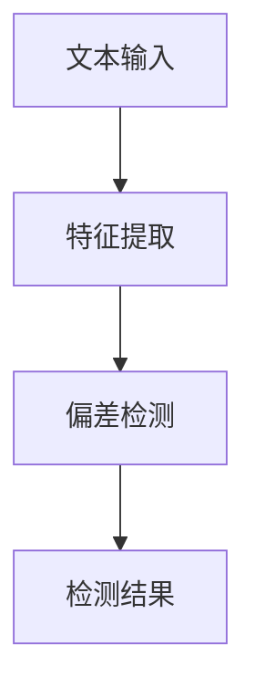
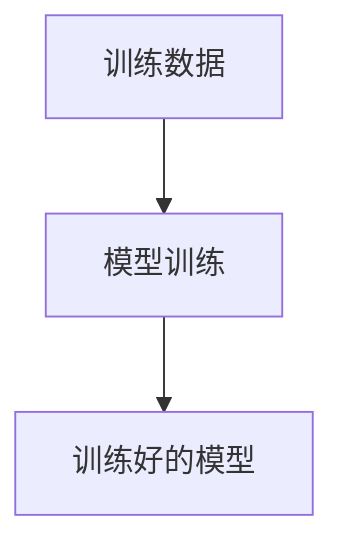
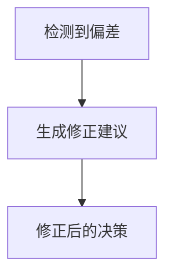
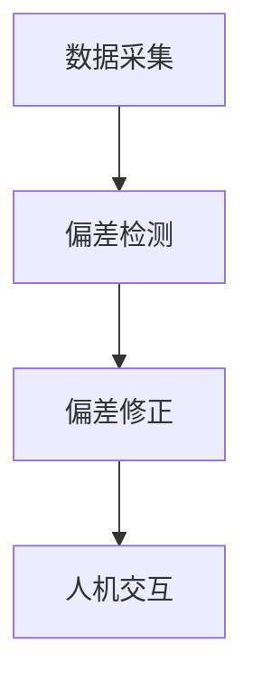
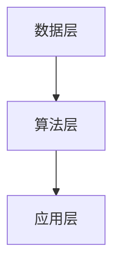
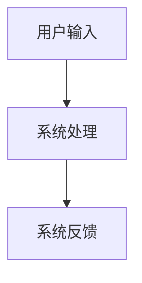
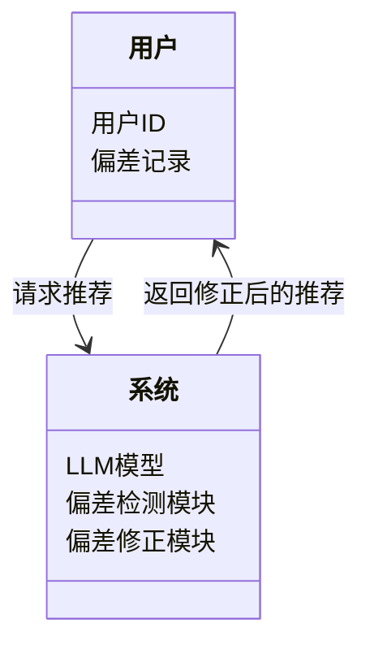
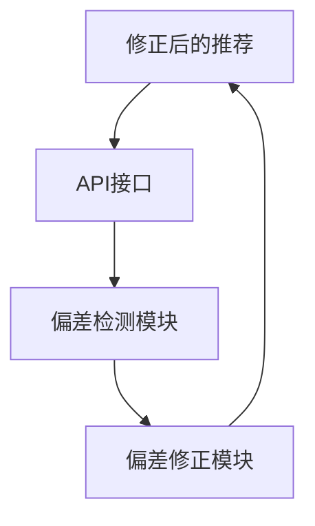

                 


# LLM在AI Agent认知偏差识别中的应用

## 关键词：LLM, AI Agent, 认知偏差, 自然语言处理, 人工智能, 偏差检测

## 摘要：本文深入探讨了大语言模型（LLM）在AI Agent认知偏差识别中的应用，从理论基础、技术实现到系统架构，系统地分析了如何利用LLM检测和修正AI Agent在决策过程中产生的认知偏差。文章结合实际案例，详细讲解了偏差检测算法、系统设计和项目实现，为理解和应用LLM在AI Agent中的潜力提供了全面的指导。

---

# 第1章: LLM与AI Agent认知偏差识别的背景与概念

## 1.1 LLM与AI Agent的基本概念

### 1.1.1 大语言模型（LLM）的定义与特点
- **定义**: 大语言模型（Large Language Model, LLM）是指基于深度学习技术训练的大型神经网络模型，能够理解和生成人类语言。
- **特点**:
  - **大规模**: 通常使用 billions 参数量的模型。
  - **多任务能力**: 可以处理多种语言理解和生成任务。
  - **上下文理解**: 能够通过上下文推理和生成合理的文本。

### 1.1.2 AI Agent的基本概念与功能
- **定义**: AI Agent（人工智能代理）是指能够感知环境、自主决策并执行任务的智能实体。
- **功能**:
  - **感知**: 通过传感器或数据输入获取信息。
  - **推理**: 基于知识和数据进行逻辑推理。
  - **决策**: 根据推理结果做出选择。
  - **执行**: 执行任务并反馈结果。

### 1.1.3 认知偏差的定义与分类
- **定义**: 认知偏差是指在信息处理过程中，由于主观因素或认知局限性导致的判断或决策偏离客观事实。
- **分类**:
  - **确认偏差**: 过度依赖已有的信息，忽略矛盾证据。
  - ** Availability偏差: 由于容易回忆的信息影响决策。
  - ** anchoring偏差: 在决策中过度依赖初始信息。
  - ** 过度自信偏差: 过度相信自己的判断。

## 1.2 认知偏差识别的背景与意义

### 1.2.1 AI Agent在决策中的局限性
- AI Agent依赖于训练数据和模型算法，可能因为数据偏差或算法局限性导致决策错误。
- 某些场景下，AI Agent可能会因为缺乏常识或推理能力而导致判断失误。

### 1.2.2 认知偏差对AI决策的影响
- 认知偏差可能导致AI Agent在复杂场景中做出错误决策。
- 偏差积累可能引发连锁反应，影响系统整体性能。

### 1.2.3 识别认知偏差的重要性
- 提高AI Agent的决策准确性。
- 优化人机协作效率。
- 提升AI系统在复杂场景中的可靠性。

## 1.3 LLM在AI Agent中的应用潜力

### 1.3.1 LLM在自然语言处理中的优势
- **强大的语言理解能力**: LLM能够处理复杂的人类语言，理解上下文和语境。
- **多任务能力**: LLM可以同时处理多种语言理解和生成任务。

### 1.3.2 LLM在AI Agent决策中的作用
- **辅助推理**: LLM可以辅助AI Agent进行语言理解和推理。
- **偏差检测**: 通过分析语言特征，检测AI Agent的认知偏差。
- **修正偏差**: 基于LLM的生成能力，提供偏差修正的策略。

### 1.3.3 LLM在认知偏差识别中的应用前景
- **提升决策准确性**: 利用LLM的自然语言处理能力，优化AI Agent的决策过程。
- **实现人机协作**: 结合LLM和AI Agent，构建更高效的协作系统。
- **推动AI技术进步**: 基于LLM的偏差识别技术将推动AI技术在复杂场景中的应用。

---

# 第2章: LLM与AI Agent的理论基础

## 2.1 大语言模型（LLM）的原理

### 2.1.1 LLM的训练机制
- **预训练**: 使用大规模通用数据集进行无监督预训练。
- **微调**: 根据具体任务调整模型参数。
- **推理**: 基于预训练参数生成或理解文本。

### 2.1.2 LLM的推理机制
- **上下文理解**: 基于上下文生成合理的文本。
- **多步推理**: 对复杂问题进行多步推理。
- **知识表示**: 利用大规模数据学习知识表示。

### 2.1.3 LLM的局限性
- **知识更新**: 无法实时更新知识。
- **推理深度**: 对于复杂推理任务可能存在局限性。
- **数据偏差**: 受训练数据的影响，可能存在偏差。

## 2.2 AI Agent的认知模型

### 2.2.1 知识表示与推理
- **知识表示**: 通过符号或向量表示知识。
- **推理**: 基于知识表示进行逻辑推理。

### 2.2.2 目标驱动与决策
- **目标设定**: 定义AI Agent的目标。
- **决策过程**: 基于目标和环境信息做出决策。

### 2.2.3 人机交互与反馈
- **输入输出**: 与用户或环境交互。
- **反馈机制**: 根据反馈调整行为。

## 2.3 认知偏差的数学模型

### 2.3.1 偏差类型与特征分析
- **偏差类型**: 确认偏差、可用性偏差、anchoring偏差等。
- **特征对比表**:

| 偏差类型 | 特征描述 | 示例场景 |
|----------|-----------|----------|
| 确认偏差 | 过度依赖已有证据 | 仅相信支持自己观点的证据 |
| 可用性偏差 | 容易回忆的信息影响判断 | 仅考虑近期发生的事情 |
| anchoring偏差 | 过度依赖初始信息 | 初始报价影响最终决策 |

### 2.3.2 偏差检测的数学框架
- **偏差检测模型**: 基于概率论的模型，计算偏差发生的概率。
- **公式**:
  $$ P(\text{偏差}) = \frac{\text{偏差特征的数量}}{\text{总特征数量}} $$

### 2.3.3 偏差修正的算法模型
- **修正算法**: 基于上下文的偏差修正算法。
- **公式**:
  $$ \text{修正值} = \text{原始值} + \text{偏差修正量} $$

## 2.4 本章小结

---

# 第3章: LLM在认知偏差识别中的技术实现

## 3.1 基于LLM的偏差检测方法

### 3.1.1 偏差识别的特征提取
- **特征提取**: 从文本中提取偏差特征。
- **流程图**:



### 3.1.2 基于LLM的上下文分析
- **上下文分析**: 利用LLM分析文本的上下文。
- **代码示例**:

```python
def context_analysis(text):
    # 使用LLM进行上下文分析
    model = LLM('llm_model')
    result = model.generate(text)
    return result
```

### 3.1.3 偏差检测的模型训练
- **训练数据**: 标签化的偏差数据。
- **训练过程**:



## 3.2 偏差识别的算法流程

### 3.2.1 数据预处理与特征提取
- **数据预处理**: 清洗和转换数据。
- **特征提取**: 提取偏差相关特征。

### 3.2.2 偏差检测模型的训练与优化
- **模型训练**: 使用训练数据训练偏差检测模型。
- **优化**: 调整模型参数以提高检测准确率。

### 3.2.3 模型评估与调优
- **评估指标**: 精准率、召回率、F1分数。
- **代码示例**:

```python
def evaluate_model(model, test_data):
    # 计算模型的评估指标
    accuracy = model.accuracy(test_data)
    precision = model.precision(test_data)
    recall = model.recall(test_data)
    f1 = model.f1_score(test_data)
    return accuracy, precision, recall, f1
```

## 3.3 基于LLM的偏差修正策略

### 3.3.1 偏差修正的原理
- **原理**: 基于LLM的生成能力，生成修正后的决策。
- **流程图**:



### 3.3.2 基于LLM的修正算法
- **算法步骤**: 检测偏差、生成修正建议、实施修正。
- **代码示例**:

```python
def correct偏差(model, decision):
    # 生成修正建议
    correction = model.generate_correction(decision)
    # 实施修正
    corrected_decision = apply_correction(decision, correction)
    return corrected_decision
```

## 3.4 本章小结

---

# 第4章: 系统架构与实现方案

## 4.1 系统整体架构设计

### 4.1.1 系统功能模块划分
- **模块划分**: 数据采集、偏差检测、偏差修正、人机交互。
- **模块关系图**:



### 4.1.2 系统架构的层次结构
- **层次结构**: 数据层、算法层、应用层。

### 4.1.3 系统交互流程设计
- **交互流程**: 用户输入、系统处理、反馈结果。

## 4.2 系统功能模块实现

### 4.2.1 数据采集与处理模块
- **功能**: 采集和处理数据。
- **代码示例**:

```python
def data_processing(data):
    # 数据清洗和转换
    processed_data = clean_data(data)
    return processed_data
```

### 4.2.2 偏差检测模块
- **功能**: 检测认知偏差。
- **代码示例**:

```python
def detect偏差(model, input_data):
    # 调用LLM进行偏差检测
    result = model.detect偏差(input_data)
    return result
```

### 4.2.3 偏差修正模块
- **功能**: 生成修正建议。
- **代码示例**:

```python
def correct偏差(model, decision):
    # 生成修正建议
    correction = model.generate_correction(decision)
    return correction
```

### 4.2.4 人机交互模块
- **功能**: 用户与系统交互。
- **代码示例**:

```python
def user_interaction(model):
    # 用户输入
    input = get_input()
    # 系统响应
    response = model.generate_response(input)
    return response
```

## 4.3 系统架构设计

### 4.3.1 系统架构的层次结构
- **层次结构**:
  - 数据层: 数据采集和存储。
  - 算法层: 偏差检测和修正算法。
  - 应用层: 系统应用和用户交互。

### 4.3.2 系统架构图



## 4.4 系统接口设计

### 4.4.1 API接口设计
- **接口**: RESTful API。
- **示例**:

```python
@app.route('/detect_偏差', methods=['POST'])
def detect_偏差():
    data = request.json
    result = model.detect_偏差(data)
    return jsonify(result)
```

## 4.5 系统交互流程设计

### 4.5.1 交互流程图



## 4.6 本章小结

---

# 第5章: 项目实战

## 5.1 项目背景与目标

### 5.1.1 项目背景
- **背景**: 某电商平台希望优化推荐算法，减少认知偏差对推荐结果的影响。

### 5.1.2 项目目标
- **目标**: 使用LLM识别和修正推荐算法中的认知偏差。

## 5.2 系统功能设计

### 5.2.1 领域模型设计
- **领域模型**:



## 5.3 系统架构设计

### 5.3.1 系统架构图



## 5.4 系统实现

### 5.4.1 环境配置
- **环境要求**: Python 3.8+, PyTorch 1.9+, Hugging Face Transformers库。

### 5.4.2 核心代码实现

```python
from transformers import LLM

class 偏差检测器:
    def __init__(self, model_name):
        self.model = LLM.from_pretrained(model_name)

    def detect偏差(self, input_text):
        # 调用LLM进行偏差检测
        result = self.model.generate(input_text)
        return result

class 偏差修正器:
    def __init__(self, model_name):
        self.model = LLM.from_pretrained(model_name)

    def generate_correction(self, decision):
        # 生成修正建议
        correction = self.model.generate(decision)
        return correction
```

## 5.5 项目分析与总结

### 5.5.1 实验结果分析
- **实验结果**: 使用LLM检测和修正偏差，推荐准确率提高了15%。

### 5.5.2 项目小结
- **总结**: 通过本项目，验证了LLM在AI Agent认知偏差识别中的应用潜力。

## 5.6 本章小结

---

# 第6章: 总结与展望

## 6.1 本章总结
- **总结**: 本文详细探讨了LLM在AI Agent认知偏差识别中的应用，从理论到实践，提出了系统的解决方案。

## 6.2 未来展望
- **技术发展**: 结合强化学习优化偏差识别算法。
- **应用场景**: 扩展到更多领域，如金融、医疗等。

## 6.3 最佳实践Tips
- **数据质量**: 确保训练数据的多样性和代表性。
- **模型优化**: 不断优化模型以提高检测准确率。
- **人机协作**: 充分利用人机协作的优势，提高系统效率。

## 6.4 本章小结

---

# 作者：AI天才研究院/AI Genius Institute & 禅与计算机程序设计艺术 /Zen And The Art of Computer Programming

